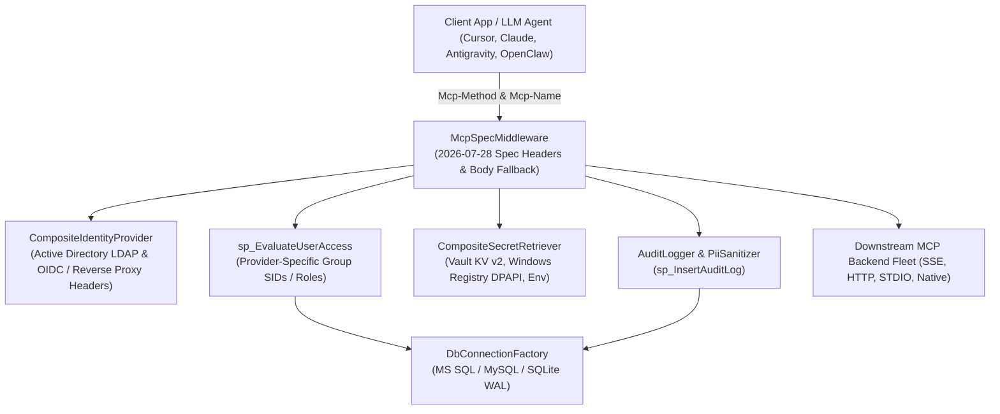
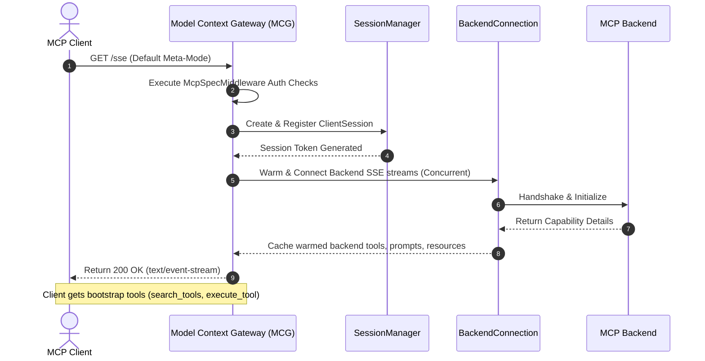
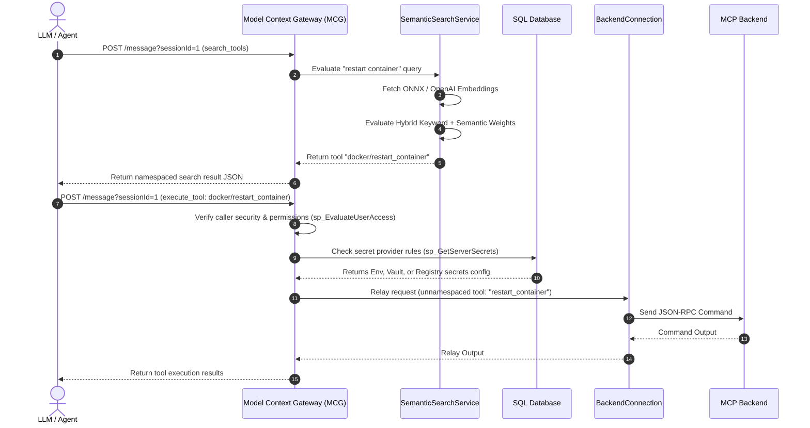
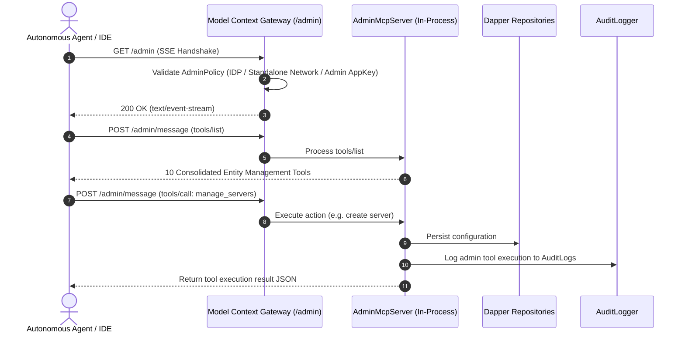

# Model Context Gateway (MCG) Architecture

This document summarizes the internal architecture, security boundaries, and execution flows of **Model Context Gateway (MCG)**.

> **Full Specification**: For complete architectural specifications, Mermaid sequence diagrams, component models, ERDs, and cryptographic pipelines, see the [**Complete Architecture Guide (`docs/architecture.md`)**](docs/architecture.md).

---

## System Overview

When you connect an AI assistant directly to many separate tools, common problems occur:
* Tool definitions fill the AI context memory before your prompt begins.
* Plaintext credentials can leak from local configuration files.
* You must configure each tool separately in every AI client.

Model Context Gateway provides a central, secure gateway between AI clients and backend tools:

* **Unified Ingress**: AI clients (Claude Desktop, Cursor, Cline, Windsurf, Antigravity) connect once to `/sse`.
* **Meta-Mode Tool Discovery**: Instead of loading hundreds of tool schemas at startup, Meta-Mode provides on-demand tool discovery via `search_tools` and `execute_tool`. This saves context memory and token costs.
* **Security & Access Control**: The gateway authenticates users (Active Directory Windows SIDs, OIDC headers, or AppKeys), checks permissions with database-backed RBAC, and redacts sensitive credentials from logs.
* **Universal Routing**: The gateway routes requests to Docker containers (auto-discovered via socket), remote HTTP/SSE servers, and local STDIO scripts.

---

## Architectural Requirements

### 1. Performance & Latency
- **Fast Routing Decisions**: The gateway inspects MCP headers (`Mcp-Method` and `Mcp-Name`) without buffering large request bodies.
- **Concurrent Connections**: The gateway handles multiple simultaneous client sessions and background health probes using thread-safe state wrappers (`ConcurrentDictionary`).
- **Background Warming**: Embedding models, backend connections, and configuration caches preload asynchronously during startup to eliminate cold-start delays.

### 2. Security & Identity
- **Dual Identity Support**: Supports enterprise Active Directory SIDs alongside modern OIDC reverse-proxy headers (`Remote-User`, `Remote-Groups`).
- **AppKey Authorization**: Supports machine callers and agents using high-entropy keys (`mcp-adm-`, `mcp-usr-`) with granular scope rules (`*`, `server:*`, `category:*`, `tool:*`).
- **Role-Based Access Control (RBAC)**: Checks caller permissions against database access policies before tools run.
- **Automatic PII Redaction**: Redacts API keys, tokens, and passwords from logs and responses.

### 3. Reliability & Resilience
- **Strategy Pattern Architecture**: Uses modular interfaces for transports (`ITransport`), identity providers (`IIdentityProvider`), secret managers (`ISecretRetriever`), and database providers (`IDbConnectionFactory`).
- **Request State Management**: Uses `JsonRpcStateManager` with unique request identifiers to match responses with original requests across concurrent connections.
- **Clean Session Cleanup**: Handles connection drops cleanly and cancels pending tasks using standard cancellation tokens.

---

## System Architecture Overview



### Modular Domain & Infrastructure Boundaries

The backend is organized into clear bounded modules across domain components, infrastructure, and core routing logic:

```text
├── Components/
│   ├── Servers/         # Upstream server models, validation, health checks, discovery & MapServerEndpoints
│   ├── Clients/         # Client models, credential services, OAuth & MapClientEndpoints
│   ├── AppKeys/         # AppKey models, authorization keys, hashing, scope validation & MapAppKeyEndpoints
│   ├── Providers/       # Auth/secret provider settings, AES-256-GCM crypto & MapProviderEndpoints
│   ├── Authorization/   # Access policies, group mappings, RBAC evaluation & MapPolicyEndpoints
│   └── Capabilities/    # Native tools, proxy execution, tool/prompt/resource handlers & MapCapabilityEndpoints
├── Infrastructure/
│   ├── Persistence/     # Dapper repositories, database connection factory, migrations & seeders
│   ├── Transports/      # SSE, HTTP, STDIO, JSON-RPC state manager & target proxy
│   ├── Identity/        # Active Directory, OIDC, AppKey identity providers & LDAP service
│   ├── Secrets/         # Vault, Windows Registry, Environment secret retrievers & encryption
│   └── Logging/         # Audit logger, PII sanitization & in-memory log providers
└── Core/
    ├── Protocol/        # JSON-RPC protocol models & Polymorphic converter
    └── Routing/         # ClientSession, SessionManager, BackendConnection & Semantic Search
```

---

## Key Message & Connection Flows

### 1. SSE Client Connection & Meta-Mode Tool Discovery
When an MCP client initiates a connection to `/sse`:



---

### 2. Request Routing and Execution Flow (Meta-Mode)
When an agent client searches for and executes a capability:



> **Dual-Key Routing & Namespace Aliasing**: Starting in v5.10.0, tools default to modern slash format `{namespace}/{tool_name}` while preserving backwards compatibility with delimiter normalization (`{serverId}__{toolName}`).

---

### 3. In-Process Virtual Admin MCP Server (`/admin`, `/mcg-admin`)

For autonomous AI agents and IDE extensions (Claude Desktop, Cursor, Cline, Windsurf, Antigravity) administering the gateway programmatically, the gateway hosts an in-process virtual MCP server (`AdminMcpServer`):



#### Consolidated Entity Tools (10 Core Tools)
1. `manage_servers`: Manage backend MCP servers (CRUD, toggle, reconnect, alias).
2. `manage_appkeys`: Manage API keys, key limits, expiration, and scopes.
3. `manage_clients`: Manage OAuth 2.0 dynamic clients.
4. `manage_policies`: Manage RBAC access policies and server/category assignments.
5. `manage_group_mappings`: Map external AD SIDs / OIDC groups to internal roles.
6. `manage_providers`: Manage secret retrievers (Vault, WinReg, Env) and auth providers (AD, OIDC).
7. `manage_settings`: Configure UI branding, dashboard title, and semantic embedding providers.
8. `manage_custom_files`: Manage prompt/resource configuration files in persistent storage.
9. `manage_system`: Inspect diagnostics, memory logs, clear logs, and query audit trails.
10. `test_tool_call`: Test execution of downstream backend tools via testbench engine.

---

## Outbound Authentication & Identity Delegation

To support enterprise security and Row-Level Security (RLS) in downstream MCP backends, the gateway implements advanced credential delegation capabilities detailed in the [Authentication End-to-End Support Matrix](docs/auth-flows/auth-support-matrix.md):

1. **Identity-Header Propagation (Trusted Gateway Pattern)**: The gateway automatically injects the authenticated client's identity into outbound HTTP/SSE transport requests via the `X-Forwarded-User` header. This allows stateless backends to enforce RLS and audit trails without requiring complex multi-hop token flows.
2. **Dynamic Auth Pass-Through & Rewriting**: Downstream tools requiring interactive challenges (e.g., Jira, ServiceNow) can securely trigger a 401 Challenge. The gateway intercepts this, issues a `dynamic_auth` prompt to the client (IDE/LLM), and propagates the resulting user-provided credential via the `X-Target-Auth` header.
3. **OAuth2 / OIDC Token Exchange (On-Behalf-Of)**: For upstream backends requiring strict bearer JWTs, the gateway functions as a Confidential Client, seamlessly exchanging inbound AppKeys or SSO headers for downstream JWTs via the standard OAuth2 On-Behalf-Of flow.
4. **NTLM / Kerberos Impersonation**: On Windows IIS native deployments, the gateway utilizes `S4U2Proxy` (via `WindowsIdentity.RunImpersonatedAsync`) to assume the identity of the inbound Active Directory caller when invoking downstream enterprise endpoints.

---

## Batteries-Included Docker Runtime

To natively execute Python, Node, and `uv` based MCP Servers via the `stdio` transport, the project provides a "batteries-included" Docker tag (`ghcr.io/spelech/model-context-gateway:latest-full`). This eliminates the complexity of sidecar container networking while preserving strict sub-process isolation.

---

## 4-Stage Authorization & Hybrid Standalone Pipeline

Every request entering the router passes through four concentric security boundaries:

```
┌─────────────────────────────────────────────────────────────────────────────┐
│ 1. AppKey Scope Boundary (Fast-Path Key Filtering)                          │
│    Does the caller's AppKey allow the target server, category, or tool?     │
└──────────────────────────────────────┬──────────────────────────────────────┘
                                       │ Pass
┌──────────────────────────────────────▼──────────────────────────────────────┐
│ 2. Identity Resolution & Group Mapping                                      │
│    Resolve username, external SIDs, and map them to internal groups         │
└──────────────────────────────────────┬──────────────────────────────────────┘
                                       │
┌──────────────────────────────────────▼──────────────────────────────────────┐
│ 3. Administrative Bypass Check                                              │
│    Does the caller possess the Admin SID (S-1-5-32-544 / full_admin)?       │
└──────────────────────────────────────┬──────────────────────────────────────┘
                   │ No                                   │ Yes (Admin Bypass)
┌──────────────────▼───────────────────┐        ┌─────────▼───────────────────┐
│ 4. RBAC Policy Evaluation            │        │ Authorized (200 OK)         │
│    - Explicit Deny overrides Allow   │        │ Invocation Audit Logged     │
│    - Category & Server inheritance   │        └─────────────────────────────┘
│    - Fail-Closed Default (DENY)      │
└──────────────────┬───────────────────┘
                   │ Allowed
┌──────────────────▼───────────────────┐
│ Authorized (200 OK)                  │
│ Invocation Audit Logged              │
└──────────────────────────────────────┘
```

---

## Database & Entity-Relationship Architecture

The persistence layer is built on pure **Dapper** with dialect-specific query and stored procedure mappings, supporting **SQLite (embedded/WAL)**, **Microsoft SQL Server (T-SQL stored procedure suite)**, and **MySQL 8.0+ (`p_` parameter bindings)**.

The data tier comprises 12 core tables governing servers, tool registries, multi-stage authorization policies, enterprise identity mappings, encrypted credentials, and tamper-resistant audit logs:

- **Server & Tool Fleet**: `Servers`, `Tools` (cascade deletion), and dynamic `Settings`.
- **Identity & Access Control**: `AdGroups`, `GroupMappings`, `AccessPolicies`, and `ToolAccessPolicies`.
- **Authentication & Secrets**: `AppKeys` (with `OwnerSid` attribution), `SecretProviders` (`EncryptedConfigJson`), and `AuthProviderConfigs` (`EncryptedConfigJson`).
- **Audit Logging**: `AuditLogs` and `AdminAuditLogs`.

> **Canonical Data Model & ERD**:
> For the complete 12-table Mermaid ERD, column constraints, data types, and relational foreign key mappings, see the authoritative [**Canonical Data Model & Database ERD (`docs/data-model.md`)**](docs/data-model.md).
> For database deployment scripts and dialect comparisons, see [**Database Provider Support & Deployment Matrix (`docs/database-providers.md`)**](docs/database-providers.md).

---

## Subsystem Documentation Library

For comprehensive guides covering each individual subsystem in depth, refer to the technical specification library:

| Document | Focus Area |
| :--- | :--- |
| [**`docs/architecture.md`**](docs/architecture.md) | **Master Architectural Specification & Comprehensive Deep-Dive** |
| [**`docs/data-model.md`**](docs/data-model.md) | **Canonical Data Model & Database Entity-Relationship Diagram (ERD)** |
| [**`docs/single-user-and-homelab-guide.md`**](docs/single-user-and-homelab-guide.md) | **Single-User & Home-Lab Setup, Granular AppKeys & Envelope Encryption** |
| [**`docs/transports.md`**](docs/transports.md) | Downstream Transports, Concurrency & Subprocess STDIO Lifecycle |
| [**`docs/appkey-scopes.md`**](docs/appkey-scopes.md) | AppKey Scopes, Granular Permissions & Multi-Stage Authorization |
| [**`docs/database-providers.md`**](docs/database-providers.md) | SQLite WAL, MS SQL Server & MySQL Stored Procedure Dialects |
| [**`docs/secret-providers.md`**](docs/secret-providers.md) | HashiCorp Vault, Windows Registry DPAPI & AES-256-GCM Crypto |
| [**`docs/ci-quality-gates.md`**](docs/ci-quality-gates.md) | Automated PR Quality Gates, Static Analysis & Testing Contracts |
| [**`docs/testing-matrix.md`**](docs/testing-matrix.md) | Pairwise Integration Matrix & Multi-User E2E Fixtures |
| [**`docs/evaluation-guide.md`**](docs/evaluation-guide.md) | Product Evaluation, Context Reduction & Gateway Comparison |
| [**`docs/developer-guide.md`**](docs/developer-guide.md) | Developer Setup, Coding Standards & Testing Protocols |
| [**`docs/runbook.md`**](docs/runbook.md) | Production Operations, Deployment, Backups & Disaster Recovery |
