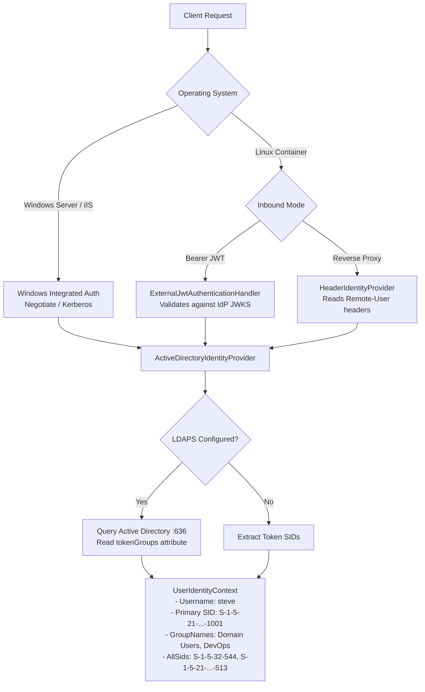
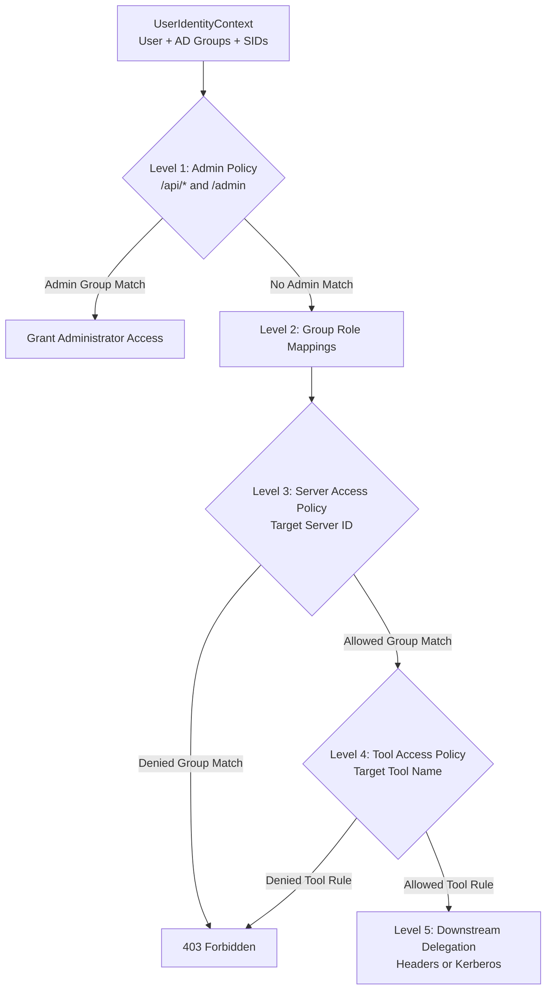

# Active Directory Authentication & Multi-Level RBAC Guide

## 1. Overview

This guide describes how Model Context Gateway (MCG) authenticates Active Directory (AD) users. It explains how the gateway evaluates group memberships and enforces authorization across all layers.

The gateway supports two deployment environments:
1. **Windows Server and IIS**: Uses Integrated Windows Authentication (Negotiate, Kerberos, NTLM).
2. **Linux Containers**: Uses direct JSON Web Token (JWT) validation or reverse proxy identity headers. It augments user groups through secure LDAP (LDAPS).

---

## 2. Inbound Identity Construction

The gateway resolves each incoming request into a unified `UserIdentityContext`.



### 2.1 Inbound Authentication Mechanisms

#### Mode 1: Windows Integrated Authentication (IIS / Windows Server)
- The client performs a Negotiate or Kerberos handshake with IIS.
- IIS populates `HttpContext.User` with a `WindowsPrincipal`.
- `ActiveDirectoryIdentityProvider` extracts user information using `IWindowsIdentityAccessor`.
- It captures the primary user Security Identifier (SID) and immediate group SIDs.

#### Mode 2: In-House Identity Provider (Linux Containers)
- The client sends an HTTP request with an `Authorization: Bearer <jwt>` header.
- `ExternalJwtAuthenticationHandler` validates the signature against the provider JWKS endpoint.
- It validates the token expiration, issuer, and audience.
- It extracts the username and group claims (`groups`, `sid`, `group_sids`).

#### Mode 3: Reverse Proxy Header Authentication (Linux Containers)
- An upstream proxy (such as Envoy, Traefik, or Nginx) authenticates the client at the perimeter.
- The proxy forwards identity headers (`Remote-User`, `Remote-Groups`, `Remote-User-Sid`).
- The gateway checks the proxy IP address against `Oidc:TrustedProxies`.
- If the proxy IP is untrusted, the gateway strips the headers and assigns the `guest` role.

---

### 2.2 Transitive Group Resolution Over LDAPS (`tokenGroups`)

Active Directory environments commonly use nested groups. Direct token inspection reads only immediate groups.

To discover all nested group memberships:
1. `ActiveDirectoryIdentityProvider` calls `LdapActiveDirectoryService`.
2. The service establishes a TLS connection to the Domain Controller over LDAPS (port 636).
3. The gateway rejects unencrypted LDAP on port 389.
4. The service authenticates with configured bind credentials (`Ldap:BindDn`, `Ldap:BindPassword`).
5. The service executes an LDAP subtree search for the user account:
   ```ldap
   (&(objectClass=user)(sAMAccountName=steve))
   ```
6. The query requests two binary attributes:
   - `objectSid`: The primary Security Identifier of the user account.
   - `tokenGroups`: A binary array calculated by the Active Directory security engine. It contains all transitive, direct, and nested group SIDs.
7. The gateway converts binary SID byte arrays to standard string format (`S-1-5-...`).
8. The gateway caches the resolved SIDs in `IMemoryCache` for 5 minutes.
9. If LDAP communication fails, the gateway throws a `SecurityException` to fail closed.

---

## 3. Multi-Level Authorization Hierarchy

The gateway enforces Active Directory group authorization across five levels:



---

### Level 1: Administrative Gateway Control (`AdminPolicy`)
`AdminPolicy` protects administrative APIs (`/api/*`) and the Admin MCP Server (`/admin`, `/mcg-admin`).

The gateway grants administrator privileges if the caller satisfies any of these conditions:
1. **Active Directory SID Match**: The caller SIDs contain `Admin:GroupSid` (default: `S-1-5-32-544` / Local Administrators).
2. **Active Directory Group Name Match**: The caller group names match any entry in `Admin:Groups` (such as `Domain Admins` or `full_admin`).
3. **Database Role Mapping**: A database rule in `GroupMappings` maps the caller's AD group to `Administrator`.
4. **Admin AppKey**: The request presents an AppKey with `admin` or `*` scopes.

---

### Level 2: External Group Mappings (`GroupMappings` Table)
Administrators map external Active Directory groups to internal gateway roles.

Configure mappings in **Settings &rarr; Access Control &rarr; Group Mappings**:

| External AD Group or SID | Internal Role | Granted Capabilities |
| :--- | :--- | :--- |
| `CN=Mcp-Admins,OU=Groups,DC=corp,DC=local` | `Administrator` | Full configuration control across all servers and settings. |
| `CN=DevOps-Operators,OU=Groups,DC=corp,DC=local` | `Operator` | Restart, reconnect, and toggle server states. |
| `CN=Security-Auditors,OU=Groups,DC=corp,DC=local` | `Auditor` | Inspect audit logs and diagnostic health. |
| `S-1-5-21-1234567890-1105` | `Administrator` | Direct SID-based administrator grant. |

---

### Level 3: Server-Level Access Control (`Policies` Table)
Controls whether an Active Directory group can access a specific downstream MCP server.

Configure server policies in **Servers &rarr; Edit Server &rarr; Access Control**:
- **`AllowedGroups`**: Delimited list of permitted AD groups (such as `CORP\Engineering,CORP\DevOps`).
- **`DeniedGroups`**: Delimited list of blocked AD groups (such as `CORP\Contractors,CORP\Guests`).

#### Evaluation Logic:
1. **Explicit Deny**: If any caller group or SID matches `DeniedGroups`, the gateway rejects the request (`403 Forbidden`).
2. **Explicit Allow**: If any caller group or SID matches `AllowedGroups`, the gateway permits server access.
3. **Default Policy Fallback**: If no rule matches, the gateway evaluates server `DefaultAllow`. If `false`, the gateway denies access.

---

### Level 4: Tool-Level Granular Access Control (`Policies` Table)
Restricts individual tools inside a backend server to specific Active Directory groups.

Configure granular tool policies in **Settings &rarr; Access Control &rarr; Access Policies**:
- **Target Type**: Select `tool`.
- **Target ID**: Enter `{serverId}/{toolName}` or `{serverId}__{toolName}`.
- **Required Group**: Enter the Active Directory group name or SID.
- **Access Type**: Select `Allow` or `Deny`.

#### Example Scenario:
An organization deploys the Docker MCP server:
- `CORP\Domain Users` receive access to read-only tools: `docker/list_containers`, `docker/inspect_container`.
- `CORP\DevOps-Admins` receive access to destructive tools: `docker/restart_container`, `docker/delete_container`.
- All other users receive `403 Forbidden` when invoking destructive tools.

---

### Level 5: Downstream Identity Delegation
After authorizing the request, the gateway connects to the target MCP server. For Active Directory callers, the gateway delegates identity using:
1. **Trusted Gateway Pattern**: Forwards `X-Forwarded-User` and `X-Forwarded-Groups` headers for downstream Row-Level Security (RLS).
2. **Windows Kerberos Impersonation**: Executes outbound calls inside `WindowsIdentity.RunImpersonated()` on Windows IIS.
3. **Personal User Credentials (BYOK)**: Resolves user tokens from database or HashiCorp Vault.

> For complete details on all downstream delegation modes and mixing guardrails, read the [**Downstream Authentication & Credential Delegation Guide**](downstream-auth-and-delegation-guide.md).

---

## 4. Configuration Reference

### Application Settings (`appsettings.json`)
```json
{
  "Admin": {
    "GroupSid": "S-1-5-32-544",
    "GroupName": "full_admin",
    "Groups": [
      "full_admin",
      "Administrator",
      "Domain Admins"
    ]
  },
  "Ldap": {
    "Server": "dc01.corp.internal",
    "Port": 636,
    "UseSsl": true,
    "Domain": "corp.internal",
    "BaseDn": "DC=corp,DC=internal",
    "BindDn": "CN=svc-mcg,OU=ServiceAccounts,DC=corp,DC=internal",
    "BindPassword": "SecretServicePassword123"
  }
}
```

### Environment Variable Overrides
```bash
Admin__GroupSid="S-1-5-32-544"
Admin__Groups__0="Domain Admins"
Admin__Groups__1="full_admin"
Ldap__Server="dc01.corp.internal"
Ldap__Port="636"
Ldap__UseSsl="true"
Ldap__Domain="corp.internal"
Ldap__BaseDn="DC=corp,DC=internal"
Ldap__BindDn="CN=svc-mcg,OU=ServiceAccounts,DC=corp,DC=internal"
Ldap__BindPassword="SecretServicePassword123"
```
