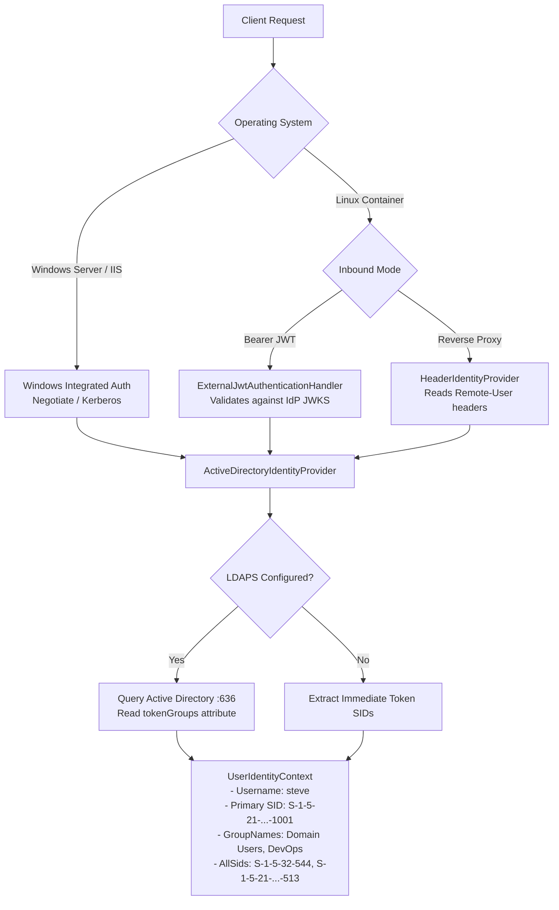

# Active Directory & Multi-Level RBAC Overview

[Home](index.md) > Active Directory & RBAC

Model Context Gateway (MCG) provides enterprise-grade identity resolution and role-based access control across Active Directory (AD) domains, LDAP/LDAPS directory services, Windows Integrated Authentication (WIA), and multi-level policy evaluation.

This guide serves as the index for MCG's security architecture articles:

---

## 1. Modular Security Architecture Articles

* [**Active Directory & LDAPS Domain Integration**](architecture/security/active-directory-ldap.md)
  Domain controller setup, LDAPS TLS configuration (port 636), service credentials (`Ldap:BindDn`, `Ldap:BindPassword`), and recursive group expansion via the Active Directory `tokenGroups` binary attribute.

* [**Multi-Level RBAC & Access Control Policies**](architecture/security/rbac-and-policies.md)
  External group mappings (`GroupMappings` table), SID evaluation, role definitions (`Administrator`, `Operator`, `Auditor`), and multi-level policies protecting administrative APIs, servers, and individual tools.

* [**Windows Integrated Authentication & IIS**](architecture/security/windows-integrated-auth.md)
  Negotiate, Kerberos, and NTLM inbound handshakes on IIS, in-process hosting via ANCM, SCM Windows Service hosting with DPAPI master key encryption, and outbound S4U2Proxy Kerberos impersonation.

---

## 2. Inbound Identity & Resolution Flow

```mermaid
flowchart TD
    Client[Client Request] --> EnvCheck{Operating System}
    
    EnvCheck -->|Windows Server / IIS| WinAuth[Windows Integrated Auth<br>Negotiate / Kerberos]
    EnvCheck -->|Linux Container| LinuxAuth{Inbound Mode}
    
    LinuxAuth -->|Bearer JWT| ExtJwt[ExternalJwtAuthenticationHandler<br>Validates against IdP JWKS]
    LinuxAuth -->|Reverse Proxy| HeaderAuth[HeaderIdentityProvider<br>Reads Remote-User headers]
    
    WinAuth --> ADProv[ActiveDirectoryIdentityProvider]
    ExtJwt --> ADProv
    HeaderAuth --> ADProv
    
    ADProv --> LdapCheck{LDAPS Configured?}
    LdapCheck -->|Yes| LdapQuery[Query Active Directory :636<br>Read tokenGroups attribute]
    LdapCheck -->|No| TokenOnly[Extract Immediate Token SIDs]
    
    LdapQuery --> Context[UserIdentityContext<br>- Username: steve<br>- Primary SID: S-1-5-21-...-1001<br>- GroupNames: Domain Users, DevOps<br>- AllSids: S-1-5-32-544, S-1-5-21-...-513]
    TokenOnly --> Context
```

---

## 3. Related User & Administrator Guides

* [**User Guide: RBAC, Security & Policies**](user-guide/rbac-and-policies.md)
* [**AppKey Scopes & Authorization**](appkey-scopes.md)
* [**Downstream Auth & Identity Delegation**](downstream-auth-and-delegation-guide.md)
* [**Authentication Architecture**](authentication-architecture.md)
