# 🏛️ Model Context Gateway (MCG) Enterprise Architecture Guide & System Specification

The **Model Context Protocol (MCP) Router Gateway & Semantic Proxy** is a C# ASP.NET Core gateway, OAuth 2.0 provider, and protocol multiplexer. It consolidates downstream MCP servers (e.g., Docker, Home Assistant, SQL databases, cloud APIs) into a unified, secure entry point for LLMs, IDEs, and autonomous agents.

This document is the **architectural specification**, detailing system context, component boundaries, frontend design, protocol multiplexing, authorization, subprocess lifecycles, database persistence, cryptographic pipelines, and operations.

---

## 📑 Table of Contents

1. [Executive Summary & Architectural Tenets](#1-executive-summary-architectural-tenets)
2. [High-Level System Architecture & Context](#2-high-level-system-architecture-context)
   - [Client Ecosystem & Ingress](#client-ecosystem-ingress)
   - [7-Layer Gateway Architecture](#7-layer-gateway-architecture)
   - [System Context & Architecture Diagram](#system-context-architecture-diagram)
3. [Backend Component & Boundary Model](#3-backend-component-boundary-model)
   - [Domain Components (`Components/`)](#domain-components-components)
   - [Infrastructure Services (`Infrastructure/`)](#infrastructure-services-infrastructure)
   - [Core Protocol & Routing Engine (`Core/`)](#core-protocol-routing-engine-core)
   - [Architectural Dependency Rules](#architectural-dependency-rules)
   - [Component Subsystem Diagram](#component-subsystem-diagram)
4. [Frontend Component & Typed Architecture](#4-frontend-component-typed-architecture)
   - [React 19 & Vite SPA Architecture](#react-19-vite-spa-architecture)
   - [Domain Component Decomposition](#domain-component-decomposition)
   - [Typed API Layer & Zustand State Stores](#typed-api-layer-zustand-state-stores)
   - [Frontend Architecture & State Flow Diagram](#frontend-architecture-state-flow-diagram)
5. [Protocol & Routing Engine Deep-Dive](#5-protocol-routing-engine-deep-dive)
   - [Meta-Mode Dynamic Capability Hiding (`/sse` & `/message`)](#meta-mode-dynamic-capability-hiding-sse-message)
   - [Target-Specific Virtual Proxying (`/{targetServerId}`)](#target-specific-virtual-proxying-targetserverid)
   - [JSON-RPC 2.0 In-Flight Multiplexing & ID Preservation](#json-rpc-20-in-flight-multiplexing-id-preservation)
   - [Sequence Diagram: Stateful SSE Session Lifecycle](#sequence-diagram-stateful-sse-session-lifecycle)
   - [Sequence Diagram: Stateless HTTP Stream Execution](#sequence-diagram-stateless-http-stream-execution)
6. [Authorization Pipeline & RBAC Decision Engine](#6-authorization-pipeline-rbac-decision-engine)
   - [4-Stage Hierarchical Decision Flow](#4-stage-hierarchical-decision-flow)
   - [Scope Grammar & Resolution](#scope-grammar-resolution)
   - [Admin SID Bypass & Database-Backed RBAC Evaluation](#admin-sid-bypass-database-backed-rbac-evaluation)
   - [Mermaid Authorization Decision Flowchart](#mermaid-authorization-decision-flowchart)
7. [Transport Subsystem & Subprocess Lifecycle](#7-transport-subsystem-subprocess-lifecycle)
   - [Strategy Pattern (`ITransport`)](#strategy-pattern-itransport)
   - [Subprocess STDIO Architecture & Security Hardening](#subprocess-stdio-architecture-security-hardening)
   - [Child Process Tree Lifecycle & Signal Handling](#child-process-tree-lifecycle-signal-handling)
   - [Stderr Log Capture & PII Token Masking](#stderr-log-capture-pii-token-masking)
   - [Sequence Diagram: STDIO Subprocess Execution](#sequence-diagram-stdio-subprocess-execution)
8. [Database & Persistence Architecture](#8-database-persistence-architecture)
   - [Unified Entity-Relationship Diagram (Mermaid ERD)](#unified-entity-relationship-diagram-mermaid-erd)
   - [Engine Dialect Strategies (SQLite, MS SQL Server, MySQL)](#engine-dialect-strategies-sqlite-ms-sql-server-mysql)
9. [Secret Provider & Envelope Encryption Pipeline](#9-secret-provider-envelope-encryption-pipeline)
   - [AES-256-GCM Envelope Encryption Specification](#aes-256-gcm-envelope-encryption-specification)
   - [Pluggable Retrievers & Dynamic Reload Without Restart](#pluggable-retrievers-dynamic-reload-without-restart)
   - [Secret Resolution & Encryption Pipeline Flowchart](#secret-resolution-encryption-pipeline-flowchart)
10. [Cross-References, Verification & Operational Guide](#10-cross-references-verification-operational-guide)

---

## 1. Executive Summary & Architectural Tenets

The Model Context Gateway (MCG) solves the **Context Explosion & Security Fragmentation Problem** in large-scale MCP deployments. Connecting directly to many independent MCP servers causes:
1. **Context Window Saturation**: Loading schemas for 300+ tools exhausts tokens.
2. **Tool Selection Confusion**: Overlapping tool names cause hallucinations and errors.
3. **Security & Credential Sprawl**: Plaintext credentials across client configurations are vulnerabilities.
4. **Lack of Centralized Audit & Governance**: Enterprise compliance requires unified auditing, identity attribution, PII redaction, and access control.

To address these challenges, Model Context Gateway (MCG) enforces seven **core architectural tenets**:

```
+---------------------------------------------------------------------------------------------------+
|                                 CORE ARCHITECTURAL TENETS                                         |
+---------------------------------------------------------------------------------------------------+
|  1. Sub-Millisecond Routing Decisions                                                             |
|     Header inspection (Mcp-Method, Mcp-Name) and lightweight path resolution allow fast triage    |
|     without buffering large request bodies.                                                       |
|                                                                                                   |
|  2. Zero Token Waste via Meta-Mode                                                                |
|     Default client connections expose only two bootstrap tools: `search_tools` and `execute_tool`.|
|     Target tools are ranked on-demand using local in-process ONNX embeddings or API embeddings.   |
|                                                                                                   |
|  3. Fail-Closed, Multi-Stage RBAC                                                                 |
|     All capability invocations pass through AppKey scope boundaries, identity group mappings,     |
|     and stored procedure RBAC evaluations. Any missing policy or exception results in DENY.      |
|                                                                                                   |
|  4. Strict Isolation & Concurrency Fidelity                                                       |
|     Clients maintain separate session contexts. JSON-RPC request IDs (integer, string, GUID) are  |
|     faithfully preserved while being mapped upstream to prevent collisions in multiplexed streams.|
|                                                                                                   |
|  5. Zero Credential Exposure (Environment-Only Injection)                                         |
|     Downstream secrets are fetched from Vault, Registry DPAPI, or Env, and injected into headers   |
|     or process environments. Credentials are NEVER passed via CLI arguments or logged to disk.    |
|                                                                                                   |
|  6. Pluggable, Strategy-Driven Subsystems                                                         |
|     All major subsystems (`ITransport`, `IIdentityProvider`, `ISecretRetriever`,                  |
|     `IDbConnectionFactory`, `IEmbeddingService`) are decoupled through strategy interfaces.      |
|                                                                                                   |
|  7. Observability & Mandatory PII Masking                                                         |
|     Every client request, downstream execution, and admin modification is logged to audit tables  |
|     after passing through regex-based PII sanitization.                                           |
+---------------------------------------------------------------------------------------------------+
```

---

## 2. High-Level System Architecture & Context

### Client Ecosystem & Ingress

Model Context Gateway (MCG) supports:

* **Cursor IDE**: Connects over Server-Sent Events (`/sse`) or target proxy routes (`/{serverId}`) using MCP extension settings.
* **Claude Desktop**: Configured via `claude_desktop_config.json` connecting to SSE or local CLI bridges.
* **Antigravity CLI**: Agentic coding assistant connecting to Meta-Mode `/sse` with automatic tool discovery and execution.
* **OpenClaw Agent**: Dedicated autonomous agent host (`10.0.10.10`) communicating over internal networks (`net_cloud`).
* **VS Code / Cline / Roo Code / Continue.dev**: IDE extensions leveraging standard MCP SSE protocols.
* **Custom SDKs & Scripts**: Python (`mcp` library), TypeScript/Node.js, cURL, LangChain, and AutoGen clients communicating over HTTP POST or SSE.

### 7-Layer Gateway Architecture

The router architecture is partitioned into seven layers:

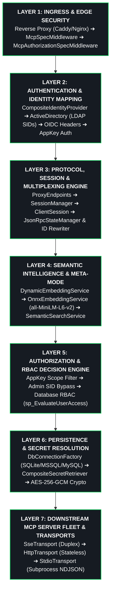

### System Context & Architecture Diagram

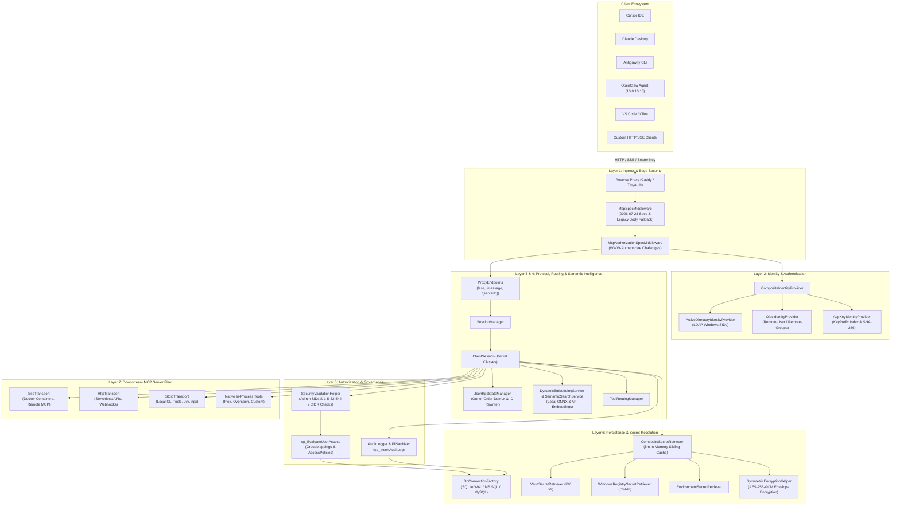

---

## 3. Backend Component & Boundary Model

The C# codebase is partitioned into three bounded contexts: [`Components/`](https://github.com/spelech/model-context-gateway/tree/main/Components), [`Infrastructure/`](https://github.com/spelech/model-context-gateway/tree/main/Infrastructure), and [`Core/`](https://github.com/spelech/model-context-gateway/tree/main/Core).

```
├── Components/
│   ├── Servers/         # Upstream server registry, validation, health checks, discovery & MapServerEndpoints
│   ├── Clients/         # Registered clients, credential service, OAuth endpoints & MapClientEndpoints
│   ├── AppKeys/         # AppKey models, authorization keys, hashing, scope checks & MapAppKeyEndpoints
│   ├── Providers/       # Auth/Secret provider settings, envelope crypto & MapProviderEndpoints
│   ├── Authorization/   # Access policies, group mappings, RBAC evaluation & MapPolicyEndpoints
│   └── Capabilities/    # Native tools, virtual proxy execution, tool/prompt/resource handlers & MapCapabilityEndpoints
├── Infrastructure/
│   ├── Persistence/     # Dapper repositories, database connection factory, migrations & seeders
│   ├── Transports/      # SSE, HTTP, STDIO, state manager & target proxy
│   ├── Identity/        # Active Directory, OIDC, AppKey identity providers & LDAP service
│   ├── Secrets/         # Vault, Windows Registry, Environment secret retrievers & encryption
│   └── Logging/         # Audit logger, PII sanitization & in-memory log providers
└── Core/
    ├── Protocol/        # JSON-RPC 2.0 protocol models & polymorphic converter
    └── Routing/         # ClientSession, SessionManager, BackendConnection & Semantic Search
```

### Domain Components (`Components/`)

1. **`Servers`**:
   - [`McpServer.cs`](https://github.com/spelech/model-context-gateway/blob/main/Components/Servers/McpServer.cs): Data model representing upstream MCP servers, endpoints, transport types, categories, headers, and secret associations.
   - [`ServerEndpoints.cs`](https://github.com/spelech/model-context-gateway/blob/main/Components/Servers/ServerEndpoints.cs): Minimal API mapping for CRUD operations, inspections, and health states (`GET /api/servers`, `POST /api/servers`, `DELETE /api/servers/{id}`).
   - [`ServerValidationHelper.cs`](https://github.com/spelech/model-context-gateway/blob/main/Components/Servers/ServerValidationHelper.cs): URL syntax checking, SSRF prevention, and parameter sanitization.
   - [`DockerAutoDiscoveryService.cs`](https://github.com/spelech/model-context-gateway/blob/main/Components/Servers/DockerAutoDiscoveryService.cs): Dynamic label-based container discovery (`mcp.enable=true`, `mcp.name`, `mcp.port`).
   - [`BackendHealthCheckService.cs`](https://github.com/spelech/model-context-gateway/blob/main/Components/Servers/BackendHealthCheckService.cs): Background periodic health prober (15s HTTP GET + 30s JSON-RPC ping).

2. **`Clients`**:
   - [`ClientEndpoints.cs`](https://github.com/spelech/model-context-gateway/blob/main/Components/Clients/ClientEndpoints.cs) & [`ClientsController.cs`](https://github.com/spelech/model-context-gateway/blob/main/Components/Clients/ClientsController.cs): Client registration and OAuth client management.
   - [`CredentialService.cs`](https://github.com/spelech/model-context-gateway/blob/main/Components/Clients/CredentialService.cs): Automated client configuration generation (`claude_desktop_config.json`, Cursor config, environment templates).

3. **`AppKeys`**:
   - [`AppKey.cs`](https://github.com/spelech/model-context-gateway/blob/main/Components/AppKeys/AppKey.cs) & [`AppKeyModels.cs`](https://github.com/spelech/model-context-gateway/blob/main/Components/AppKeys/AppKeyModels.cs): High-entropy machine keys (`mcp-*-*-*`), key prefixes (`KeyPrefix`), AES-256-GCM encrypted keys, scopes (`ScopesJson`), and attribution (`OwnerSid`).
   - [`AppKeyEndpoints.cs`](https://github.com/spelech/model-context-gateway/blob/main/Components/AppKeys/AppKeyEndpoints.cs) & [`AppKeysController.cs`](https://github.com/spelech/model-context-gateway/blob/main/Components/AppKeys/AppKeysController.cs): Endpoints for key minting, revocation, prefix lookups, and validation.

4. **`Providers`**:
   - [`ProviderEndpoints.cs`](https://github.com/spelech/model-context-gateway/blob/main/Components/Providers/ProviderEndpoints.cs) & [`ProvidersController.cs`](https://github.com/spelech/model-context-gateway/blob/main/Components/Providers/ProvidersController.cs): Management of Identity and Secret Provider configurations.
   - [`ProviderConfigSecurityHelper.cs`](https://github.com/spelech/model-context-gateway/blob/main/Components/Providers/ProviderConfigSecurityHelper.cs): Transparent encryption/decryption of provider JSON configuration payloads.

5. **`Authorization`**:
   - [`PolicyEndpoints.cs`](https://github.com/spelech/model-context-gateway/blob/main/Components/Authorization/PolicyEndpoints.cs) & [`PermissionsController.cs`](https://github.com/spelech/model-context-gateway/blob/main/Components/Authorization/PermissionsController.cs): Endpoints for RBAC policies and group mappings.
   - [`SecurityValidationHelper.cs`](https://github.com/spelech/model-context-gateway/blob/main/Components/Authorization/SecurityValidationHelper.cs): CIDR subnet evaluation, private IP blocking, SSRF prevention, and Administrator SID verification (`S-1-5-32-544`).

6. **`Capabilities`**:
   - [`ProxyEndpoints.cs`](https://github.com/spelech/model-context-gateway/blob/main/Components/Capabilities/ProxyEndpoints.cs): Core HTTP/SSE entrypoints (`/sse`, `/message`, `/{targetServerId}`).
   - [`CapabilityEndpoints.cs`](https://github.com/spelech/model-context-gateway/blob/main/Components/Capabilities/CapabilityEndpoints.cs): Tool, prompt, resource, and custom file catalog management.
   - [`CustomToolRegistry.cs`](https://github.com/spelech/model-context-gateway/blob/main/Components/Capabilities/NativeTools/CustomToolRegistry.cs): In-process native tools for Plex (`PlexGetLibrarySectionsTool`, `PlexSearchLibraryTool`, `PlexGetSessionsTool`, etc.) and Overseerr (`SeerrSearchMediaTool`, `SeerrRequestMediaTool`, `SeerrGetRequestsTool`, etc.).

### Infrastructure Services (`Infrastructure/`)

1. **`Persistence`**:
   - [`DbConnectionFactory.cs`](https://github.com/spelech/model-context-gateway/blob/main/Infrastructure/Persistence/DbConnectionFactory.cs): Multi-database factory supporting SQLite (WAL), MS SQL Server (`Microsoft.Data.SqlClient`), and MySQL (`MySqlConnector`).
   - [`Repositories.cs`](https://github.com/spelech/model-context-gateway/blob/main/Infrastructure/Persistence/Repositories.cs): High-performance Dapper repository layer.
   - [`DatabaseSeederService.cs`](https://github.com/spelech/model-context-gateway/blob/main/Infrastructure/Persistence/DatabaseSeederService.cs): Automatic in-process migrations, schema compatibility validation, and default configuration seeding.

2. **`Transports`**:
   - [`ITransport.cs`](https://github.com/spelech/model-context-gateway/blob/main/Infrastructure/Transports/ITransport.cs): Unified abstraction for downstream transport channels.
   - [`SseTransport.cs`](https://github.com/spelech/model-context-gateway/blob/main/Infrastructure/Transports/SseTransport.cs): Full-duplex persistent Server-Sent Events channel with POST message forwarding.
   - [`HttpTransport.cs`](https://github.com/spelech/model-context-gateway/blob/main/Infrastructure/Transports/HttpTransport.cs): Stateless half-duplex HTTP POST and chunked streaming transport.
   - [`StdioTransport.cs`](https://github.com/spelech/model-context-gateway/blob/main/Infrastructure/Transports/StdioTransport.cs): Subprocess STDIO transport communicating via newline-delimited JSON-RPC (NDJSON).
   - [`JsonRpcStateManager.cs`](https://github.com/spelech/model-context-gateway/blob/main/Infrastructure/Transports/JsonRpcStateManager.cs): Manages pending request completion sources (`PendingRequestTcs`), ID rewriting, cancellation tokens, and connection resets.

3. **`Identity`**:
   - [`CompositeIdentityProvider.cs`](https://github.com/spelech/model-context-gateway/blob/main/Infrastructure/Identity/CompositeIdentityProvider.cs): Aggregates Active Directory, OIDC, and AppKey authenticators.
   - [`ActiveDirectoryIdentityProvider.cs`](https://github.com/spelech/model-context-gateway/blob/main/Infrastructure/Identity/ActiveDirectoryIdentityProvider.cs) & [`LdapActiveDirectoryService.cs`](https://github.com/spelech/model-context-gateway/blob/main/Infrastructure/Identity/LdapActiveDirectoryService.cs): Resolves Windows Kerberos/NTLM caller SIDs via LDAP.
   - [`OidcIdentityProvider.cs`](https://github.com/spelech/model-context-gateway/blob/main/Infrastructure/Identity/OidcIdentityProvider.cs): Extracts authenticated user contexts from reverse-proxy headers (`Remote-User`, `Remote-Groups`, `Remote-User-Sid`).

4. **`Secrets`**:
   - [`CompositeSecretRetriever.cs`](https://github.com/spelech/model-context-gateway/blob/main/Infrastructure/Secrets/CompositeSecretRetriever.cs): Dispatches to Vault, Windows Registry, or Environment retrievers with a 5-minute sliding in-memory cache.
   - [`VaultSecretRetriever.cs`](https://github.com/spelech/model-context-gateway/blob/main/Infrastructure/Secrets/VaultSecretRetriever.cs): Fetches secrets from HashiCorp Vault KV v2 using AppRole or Token authentication.
   - [`WindowsRegistrySecretRetriever.cs`](https://github.com/spelech/model-context-gateway/blob/main/Infrastructure/Secrets/WindowsRegistrySecretRetriever.cs): Fetches Windows DPAPI-protected registry keys (`HKLM` / `HKCU`).
   - [`EnvironmentSecretRetriever.cs`](https://github.com/spelech/model-context-gateway/blob/main/Infrastructure/Secrets/EnvironmentSecretRetriever.cs): Reads container environment variables.
   - [`SymmetricEncryptionHelper.cs`](https://github.com/spelech/model-context-gateway/blob/main/Infrastructure/Secrets/SymmetricEncryptionHelper.cs): AES-256-GCM envelope encryption for database fields and config payloads.

5. **`Logging`**:
   - [`AuditLogger.cs`](https://github.com/spelech/model-context-gateway/blob/main/Infrastructure/Logging/AuditLogger.cs): Writes structured invocation and admin audit trails.
   - [`PiiSanitizer.cs`](https://github.com/spelech/model-context-gateway/blob/main/Infrastructure/Logging/PiiSanitizer.cs): Regex sanitizer stripping Bearer tokens, API keys, passwords, and connection strings.
   - [`InMemoryLogger.cs`](https://github.com/spelech/model-context-gateway/blob/main/Infrastructure/Logging/InMemoryLogger.cs): Thread-safe ring buffer powering the real-time Test Bench UI console.

### Core Protocol & Routing Engine (`Core/`)

1. **`ClientSession` (Partial Class Architecture)**:
   - [`ClientSession.cs`](https://github.com/spelech/model-context-gateway/blob/main/Core/Routing/ClientSession.cs): Main session lifecycle coordinator.
   - [`ClientSession.Authorization.cs`](https://github.com/spelech/model-context-gateway/blob/main/Core/Routing/ClientSession/ClientSession.Authorization.cs): Multi-stage RBAC authorization, caller identity resolution, and audit logging.
   - [`ClientSession.BackendInitializer.cs`](https://github.com/spelech/model-context-gateway/blob/main/Core/Routing/ClientSession/ClientSession.BackendInitializer.cs): Asynchronous concurrent warming of downstream backend connections and tool schemas.
   - [`ClientSession.ProxyForwarder.cs`](https://github.com/spelech/model-context-gateway/blob/main/Core/Routing/ClientSession/ClientSession.ProxyForwarder.cs): Dispatches requests to downstream servers, tracks upstream GUIDs, and demultiplexes responses.
   - [`ClientSession.JsonRpcRewriter.cs`](https://github.com/spelech/model-context-gateway/blob/main/Core/Routing/ClientSession/ClientSession.JsonRpcRewriter.cs): Uses `System.Text.Json.Nodes.JsonNode` to un-namespace tool names and rewrite message bodies safely without fragile string manipulation.
   - [`ClientSession.NotificationBroadcaster.cs`](https://github.com/spelech/model-context-gateway/blob/main/Core/Routing/ClientSession/ClientSession.NotificationBroadcaster.cs): Fan-out broadcasting of notifications across active client channels.

2. **`Routing Coordinators`**:
   - [`SessionManager.cs`](https://github.com/spelech/model-context-gateway/blob/main/Core/Routing/SessionManager.cs): Thread-safe tracking and cleanup of active client connections.
   - [`BackendConnection.cs`](https://github.com/spelech/model-context-gateway/blob/main/Core/Routing/BackendConnection.cs): Manages a single upstream server connection channel, health state, and cached capabilities.
   - [`SemanticSearchService.cs`](https://github.com/spelech/model-context-gateway/blob/main/Core/Routing/SemanticSearchService.cs): Hybrid BM25 keyword matching combined with cosine similarity vector scoring.
   - [`DynamicEmbeddingService.cs`](https://github.com/spelech/model-context-gateway/blob/main/Core/Routing/DynamicEmbeddingService.cs), [`OnnxEmbeddingService.cs`](https://github.com/spelech/model-context-gateway/blob/main/Core/Routing/OnnxEmbeddingService.cs), and [`ApiEmbeddingService.cs`](https://github.com/spelech/model-context-gateway/blob/main/Core/Routing/ApiEmbeddingService.cs): Vector embedding calculation via local CPU ONNX runtime (`all-MiniLM-L6-v2`) or remote OpenAI-compatible APIs.
   - [`ToolRoutingManager.cs`](https://github.com/spelech/model-context-gateway/blob/main/Core/Routing/ToolRoutingManager.cs), [`ResourceRoutingManager.cs`](https://github.com/spelech/model-context-gateway/blob/main/Core/Routing/ResourceRoutingManager.cs), [`PromptRoutingManager.cs`](https://github.com/spelech/model-context-gateway/blob/main/Core/Routing/PromptRoutingManager.cs): Namespacing, un-namespacing, and routing of individual MCP capabilities.

### Architectural Dependency Rules

```
┌─────────────────────────────────────────────────────────────────────────────┐
│                       ARCHITECTURAL BOUNDARY CONSTRAINTS                    │
├─────────────────────────────────────────────────────────────────────────────┤
│ 1. Core NEVER depends on specific database drivers or concrete transports.  │
│    Core interacts strictly through `IDbConnectionFactory`, `ITransport`,    │
│    and `ISecretRetriever`.                                                  │
│                                                                             │
│ 2. Infrastructure implements strategy interfaces defined in Core and DI.    │
│    All database dialects (SQLite, MSSQL, MySQL) adhere to common contracts.│
│                                                                             │
│ 3. Components expose Minimal API endpoints and controllers that consume      │
│    Core session managers, repositories, and security helpers.               │
│                                                                             │
│ 4. No Raw String JSON Manipulation: All JSON-RPC modifications MUST use     │
│    `JsonNode`, `JsonObject`, or `JsonDocument` DOM trees.                   │
│                                                                             │
│ 5. Thread-Safe State: Shared state MUST use `ConcurrentDictionary` or       │
│    explicit monitor locks. Single-execution locks guard initialization.     │
└─────────────────────────────────────────────────────────────────────────────┘
```

### Component Subsystem Diagram

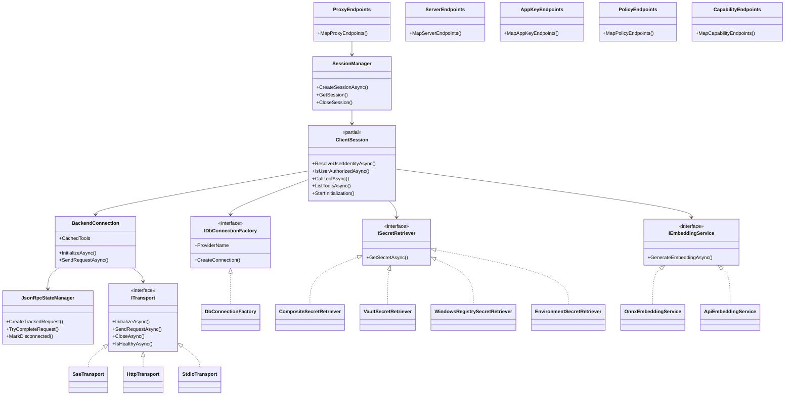

---

## 4. Frontend Component & Typed Architecture

### React 19 & Vite SPA Architecture

The web dashboard uses **React 19**, **TypeScript**, **Vite**, and **Zustand**. It features a dark-mode interface styled with CSS variables (`variables.css`, `layout.css`, `dashboard.css`, `tester.css`).

### Domain Component Decomposition

```
frontend/src/
├── api/                    # Typed API Client Layer (Axios / Fetch Wrappers)
│   ├── api.ts              # Base API instance, headers & error handling
│   ├── serverApi.ts        # Server CRUD & discovery endpoints
│   ├── clientApi.ts        # Registered OAuth clients
│   ├── appKeyApi.ts        # AppKey minting, revocation & verification
│   ├── securityApi.ts      # Policies & group mappings
│   ├── settingsApi.ts      # Provider configs & system settings
│   ├── userApi.ts          # Authenticated user identity & version info
│   └── testbenchApi.ts     # Tool execution, search simulation & log streaming
├── components/             # Domain UI Component Trees
│   ├── servers/            # DashboardView, ServerModal, ServerInspectModal, ServerCard
│   ├── clients/            # RegisteredClientsCard, ClientSetupGuide, AppKeysCard, ClientModal
│   ├── security/           # SecurityView, PolicyModal, MappingModal
│   ├── settings/           # SettingsView, GeneralTab, IdentityAuthTab, SecretProvidersTab,
│   │                       # AccessControlTab, CustomFilesTab, BackupsTab
│   ├── testbench/          # TestBenchView (Interactive JSON Schema Form Builder, Console, & Log Stream)
│   └── shared/             # Header, Footer, Toasts, Modal, StatusBadge, PaginationToolbar
├── stores/                 # Centralized Zustand Reactive Stores
│   ├── useServerStore.ts   # Servers list, health states, filter queries
│   ├── useClientStore.ts   # Registered clients & setup guides
│   ├── useAppKeyStore.ts   # Active keys, key creation modal, copy buffer
│   ├── useSettingsStore.ts # Provider configs, dynamic encryption flags
│   ├── useUserStore.ts     # Current user, roles, SIDs, version cache
│   ├── useLogStore.ts      # Real-time logs ring buffer & level filters
│   └── useToastStore.ts    # Notification toast queue with auto-dismiss
└── types/                  # Canonical TypeScript Domain Interfaces
    ├── server.ts, client.ts, appKey.ts, security.ts, settings.ts, user.ts, testbench.ts
```

### Typed API Layer & Zustand State Stores

The frontend decouples UI rendering, API communication, and state management:
* **`useServerStore`**: Manages server inventory, search/category filtering, inspect modal state, and health check refresh intervals.
* **`useAppKeyStore`**: Handles key creation, reveals the raw secret once upon creation, and manages scope assignments.
* **`useSettingsStore`**: Coordinates secret and identity provider forms, toggles password masking, and encrypts configuration payloads.
* **`useLogStore`**: Receives streaming logs into an in-memory ring buffer for live filtering in the Test Bench.

### Frontend Architecture & State Flow Diagram

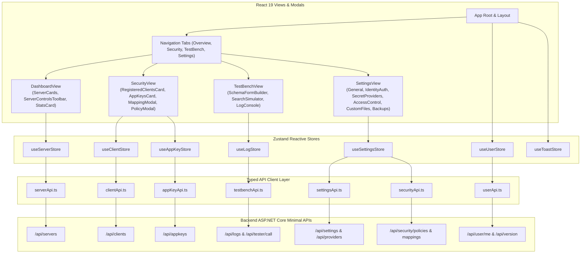

---

## 5. Protocol & Routing Engine Deep-Dive

### Meta-Mode Dynamic Capability Hiding (`/sse` & `/message`)

Exposing all tool definitions during the `tools/list` handshake overwhelms LLM context windows.

**Meta-Mode Architecture**:
1. **Bootstrap Initialization**: When a client connects to `/sse` with Meta-Mode enabled (the default), the router returns only two native gateway bootstrap tools:
   - `search_tools`: Accepts a natural language query (e.g. `"restart plex container"`) and returns relevant ranked tools.
   - `execute_tool`: Executes a namespaced tool (`{serverId}__{toolName}`) with dynamic parameter forwarding.
2. **Background Cache Pre-Warming**: In the background, [`ClientSession.BackendInitializer.cs`](https://github.com/spelech/model-context-gateway/blob/main/Core/Routing/ClientSession/ClientSession.BackendInitializer.cs) concurrently initializes all enabled downstream transports and caches their tool, prompt, and resource schemas.
3. **Semantic Scoring & Ranking**: When `search_tools` is called:
   - The query is vectorized using [`DynamicEmbeddingService`](https://github.com/spelech/model-context-gateway/blob/main/Core/Routing/DynamicEmbeddingService.cs) (local ONNX `all-MiniLM-L6-v2` or remote API).
   - [`SemanticSearchService`](https://github.com/spelech/model-context-gateway/blob/main/Core/Routing/SemanticSearchService.cs) scores cached tools using a hybrid formula: `Score = (0.4 * KeywordScore) + (0.6 * VectorCosineSimilarity)`.
   - Results are namespaced as `{serverId}__{toolName}` and returned to the client.
4. **Execution Dispatch**: When `execute_tool` is invoked:
   - The router un-namespaces the tool name to identify the target server.
   - Security policies and AppKey scopes are verified.
   - Secrets are resolved and injected.
   - The call is dispatched to the upstream transport, and the result is returned to the client.

### Target-Specific Virtual Proxying (`/{targetServerId}`)

For clients requiring direct interaction with a specific backend:
* The client connects to `/{targetServerId}`.
* The gateway validates AppKey scopes (`server:{targetServerId}`, `category:{cat}`, or `*`).
* Capabilities are proxied directly without Meta-Mode filtering; tool names remain un-namespaced.

### JSON-RPC 2.0 In-Flight Multiplexing & ID Preservation

The router multiplexes client requests across backend connections while ensuring response isolation:

1. **Polymorphic Serialization**: [`JsonRpcMessageConverter.cs`](https://github.com/spelech/model-context-gateway/blob/main/Core/Protocol/ProtocolModels.cs) handles bidirectional serialization of `JsonRpcRequest`, `JsonRpcResponse`, `JsonRpcNotification`, and `JsonRpcError`.
2. **Client ID Preservation**: The client's original ID (whether an integer `1`, string `"req-123"`, or GUID) is captured in [`PendingRequestTcs`](https://github.com/spelech/model-context-gateway/blob/main/Infrastructure/Transports/JsonRpcStateManager.cs).
3. **GUID Upstream Rewriting**: To prevent ID collisions when multiple clients send requests with `id: 1` to the same backend connection, the router rewrites the upstream request ID to a unique GUID (`upstreamRequestId = Guid.NewGuid().ToString("N")`).
4. **Out-of-Order Response Demultiplexing**: When the upstream backend responds, [`JsonRpcStateManager`](https://github.com/spelech/model-context-gateway/blob/main/Infrastructure/Transports/JsonRpcStateManager.cs) matches the GUID, restores the client's original ID onto the response object (`response.Id = tracked.OriginalId`), and fulfills the waiting `TaskCompletionSource`.

### Sequence Diagram: Stateful SSE Session Lifecycle

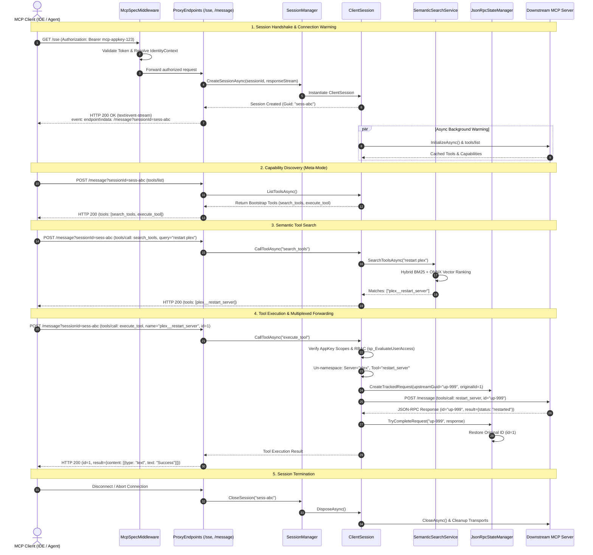

### Sequence Diagram: Stateless HTTP Stream Execution

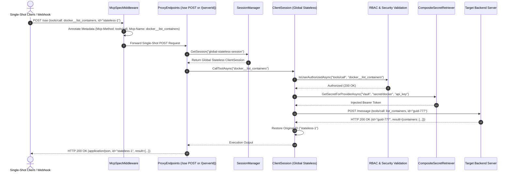

---

## 6. Authorization Pipeline & RBAC Decision Engine

### 4-Stage Hierarchical Decision Flow

Requests pass through four security stages:

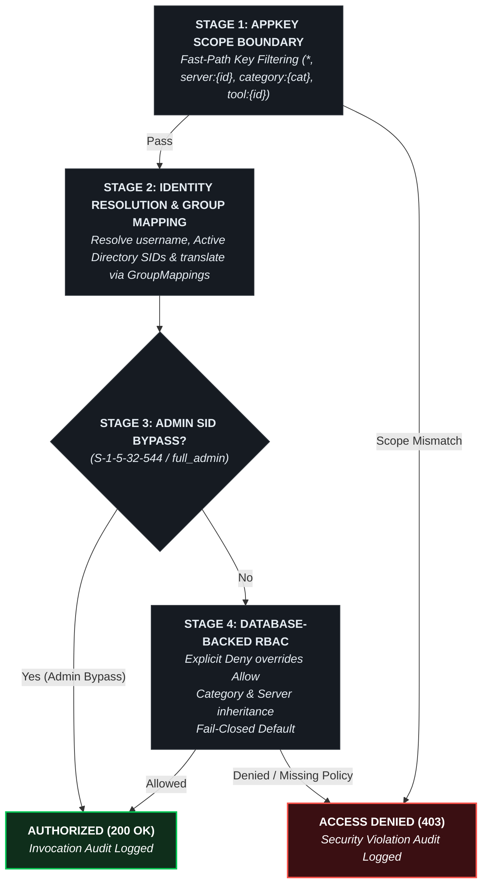

### Scope Grammar & Resolution

AppKeys support granular least-privilege scoping:

| Scope Pattern | Matches / Grants Access To |
| :--- | :--- |
| `*` or `all` or `mcp_client` | Full access to all servers, tools, prompts, and resources. |
| `server:{serverId}` | Full access to all tools, prompts, and resources under the specified server. |
| `category:{categoryName}` | Access to all servers tagged with the specified category (e.g. `category:Media`, `category:Smarthome`). |
| `tool:{toolName}` | Access to a specific un-namespaced or namespaced tool. |
| `prompt:{promptName}` | Access to a specific prompt template. |
| `resource:{uri}` | Access to a specific resource URI or wildcard pattern (`mcp://docker/*`). |

### Admin SID Bypass & Database-Backed RBAC Evaluation

1. **Administrator SID Verification**: [`SecurityValidationHelper.IsAdmin`](https://github.com/spelech/model-context-gateway/blob/main/Components/Authorization/SecurityValidationHelper.cs) verifies whether the resolved caller principal contains the well-known Windows Built-in Administrators SID (`S-1-5-32-544`), the `full_admin` group role, or any SID configured in `Admin:GroupSid`. Admin principals bypass database RBAC policy checks while their actions remain fully audited.
2. **Database Stored Procedure Evaluation (`sp_EvaluateUserAccess`)**:
   - For non-admin principals, the gateway executes [`sp_EvaluateUserAccess`](https://github.com/spelech/model-context-gateway/blob/main/scripts/db/mssql/02_procedures.sql) across MS SQL Server / MySQL, or direct parameterized queries on SQLite.
   - **Explicit Deny Rule**: If any policy matching the user's groups has `IsAllowed = 0`, access is immediately denied.
   - **Explicit Allow Rule**: Access is permitted only if at least one matching policy has `IsAllowed = 1`.
   - **Fail-Closed Default**: If no matching policies exist, or if a database failure occurs, access is denied (`403 Forbidden`).

### Mermaid Authorization Decision Flowchart

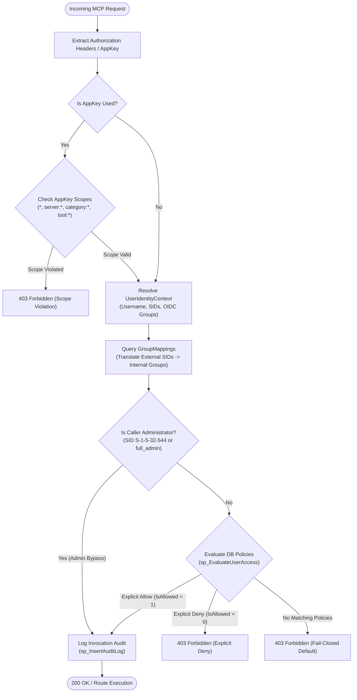

---

## 7. Transport Subsystem & Subprocess Lifecycle

### Strategy Pattern (`ITransport`)

All downstream transports implement [`ITransport`](https://github.com/spelech/model-context-gateway/blob/main/Infrastructure/Transports/ITransport.cs):

```csharp
public interface ITransport : IAsyncDisposable
{
    string TransportType { get; }
    bool IsConnected { get; }
    Task InitializeAsync(McpServer server, CancellationToken cancellationToken = default);
    Task<JsonRpcResponse> SendRequestAsync(JsonRpcRequest request, CancellationToken cancellationToken = default);
    Task SendNotificationAsync(JsonRpcNotification notification, CancellationToken cancellationToken = default);
    Task CloseAsync(CancellationToken cancellationToken = default);
    Task<bool> IsHealthyAsync(CancellationToken cancellationToken = default);
}
```

### Subprocess STDIO Architecture & Security Hardening

The [`StdioTransport`](https://github.com/spelech/model-context-gateway/blob/main/Infrastructure/Transports/StdioTransport.cs) manages local executables, CLI tools, Python scripts (`uvx`), and Node packages (`npx`):

1. **Command Line Tokenization**: [`StdioTransport.ParseCommandLine`](https://github.com/spelech/model-context-gateway/blob/main/Infrastructure/Transports/StdioTransport.cs) parses single/double quoted paths and arguments cleanly into an executable and argument array.
2. **Strict Process Security Policy**:
   - `UseShellExecute = false` and `CreateNoWindow = true`.
   - Executables are invoked directly without intermediate shells (`sh`, `bash`, `cmd.exe`, `powershell.exe`) to prevent shell injection and command chaining attacks (`&&`, `;`, `|`).
3. **Zero-Leakage Credential Injection**:
   - Downstream secrets resolved from Vault or Environment are injected strictly via `ProcessStartInfo.Environment`.
   - Credentials are **never** passed as command-line arguments, preventing exposure in process tables (`ps aux`, `/proc/$PID/cmdline`).
4. **Stream Synchronization & Buffer Draining**:
   - Requests are written to `StandardInput` as newline-delimited JSON (NDJSON) guarded by asynchronous write locks.
   - `StandardOutput` is read line-by-line using asynchronous loops to prevent buffer deadlocks.

### Child Process Tree Lifecycle & Signal Handling

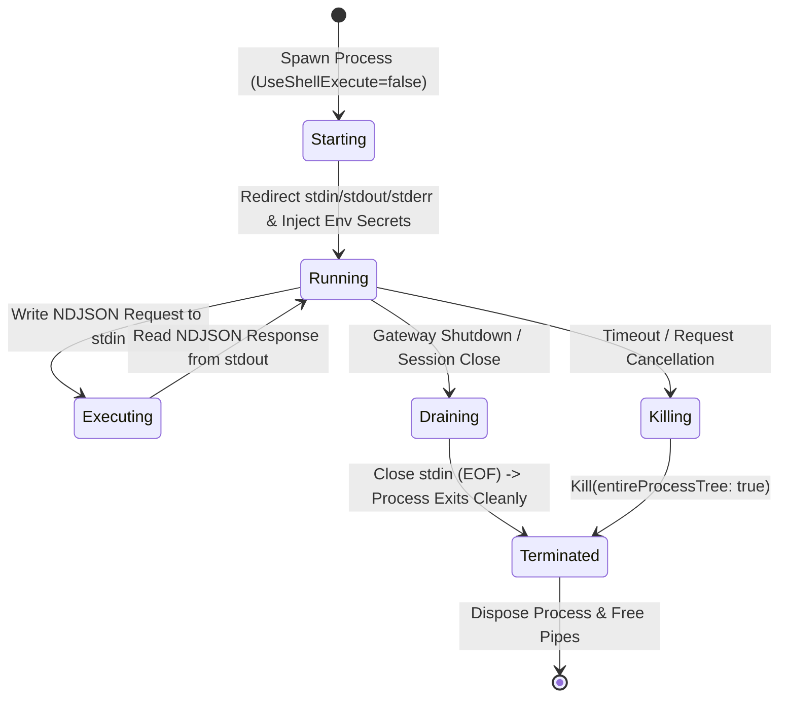

* **Graceful Termination**: The router closes `stdin`, signaling EOF to the subprocess.
* **Process Tree Killing**: If the subprocess fails to exit within the grace period (5 seconds), [`process.Kill(entireProcessTree: true)`](https://github.com/spelech/model-context-gateway/blob/main/Infrastructure/Transports/StdioTransport.cs) terminates the entire process hierarchy, preventing orphaned worker threads.

### Stderr Log Capture & PII Token Masking

* A background listener continuously drains `StandardError`.
* Lines are passed through [`PiiSanitizer.SanitizePayload`](https://github.com/spelech/model-context-gateway/blob/main/Infrastructure/Logging/PiiSanitizer.cs) to redact tokens before writing to application loggers.

### Sequence Diagram: STDIO Subprocess Execution

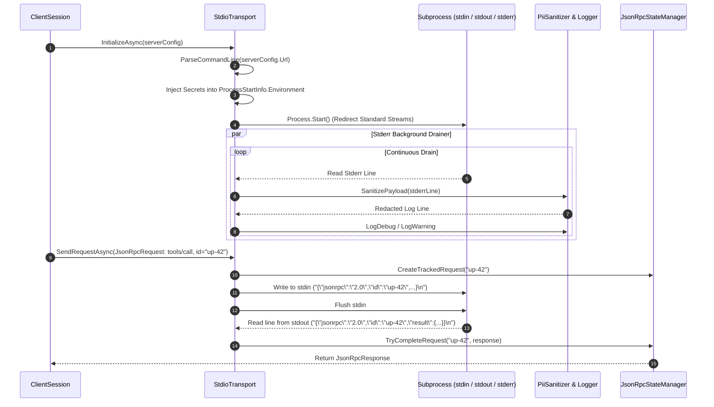

---

## 8. Database & Persistence Architecture

### Unified Entity-Relationship Diagram (Mermaid ERD)

For the standalone schema reference and column constraints catalog, see [**Canonical Data Model & Database ERD**](data-model.md) and [**Database Provider Support & Deployment Matrix**](database-providers.md).

```mermaid
erDiagram
    Servers ||--o{ Tools : "exposes (FK: ServerId)"
    Servers ||--o{ AccessPolicies : "governed by (TargetId)"
    Servers ||--o{ AuditLogs : "generates (ServerCodeName)"
    Servers }o--o| SecretProviders : "resolves credentials (SecretProvider)"
    
    Tools ||--o{ ToolAccessPolicies : "governed by (FK: ToolId)"
    Tools ||--o{ AccessPolicies : "governed by (TargetId)"
    
    AdGroups ||--o{ ToolAccessPolicies : "assigned to (FK: GroupId)"
    AdGroups ||--o{ GroupMappings : "maps external groups (InternalGroup)"
    
    AppKeys ||--o{ AuditLogs : "attributed via (UserSid -> OwnerSid)"
    
    Servers {
        string Id PK "Server unique identifier (e.g. docker, plex)"
        string DisplayName "Human-readable server name"
        string Url "Endpoint URL or command string"
        boolean Enabled "Active/inactive operational state"
        boolean Hidden "Hidden from client discovery list"
        string Type "Transport type: sse, http, stdio"
        string SecretProvider "Provider: None, HashiCorpVault, WindowsRegistry, Environment"
        string SecretItemKey "Target secret key identifier"
        string SecretMount "Vault secret engine mount path"
        string SecretPath "Vault secret subpath or registry key"
        string SecretField "Vault secret JSON field key"
        string AuthShape "Authentication shape: bearer, customHeader, query"
        string CustomHeaderName "Custom HTTP header name if shape=customHeader"
        string Categories "JSON array of category tags"
        string ApiKey "Static API key (redacted in API)"
        string HeadersJson "JSON dictionary of custom HTTP headers"
        boolean AutoDiscovered "Flag indicating dynamic auto-discovery"
    }

    Settings {
        string Id PK "Global singleton configuration ID"
        string EmbeddingProvider "Embedding backend: local, openai, custom"
        string EmbeddingApiUrl "Embedding inference API endpoint"
        string EmbeddingApiKey "Encrypted embedding API key"
        string EmbeddingApiModel "Embedding model name"
        string EmbeddingModelDir "Filesystem directory for local ONNX model"
        string UserSecretStorage "Storage mode for user personal secrets"
        int GlobalMaxKeys "Maximum total active AppKeys allowed"
        int UserMaxKeys "Maximum active AppKeys allowed per user"
    }

    SecretProviders {
        int ProviderId PK "Provider integer surrogate key"
        string ProviderName UK "Unique provider identifier (e.g. HashiCorpVault)"
        string DisplayName "Human-readable provider name"
        string EncryptedConfigJson "AES-256-GCM encrypted provider configuration"
        boolean IsEnabled "Provider enabled state"
        datetime UpdatedAt "Timestamp of last modification"
    }

    AuthProviderConfigs {
        int AuthId PK "Auth provider surrogate key"
        string ProviderName UK "Unique identity provider identifier (e.g. ActiveDirectory)"
        string DisplayName "Human-readable identity provider name"
        string UserHeader "HTTP header for username (default: Remote-User)"
        string GroupsHeader "HTTP header for user groups (default: Remote-Groups)"
        string EncryptedConfigJson "AES-256-GCM encrypted provider settings"
        boolean IsEnabled "Identity provider enabled state"
        datetime UpdatedAt "Timestamp of last modification"
    }

    AdGroups {
        int GroupId PK "Group integer surrogate key"
        string ObjectSid UK "Active Directory Security Identifier (SID)"
        string GroupName "Active Directory / Enterprise group name"
        string Description "Group description and purpose"
        boolean IsActive "Group active state"
        datetime CreatedAt "Timestamp of creation"
    }

    Tools {
        int ToolId PK "Tool integer surrogate key"
        string ServerId FK "Foreign key referencing Servers.Id"
        string ToolName "MCP tool name (e.g. list_containers)"
        string Description "Tool description shown to LLMs"
        string InputSchemaJson "JSON Schema defining tool arguments"
        string VaultSecretPath "Optional tool-specific secret path"
        string SecretProvider "Tool-specific secret provider"
        boolean IsEnabled "Tool enabled state"
        datetime CreatedAt "Timestamp of tool discovery"
    }

    ToolAccessPolicies {
        int ToolPolicyId PK "Surrogate policy primary key"
        int ToolId FK "Foreign key referencing Tools.ToolId"
        int GroupId FK "Foreign key referencing AdGroups.GroupId"
        boolean IsAllowed "Allow (1) or Explicit Deny (0)"
        int RateLimitPerMin "Rate limit allocations per minute"
        datetime CreatedAt "Timestamp of policy creation"
    }

    AccessPolicies {
        string Id PK "Policy unique GUID identifier"
        string TargetId "Target server ID, category, or tool identifier"
        string RequiredGroup "AD group, SID, or role required for access"
        boolean IsAllowed "Allow (1) or Explicit Deny (0)"
        datetime CreatedAt "Timestamp of policy assignment"
    }

    GroupMappings {
        string Id PK "Mapping unique GUID identifier"
        string ExternalId "External group claim or SSO header value"
        string InternalGroup "Internal mapped router role / AD group"
        datetime CreatedAt "Timestamp of mapping creation"
    }

    AppKeys {
        string Id PK "AppKey unique GUID identifier"
        string Name "Friendly application/client name"
        string Username "Subject username associated with key"
        string KeyPrefix UK "High-entropy random key prefix"
        string EncryptedKey "Argon2id / PBKDF2 hash of secret key"
        string ScopesJson "JSON array of allowed scopes (*, category:*, server:*)"
        datetime ExpiresAt "Optional key expiration UTC timestamp"
        datetime CreatedAt "Timestamp of key creation"
        string OwnerSid "Target user SID (decoupled from admin creator)"
    }

    AuditLogs {
        bigint AuditId PK "Audit entry sequential identifier"
        string RequestId "Unique client request GUID"
        string UserPrincipalName "Caller username or identity"
        string UserSid "Caller Active Directory SID or AppKey OwnerSid"
        string ServerCodeName "Target MCP server code name"
        string ItemName "Target tool, prompt, or resource URI"
        string RequestMethod "MCP method: tools/call, prompts/get, etc."
        int ExecutionTimeMs "Total round-trip execution latency"
        int StatusCode "HTTP or JSON-RPC status code"
        string RequestPayload "Masked request payload"
        string ResponsePayload "Masked response payload"
        string ErrorMessage "Error message if invocation failed"
        datetime Timestamp "UTC timestamp of execution"
    }

    AdminAuditLogs {
        string Id PK "Admin audit GUID identifier"
        string Username "Administrator username"
        string Action "Administrative action performed"
        string Target "Target configuration entity"
        string Details "Detailed changes or audit payload"
        boolean Success "Action success status"
        string ErrorMessage "Error details if action failed"
        datetime Timestamp "UTC timestamp of administrative action"
    }
```

### Engine Dialect Strategies (SQLite, MS SQL Server, MySQL)

| Persistence Dimension | 🪶 SQLite (Default) | 🏢 Microsoft SQL Server | 🐬 MySQL / MariaDB |
| :--- | :--- | :--- | :--- |
| **Provider Key** | `sqlite` | `mssql` | `mysql` |
| **Concurrency Mode** | WAL (Write-Ahead Logging) | Row-Level Locking / Always On | InnoDB MVCC Transactions |
| **Execution Paradigm** | Direct SQL & Parameterized Dapper | T-SQL Stored Procedures (`sp_*`) | Stored Procedures (`sp_*`) |
| **Upsert Syntax** | `ON CONFLICT(Id) DO UPDATE` | `IF EXISTS ... UPDATE ELSE INSERT` | `ON DUPLICATE KEY UPDATE` |
| **Parameter Prefix** | `@Param` | `@Param` | Strict `p_Param` |
| **Timestamp Generation** | `CURRENT_TIMESTAMP` (ISO-8601) | `SYSUTCDATETIME()` (DATETIME2) | `CURRENT_TIMESTAMP` / `NOW()` |
| **DDL Migrations** | In-Process Automatic (`DatabaseSeederService`) | Scripted DDL (`scripts/db/mssql/`) | Scripted DDL (`scripts/db/mysql/`) |

For comprehensive schema definitions, stored procedure listings, and migrations, see [**Database Provider Support & Deployment Matrix**](database-providers.md).

---

## 9. Secret Provider & Envelope Encryption Pipeline

### AES-256-GCM Envelope Encryption Specification

Sensitive database columns (e.g. `AppKeys.EncryptedKey`, `SecretProviders.EncryptedConfigJson`, `AuthProviderConfigs.EncryptedConfigJson`, `Servers.ApiKey`) are protected using **AES-256-GCM authenticated envelope encryption** via [`SymmetricEncryptionHelper`](https://github.com/spelech/model-context-gateway/blob/main/Infrastructure/Secrets/SymmetricEncryptionHelper.cs):

```
┌─────────────────────────────────────────────────────────────────────────────┐
│                       AES-256-GCM ENVELOPE PACKET FORMAT                    │
├───────────────────────────┬──────────────────────────┬──────────────────────┤
│    Nonce (IV) [12 Bytes]  │  Auth Tag [16 Bytes]     │ Ciphertext [N Bytes] │
└───────────────────────────┴──────────────────────────┴──────────────────────┘
 ◄────────────────────── Base64 Encoded for Storage ────────────────────────►
```

1. **Nonce Generation**: A cryptographically secure 12-byte random nonce is generated for every encryption operation using `RandomNumberGenerator.GetBytes(12)`.
2. **Authenticated Tagging**: AesGcm computes a 16-byte authentication tag over the ciphertext, guaranteeing tamper detection and payload integrity.
3. **Master Key Derivation (PBKDF2)**:
   - Derives a 256-bit key from `MCG_SECRET`, `MCG_MASTER_KEY`, or `DB_ENCRYPTION_KEY`.
   - Uses `Rfc2898DeriveBytes.Pbkdf2` with **600,000 iterations** of **SHA-256** and a deployment-specific salt (`_McpRouter_Salt_v2`).

### Pluggable Retrievers & Dynamic Reload Without Restart

When an administrator updates a Secret Provider in the Settings UI:
1. The frontend submits the updated credentials to `POST /api/providers/secret`.
2. [`ProviderConfigSecurityHelper`](https://github.com/spelech/model-context-gateway/blob/main/Components/Providers/ProviderConfigSecurityHelper.cs) encrypts the payload with AES-256-GCM and persists it to the database.
3. The in-memory cache in [`CompositeSecretRetriever`](https://github.com/spelech/model-context-gateway/blob/main/Infrastructure/Secrets/CompositeSecretRetriever.cs) is immediately invalidated.
4. Subsequent downstream requests fetch fresh tokens from HashiCorp Vault or the updated provider without requiring a container or service restart.

### Secret Resolution & Encryption Pipeline Flowchart

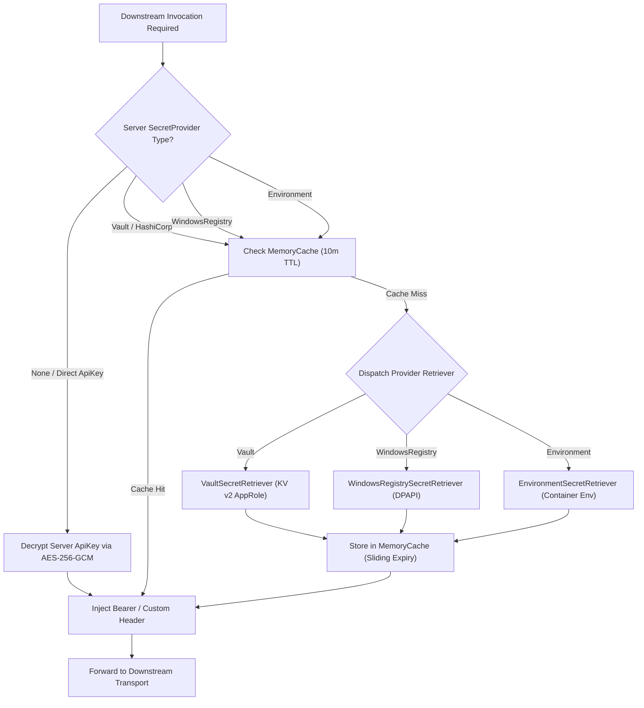

For complete setup guides, AppRole configuration commands, and DPAPI registry recipes, see [**Enterprise Secret Providers & Key Management Guide**](secret-providers.md).

---

## 10. Cross-References, Verification & Operational Guide

### Documentation Navigation Matrix

| Topic / Focus Area | Target Specification Guide |
| :--- | :--- |
| **Product Overview & Problem Statement** | [**Evaluation & Product Overview Guide**](evaluation-guide.md) |
| **AppKey Scopes & Authorization Rules** | [**AppKey Scopes & Authorization Guide**](appkey-scopes.md) |
| **Database Engines, Schemas & Stored Procs** | [**Database Provider Support & Deployment Matrix**](database-providers.md) |
| **Transports, Concurrency & STDIO Subprocesses** | [**Transport Capability & Configuration Guide**](transports.md) |
| **Vault, DPAPI & AES-256-GCM Encryption** | [**Enterprise Secret Providers & Key Management Guide**](secret-providers.md) |
| **CI Quality Gates, Static Analysis & Testing** | [**CI Quality Gates & Verification Guide**](ci-quality-gates.md) |
| **Pairwise Integration Matrix & E2E Tests** | [**Testing Matrix & Integration Guide**](testing-matrix.md) |
| **Living Software Requirements (SRS) & Test Catalog** | [**Software Requirements & Test Verification Catalog**](software-requirements-and-test-catalog.md) |
| **Test Catalog Architecture & Annotation Guide** | [**Test Catalog & Annotation Guide**](test-catalog-guide.md) |
| **End-User Guides & Interactive UI Manual** | [**Official User Guide**](user-guide.md) |
| **Developer Environment & Coding Guidelines** | [**Developer Guide & Local Setup**](developer-guide.md) |
| **Operations, Deployment & Disaster Recovery** | [**Operations & Production Runbook**](runbook.md) |
| **Contributor Workflow & PR Standards** | [**Contributing Guide**](developer-guide.md) |
| **Core Documentation & Getting Started** | [**Project Overview & Quickstart**](index.md) |

### Verification & Test Suite Execution

All architectural contracts, concurrency guarantees, and security policies are validated by the comprehensive automated test suite:

```bash
# Execute full C# test suite in CI mode:
CI=true dotnet test ModelContextGateway.slnx
```

---

*Document Version: `v5.0.0` | Maintained by the Model Context Gateway Architecture Group.*
