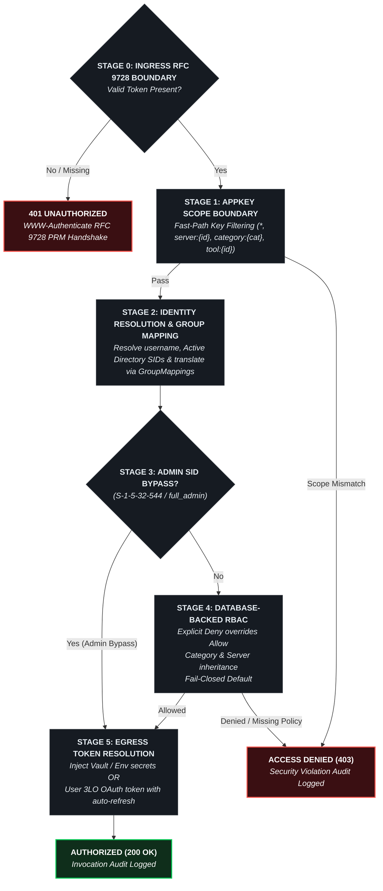
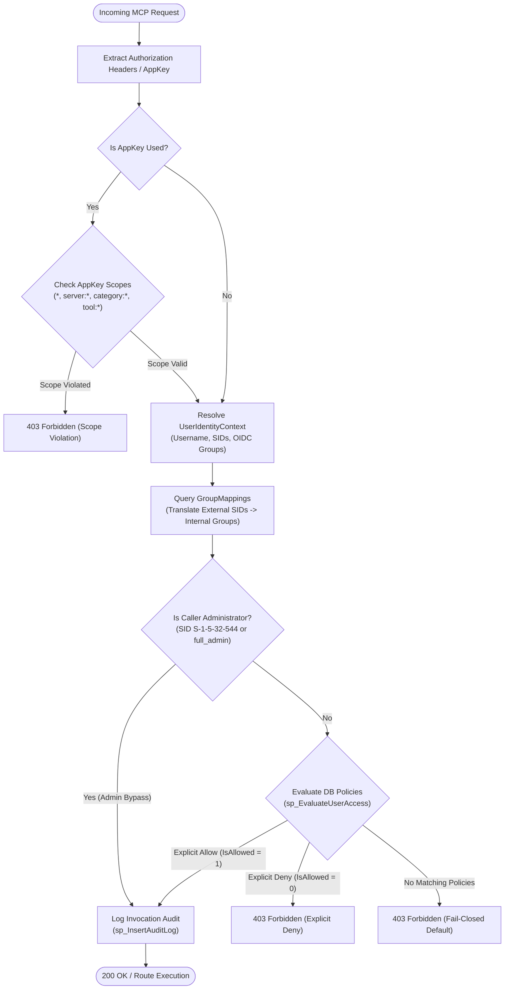

# 🛡️ Authorization Pipeline & RBAC Decision Engine

This document details the multi-stage authorization pipeline, scope resolution grammar, Active Directory SID evaluation, Administrator bypass logic, and database-backed Role-Based Access Control (RBAC) in the **Model Context Gateway (MCG)**.

---

## 📑 Table of Contents

1. [4-Stage Hierarchical Decision Flow](#1-4-stage-hierarchical-decision-flow)
2. [Scope Grammar & Resolution](#2-scope-grammar-resolution)
3. [Admin SID Bypass & Database-Backed RBAC Evaluation](#3-admin-sid-bypass-database-backed-rbac-evaluation)
   - [Administrator SID Verification](#administrator-sid-verification)
   - [Database Stored Procedure Evaluation (`sp_EvaluateUserAccess`)](#database-stored-procedure-evaluation-sp_evaluateuseraccess)
   - [Evaluation Precedence Rules](#evaluation-precedence-rules)
4. [Mermaid Authorization Decision Flowchart](#4-mermaid-authorization-decision-flowchart)

---

## 1. 4-Stage Hierarchical Decision Flow

Every incoming capability invocation (`tools/call`, `prompts/get`, `resources/read`, or target-specific proxying) is evaluated through a strict, fail-closed 4-stage pipeline:

---

## 2. Scope Grammar & Resolution

AppKeys support granular least-privilege scoping. The gateway validates that the targeted server, category, tool, prompt, or resource matches the scopes encoded in the AppKey's `ScopesJson` array:

| Scope Pattern | Matches / Grants Access To | Evaluation Logic |
| :--- | :--- | :--- |
| `*` or `all` or `mcp_client` | Global Wildcard | Permits invocation of all servers, tools, prompts, and resources. |
| `server:{serverId}` | Target Server Wildcard | Permits access to all capabilities exposed by the specified server (e.g. `server:docker`). |
| `category:{categoryName}` | Target Category Wildcard | Permits access to any server tagged with the specified category (e.g. `category:Media`, `category:Smarthome`). |
| `tool:{toolName}` | Specific Tool | Permits execution of a specific un-namespaced or namespaced tool (e.g. `tool:list_containers`, `tool:docker__list_containers`). |
| `prompt:{promptName}` | Specific Prompt | Permits retrieval of a specific prompt template. |
| `resource:{uri}` | Specific Resource URI | Permits reading a specific resource URI or wildcard pattern (e.g. `resource:mcp://docker/*`). |

### Evaluation Order

1. If the key contains `*`, `all`, or `mcp_client`, Stage 1 immediately succeeds.
2. If the invocation targets a tool `{serverId}__{toolName}`:
   - Check if `tool:{toolName}` or `tool:{serverId}__{toolName}` is present.
   - Check if `server:{serverId}` is present.
   - Check if `category:{category}` matches any of the server's categories.
3. If no scope matches the target capability, the request is immediately rejected with `403 Forbidden` and audited as a scope violation.

---

## 3. Admin SID Bypass & Database-Backed RBAC Evaluation

### Administrator SID Verification

The gateway provides a zero-overhead fast path for system administrators:
* [`SecurityValidationHelper.IsAdmin`](https://github.com/spelech/model-context-gateway/blob/main/Components/Authorization/SecurityValidationHelper.cs) verifies whether the resolved caller principal contains:
  - The well-known Windows Built-in Administrators SID: `S-1-5-32-544`
  - The `full_admin` group role
  - Any custom SID or group defined in the application setting `Admin:GroupSid`
* **Audit Guarantees**: Administrator invocations bypass database RBAC evaluation to guarantee administrative continuity, but **every administrative invocation is recorded to `AuditLogs`**.

---

### Database Stored Procedure Evaluation (`sp_EvaluateUserAccess`)

For standard users, agents, and client connections, the gateway invokes the database-level authorization procedure:
* **MS SQL Server & MySQL**: Evaluates access via the optimized stored procedure [`sp_EvaluateUserAccess`](https://github.com/spelech/model-context-gateway/blob/main/scripts/db/mssql/02_procedures.sql).
* **SQLite**: Executes an equivalent parameterized relational query joining `AccessPolicies`, `GroupMappings`, and `ToolAccessPolicies`.

---

### Evaluation Precedence Rules

1. **Explicit Deny Rule (Highest Priority)**:
   If ANY group assigned to the user or mapped from their external identity has a policy matching the server, category, or tool where `IsAllowed = 0`, access is **immediately denied**. Explicit Deny always supersedes any Allow policy.
2. **Explicit Allow Rule**:
   Access is granted if at least one matching policy for the user's groups has `IsAllowed = 1`.
3. **Hierarchical Inheritance**:
   Permissions cascade down the hierarchy:
   $$\text{Category Policy} \longrightarrow \text{Server Policy} \longrightarrow \text{Tool-Specific Policy}$$
4. **Fail-Closed Default (Lowest Priority)**:
   If no matching policy is found in the database, or if an unexpected database connection error occurs, the pipeline defaults to **FAIL-CLOSED** (`403 Forbidden`).

---

## 4. Mermaid Authorization Decision Flowchart

The following diagram illustrates the complete end-to-end authorization decision logic executed for every incoming MCP request:

---

*Related Specifications:*
- [System Architecture Index](index.md)
- [AppKey Scopes & Authorization Guide](../appkey-scopes.md)
- [Active Directory & Multi-Level RBAC Guide](../active-directory-and-rbac-guide.md)
- [Database Persistence & Envelope Encryption](database-and-encryption.md)
