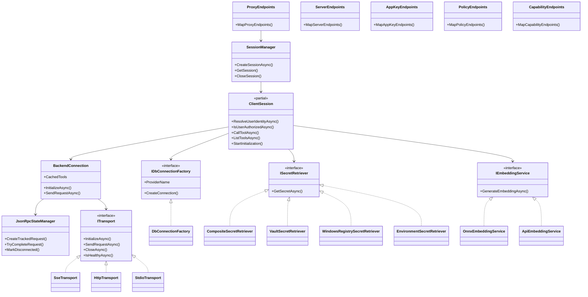
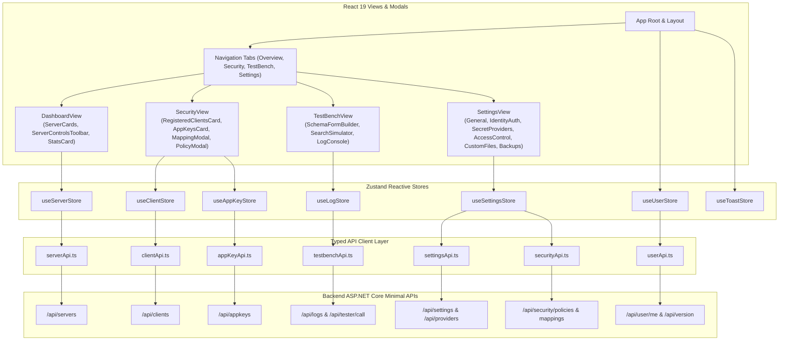

# 🧩 Backend & Frontend Component Architecture

This document details the software architecture, component boundaries, dependency inversion rules, subsystem interactions, and frontend state management in the **Model Context Gateway (MCG)**.

---

## 📑 Table of Contents

1. [Backend Component & Boundary Model](#1-backend-component-boundary-model)
   - [Domain Components (`Components/`)](#domain-components-components)
   - [Infrastructure Services (`Infrastructure/`)](#infrastructure-services-infrastructure)
   - [Core Protocol & Routing Engine (`Core/`)](#core-protocol-routing-engine-core)
   - [Architectural Boundary Constraints](#architectural-boundary-constraints)
   - [Component Subsystem Diagram](#component-subsystem-diagram)
2. [Frontend Component & Typed Architecture](#2-frontend-component-typed-architecture)
   - [React 19 & Vite SPA Architecture](#react-19-vite-spa-architecture)
   - [Domain Component Decomposition](#domain-component-decomposition)
   - [Typed API Layer & Zustand State Stores](#typed-api-layer-zustand-state-stores)
   - [Frontend Architecture & State Flow Diagram](#frontend-architecture-state-flow-diagram)

---

## 1. Backend Component & Boundary Model

The C# ASP.NET Core backend codebase is partitioned into three strictly bounded contexts following Clean Architecture and Domain-Driven Design principles: [`Components/`](https://github.com/spelech/model-context-gateway/tree/main/Components), [`Infrastructure/`](https://github.com/spelech/model-context-gateway/tree/main/Infrastructure), and [`Core/`](https://github.com/spelech/model-context-gateway/tree/main/Core).

```
├── Components/
│   ├── Servers/         # Upstream server registry, validation, health checks, discovery & MapServerEndpoints
│   ├── Clients/         # Registered clients, credential service, OAuth endpoints & MapClientEndpoints
│   ├── AppKeys/         # AppKey models, authorization keys, hashing, scope checks & MapAppKeyEndpoints
│   ├── Providers/       # Auth/Secret provider settings, envelope crypto & MapProviderEndpoints
│   ├── Authorization/   # Access policies, group mappings, RBAC evaluation & MapPolicyEndpoints
│   └── Capabilities/    # Native tools, virtual proxy execution, tool/prompt/resource handlers & MapCapabilityEndpoints
├── Infrastructure/
│   ├── Persistence/     # Dapper repositories, database connection factory, migrations & seeders
│   ├── Transports/      # SSE, HTTP, STDIO, state manager & target proxy
│   ├── Identity/        # Active Directory, OIDC, AppKey identity providers & LDAP service
│   ├── Secrets/         # Vault, Windows Registry, Environment secret retrievers & encryption
│   └── Logging/         # Audit logger, PII sanitization & in-memory log providers
└── Core/
    ├── Protocol/        # JSON-RPC 2.0 protocol models & polymorphic converter
    └── Routing/         # ClientSession, SessionManager, BackendConnection & Semantic Search
```

---

### Domain Components (`Components/`)

Domain components encapsulate vertical business features, HTTP/JSON-RPC controller routes, Minimal API route endpoints, and domain validation services:

1. **`Servers`**:
   - [`McpServer.cs`](https://github.com/spelech/model-context-gateway/blob/main/Components/Servers/McpServer.cs): Data model representing upstream MCP servers, endpoints, transport types, categories, headers, and secret associations.
   - [`ServerEndpoints.cs`](https://github.com/spelech/model-context-gateway/blob/main/Components/Servers/ServerEndpoints.cs): Minimal API mapping for CRUD operations, inspections, and health states (`GET /api/servers`, `POST /api/servers`, `DELETE /api/servers/{id}`).
   - [`ServerValidationHelper.cs`](https://github.com/spelech/model-context-gateway/blob/main/Components/Servers/ServerValidationHelper.cs): URL syntax checking, Server-Side Request Forgery (SSRF) prevention, and parameter sanitization.
   - [`DockerAutoDiscoveryService.cs`](https://github.com/spelech/model-context-gateway/blob/main/Components/Servers/DockerAutoDiscoveryService.cs): Dynamic label-based container discovery (`mcp.enable=true`, `mcp.name`, `mcp.port`).
   - [`BackendHealthCheckService.cs`](https://github.com/spelech/model-context-gateway/blob/main/Components/Servers/BackendHealthCheckService.cs): Background periodic health prober (15s HTTP GET + 30s JSON-RPC ping).

2. **`Clients`**:
   - [`ClientEndpoints.cs`](https://github.com/spelech/model-context-gateway/blob/main/Components/Clients/ClientEndpoints.cs) & [`ClientsController.cs`](https://github.com/spelech/model-context-gateway/blob/main/Components/Clients/ClientsController.cs): Client registration and OAuth client management.
   - [`CredentialService.cs`](https://github.com/spelech/model-context-gateway/blob/main/Components/Clients/CredentialService.cs): Automated client configuration generation (`claude_desktop_config.json`, Cursor config, environment templates).

3. **`AppKeys`**:
   - [`AppKey.cs`](https://github.com/spelech/model-context-gateway/blob/main/Components/AppKeys/AppKey.cs) & [`AppKeyModels.cs`](https://github.com/spelech/model-context-gateway/blob/main/Components/AppKeys/AppKeyModels.cs): High-entropy machine keys (`mcp-*-*-*`), key prefixes (`KeyPrefix`), AES-256-GCM encrypted keys, scopes (`ScopesJson`), and attribution (`OwnerSid`).
   - [`AppKeyEndpoints.cs`](https://github.com/spelech/model-context-gateway/blob/main/Components/AppKeys/AppKeyEndpoints.cs) & [`AppKeysController.cs`](https://github.com/spelech/model-context-gateway/blob/main/Components/AppKeys/AppKeysController.cs): Endpoints for key minting, revocation, prefix lookups, and validation.

4. **`Providers`**:
   - [`ProviderEndpoints.cs`](https://github.com/spelech/model-context-gateway/blob/main/Components/Providers/ProviderEndpoints.cs) & [`ProvidersController.cs`](https://github.com/spelech/model-context-gateway/blob/main/Components/Providers/ProvidersController.cs): Management of Identity and Secret Provider configurations.
   - [`ProviderConfigSecurityHelper.cs`](https://github.com/spelech/model-context-gateway/blob/main/Components/Providers/ProviderConfigSecurityHelper.cs): Transparent encryption/decryption of provider JSON configuration payloads.

5. **`Authorization`**:
   - [`PolicyEndpoints.cs`](https://github.com/spelech/model-context-gateway/blob/main/Components/Authorization/PolicyEndpoints.cs) & [`PermissionsController.cs`](https://github.com/spelech/model-context-gateway/blob/main/Components/Authorization/PermissionsController.cs): Endpoints for RBAC policies and group mappings.
   - [`SecurityValidationHelper.cs`](https://github.com/spelech/model-context-gateway/blob/main/Components/Authorization/SecurityValidationHelper.cs): CIDR subnet evaluation, private IP blocking, SSRF prevention, and Administrator SID verification (`S-1-5-32-544`).

6. **`Capabilities`**:
   - [`ProxyEndpoints.cs`](https://github.com/spelech/model-context-gateway/blob/main/Components/Capabilities/ProxyEndpoints.cs): Core HTTP/SSE entrypoints (`/sse`, `/message`, `/{targetServerId}`).
   - [`CapabilityEndpoints.cs`](https://github.com/spelech/model-context-gateway/blob/main/Components/Capabilities/CapabilityEndpoints.cs): Tool, prompt, resource, and custom file catalog management.
   - [`CustomToolRegistry.cs`](https://github.com/spelech/model-context-gateway/blob/main/Components/Capabilities/NativeTools/CustomToolRegistry.cs): In-process native tools for Plex (`PlexGetLibrarySectionsTool`, `PlexSearchLibraryTool`, `PlexGetSessionsTool`, etc.) and Overseerr (`SeerrSearchMediaTool`, `SeerrRequestMediaTool`, `SeerrGetRequestsTool`, etc.).

---

### Infrastructure Services (`Infrastructure/`)

Infrastructure provides concrete technical implementations for interfaces defined across Core and Components:

1. **`Persistence`**:
   - [`DbConnectionFactory.cs`](https://github.com/spelech/model-context-gateway/blob/main/Infrastructure/Persistence/DbConnectionFactory.cs): Multi-database factory supporting SQLite (WAL), MS SQL Server (`Microsoft.Data.SqlClient`), and MySQL (`MySqlConnector`).
   - [`Repositories.cs`](https://github.com/spelech/model-context-gateway/blob/main/Infrastructure/Persistence/Repositories.cs): High-performance Dapper repository layer.
   - [`DatabaseSeederService.cs`](https://github.com/spelech/model-context-gateway/blob/main/Infrastructure/Persistence/DatabaseSeederService.cs): Automatic in-process migrations, schema compatibility validation, and default configuration seeding.

2. **`Transports`**:
   - [`ITransport.cs`](https://github.com/spelech/model-context-gateway/blob/main/Infrastructure/Transports/ITransport.cs): Unified abstraction for downstream transport channels.
   - [`SseTransport.cs`](https://github.com/spelech/model-context-gateway/blob/main/Infrastructure/Transports/SseTransport.cs): Full-duplex persistent Server-Sent Events channel with POST message forwarding.
   - [`HttpTransport.cs`](https://github.com/spelech/model-context-gateway/blob/main/Infrastructure/Transports/HttpTransport.cs): Stateless half-duplex HTTP POST and chunked streaming transport.
   - [`StdioTransport.cs`](https://github.com/spelech/model-context-gateway/blob/main/Infrastructure/Transports/StdioTransport.cs): Subprocess STDIO transport communicating via newline-delimited JSON-RPC (NDJSON).
   - [`JsonRpcStateManager.cs`](https://github.com/spelech/model-context-gateway/blob/main/Infrastructure/Transports/JsonRpcStateManager.cs): Manages pending request completion sources (`PendingRequestTcs`), ID rewriting, cancellation tokens, and connection resets.

3. **`Identity`**:
   - [`CompositeIdentityProvider.cs`](https://github.com/spelech/model-context-gateway/blob/main/Infrastructure/Identity/CompositeIdentityProvider.cs): Aggregates Active Directory, OIDC, and AppKey authenticators.
   - [`ActiveDirectoryIdentityProvider.cs`](https://github.com/spelech/model-context-gateway/blob/main/Infrastructure/Identity/ActiveDirectoryIdentityProvider.cs) & [`LdapActiveDirectoryService.cs`](https://github.com/spelech/model-context-gateway/blob/main/Infrastructure/Identity/LdapActiveDirectoryService.cs): Resolves Windows Kerberos/NTLM caller SIDs via LDAP.
   - [`OidcIdentityProvider.cs`](https://github.com/spelech/model-context-gateway/blob/main/Infrastructure/Identity/OidcIdentityProvider.cs): Extracts authenticated user contexts from reverse-proxy headers (`Remote-User`, `Remote-Groups`, `Remote-User-Sid`).

4. **`Secrets`**:
   - [`CompositeSecretRetriever.cs`](https://github.com/spelech/model-context-gateway/blob/main/Infrastructure/Secrets/CompositeSecretRetriever.cs): Dispatches to Vault, Windows Registry, or Environment retrievers with a 5-minute sliding in-memory cache.
   - [`VaultSecretRetriever.cs`](https://github.com/spelech/model-context-gateway/blob/main/Infrastructure/Secrets/VaultSecretRetriever.cs): Fetches secrets from HashiCorp Vault KV v2 using AppRole or Token authentication.
   - [`WindowsRegistrySecretRetriever.cs`](https://github.com/spelech/model-context-gateway/blob/main/Infrastructure/Secrets/WindowsRegistrySecretRetriever.cs): Fetches Windows DPAPI-protected registry keys (`HKLM` / `HKCU`).
   - [`EnvironmentSecretRetriever.cs`](https://github.com/spelech/model-context-gateway/blob/main/Infrastructure/Secrets/EnvironmentSecretRetriever.cs): Reads container environment variables.
   - [`SymmetricEncryptionHelper.cs`](https://github.com/spelech/model-context-gateway/blob/main/Infrastructure/Secrets/SymmetricEncryptionHelper.cs): AES-256-GCM envelope encryption for database fields and config payloads.

5. **`Logging`**:
   - [`AuditLogger.cs`](https://github.com/spelech/model-context-gateway/blob/main/Infrastructure/Logging/AuditLogger.cs): Writes structured invocation and admin audit trails.
   - [`PiiSanitizer.cs`](https://github.com/spelech/model-context-gateway/blob/main/Infrastructure/Logging/PiiSanitizer.cs): Regex sanitizer stripping Bearer tokens, API keys, passwords, and connection strings.
   - [`InMemoryLogger.cs`](https://github.com/spelech/model-context-gateway/blob/main/Infrastructure/Logging/InMemoryLogger.cs): Thread-safe ring buffer powering the real-time Test Bench UI console.

---

### Core Protocol & Routing Engine (`Core/`)

The Core assembly contains high-performance routing coordinators and protocol engines that remain free of concrete external dependencies:

1. **`ClientSession` (Partial Class Architecture)**:
   - [`ClientSession.cs`](https://github.com/spelech/model-context-gateway/blob/main/Core/Routing/ClientSession.cs): Main session lifecycle coordinator.
   - [`ClientSession.Authorization.cs`](https://github.com/spelech/model-context-gateway/blob/main/Core/Routing/ClientSession/ClientSession.Authorization.cs): Multi-stage RBAC authorization, caller identity resolution, and audit logging.
   - [`ClientSession.BackendInitializer.cs`](https://github.com/spelech/model-context-gateway/blob/main/Core/Routing/ClientSession/ClientSession.BackendInitializer.cs): Asynchronous concurrent warming of downstream backend connections and tool schemas.
   - [`ClientSession.ProxyForwarder.cs`](https://github.com/spelech/model-context-gateway/blob/main/Core/Routing/ClientSession/ClientSession.ProxyForwarder.cs): Dispatches requests to downstream servers, tracks upstream GUIDs, and demultiplexes responses.
   - [`ClientSession.JsonRpcRewriter.cs`](https://github.com/spelech/model-context-gateway/blob/main/Core/Routing/ClientSession/ClientSession.JsonRpcRewriter.cs): Uses `System.Text.Json.Nodes.JsonNode` to un-namespace tool names and rewrite message bodies safely without fragile string manipulation.
   - [`ClientSession.NotificationBroadcaster.cs`](https://github.com/spelech/model-context-gateway/blob/main/Core/Routing/ClientSession/ClientSession.NotificationBroadcaster.cs): Fan-out broadcasting of notifications across active client channels.

2. **`Routing Coordinators`**:
   - [`SessionManager.cs`](https://github.com/spelech/model-context-gateway/blob/main/Core/Routing/SessionManager.cs): Thread-safe tracking and cleanup of active client connections.
   - [`BackendConnection.cs`](https://github.com/spelech/model-context-gateway/blob/main/Core/Routing/BackendConnection.cs): Manages a single upstream server connection channel, health state, and cached capabilities.
   - [`SemanticSearchService.cs`](https://github.com/spelech/model-context-gateway/blob/main/Core/Routing/SemanticSearchService.cs): Hybrid BM25 keyword matching combined with cosine similarity vector scoring.
   - [`DynamicEmbeddingService.cs`](https://github.com/spelech/model-context-gateway/blob/main/Core/Routing/DynamicEmbeddingService.cs), [`OnnxEmbeddingService.cs`](https://github.com/spelech/model-context-gateway/blob/main/Core/Routing/OnnxEmbeddingService.cs), and [`ApiEmbeddingService.cs`](https://github.com/spelech/model-context-gateway/blob/main/Core/Routing/ApiEmbeddingService.cs): Vector embedding calculation via local CPU ONNX runtime (`all-MiniLM-L6-v2`) or remote OpenAI-compatible APIs.
   - [`ToolRoutingManager.cs`](https://github.com/spelech/model-context-gateway/blob/main/Core/Routing/ToolRoutingManager.cs), [`ResourceRoutingManager.cs`](https://github.com/spelech/model-context-gateway/blob/main/Core/Routing/ResourceRoutingManager.cs), [`PromptRoutingManager.cs`](https://github.com/spelech/model-context-gateway/blob/main/Core/Routing/PromptRoutingManager.cs): Namespacing, un-namespacing, and routing of individual MCP capabilities.

---

### Architectural Boundary Constraints

To preserve modularity, testability, and maintainability across releases, the codebase enforces five strict architectural boundary constraints:

```
┌─────────────────────────────────────────────────────────────────────────────┐
│                       ARCHITECTURAL BOUNDARY CONSTRAINTS                    │
├─────────────────────────────────────────────────────────────────────────────┤
│ 1. Core NEVER depends on specific database drivers or concrete transports.  │
│    Core interacts strictly through `IDbConnectionFactory`, `ITransport`,    │
│    and `ISecretRetriever`.                                                  │
│                                                                             │
│ 2. Infrastructure implements strategy interfaces defined in Core and DI.    │
│    All database dialects (SQLite, MSSQL, MySQL) adhere to common contracts.│
│                                                                             │
│ 3. Components expose Minimal API endpoints and controllers that consume      │
│    Core session managers, repositories, and security helpers.               │
│                                                                             │
│ 4. No Raw String JSON Manipulation: All JSON-RPC modifications MUST use     │
│    `JsonNode`, `JsonObject`, or `JsonDocument` DOM trees.                   │
│                                                                             │
│ 5. Thread-Safe State: Shared state MUST use `ConcurrentDictionary` or       │
│    explicit monitor locks. Single-execution locks guard initialization.     │
└─────────────────────────────────────────────────────────────────────────────┘
```

---

### Component Subsystem Diagram

The following class diagram illustrates the dependency inversion contracts connecting domain endpoints, session management, abstract transports, database factories, and secret retrievers:



---

## 2. Frontend Component & Typed Architecture

### React 19 & Vite SPA Architecture

The web dashboard is built using **React 19**, **TypeScript**, **Vite**, and **Zustand**. It features a dark-mode interface styled with centralized CSS variables (`variables.css`, `layout.css`, `dashboard.css`, `tester.css`), eliminating UI layout shifts via `align-items: flex-start` and `scrollbar-gutter: stable`.

---

### Domain Component Decomposition

The frontend source structure clearly separates typed API communication, modular views, reactive Zustand stores, and TypeScript domain models:

```
frontend/src/
├── api/                    # Typed API Client Layer (Axios / Fetch Wrappers)
│   ├── api.ts              # Base API instance, headers & error handling
│   ├── serverApi.ts        # Server CRUD & discovery endpoints
│   ├── clientApi.ts        # Registered OAuth clients
│   ├── appKeyApi.ts        # AppKey minting, revocation & verification
│   ├── securityApi.ts      # Policies & group mappings
│   ├── settingsApi.ts      # Provider configs & system settings
│   ├── userApi.ts          # Authenticated user identity & version info
│   └── testbenchApi.ts     # Tool execution, search simulation & log streaming
├── components/             # Domain UI Component Trees
│   ├── servers/            # DashboardView, ServerModal, ServerInspectModal, ServerCard
│   ├── clients/            # RegisteredClientsCard, ClientSetupGuide, AppKeysCard, ClientModal
│   ├── security/           # SecurityView, PolicyModal, MappingModal
│   ├── settings/           # SettingsView, GeneralTab, IdentityAuthTab, SecretProvidersTab,
│   │                       # AccessControlTab, CustomFilesTab, BackupsTab
│   ├── testbench/          # TestBenchView (Interactive JSON Schema Form Builder, Console, & Log Stream)
│   └── shared/             # Header, Footer, Toasts, Modal, StatusBadge, PaginationToolbar
├── stores/                 # Centralized Zustand Reactive Stores
│   ├── useServerStore.ts   # Servers list, health states, filter queries
│   ├── useClientStore.ts   # Registered clients & setup guides
│   ├── useAppKeyStore.ts   # Active keys, key creation modal, copy buffer
│   ├── useSettingsStore.ts # Provider configs, dynamic encryption flags
│   ├── useUserStore.ts     # Current user, roles, SIDs, version cache
│   ├── useLogStore.ts      # Real-time logs ring buffer & level filters
│   └── useToastStore.ts    # Notification toast queue with auto-dismiss
└── types/                  # Canonical TypeScript Domain Interfaces
    ├── server.ts, client.ts, appKey.ts, security.ts, settings.ts, user.ts, testbench.ts
```

---

### Typed API Layer & Zustand State Stores

The frontend strictly separates UI rendering from state synchronization and network communication:

* **`useServerStore`**: Manages the server inventory, category tags, search filters, modal inspection state, and health check polling intervals.
* **`useClientStore`**: Coordinates registered OAuth clients, client setup guide generation, and configuration downloads.
* **`useAppKeyStore`**: Handles key creation workflows, reveals raw secret tokens once upon generation, and manages granular scope boundaries.
* **`useSettingsStore`**: Coordinates identity and secret provider configuration forms, toggles password masking, and encrypts configuration payloads.
* **`useUserStore`**: Tracks the authenticated user session, resolved roles, SIDs, permissions, and fallback gateway version information.
* **`useLogStore`**: Streams logs via a thread-safe ring buffer with severity filters (`Debug`, `Info`, `Warn`, `Error`) for the Test Bench.
* **`useToastStore`**: Centralized ephemeral toast notification queue with auto-dismissal.

---

### Frontend Architecture & State Flow Diagram



---

*Related Specifications:*
- [System Architecture Index](index.md)
- [Protocol & Routing Engine](routing-and-meta-mode.md)
- [Authorization Pipeline & RBAC](authorization-pipeline.md)
