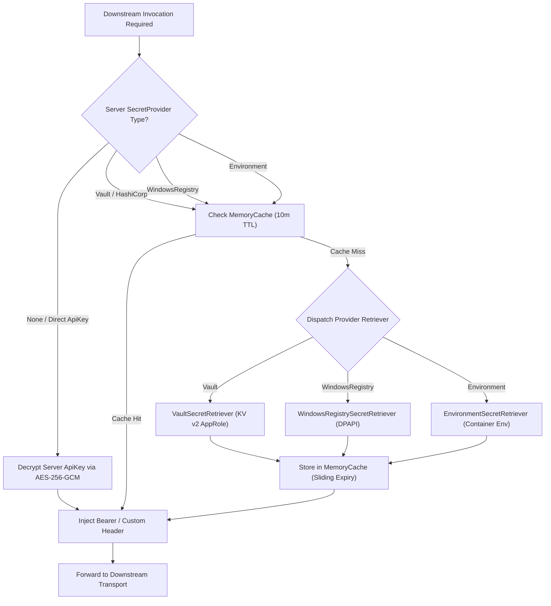

# 💾 Database Persistence & Envelope Encryption Pipeline

This document details the multi-engine persistence architecture, relational data model, AES-256-GCM authenticated envelope encryption pipeline, and dynamic secret provider resolution in the **Model Context Gateway (MCG)**.

---

## 📑 Table of Contents

1. [Database & Persistence Architecture](#1-database-persistence-architecture)
   - [Unified Entity-Relationship Diagram (Mermaid ERD)](#unified-entity-relationship-diagram-mermaid-erd)
   - [Engine Dialect Strategies (SQLite, MS SQL Server, MySQL)](#engine-dialect-strategies-sqlite-ms-sql-server-mysql)
2. [Secret Provider & Envelope Encryption Pipeline](#2-secret-provider-envelope-encryption-pipeline)
   - [AES-256-GCM Envelope Encryption Specification](#aes-256-gcm-envelope-encryption-specification)
   - [Master Key Derivation (PBKDF2)](#master-key-derivation-pbkdf2)
   - [Pluggable Retrievers & Dynamic Reload Without Restart](#pluggable-retrievers-dynamic-reload-without-restart)
   - [Secret Resolution & Encryption Pipeline Flowchart](#secret-resolution-encryption-pipeline-flowchart)

---

## 1. Database & Persistence Architecture

The gateway abstracts persistent storage behind [`IDbConnectionFactory`](https://github.com/spelech/model-context-gateway/blob/main/Infrastructure/Persistence/DbConnectionFactory.cs) and high-performance Dapper repositories. It natively supports SQLite, Microsoft SQL Server, and MySQL / MariaDB.

---

### Unified Entity-Relationship Diagram (Mermaid ERD)

For the standalone schema reference and column constraints catalog, see [**Canonical Data Model & Database ERD**](../data-model.md) and [**Database Provider Support & Deployment Matrix**](../database-providers.md).

```mermaid
erDiagram
    Servers ||--o{ Tools : "exposes (FK: ServerId)"
    Servers ||--o{ AccessPolicies : "governed by (TargetId)"
    Servers ||--o{ AuditLogs : "generates (ServerCodeName)"
    Servers }o--o| SecretProviders : "resolves credentials (SecretProvider)"
    
    Tools ||--o{ ToolAccessPolicies : "governed by (FK: ToolId)"
    Tools ||--o{ AccessPolicies : "governed by (TargetId)"
    
    AdGroups ||--o{ ToolAccessPolicies : "assigned to (FK: GroupId)"
    AdGroups ||--o{ GroupMappings : "maps external groups (InternalGroup)"
    
    AppKeys ||--o{ AuditLogs : "attributed via (UserSid -> OwnerSid)"
    
    Servers {
        string Id PK "Server unique identifier (e.g. docker, plex)"
        string DisplayName "Human-readable server name"
        string Url "Endpoint URL or command string"
        boolean Enabled "Active/inactive operational state"
        boolean Hidden "Hidden from client discovery list"
        string Type "Transport type: sse, http, stdio"
        string SecretProvider "Provider: None, HashiCorpVault, WindowsRegistry, Environment"
        string SecretItemKey "Target secret key identifier"
        string SecretMount "Vault secret engine mount path"
        string SecretPath "Vault secret subpath or registry key"
        string SecretField "Vault secret JSON field key"
        string AuthShape "Authentication shape: bearer, customHeader, query"
        string CustomHeaderName "Custom HTTP header name if shape=customHeader"
        string Categories "JSON array of category tags"
        string ApiKey "Static API key (redacted in API)"
        string HeadersJson "JSON dictionary of custom HTTP headers"
        boolean AutoDiscovered "Flag indicating dynamic auto-discovery"
    }

    Settings {
        string Id PK "Global singleton configuration ID"
        string EmbeddingProvider "Embedding backend: local, openai, custom"
        string EmbeddingApiUrl "Embedding inference API endpoint"
        string EmbeddingApiKey "Encrypted embedding API key"
        string EmbeddingApiModel "Embedding model name"
        string EmbeddingModelDir "Filesystem directory for local ONNX model"
        string UserSecretStorage "Storage mode for user personal secrets"
        int GlobalMaxKeys "Maximum total active AppKeys allowed"
        int UserMaxKeys "Maximum active AppKeys allowed per user"
    }

    SecretProviders {
        int ProviderId PK "Provider integer surrogate key"
        string ProviderName UK "Unique provider identifier (e.g. HashiCorpVault)"
        string DisplayName "Human-readable provider name"
        string EncryptedConfigJson "AES-256-GCM encrypted provider configuration"
        boolean IsEnabled "Provider enabled state"
        datetime UpdatedAt "Timestamp of last modification"
    }

    AuthProviderConfigs {
        int AuthId PK "Auth provider surrogate key"
        string ProviderName UK "Unique identity provider identifier (e.g. ActiveDirectory)"
        string DisplayName "Human-readable identity provider name"
        string UserHeader "HTTP header for username (default: Remote-User)"
        string GroupsHeader "HTTP header for user groups (default: Remote-Groups)"
        string EncryptedConfigJson "AES-256-GCM encrypted provider settings"
        boolean IsEnabled "Identity provider enabled state"
        datetime UpdatedAt "Timestamp of last modification"
    }

    AdGroups {
        int GroupId PK "Group integer surrogate key"
        string ObjectSid UK "Active Directory Security Identifier (SID)"
        string GroupName "Active Directory / Enterprise group name"
        string Description "Group description and purpose"
        boolean IsActive "Group active state"
        datetime CreatedAt "Timestamp of creation"
    }

    Tools {
        int ToolId PK "Tool integer surrogate key"
        string ServerId FK "Foreign key referencing Servers.Id"
        string ToolName "MCP tool name (e.g. list_containers)"
        string Description "Tool description shown to LLMs"
        string InputSchemaJson "JSON Schema defining tool arguments"
        string VaultSecretPath "Optional tool-specific secret path"
        string SecretProvider "Tool-specific secret provider"
        boolean IsEnabled "Tool enabled state"
        datetime CreatedAt "Timestamp of tool discovery"
    }

    ToolAccessPolicies {
        int ToolPolicyId PK "Surrogate policy primary key"
        int ToolId FK "Foreign key referencing Tools.ToolId"
        int GroupId FK "Foreign key referencing AdGroups.GroupId"
        boolean IsAllowed "Allow (1) or Explicit Deny (0)"
        int RateLimitPerMin "Rate limit allocations per minute"
        datetime CreatedAt "Timestamp of policy creation"
    }

    AccessPolicies {
        string Id PK "Policy unique GUID identifier"
        string TargetId "Target server ID, category, or tool identifier"
        string RequiredGroup "AD group, SID, or role required for access"
        boolean IsAllowed "Allow (1) or Explicit Deny (0)"
        datetime CreatedAt "Timestamp of policy assignment"
    }

    GroupMappings {
        string Id PK "Mapping unique GUID identifier"
        string ExternalId "External group claim or SSO header value"
        string InternalGroup "Internal mapped router role / AD group"
        datetime CreatedAt "Timestamp of mapping creation"
    }

    AppKeys {
        string Id PK "AppKey unique GUID identifier"
        string Name "Friendly application/client name"
        string Username "Subject username associated with key"
        string KeyPrefix UK "High-entropy random key prefix"
        string EncryptedKey "Argon2id / PBKDF2 hash of secret key"
        string ScopesJson "JSON array of allowed scopes (*, category:*, server:*)"
        datetime ExpiresAt "Optional key expiration UTC timestamp"
        datetime CreatedAt "Timestamp of key creation"
        string OwnerSid "Target user SID (decoupled from admin creator)"
    }

    AuditLogs {
        bigint AuditId PK "Audit entry sequential identifier"
        string RequestId "Unique client request GUID"
        string UserPrincipalName "Caller username or identity"
        string UserSid "Caller Active Directory SID or AppKey OwnerSid"
        string ServerCodeName "Target MCP server code name"
        string ItemName "Target tool, prompt, or resource URI"
        string RequestMethod "MCP method: tools/call, prompts/get, etc."
        int ExecutionTimeMs "Total round-trip execution latency"
        int StatusCode "HTTP or JSON-RPC status code"
        string RequestPayload "Masked request payload"
        string ResponsePayload "Masked response payload"
        string ErrorMessage "Error message if invocation failed"
        datetime Timestamp "UTC timestamp of execution"
    }

    AdminAuditLogs {
        string Id PK "Admin audit GUID identifier"
        string Username "Administrator username"
        string Action "Administrative action performed"
        string Target "Target configuration entity"
        string Details "Detailed changes or audit payload"
        boolean Success "Action success status"
        string ErrorMessage "Error details if action failed"
        datetime Timestamp "UTC timestamp of administrative action"
    }
```



---

### Engine Dialect Strategies (SQLite, MS SQL Server, MySQL)

| Persistence Dimension | 🪶 SQLite (Default) | 🏢 Microsoft SQL Server | 🐬 MySQL / MariaDB |
| :--- | :--- | :--- | :--- |
| **Provider Key** | `sqlite` | `mssql` | `mysql` |
| **Concurrency Mode** | WAL (Write-Ahead Logging) | Row-Level Locking / Always On | InnoDB MVCC Transactions |
| **Execution Paradigm** | Direct SQL & Parameterized Dapper | T-SQL Stored Procedures (`sp_*`) | Stored Procedures (`sp_*`) |
| **Upsert Syntax** | `ON CONFLICT(Id) DO UPDATE` | `IF EXISTS ... UPDATE ELSE INSERT` | `ON DUPLICATE KEY UPDATE` |
| **Parameter Prefix** | `@Param` | `@Param` | Strict `p_Param` |
| **Timestamp Generation** | `CURRENT_TIMESTAMP` (ISO-8601) | `SYSUTCDATETIME()` (DATETIME2) | `CURRENT_TIMESTAMP` / `NOW()` |
| **DDL Migrations** | In-Process Automatic (`DatabaseSeederService`) | Scripted DDL (`scripts/db/mssql/`) | Scripted DDL (`scripts/db/mysql/`) |

---

## 2. Secret Provider & Envelope Encryption Pipeline

### AES-256-GCM Envelope Encryption Specification

Sensitive database columns (e.g. `AppKeys.EncryptedKey`, `SecretProviders.EncryptedConfigJson`, `AuthProviderConfigs.EncryptedConfigJson`, `Servers.ApiKey`) are protected using **AES-256-GCM authenticated envelope encryption** via [`SymmetricEncryptionHelper`](https://github.com/spelech/model-context-gateway/blob/main/Infrastructure/Secrets/SymmetricEncryptionHelper.cs):

```
┌─────────────────────────────────────────────────────────────────────────────┐
│                       AES-256-GCM ENVELOPE PACKET FORMAT                    │
├───────────────────────────┬──────────────────────────┬──────────────────────┤
│    Nonce (IV) [12 Bytes]  │  Auth Tag [16 Bytes]     │ Ciphertext [N Bytes] │
└───────────────────────────┴──────────────────────────┴──────────────────────┘
 ◄────────────────────── Base64 Encoded for Storage ────────────────────────►
```

1. **Nonce Generation**: A cryptographically secure 12-byte random nonce is generated for every encryption operation using `RandomNumberGenerator.GetBytes(12)`.
2. **Authenticated Tagging**: `AesGcm` computes a 16-byte authentication tag over the ciphertext, guaranteeing tamper detection and payload integrity.
3. **Storage Encoding**: The concatenated packet `[ Nonce (12B) || Tag (16B) || Ciphertext (NB) ]` is Base64 encoded before persistence into relational database columns.

---

### Master Key Derivation (PBKDF2)

* Derives a 256-bit symmetric encryption key from the environment variables `MCG_SECRET`, `MCG_MASTER_KEY`, or `DB_ENCRYPTION_KEY`.
* Uses `Rfc2898DeriveBytes.Pbkdf2` configured with **600,000 iterations** of **SHA-256** and a deployment-specific salt (`_McpRouter_Salt_v2`).

---

### Pluggable Retrievers & Dynamic Reload Without Restart

When an administrator updates a Secret Provider in the Settings UI:
1. The frontend submits the updated credentials to `POST /api/providers/secret`.
2. [`ProviderConfigSecurityHelper`](https://github.com/spelech/model-context-gateway/blob/main/Components/Providers/ProviderConfigSecurityHelper.cs) encrypts the payload with AES-256-GCM and persists it to the database.
3. The in-memory cache in [`CompositeSecretRetriever`](https://github.com/spelech/model-context-gateway/blob/main/Infrastructure/Secrets/CompositeSecretRetriever.cs) is immediately invalidated.
4. Subsequent downstream requests fetch fresh tokens from HashiCorp Vault or the updated provider without requiring a container or service restart.

---

### Secret Resolution & Encryption Pipeline Flowchart

The following flowchart illustrates how secrets are dynamically resolved, decrypted, and injected for downstream MCP requests:



---

*Related Specifications:*
- [System Architecture Index](index.md)
- [Canonical Data Model & Database ERD](../data-model.md)
- [Database Provider Support & Deployment Matrix](../database-providers.md)
- [Enterprise Secret Providers & Key Management Guide](../secret-providers.md)
- [Authorization Pipeline & RBAC](authorization-pipeline.md)
