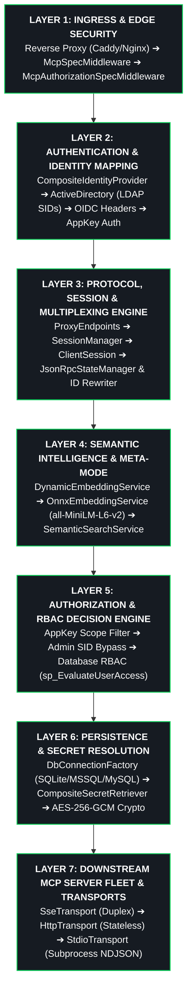
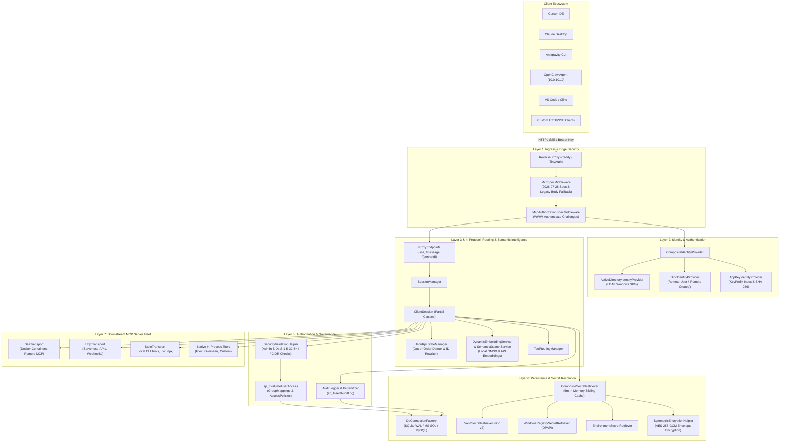

# 🏛️ Model Context Gateway (MCG) Architecture Overview

The **Model Context Protocol (MCP) Router Gateway & Semantic Proxy** is a high-performance C# ASP.NET Core gateway, OAuth 2.0 provider, and protocol multiplexer. It consolidates downstream MCP servers (e.g., Docker, Home Assistant, SQL databases, cloud APIs) into a unified, secure entry point for Large Language Models (LLMs), IDEs, and autonomous agents.

This document serves as the **architectural specification index and system topology overview**, detailing the system context, 7-layer architecture, architectural tenets, and navigational index to the modular deep-dive specifications.

---

## 📑 Modular Architecture Specifications

The architecture documentation is decomposed into dedicated, modular specifications:

| Module | Document | Description |
| :--- | :--- | :--- |
| **01. Components** | [**Backend & Frontend Components**](components.md) | Clean Architecture component boundaries (`Components/`, `Infrastructure/`, `Core/`), dependency inversion rules, subsystem class diagrams, and React 19 / Zustand state architecture. |
| **02. Routing & Meta-Mode** | [**Protocol & Routing Engine**](routing-and-meta-mode.md) | Meta-Mode capability abstraction (`search_tools`, `execute_tool`), target-specific virtual proxying (`/{targetServerId}`), JSON-RPC 2.0 multiplexing, and SSE/HTTP sequence diagrams. |
| **03. Authorization** | [**Authorization Pipeline & RBAC**](authorization-pipeline.md) | 4-stage hierarchical authorization pipeline, AppKey scope resolution grammar, Admin SID bypass (`S-1-5-32-544`), database RBAC evaluation, and decision flowcharts. |
| **04. Transports** | [**Transports & Subprocesses**](transports-and-subprocesses.md) | `ITransport` strategy pattern, STDIO subprocess isolation, child process tree lifecycle and signal handling, stderr log capture, and execution sequence diagrams. |
| **05. Persistence & Secrets** | [**Database & Envelope Encryption**](database-and-encryption.md) | Multi-engine persistence dialect strategies (SQLite, MS SQL, MySQL), unified ERD (12 entities), AES-256-GCM envelope encryption, and secret resolution pipeline. |

---

## 1. Executive Summary & Architectural Tenets

The Model Context Gateway (MCG) solves the **Context Explosion & Security Fragmentation Problem** in large-scale MCP deployments. Connecting directly to many independent MCP servers causes:

1. **Context Window Saturation**: Loading schemas for 300+ tools exhausts tokens before any conversation begins.
2. **Tool Selection Confusion**: Overlapping tool names across servers cause model hallucinations and selection errors.
3. **Security & Credential Sprawl**: Plaintext credentials scattered across client configurations are severe security vulnerabilities.
4. **Lack of Centralized Audit & Governance**: Enterprise compliance requires unified auditing, identity attribution, PII redaction, and centralized access control.

To address these challenges, Model Context Gateway enforces seven **core architectural tenets**:

```
+---------------------------------------------------------------------------------------------------+
|                                 CORE ARCHITECTURAL TENETS                                         |
+---------------------------------------------------------------------------------------------------+
|  1. Sub-Millisecond Routing Decisions                                                             |
|     Header inspection (Mcp-Method, Mcp-Name) and lightweight path resolution allow fast triage    |
|     without buffering large request bodies.                                                       |
|                                                                                                   |
|  2. Zero Token Waste via Meta-Mode                                                                |
|     Default client connections expose only two bootstrap tools: `search_tools` and `execute_tool`.|
|     Target tools are ranked on-demand using local in-process ONNX embeddings or API embeddings.   |
|                                                                                                   |
|  3. Fail-Closed, Multi-Stage RBAC                                                                 |
|     All capability invocations pass through AppKey scope boundaries, identity group mappings,     |
|     and stored procedure RBAC evaluations. Any missing policy or exception results in DENY.      |
|                                                                                                   |
|  4. Strict Isolation & Concurrency Fidelity                                                       |
|     Clients maintain separate session contexts. JSON-RPC request IDs (integer, string, GUID) are  |
|     faithfully preserved while being mapped upstream to prevent collisions in multiplexed streams.|
|                                                                                                   |
|  5. Zero Credential Exposure (Environment-Only Injection)                                         |
|     Downstream secrets are fetched from Vault, Registry DPAPI, or Env, and injected into headers   |
|     or process environments. Credentials are NEVER passed via CLI arguments or logged to disk.    |
|                                                                                                   |
|  6. Pluggable, Strategy-Driven Subsystems                                                         |
|     All major subsystems (`ITransport`, `IIdentityProvider`, `ISecretRetriever`,                  |
|     `IDbConnectionFactory`, `IEmbeddingService`) are decoupled through strategy interfaces.      |
|                                                                                                   |
|  7. Observability & Mandatory PII Masking                                                         |
|     Every client request, downstream execution, and admin modification is logged to audit tables  |
|     after passing through regex-based PII sanitization.                                           |
+---------------------------------------------------------------------------------------------------+
```

---

## 2. High-Level System Architecture & Context

### Client Ecosystem & Ingress

Model Context Gateway (MCG) supports a wide variety of client integrations:

* **Cursor IDE**: Connects over Server-Sent Events (`/sse`) or target proxy routes (`/{serverId}`) using MCP extension settings.
* **Claude Desktop**: Configured via `claude_desktop_config.json` connecting to SSE or local CLI bridges.
* **Antigravity CLI**: Agentic coding assistant connecting to Meta-Mode `/sse` with automatic tool discovery and execution.
* **OpenClaw Agent**: Dedicated autonomous agent host (`10.0.10.10`) communicating over internal networks (`net_cloud`).
* **VS Code / Cline / Roo Code / Continue.dev**: IDE extensions leveraging standard MCP SSE protocols.
* **Custom SDKs & Scripts**: Python (`mcp` library), TypeScript/Node.js, cURL, LangChain, and AutoGen clients communicating over HTTP POST or SSE.

---

### 7-Layer Gateway Architecture

The router architecture is partitioned into seven distinct, decoupled operational layers:



---

### System Context & Architecture Diagram



---

## 3. Cross-References, Verification & Operational Guide

### Documentation Navigation Matrix

| Topic / Focus Area | Target Specification Guide |
| :--- | :--- |
| **Product Overview & Problem Statement** | [**Evaluation & Product Overview Guide**](../evaluation-guide.md) |
| **AppKey Scopes & Authorization Rules** | [**AppKey Scopes & Authorization Guide**](../appkey-scopes.md) |
| **Database Engines, Schemas & Stored Procs** | [**Database Provider Support & Deployment Matrix**](../database-providers.md) |
| **Transports, Concurrency & STDIO Subprocesses** | [**Transport Capability & Configuration Guide**](../transports.md) |
| **Vault, DPAPI & AES-256-GCM Encryption** | [**Enterprise Secret Providers & Key Management Guide**](../secret-providers.md) |
| **CI Quality Gates, Static Analysis & Testing** | [**CI Quality Gates & Verification Guide**](../ci-quality-gates.md) |
| **Pairwise Integration Matrix & E2E Tests** | [**Testing Matrix & Integration Guide**](../testing-matrix.md) |
| **Living Software Requirements (SRS) & Test Catalog** | [**Software Requirements & Test Verification Catalog**](../software-requirements-and-test-catalog.md) |
| **Test Catalog Architecture & Annotation Guide** | [**Test Catalog & Annotation Guide**](../test-catalog-guide.md) |
| **End-User Guides & Interactive UI Manual** | [**Official User Guide**](../user-guide/index.md) |
| **Developer Environment & Coding Guidelines** | [**Developer Guide & Local Setup**](../developer-guide.md) |
| **Operations, Deployment & Disaster Recovery** | [**Operations & Production Runbook**](../runbook.md) |
| **Contributor Workflow & PR Standards** | [**Contributing Guide**](../developer-guide.md) |
| **Core Documentation & Getting Started** | [**Project Overview & Quickstart**](../index.md) |

### Verification & Test Suite Execution

All architectural contracts, concurrency guarantees, and security policies are validated by the comprehensive automated test suite:

```bash
# Execute full C# test suite in CI mode:
CI=true dotnet test ModelContextGateway.slnx
```

---

*Document Version: `v5.0.0` | Maintained by the Model Context Gateway Architecture Group.*
