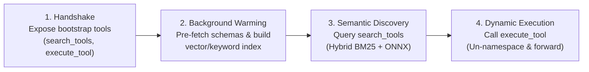
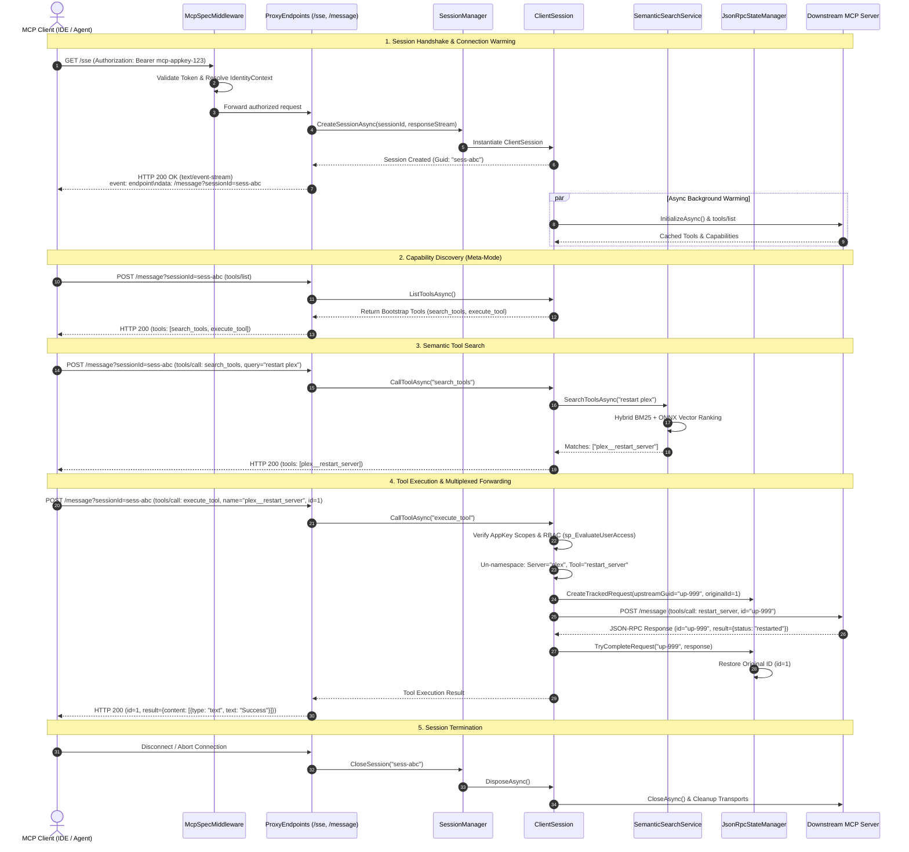
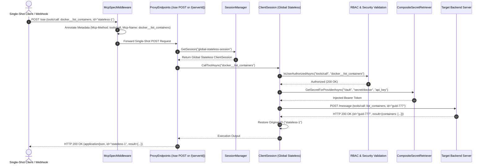

# 🔀 Protocol & Routing Engine Deep-Dive

This document details the protocol translation, routing engine, Meta-Mode capability abstraction, target-specific virtual proxying, and JSON-RPC 2.0 multiplexing pipeline in the **Model Context Gateway (MCG)**.

---

## 📑 Table of Contents

1. [Meta-Mode Dynamic Capability Hiding (`/sse` & `/message`)](#1-meta-mode-dynamic-capability-hiding-sse-message)
   - [Architectural Motivation](#architectural-motivation)
   - [Meta-Mode Four-Stage Execution Lifecycle](#meta-mode-four-stage-execution-lifecycle)
2. [Target-Specific Virtual Proxying (`/{targetServerId}`)](#2-target-specific-virtual-proxying-targetserverid)
3. [JSON-RPC 2.0 In-Flight Multiplexing & ID Preservation](#3-json-rpc-20-in-flight-multiplexing-id-preservation)
4. [Sequence Diagram: Stateful SSE Session Lifecycle](#4-sequence-diagram-stateful-sse-session-lifecycle)
5. [Sequence Diagram: Stateless HTTP Stream Execution](#5-sequence-diagram-stateless-http-stream-execution)

---

## 1. Meta-Mode Dynamic Capability Hiding (`/sse` & `/message`)

### Architectural Motivation

Standard MCP implementations expose every downstream tool definition during the initial `tools/list` handshake. In enterprise or complex home-lab environments with 10–50 backend servers providing 300+ tools, exposing all schemas directly to an LLM causes severe degradation:
* **Context Saturation**: Schema payloads consume 40,000–80,000 tokens before the user sends a single query.
* **Model Confusion & Hallucinations**: Overlapping tool names (e.g., `list_containers`, `restart_service`) lead to incorrect tool selections.
* **Excessive Token Costs**: Every conversational turn incurs billed token overhead from repetitive schema definitions.

Model Context Gateway eliminates this overhead via **Meta-Mode**.

---

### Meta-Mode Four-Stage Execution Lifecycle



1. **Bootstrap Initialization**:
   When an MCP client connects to `/sse` (the default gateway endpoint), the router intercepts `tools/list` and returns only two gateway bootstrap tools:
   - `search_tools`: Accepts a natural language query string (e.g., `"restart plex media server"`) and returns ranked, matching tools.
   - `execute_tool`: Executes a namespaced tool (`{serverId}__{toolName}`) with dynamic parameter forwarding.

2. **Background Cache Pre-Warming**:
   Simultaneously in the background, [`ClientSession.BackendInitializer.cs`](https://github.com/spelech/model-context-gateway/blob/main/Core/Routing/ClientSession/ClientSession.BackendInitializer.cs) concurrently initializes all enabled downstream transports and caches their tool, prompt, and resource schemas. This ensures zero latency during subsequent user requests.

3. **Semantic Scoring & Ranking (Hybrid RRF & SIMD)**:
   When the client invokes `search_tools`:
   - The query string is vectorized using `IEmbeddingProvider` (supporting local CPU ONNX runtime with `all-MiniLM-L6-v2` or remote OpenAI/Ollama/LiteLLM embedding APIs via `OpenAiEmbeddingProvider`).
   - The tool candidate list is retrieved through two independent ranking passes:
     1. **Lexical Keyword Matcher**: Tokenizes query phrases and evaluates exact matches across tool names, descriptions, categories, and JSON input schemas.
     2. **SIMD Vector Store (`IToolVectorStore`)**: Computes dense vector cosine similarities using **.NET 10 hardware SIMD intrinsics** (`TensorPrimitives.CosineSimilarity`) directly in memory.
   - Rankings are fused using **Reciprocal Rank Fusion (RRF, $k=60$)**:
     $$\text{RRF\_Score}(tool) = \frac{1.0}{60 + \text{Rank}_{\text{keyword}}(tool)} + \frac{1.0}{60 + \text{Rank}_{\text{vector}}(tool)}$$
   - Tools are formatted as `{serverId}__{toolName}` along with their input schemas and returned to the client.
   - If vector search is unconfigured or unavailable, the engine gracefully falls back to pure keyword rankings.

4. **Execution Dispatch**:
   When the client invokes `execute_tool`:
   - The router un-namespaces the `{serverId}__{toolName}` identifier to identify the destination server.
   - Caller identity, AppKey scopes, and database RBAC policies are evaluated.
   - Associated secrets (from HashiCorp Vault, DPAPI, or Environment) are resolved and injected into the transport headers or process environment.
   - The payload is dispatched to the upstream transport, and the result is returned to the client.

---

## 2. Target-Specific Virtual Proxying (`/{targetServerId}`)

For specialized IDEs, scripts, or agents requiring dedicated, direct access to a specific backend server without Meta-Mode abstraction:

* **Direct URL Access**: The client connects to `/{targetServerId}` (e.g. `/docker` or `/plex`).
* **Granular Scope Validation**: The gateway verifies that the caller's AppKey includes permissions for the target server:
  - `server:{targetServerId}`
  - `category:{categoryName}`
  - `*` (Global Wildcard)
* **Transparent Pass-Through**: Capabilities (`tools/list`, `resources/list`, `prompts/list`) are served directly from that server's schema cache.
* **Un-Namespaced Tools**: Tool names are presented without prefixing (e.g. `list_containers` rather than `docker__list_containers`), providing native compatibility for legacy tooling.

---

## 3. JSON-RPC 2.0 In-Flight Multiplexing & ID Preservation

The router multiplexes concurrent requests across shared backend connections while guaranteeing strict response isolation:

```
Client 1 (ID: 1) ──┐                                  ┌── Upstream Server
                   ├─► [ JsonRpcStateManager ] ───────┤   (ID: "c18a-981f...")
Client 2 (ID: 1) ──┘   • Rewrite to Upstream GUID     └──
                       • Match Response by GUID
                       • Restore Original ID (1)
```

1. **Polymorphic Serialization**:
   [`JsonRpcMessageConverter.cs`](https://github.com/spelech/model-context-gateway/blob/main/Core/Protocol/ProtocolModels.cs) handles high-throughput serialization and deserialization of `JsonRpcRequest`, `JsonRpcResponse`, `JsonRpcNotification`, and `JsonRpcError` objects without recursive converter invocation loops.

2. **Client ID Preservation**:
   Clients use varied identifier types—integers (`1`), alphanumeric strings (`"req-42"`), or GUIDs. The original identifier and type are captured in [`PendingRequestTcs`](https://github.com/spelech/model-context-gateway/blob/main/Infrastructure/Transports/JsonRpcStateManager.cs).

3. **GUID Upstream Rewriting**:
   If two independent clients send requests with `id: 1` to the same backend connection concurrently, an upstream collision would corrupt responses. The gateway rewrites all outgoing upstream request IDs to unique GUIDs:
   ```csharp
   string upstreamRequestId = Guid.NewGuid().ToString("N");
   ```

4. **Out-of-Order Response Demultiplexing**:
   When the upstream server replies (potentially out-of-order due to variable execution durations), [`JsonRpcStateManager`](https://github.com/spelech/model-context-gateway/blob/main/Infrastructure/Transports/JsonRpcStateManager.cs) looks up the tracked GUID in its concurrent map:
   ```csharp
   response.Id = tracked.OriginalId;
   tracked.CompletionSource.TrySetResult(response);
   ```
   The waiting async task completes, returning the response with the client's original ID intact.

---

## 4. Sequence Diagram: Stateful SSE Session Lifecycle

The following sequence diagram details the full lifecycle of a stateful Server-Sent Events session, from edge authentication and background cache warming through semantic discovery and multiplexed execution:



---

## 5. Sequence Diagram: Stateless HTTP Stream Execution

For single-shot tool calls, serverless functions, or webhooks that execute over standard HTTP POST without an ongoing SSE stream:



---

*Related Specifications:*
- [System Architecture Index](index.md)
- [Backend & Frontend Components](components.md)
- [Authorization Pipeline & RBAC](authorization-pipeline.md)
- [Transports & Subprocesses](transports-and-subprocesses.md)
