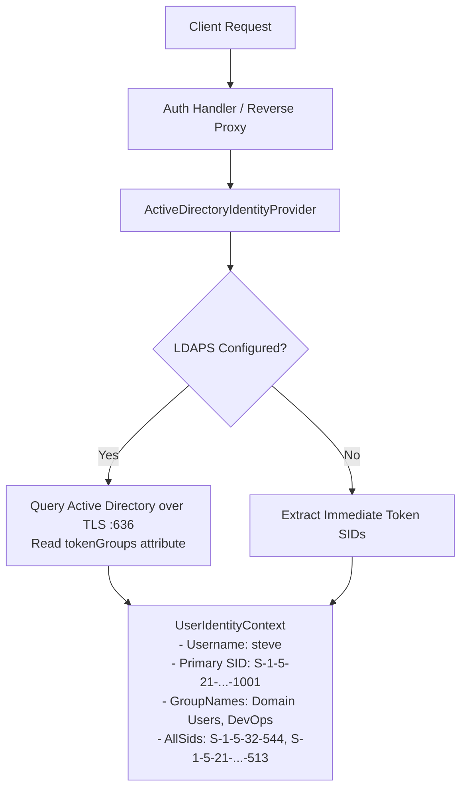

# Active Directory & LDAPS Domain Integration

[Home](../../index.md) > [Active Directory & RBAC](../../active-directory-and-rbac-guide.md) > Active Directory & LDAPS

## 1. Overview

Model Context Gateway (MCG) integrates with Microsoft Active Directory (AD) to resolve enterprise user identity context, primary Security Identifiers (SIDs), and group memberships. In Linux container and non-Windows deployments, the gateway queries Active Directory over **Secure LDAP (LDAPS)** to recursively resolve nested group memberships.

---

## 2. Inbound Identity Construction over LDAPS

When an authenticated caller issues a request, `ActiveDirectoryIdentityProvider` constructs a unified `UserIdentityContext`.



---

## 3. Transitive Group Resolution (`tokenGroups`)

Active Directory environments commonly use nested groups (such as `DevOps-Admins` nested inside `Infrastructure-Operators`). Direct token inspection resolves only immediate group memberships.

To resolve all nested group memberships reliably:
1. `ActiveDirectoryIdentityProvider` delegates query execution to `LdapActiveDirectoryService`.
2. The service initiates a TLS-encrypted LDAP connection to the Domain Controller on port **636 (LDAPS)**.
3. **Security Guardrail**: The gateway rejects unencrypted LDAP communication on port 389 to prevent credential disclosure.
4. The service authenticates with configured domain service account credentials (`Ldap:BindDn`, `Ldap:BindPassword`).
5. The service executes an LDAP subtree search for the target user account:
   ```ldap
   (&(objectClass=user)(sAMAccountName=steve))
   ```
6. The query requests two binary attributes:
   - `objectSid`: Primary Security Identifier of the user account.
   - `tokenGroups`: A binary array computed dynamically by Active Directory security subsystem containing all transitive, direct, and nested group SIDs.
7. Binary SID byte arrays are converted into standard string representations (`S-1-5-...`).
8. Resolved user SIDs and group names are cached in `IMemoryCache` for 5 minutes.
9. If LDAPS communication fails or times out, the gateway throws a `SecurityException` to fail closed rather than granting unverified fallback permissions.

---

## 4. Configuration Reference

### Application Settings (`appsettings.json`)
```json
{
  "Ldap": {
    "Server": "dc01.corp.internal",
    "Port": 636,
    "UseSsl": true,
    "Domain": "corp.internal",
    "BaseDn": "DC=corp,DC=internal",
    "BindDn": "CN=svc-mcg,OU=ServiceAccounts,DC=corp,DC=internal",
    "BindPassword": "SecretServicePassword123"
  }
}
```

### Environment Variable Overrides
```bash
Ldap__Server="dc01.corp.internal"
Ldap__Port="636"
Ldap__UseSsl="true"
Ldap__Domain="corp.internal"
Ldap__BaseDn="DC=corp,DC=internal"
Ldap__BindDn="CN=svc-mcg,OU=ServiceAccounts,DC=corp,DC=internal"
Ldap__BindPassword="SecretServicePassword123"
```

---

## 5. Related Security Guides

* [**Multi-Level RBAC & Access Control Policies**](rbac-and-policies.md)
* [**Windows Integrated Authentication & IIS**](windows-integrated-auth.md)
* [**Unified Authorization Pipeline**](../authorization-pipeline.md)
* [**Downstream Auth & Identity Delegation**](../../downstream-auth-and-delegation-guide.md)
