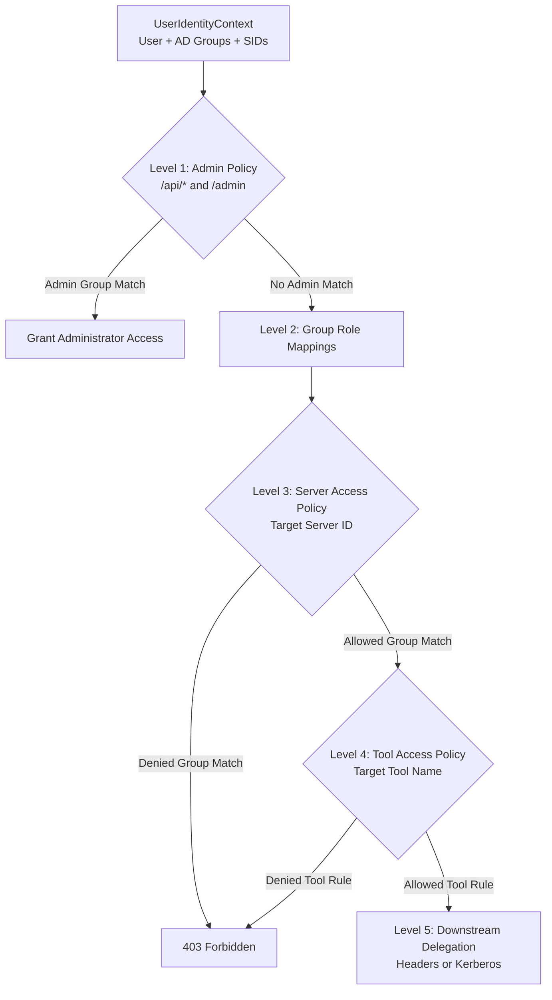

# Multi-Level RBAC & Access Control Policies

[Home](../../index.md) > [Active Directory & RBAC](../../active-directory-and-rbac-guide.md) > RBAC & Access Policies

## 1. Overview

Model Context Gateway (MCG) enforces **Multi-Level Role-Based Access Control (RBAC)** across gateway administrative endpoints, connected backend servers, and individual tools, prompts, resources, and completions.

Identity provider group claims or Active Directory SIDs are mapped to internal roles and evaluated across five distinct authorization levels.

---

## 2. Multi-Level Authorization Hierarchy

Every request evaluated by the authorization engine flows through the multi-level hierarchy:



---

## 3. Level Breakdown

### Level 1: Gateway Administrative Control (`AdminPolicy`)
`AdminPolicy` protects administrative REST APIs (`/api/*`) and the Admin MCP Server (`/admin`, `/mcg-admin`).

Administrator status is granted if the caller matches any of the following:
1. **Active Directory SID Match**: Caller SIDs contain `Admin:GroupSid` (default: `S-1-5-32-544` / Local Administrators).
2. **Active Directory / OIDC Group Name Match**: Caller group names match any entry in `Admin:Groups` (e.g. `Domain Admins`, `full_admin`).
3. **Database Role Mapping**: A mapping rule in `GroupMappings` maps the caller's group/SID to `Administrator`.
4. **Admin AppKey**: Request presents an AppKey with `admin` or `*` scope.

---

### Level 2: External Group Role Mappings (`GroupMappings` Table)
External identity groups (Active Directory SIDs, LDAP groups, OIDC claims) are mapped to internal gateway roles.

Configure mappings in **Settings &rarr; Access Control &rarr; Group Mappings**:

| External Identifier | Internal Role | Granted Capabilities |
| :--- | :--- | :--- |
| `CN=Mcp-Admins,OU=Groups,DC=corp,DC=local` | `Administrator` | Full configuration control across servers, settings, keys, and security policies. |
| `CN=DevOps-Operators,OU=Groups,DC=corp,DC=local` | `Operator` | Restart, reconnect, and toggle backend server states. |
| `CN=Security-Auditors,OU=Groups,DC=corp,DC=local` | `Auditor` | Inspect live logs, system diagnostics, and audit log history. |
| `S-1-5-21-1234567890-1105` | `Administrator` | Direct SID-based administrator role assignment. |

---

### Level 3: Server-Level Access Control (`Policies` Table)
Controls whether an authenticated group or user can access a specific downstream backend MCP server.

Configure server policies in **Servers &rarr; Edit Server &rarr; Access Control**:
- **`AllowedGroups`**: Delimited list of permitted groups/SIDs (e.g. `CORP\Engineering,CORP\DevOps`).
- **`DeniedGroups`**: Delimited list of blocked groups/SIDs (e.g. `CORP\Contractors,CORP\Guests`).

#### Evaluation Order:
1. **Explicit Deny**: If any caller group or SID matches `DeniedGroups`, the gateway immediately rejects the request with HTTP 403 Forbidden.
2. **Explicit Allow**: If any caller group or SID matches `AllowedGroups`, the gateway permits server access.
3. **Default Policy Fallback**: If no rule matches, the gateway checks server `DefaultAllow`. If `false`, access is denied.

---

### Level 4: Tool-Level Granular Access Control (`Policies` Table)
Restricts individual tools within a server to specific security groups.

Configure tool policies in **Settings &rarr; Access Control &rarr; Access Policies**:
- **Target Type**: Select `tool`.
- **Target ID**: Enter `{serverId}/{toolName}` or `{serverId}__{toolName}`.
- **Required Group**: Enter the Active Directory group name, OIDC claim, or SID.
- **Access Type**: Select `Allow` or `Deny`.

#### Granular Authorization Example:
For a Docker MCP server:
- `CORP\Domain Users`: Permitted to invoke read-only tools (`docker/list_containers`, `docker/inspect_container`).
- `CORP\DevOps-Admins`: Permitted to invoke destructive tools (`docker/restart_container`, `docker/delete_container`).
- Unmatched users: Denied execution with an audited 403 Forbidden response.

---

### Level 5: Downstream Identity Delegation
Upon passing Level 1–4 access checks, the gateway forwards requests to downstream MCP servers while propagating caller identity:
1. **Trusted Gateway Headers**: Forwards `X-Forwarded-User` and `X-Forwarded-Groups` headers for downstream Row-Level Security (RLS).
2. **Windows Kerberos Impersonation**: Runs outbound transport calls inside `WindowsIdentity.RunImpersonated()` on Windows hosts.
3. **Bring Your Own Key (BYOK)**: Resolves user-specific credentials from database or Vault storage.

---

## 4. Configuration Reference

### Application Settings (`appsettings.json`)
```json
{
  "Admin": {
    "GroupSid": "S-1-5-32-544",
    "GroupName": "full_admin",
    "Groups": [
      "full_admin",
      "Administrator",
      "Domain Admins"
    ]
  }
}
```

---

## 5. Related Security Guides

* [**Active Directory & LDAPS Domain Integration**](active-directory-ldap.md)
* [**Windows Integrated Authentication & IIS**](windows-integrated-auth.md)
* [**Unified Authorization Pipeline**](../authorization-pipeline.md)
* [**AppKey Scopes & RBAC**](../../appkey-scopes.md)
