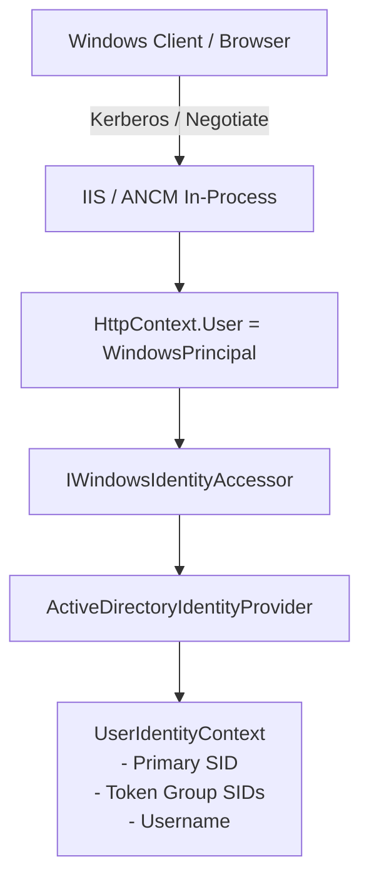

# Windows Integrated Authentication & IIS Hosting

[Home](../../index.md) > [Active Directory & RBAC](../../active-directory-and-rbac-guide.md) > Windows Integrated Auth

## 1. Overview

Model Context Gateway (MCG) supports native **Windows Integrated Authentication (WIA)** using Negotiate, Kerberos, and NTLM protocols when hosted on Windows Server via Internet Information Services (IIS) or as a Windows Service under the Service Control Manager (SCM).

---

## 2. Inbound Authentication Pipeline on Windows

When running on Windows IIS with the ASP.NET Core Module (ANCM) in-process hosting model:

1. **IIS Handshake**: IIS performs the initial Kerberos or NTLM handshake with the client (such as Cursor or Claude Desktop running in an Active Directory domain).
2. **WindowsPrincipal Attachment**: IIS attaches the authenticated `WindowsPrincipal` to `HttpContext.User`.
3. **Identity Accessor**: `ActiveDirectoryIdentityProvider` uses `IWindowsIdentityAccessor` to inspect the `WindowsIdentity`.
4. **SID Extraction**: Extracts the primary user SID (`User.Value`), primary domain SID, and immediate group SIDs attached to the Windows access token.



---

## 3. Windows Service (SCM) & DPAPI Master Key Protection

When deployed as a standalone Windows Service managed by SCM:

* **Data Protection API (DPAPI)**: MCG uses Windows Data Protection API (`System.Security.Cryptography.ProtectedData`) to encrypt sensitive configuration files (`./data/.master.key`) using local machine or user account scope (`DataProtectionScope.LocalMachine`).
* **Service Account Integration**: Can run under `NT AUTHORITY\NetworkService`, `NT AUTHORITY\LocalSystem`, or a dedicated Group Managed Service Account (gMSA).
* **Registry Secret Provider**: Reads DPAPI-encrypted secrets directly from Windows Registry hives (`HKLM\SOFTWARE\ModelContextGateway`).

---

## 4. Outbound Kerberos Impersonation (S4U2Proxy)

For downstream HTTP or SSE backends configured with `impersonation` or `kerberos-impersonate` outbound auth mode:

1. **Windows Identity Capture**: The transport captures the caller's `WindowsIdentity` from `HttpContext`.
2. **Service for User to Proxy (S4U2Proxy)**: The transport executes the outbound HTTP/SSE call inside `WindowsIdentity.RunImpersonated(identity.AccessToken, () => { ... })`.
3. **Kerberos Delegation**: SocketsHttpHandler passes `DefaultNetworkCredentials` under the caller's token to the downstream service.
4. **Platform & Auth Guardrails**:
   * Outbound impersonation is supported strictly on Windows operating systems.
   * On non-Windows platforms or unauthenticated calls, the transport gracefully falls back or logs explicit security errors.

---

## 5. Web.config IIS Configuration Reference

```xml
<?xml version="1.0" encoding="utf-8"?>
<configuration>
  <location path="." inheritInChildApplications="false">
    <system.webServer>
      <handlers>
        <add name="aspNetCore" path="*" verb="*" modules="AspNetCoreModuleV2" resourceType="Unspecified" />
      </handlers>
      <aspNetCore processPath="dotnet" arguments=".\ModelContextGateway.dll" stdoutLogEnabled="false" stdoutLogFile=".\logs\stdout" hostingModel="inprocess">
        <environmentVariables>
          <environmentVariable name="ASPNETCORE_ENVIRONMENT" value="Production" />
        </environmentVariables>
      </aspNetCore>
      <security>
        <authentication>
          <anonymousAuthentication enabled="true" />
          <windowsAuthentication enabled="true" />
        </authentication>
      </security>
    </system.webServer>
  </location>
</configuration>
```

---

## 6. Related Security Guides

* [**Active Directory & LDAPS Domain Integration**](active-directory-ldap.md)
* [**Multi-Level RBAC & Access Control Policies**](rbac-and-policies.md)
* [**Windows & IIS Deployment Guide**](../../deployment/windows-iis.md)
* [**Windows Service Deployment Guide**](../../deployment/windows-service.md)
