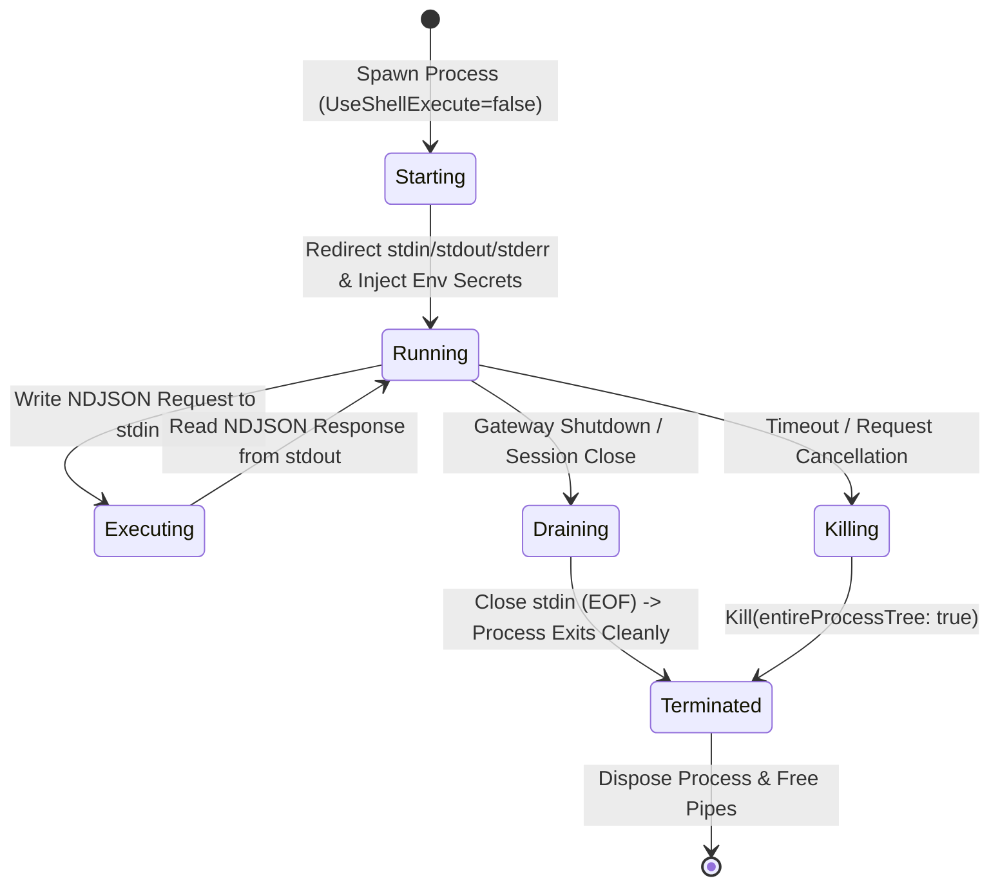
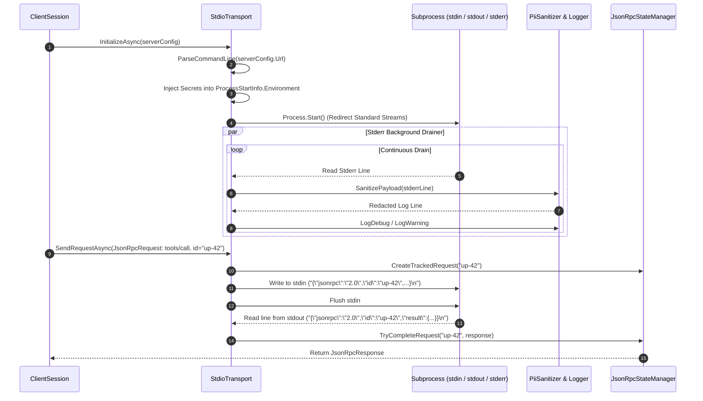

# 🚀 Transport Subsystem & Subprocess Lifecycle

This document details the transport abstraction layer, STDIO subprocess isolation, process tree lifecycle management, signal handling, and secure stream multiplexing in the **Model Context Gateway (MCG)**.

---

## 📑 Table of Contents

1. [Strategy Pattern (`ITransport`)](#1-strategy-pattern-itransport)
2. [Subprocess STDIO Architecture & Security Hardening](#2-subprocess-stdio-architecture-security-hardening)
3. [Child Process Tree Lifecycle & Signal Handling](#3-child-process-tree-lifecycle-signal-handling)
4. [Stderr Log Capture & PII Token Masking](#4-stderr-log-capture-pii-token-masking)
5. [Sequence Diagram: STDIO Subprocess Execution](#5-sequence-diagram-stdio-subprocess-execution)

---

## 1. Strategy Pattern (`ITransport`)

The gateway shields core routing coordinators from network and IPC transport protocols through the [`ITransport`](https://github.com/spelech/model-context-gateway/blob/main/Infrastructure/Transports/ITransport.cs) strategy interface:

```csharp
public interface ITransport : IAsyncDisposable
{
    string TransportType { get; }
    bool IsConnected { get; }
    Task InitializeAsync(McpServer server, CancellationToken cancellationToken = default);
    Task<JsonRpcResponse> SendRequestAsync(JsonRpcRequest request, CancellationToken cancellationToken = default);
    Task SendNotificationAsync(JsonRpcNotification notification, CancellationToken cancellationToken = default);
    Task CloseAsync(CancellationToken cancellationToken = default);
    Task<bool> IsHealthyAsync(CancellationToken cancellationToken = default);
}
```

The gateway provides three production transport implementations:

| Transport Implementation | Protocol / Channel | Concurrency & Multiplexing | Target Systems |
| :--- | :--- | :--- | :--- |
| **`SseTransport`** | HTTP Server-Sent Events + POST | Full-Duplex Multiplexed | Docker containers, remote network MCP servers, persistent services |
| **`HttpTransport`** | Half-Duplex HTTP POST / Stream | Stateless / Single-Shot | Serverless functions, cloud endpoints, webhooks |
| **`StdioTransport`** | Standard Input / Output (NDJSON) | Serialized via Async Lock | Local CLI tools, Python scripts (`uvx`), Node.js packages (`npx`) |

---

## 2. Subprocess STDIO Architecture & Security Hardening

The [`StdioTransport`](https://github.com/spelech/model-context-gateway/blob/main/Infrastructure/Transports/StdioTransport.cs) manages local CLI processes, Python virtual environments, and Node runtimes with strict security sandboxing:

1. **Command Line Tokenization**:
   [`StdioTransport.ParseCommandLine`](https://github.com/spelech/model-context-gateway/blob/main/Infrastructure/Transports/StdioTransport.cs) parses single/double quoted paths and arguments cleanly into an executable and distinct argument array without passing raw string blocks to the OS.

2. **Strict Process Security Policy**:
   - `UseShellExecute = false` and `CreateNoWindow = true`.
   - Executables are invoked **directly** without intermediate command interpreters (`sh`, `bash`, `cmd.exe`, `powershell.exe`). This completely prevents shell injection vulnerabilities and command chaining attacks (`&&`, `;`, `|`, `$(...)`).

3. **Zero-Leakage Credential Injection**:
   - Downstream secrets resolved from Vault, DPAPI, or Gateway Environment are injected **strictly** via `ProcessStartInfo.Environment`.
   - Credentials are **never** passed as command-line arguments, preventing credential exposure in host process listings (`ps aux`, `/proc/$PID/cmdline`, Windows Task Manager).

4. **Stream Synchronization & Buffer Draining**:
   - Requests are written to `StandardInput` as newline-delimited JSON (NDJSON) guarded by asynchronous write locks (`SemaphoreSlim`).
   - `StandardOutput` is read line-by-line using asynchronous loops to avoid standard pipe buffer deadlocks.

---

## 3. Child Process Tree Lifecycle & Signal Handling

Subprocesses follow a deterministic lifecycle that ensures processes and their spawned worker threads exit cleanly without leaving zombie or orphaned processes:



### Lifecycle Rules

* **Graceful Termination**:
  When a session terminates or the gateway shuts down, the router closes `StandardInput`. MCP compliant tools detect EOF on standard input and exit cleanly.
* **Process Tree Killing**:
  If a subprocess hangs or fails to terminate within the configured grace period (default: 5 seconds), [`process.Kill(entireProcessTree: true)`](https://github.com/spelech/model-context-gateway/blob/main/Infrastructure/Transports/StdioTransport.cs) is invoked. This recursively terminates the root process and all child processes spawned by it (e.g., Python scripts spawning native binaries or compilers).

---

## 4. Stderr Log Capture & PII Token Masking

Local CLI processes often emit diagnostic, debugging, or error information to `StandardError`. The gateway continuously monitors this stream while safeguarding sensitive data:

1. **Continuous Drainer Loop**:
   An asynchronous background worker continuously drains `StandardError` to prevent standard pipe buffer saturation from blocking process execution.
2. **Mandatory PII Masking**:
   Every log line emitted by the subprocess passes through [`PiiSanitizer.SanitizePayload`](https://github.com/spelech/model-context-gateway/blob/main/Infrastructure/Logging/PiiSanitizer.cs). Regex patterns automatically redact Bearer tokens, API keys, passwords, and private connection strings before the entry is written to `AuditLogs` or forwarded to console monitors.

---

## 5. Sequence Diagram: STDIO Subprocess Execution

The following sequence diagram illustrates the lifecycle of a tool request dispatched over the STDIO transport, including background stderr log capture, secret injection, and asynchronous response completion:



---

*Related Specifications:*
- [System Architecture Index](index.md)
- [Protocol & Routing Engine](routing-and-meta-mode.md)
- [Transport Capability & Configuration Guide](../transports.md)
- [Database Persistence & Envelope Encryption](database-and-encryption.md)
