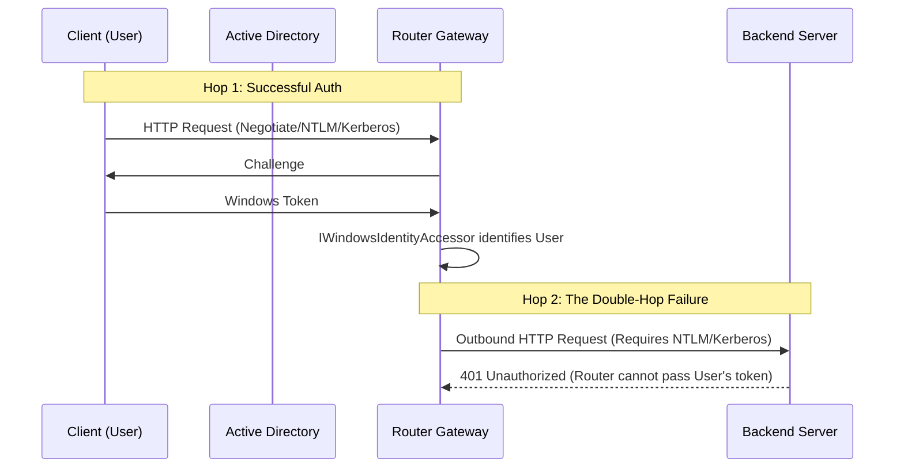
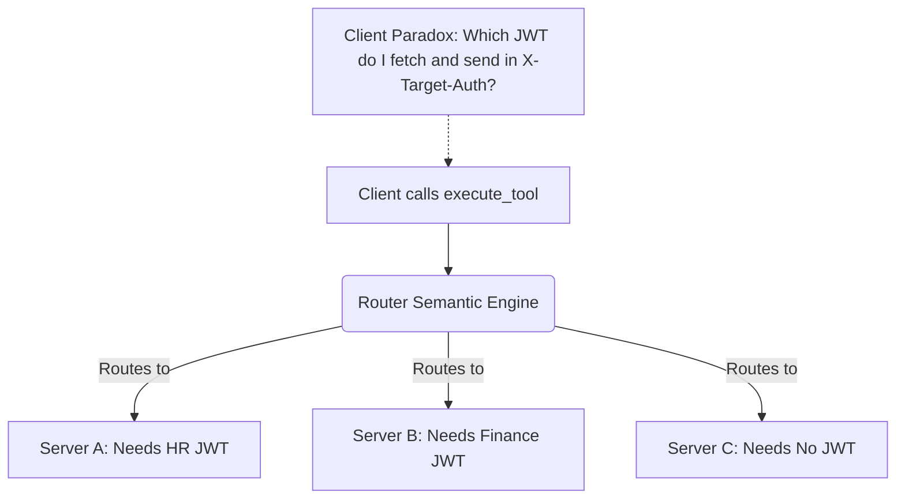

# Dynamic Auth & Kerberos Limitations

This document explains architectural limitations when using dynamic credentials (such as short-lived JWTs) and Windows Integrated Authentication (Kerberos or NTLM) in Model Context Gateway (MCG).

### Core Concepts for Beginners
- **Kerberos / NTLM**: Windows security protocols that authenticate domain users automatically.
- **Double-Hop Issue**: Windows prevents a server from forwarding a user's Kerberos credentials to a third computer without special delegation settings.
- **Dynamic JWT**: A short-lived security token that expires after a short period (such as 15 to 60 minutes).
- **Trusted Gateway**: A reverse proxy that authenticates users and connects to backend servers using a shared service account.

---

## 1. The Kerberos "Double-Hop" Boundary

The gateway identifies incoming users through Windows Integrated Authentication (NTLM or Kerberos). However, the gateway **cannot** forward the user's Windows credentials to downstream MCP servers.

### Why this fails natively

Windows networks require **Kerberos Constrained Delegation (S4U2Proxy)** to solve the double-hop problem. An Active Directory administrator must configure the gateway's service account to delegate credentials to downstream Service Principal Names (SPNs).

In addition, the gateway C# code would need to wrap outgoing requests in `WindowsIdentity.RunImpersonatedAsync()`.

Therefore, the gateway acts as a strict security boundary: it enforces RBAC rules at the edge and connects to backend servers using a service account or static key.

---

## 2. The Meta-Routing & Pass-Through Auth Paradox

The gateway supports `AllowPassThroughAuth` (clients pass a dynamic JWT in the `X-Target-Auth` header). However, this feature conflicts with **Semantic Meta-Routing**.

In meta-mode, the client only sees universal tools (`search_tools`, `execute_tool`). The client does not know which backend server the gateway will select.

### The Problem
If Server A and Server B require different dynamic tokens from an identity provider, the client cannot pre-fetch the correct token. The client does not know which server the gateway will choose. Furthermore, the Model Context Protocol (MCP) does not define a standard mechanism to pause execution and request tokens from the client.

### Recommended Workarounds
1. **Targeted Proxy Routes**: The client connects to `/{targetServerId}` directly. The client knows the target server and fetches the correct token.
2. **UserProvided Secret Store**: If the backend accepts a static credential (such as a Personal Access Token), the gateway retrieves the user's PAT from the database at runtime.
3. **Universal SSO Token**: The client fetches a universal JWT accepted by all internal backends and passes it in `X-Target-Auth`.

---

## 3. The Enterprise Solution: Trusted Gateway Pattern

When an organization controls both the gateway and downstream MCP servers, the **Trusted Gateway Pattern** solves this problem cleanly.

### How it Works
1. **Edge Authentication**: The gateway authenticates the client using an AppKey, SSO header, or LDAP.
2. **Service Account Auth**: Downstream servers trust a shared Service Account API key sent by the gateway (stored in Vault or Windows DPAPI).
3. **Identity Propagation**: The gateway passes the user's identity to the backend in an HTTP header (e.g., `X-Forwarded-User: DOMAIN\Steve`).

### How Downstream Servers Use Forwarded User Headers
When the downstream MCP server receives the request, it verifies the Service Account API key. Once verified, it trusts the `X-Forwarded-User` header to:
- **Enforce Fine-Grained RBAC**: Verify whether the user can run the requested tool.
- **Audit Logging**: Record which human user or agent executed the action.
- **Row-Level Security**: Filter database rows based on user identity before returning results.

---

## 4. Enterprise Remediations (v5.12.0)

Version 5.12.0 introduced three key architectural remediations to address dynamic authentication and self-service limitations:

### 4.1 Pluggable Vault User Secret Storage (BYOK)
- **Problem**: Previously, per-user Personal Access Tokens could only be saved in the local SQLite/SQL database, blocking enterprise setups where all credentials must reside in HashiCorp Vault.
- **Remediation**: `IUserSecretStore` is now fully pluggable. Setting `Secrets:UserStore:Provider = "Vault"` routes all user secret reads, writes, and deletions to HashiCorp Vault KV v2.
- **Path Templating**: Templates like `{Company}/mcgateway/{User}/{Server}` dynamically isolate secrets per user and service. Supports both discrete fields (`client_id`, `client_secret`, `access_token`) and full JSON auth blobs.

### 4.2 RFC 8693 Downstream Token Exchange
- **Problem**: Meta-routing could not dynamically mint tokens for multiple downstream microservices without requiring the client to guess the target server upfront.
- **Remediation**: The gateway can now execute standard RFC 8693 OAuth 2.0 Token Exchange (`TokenExchangeClient`), exchanging the caller's inbound JWT or identity for a short-lived downstream token targeted at the backend service's required audience.

### 4.3 In-House Identity Provider / External JWT Bearer
- **Problem**: Enterprise Linux container deployments cannot use Windows Kerberos/NTLM authentication directly, but possess internal Identity Providers with OpenID Connect discovery (`/.well-known/openid-configuration`) and JWKS endpoints.
- **Remediation**: `ExternalJwtAuthenticationHandler` validates incoming Bearer JWTs directly against enterprise IdP JWKS keys, extracting user identity, SIDs, and groups into the `UserIdentityContext` without requiring reverse proxy header spoofing risks.

