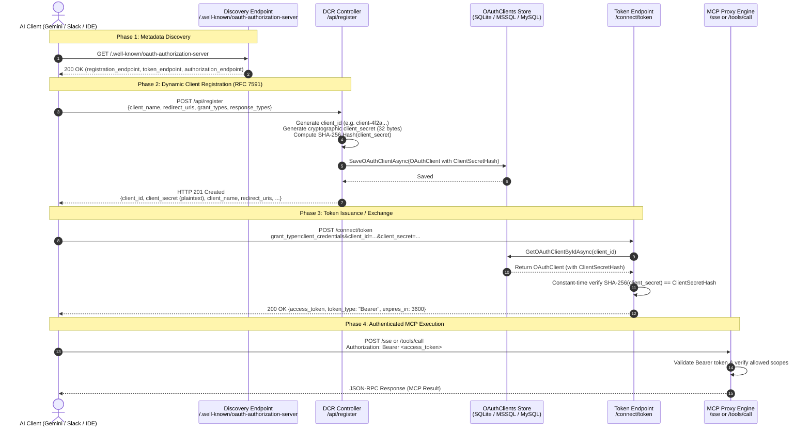
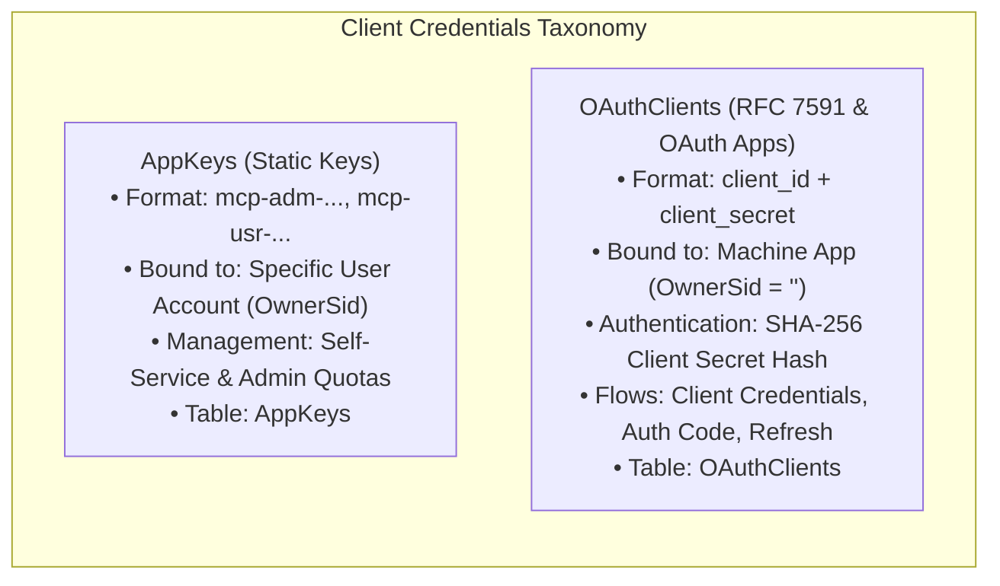

# ⚡ Dynamic Client Registration (RFC 7591) & OAuth 2.0 Flow

This document describes **OAuth 2.0 Dynamic Client Registration (RFC 7591)** in **Model Context Gateway (MCG)**. It explains protocols, workflows, registration schemas, token exchanges, and administration tools.

---

## 📖 1. Protocol Standards & Core Concepts

### Core Concepts for Beginners

- **OAuth 2.0**: An authorization standard. It allows applications to access services on behalf of users without sharing passwords.
- **Dynamic Client Registration (DCR / RFC 7591)**: A protocol that lets client applications register themselves automatically. AI agents and IDEs register without manual administrator setup.
- **Bearer Token**: A secret security token. The client passes it in the `Authorization: Bearer <token>` header to access resources.

### Implemented Specifications

The gateway complies with modern OAuth 2.0, OAuth 2.1, and OpenID Connect specifications:

* **[RFC 7591](https://datatracker.ietf.org/doc/html/rfc7591)**: *OAuth 2.0 Dynamic Client Registration Protocol* — Lets external AI agents and IDEs register as OAuth clients programmatically.
* **[RFC 8414](https://datatracker.ietf.org/doc/html/rfc8414)**: *OAuth 2.0 Authorization Server Metadata* — Advertises endpoints (`issuer`, `authorization_endpoint`, `token_endpoint`, `registration_endpoint`) through `/.well-known` endpoints.
* **[RFC 9728](https://datatracker.ietf.org/doc/html/rfc9728)**: *OAuth 2.0 Protected Resource Metadata* — Lets clients discover resource authorization servers via `/.well-known/oauth-protected-resource`.
* **[OpenID Connect Registration 1.0](https://openid.net/specs/openid-connect-registration-1_0.html)**: Standard dynamic client registration profile for OpenID Connect providers.

---

## 🔄 2. End-to-End Dynamic Client Registration Sequence

This diagram shows the complete registration, token issuance, and MCP execution sequence:



---

## 🛠️ 3. Discovery Endpoints & RFC 8414 Advertisement

External AI agents (such as Google Gemini) query discovery endpoints to locate the `registration_endpoint` and supported authentication methods before connecting.

### Endpoints
* `GET /.well-known/oauth-authorization-server` (RFC 8414)
* `GET /.well-known/openid-configuration` (OIDC Discovery)
* `GET /.well-known/oauth-protected-resource` (RFC 9728)

### Sample Discovery Response
```json
{
  "issuer": "https://mcg.internal.example.com",
  "authorization_endpoint": "https://mcg.internal.example.com/connect/authorize",
  "token_endpoint": "https://mcg.internal.example.com/connect/token",
  "registration_endpoint": "https://mcg.internal.example.com/api/register",
  "jwks_uri": "https://mcg.internal.example.com/.well-known/jwks",
  "scopes_supported": [
    "openid",
    "profile",
    "email",
    "offline_access",
    "mcp_client",
    "all"
  ],
  "response_types_supported": [
    "code",
    "token",
    "id_token"
  ],
  "grant_types_supported": [
    "authorization_code",
    "client_credentials",
    "refresh_token"
  ],
  "token_endpoint_auth_methods_supported": [
    "client_secret_post",
    "client_secret_basic"
  ]
}
```

---

## 📝 4. Client Registration Endpoint (`POST /api/register`)

The gateway accepts Dynamic Client Registration requests at these route aliases:
* `/api/register` *(Primary)*
* `/connect/register`
* `/oauth/register`
* `/register`

### Request Payload (RFC 7591)
```http
POST /api/register HTTP/1.1
Host: mcg.internal.example.com
Content-Type: application/json

{
  "client_name": "Google Gemini Assistant",
  "redirect_uris": [
    "https://oauth.pstmn.io/v1/callback",
    "https://gemini.google.com/oauth/callback"
  ],
  "grant_types": [
    "authorization_code",
    "refresh_token",
    "client_credentials"
  ],
  "response_types": [
    "code"
  ],
  "token_endpoint_auth_method": "client_secret_post",
  "scope": "mcp_client"
}
```

#### Request Fields
| Parameter | Type | Required | Default | Description |
| :--- | :--- | :---: | :--- | :--- |
| `client_name` | String | No | `"Unknown Client"` | Human-readable name identifying the client application. |
| `redirect_uris` | Array\<String\> | No | `[]` | Allowed redirection destinations for `authorization_code` flows. |
| `grant_types` | Array\<String\> | No | `["authorization_code", "refresh_token"]` | Allowed OAuth 2.0 grant types for this client. |
| `response_types` | Array\<String\> | No | `["code"]` | Allowed response types for authorization requests. |
| `token_endpoint_auth_method` | String | No | `"client_secret_post"` | Authentication method: `"client_secret_post"`, `"client_secret_basic"`, or `"none"`. |
| `application_type` | String | No | `"web"` | Application type: `"web"` or `"native"` (native defaults to public client with PKCE). |
| `scope` | String | No | `"mcp_client"` | Space-delimited string of requested OAuth scopes (e.g. `"openid mcp_client tools:execute"`). |

### Response Payload — Confidential Client (`HTTP 201 Created`)
```http
HTTP/1.1 201 Created
Content-Type: application/json
Cache-Control: no-store
Pragma: no-cache

{
  "client_id": "client-8f3b2c1e4d5a",
  "client_secret": "4a8e2b9c7d1f0e3a5b6c8d9e0f1a2b3c4d5e6f7a8b9c0d1e2f3a4b5c6d7e8f9a",
  "client_id_issued_at": 1756598400,
  "client_secret_expires_at": 0,
  "client_name": "Google Gemini Assistant",
  "redirect_uris": [
    "https://oauth.pstmn.io/v1/callback",
    "https://gemini.google.com/oauth/callback"
  ],
  "grant_types": [
    "authorization_code",
    "refresh_token",
    "client_credentials"
  ],
  "response_types": [
    "code"
  ],
  "token_endpoint_auth_method": "client_secret_post",
  "scope": "api mcp_client openid offline_access"
}
```

### Response Payload — Public Client / Native App (`HTTP 201 Created`)
For native apps or public clients requesting `token_endpoint_auth_method: "none"` (e.g. Claude Desktop, Cursor, CLI tools using PKCE), no secret is issued or required:
```http
HTTP/1.1 201 Created
Content-Type: application/json
Cache-Control: no-store
Pragma: no-cache

{
  "client_id": "client-2c9e4b1a7d8f",
  "client_name": "Claude Desktop",
  "client_id_issued_at": 1756598400,
  "redirect_uris": [
    "http://127.0.0.1:8080/callback"
  ],
  "grant_types": [
    "authorization_code",
    "refresh_token"
  ],
  "response_types": [
    "code"
  ],
  "token_endpoint_auth_method": "none",
  "scope": "mcp_client openid offline_access tools:execute"
}
```

> [!CAUTION]
> **One-Time Secret Disclosure**: For confidential clients, the gateway returns the plaintext `client_secret` **only once** in the HTTP 201 response. The database stores only its SHA-256 hash. The gateway never saves plaintext secrets to disk. You cannot retrieve a lost secret through the API. Public clients do not use secrets.

---

## 🔒 5. Persistence Isolation: `OAuthClients` vs `AppKeys`

OAuth 2.0 Dynamic Client Registrations remain strictly separate from static user API keys (`AppKeys`):



### Key Differences Matrix

| Dimension | 🔑 Static `AppKeys` | ⚡ Dynamic `OAuthClients` |
| :--- | :--- | :--- |
| **Primary Use Case** | Local IDEs (Cursor, VS Code), CLI scripts | Dynamic AI Agents (Gemini, Slack, Multi-Tenant apps) |
| **Protocol Standards** | Header-based (`X-App-Key: mcp-...`) | RFC 7591 (DCR), RFC 6749 (OAuth 2.0), OpenID Connect |
| **Underlying Database Table** | `AppKeys` | `OAuthClients` |
| **Secret Storage Scheme** | Argon2id / AES-256-GCM encrypted key | SHA-256 Hex Hash (`ClientSecretHash`) |
| **Owner Binding** | Bound to user Active Directory SID or UPN | Machine application (`OwnerSid = ''` / decoupled) |
| **Token Lifecycle** | Static key lifetime (or optional expiration) | Short-lived JWT Access Tokens and Refresh Tokens |
| **Stored Procedures** | `sp_SaveAppKey`, `sp_GetAppKeys`, `sp_DeleteAppKey` | `sp_SaveOAuthClient`, `sp_GetOAuthClients`, `sp_DeleteOAuthClient` |

---

## 🛡️ 6. Security Architecture & Threat Mitigations

### 1. Timing-Attack Mitigation
During token exchange (`/connect/token`), the gateway computes the SHA-256 hash of the client secret. It compares the hash with `OAuthClient.ClientSecretHash` using **constant-time byte comparison** (`CryptographicOperations.FixedTimeEquals`):

```csharp
byte[] inputHash = SHA256.HashData(Encoding.UTF8.GetBytes(clientSecret));
byte[] storedHash = Convert.FromHexString(client.ClientSecretHash);
bool isValid = CryptographicOperations.FixedTimeEquals(inputHash, storedHash);
```
This comparison prevents timing attacks.

### 2. Privilege Decoupling
The gateway sets `OwnerSid = string.Empty` on all dynamic machine clients. This prevents autonomous AI agents from inheriting administrator Windows SIDs or bypassing Role-Based Access Control (RBAC) rules.

### 3. Expiration & Revocation
* **Expiration**: Clients support an optional `ExpiresAt` UTC timestamp. The gateway rejects authentication requests from expired clients with HTTP 400 `invalid_client`.
* **Instant Revocation**: Administrators can delete registered clients in the Web UI (**App Keys & Security > Registered Clients**) or via `DELETE /api/clients/{clientId}`. Revocation blocks new token requests immediately.

### 4. Idempotency, Client Reuse & Automated Cleanup
Autonomous AI clients and IDE agents frequently reconnect and query registration discovery endpoints. To prevent duplicate database rows:
* **Idempotent Client Reuse**: If an incoming DCR request matches an existing client's name and type (with `CreatedBy = 'dcr'`), the gateway reuses the existing `ClientId`. It updates timestamps and scope metadata instead of creating duplicate records.
* **Automated Startup Pruning**: During startup migrations and background maintenance (`DatabaseSeederService`), the gateway prunes old duplicate DCR records across SQLite, MySQL, and MSSQL. It keeps only the latest record.
* **Administrative Cleanup**: Operators can trigger immediate DCR cleanup using the Web UI button (**Clean Up DCR**) or via `POST /api/clients/cleanup?retentionDays=30`.

---

## 🖥️ 7. Web UI Management

Administrators can view and manage registered OAuth applications in the Web Dashboard:

1. Open **App Keys & Security**.
2. Scroll to **Dynamic Client Registration (RFC 7591)**.
3. Review the client table:
   - **Application Name**: Display name provided during registration.
   - **Client ID**: Alphanumeric identifier with one-click copy button.
   - **Type**: Badges indicating `confidential` or `public` and `Dynamic` (API) or `Manual` (UI).
   - **Grant Types**: Tags for supported grants (`authorization_code`, `refresh_token`, `client_credentials`).
   - **Redirect URIs**: Allowed callback destinations.
   - **Scopes**: Allowed permission tags.
   - **Created / Expires**: Timestamp tracking with expiration status warnings.
4. Click **Register Client** to provision an OAuth application manually with custom redirect URIs and grant types.

---

## 🔗 8. Related Documentation

- [Multi-Tenant OAuth Consent Flow](multi-tenant-oauth-consent.md): User authorization and consent screen architecture.
- [Canonical Data Model & Database ERD](../data-model.md): Database schema and entity relationships for `OAuthClients`.
- [Database Provider Support Matrix](../database-providers.md): Dialect-specific DDL and stored procedures across SQLite, MSSQL, and MySQL.
- [RBAC & Access Control Policies](../user-guide/03-rbac-and-security.md): 4-Stage authorization pipeline and identity providers.
