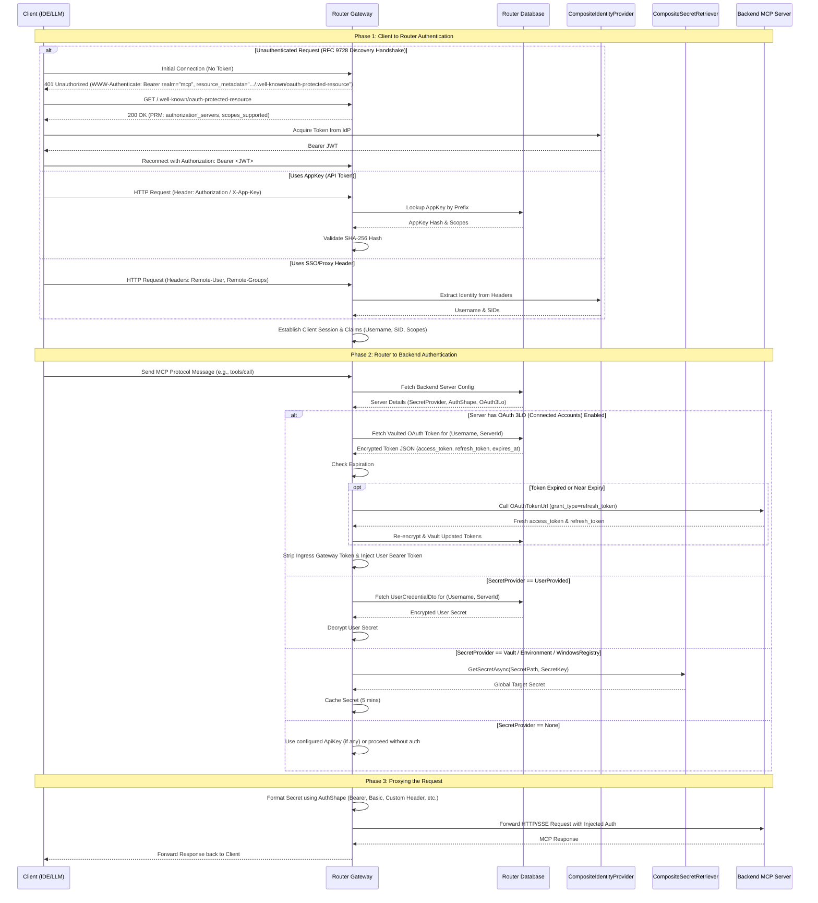

# MCP Request Auth End-to-End Flow

This diagram shows the end-to-end authentication lifecycle of an MCP request. It traces the request from a client, through the gateway, to a downstream MCP server.

### Core Concepts for Beginners
- **Reverse Proxy**: A server that authenticates users and passes identity headers to the gateway.
- **Bearer Token**: A secret key sent in the `Authorization: Bearer <token>` header.
- **AuthShape**: The credential format required by a downstream server (Bearer token, Basic auth, custom header, or query parameter).

### Auth & Setup Matrix Reference

This flow combines three security layers:
1. **Client Identity**: The gateway resolves caller identity from SSO headers or AppKey records.
2. **Server Auth Requirement**: The downstream server specifies its credential format (`AuthShape`).
3. **Secret Origin**: The gateway retrieves a shared secret (`Vault`, `Env`) or a personal secret (`UserProvided`). It formats the credential and forwards the request transparently.

> [!WARNING]
> **Dynamic Token Limitation**: The gateway does not mint dynamic tokens (such as short-lived JWTs) on behalf of users. Configured secret providers return static credentials.
>
> If a backend server requires a dynamic JWT, the client must obtain the token first. The client sends the token in the `X-Target-Auth` header. When the server has `AllowPassThroughAuth: true`, the gateway formats this token into the target `AuthShape` before forwarding the request.
