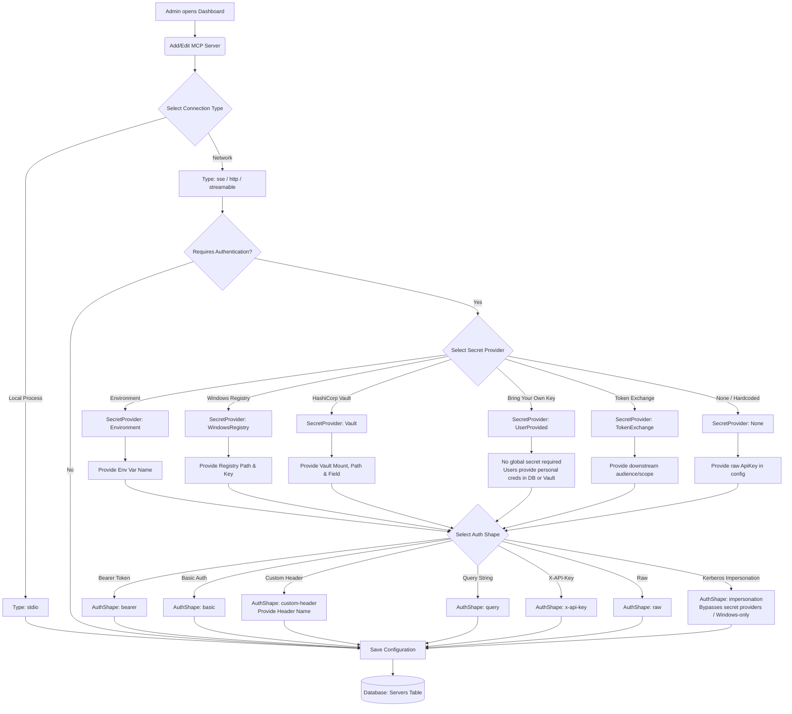

# MCP Server Configuration Flow

This document explains how an administrator configures a backend MCP server in the gateway. It focuses on authentication options and secret management.

### Core Concepts for Beginners
- **Secret Provider**: The storage location where the gateway fetches credentials (environment variables, Windows registry, or HashiCorp Vault).
- **AuthShape**: The format used to send credentials to the backend server (Bearer token, Basic auth, custom header, or query string).
- **Bearer Token**: A secret key string sent in the `Authorization: Bearer <token>` header.

### Configuration Options Reference

1. **Connection Type**: The transport used to reach the backend server (`sse`, `http`, or `stdio`).
2. **Secret Provider**: The source where the gateway retrieves credentials:
   - **Environment**: Reads values from host environment variables.
   - **WindowsRegistry**: Reads values from the Windows registry.
   - **Vault**: Reads secrets securely from HashiCorp Vault.
   - **UserProvided**: Uses personal credentials saved by individual users (in encrypted DB or HashiCorp Vault).
   - **TokenExchange**: Dynamically mints downstream tokens via RFC 8693 token exchange with an IdP.
   - **None**: Uses a static API key saved directly in the server configuration (or Windows Kerberos Impersonation).
3. **Auth Shape**: Dictates how the gateway injects credentials into outbound requests:
   - `bearer`: Injects `Authorization: Bearer <token>`.
   - `custom-header`: Injects a designated header (`X-API-Key`, `X-Plex-Token`, etc.).
   - `basic`: Injects `Authorization: Basic <base64>`.
   - `query`: Appends credentials to the query string.
   - `impersonation`: Runs request inside `WindowsIdentity.RunImpersonated()` using caller's Windows token (Windows Server / IIS only).

### Dynamic vs. Static Credentials

The gateway supports both **static credentials** (Vault, Environment, DPAPI, database keys) and **dynamic credentials** (RFC 8693 Token Exchange, Pass-Through JWTs, and interactive OAuth consent):

1. **RFC 8693 Token Exchange**: The gateway can exchange the incoming caller's token for a downstream microservice JWT without client involvement.
2. **Pass-Through Auth**:
   - Enable `AllowPassThroughAuth` in the backend server configuration.
   - Have the client (IDE) obtain the dynamic JWT from the identity provider.
   - Pass the JWT in the `X-Target-Auth` HTTP header.
   - The gateway reads this token and injects it into outbound requests using the configured `AuthShape` (such as `Authorization: Bearer <token>`).
3. **User-Provided BYOK (Database or Vault)**:
   - End users store their personal tokens or JSON credentials in **My MCP Servers**.
   - Storage is decoupled: administrators can choose between AES-256-GCM encrypted database storage or HashiCorp Vault with configurable path templates (`{Company}/mcgateway/{User}/{Server}`).
