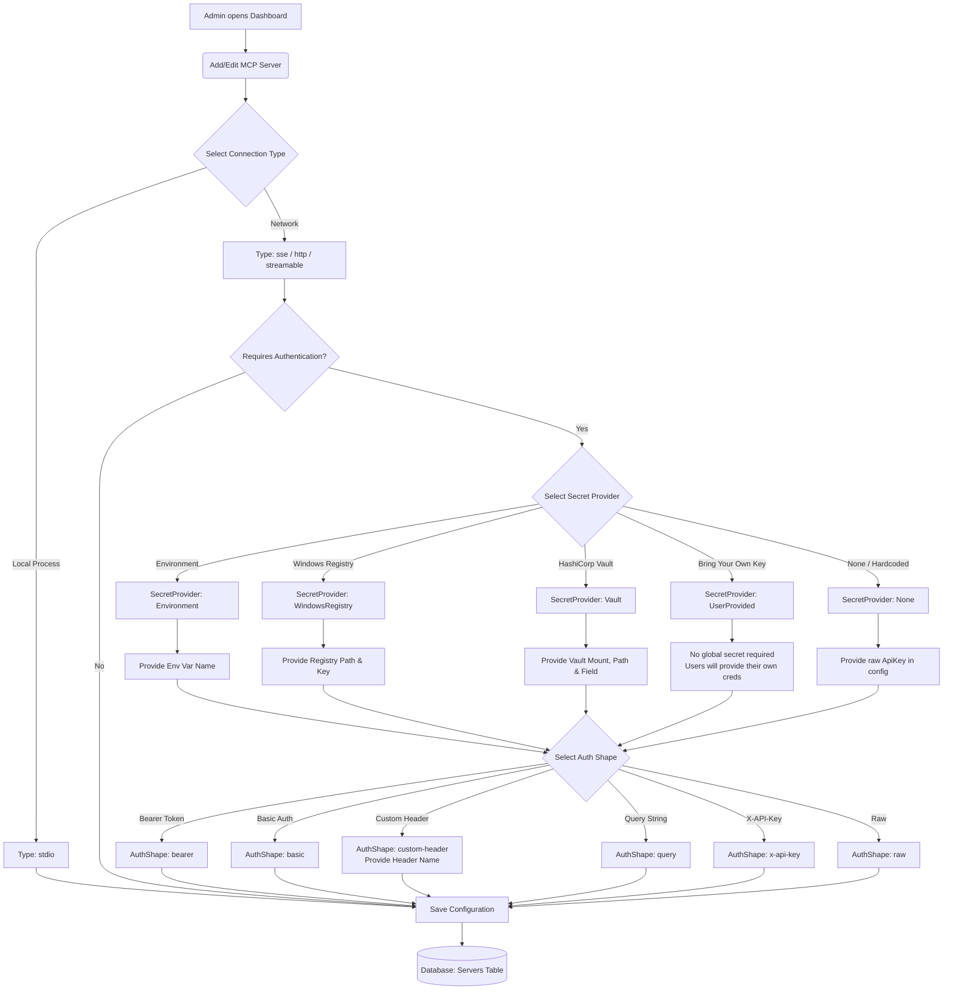

# MCP Server Configuration Flow

This document explains how an administrator configures a backend MCP server in the gateway. It focuses on authentication options and secret management.

### Core Concepts for Beginners
- **Secret Provider**: The storage location where the gateway fetches credentials (environment variables, Windows registry, or HashiCorp Vault).
- **AuthShape**: The format used to send credentials to the backend server (Bearer token, Basic auth, custom header, or query string).
- **Bearer Token**: A secret key string sent in the `Authorization: Bearer <token>` header.

### Configuration Options Reference

1. **Connection Type**: The transport used to reach the backend server (`sse`, `http`, or `stdio`).
2. **Secret Provider**: The source where the gateway retrieves credentials:
   - **Environment**: Reads values from host environment variables.
   - **WindowsRegistry**: Reads values from the Windows registry.
   - **Vault**: Reads secrets securely from HashiCorp Vault.
   - **UserProvided**: Uses personal credentials saved by individual users.
   - **None**: Uses a static API key saved directly in the server configuration.
3. **Auth Shape**: Dictates how the gateway injects credentials into outbound requests (e.g., Bearer tokens or custom headers like `X-API-Key`).

### Dynamic vs. Static Credentials

The gateway retrieves **static** credentials only. It does not fetch dynamic tokens (such as running OAuth 2.0 token exchanges) on behalf of users.

If a backend server requires a dynamic JWT, use **Pass-Through Auth**:
1. Enable `AllowPassThroughAuth` in the backend server configuration.
2. Have the client (IDE) obtain the dynamic JWT from the identity provider.
3. Pass the JWT in the `X-Target-Auth` HTTP header.
4. The gateway reads this token and injects it into outbound requests using the configured `AuthShape` (such as `Authorization: Bearer <token>`). The backend server receives standard authorization headers.
