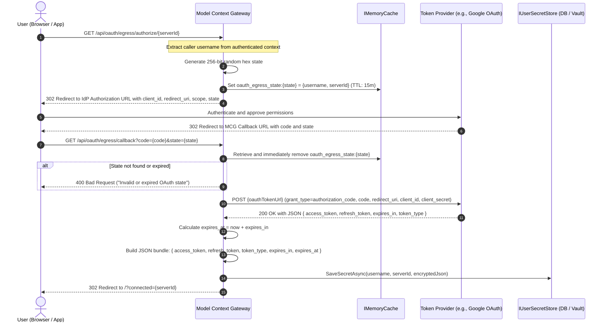
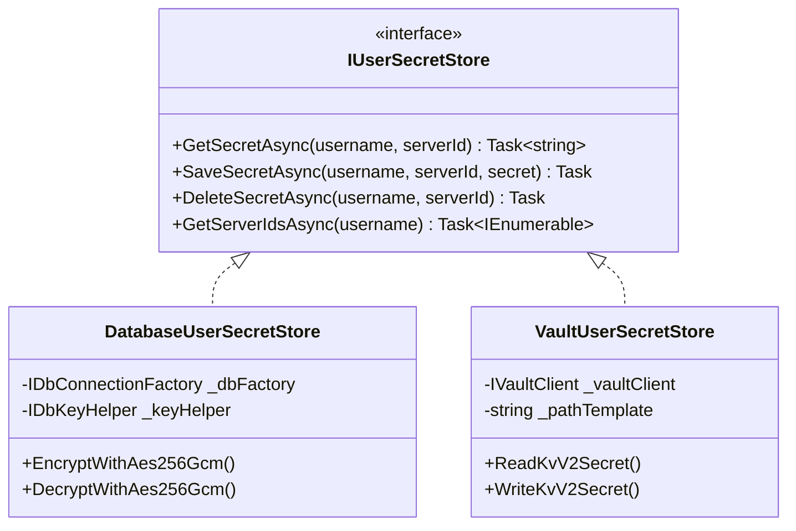
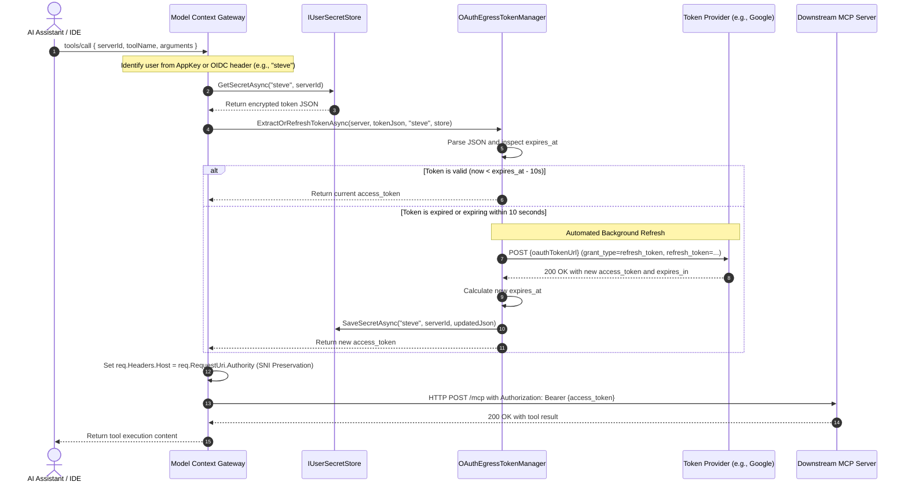

# Per-User OAuth Delegation & Connected Accounts Flow

This document describes how Model Context Gateway (MCG) authenticates individual users through OAuth 2.0. It details the protocol, process steps, token storage, and background token refresh mechanics.

---

## 1. Overview & Problem Statement

Many modern platforms, such as Google Home, Google Assistant, GitHub, Slack, and Notion, require individual user authentication. When multiple people in a household or organization use AI assistants, commands must execute on behalf of each specific user.

### The Problem With Shared Credentials
Standard Model Context Protocol (MCP) servers often rely on a single shared API key or service token configured in an environment variable. This model causes three critical problems:
1. **Context Bleed**: One user can view or modify resources that belong to another user.
2. **Excessive Permissions**: The shared service token must hold broad permissions across all users.
3. **No Individual Audit Trail**: Downstream services record all operations under a single service account instead of the real caller.

### The MCG Solution
Model Context Gateway solves these problems with its **Personal Egress 3-Legged OAuth (3LO) Engine**. MCG acts as a secure OAuth 2.0 client and credential vault directly inside the gateway:
* The user links their personal account once through the MCG dashboard.
* MCG stores the resulting tokens in an encrypted, user-partitioned secret store (`IUserSecretStore`).
* AI clients (such as Claude, Cursor, Windsurf, or Antigravity) connect to MCG with their standard gateway credentials.
* During tool calls, MCG resolves the specific user identity, extracts their personal OAuth token, refreshes the token automatically if it is expired, and injects it into downstream requests.
* AI models never see or handle the user's underlying OAuth tokens.

---

## 2. Core Definitions (ASD-STE100)

| Term | Definition |
| :--- | :--- |
| **Token Provider** | The external OAuth 2.0 service (for example, Google OAuth or GitHub) that issues tokens. |
| **Model Context Gateway (MCG)** | The proxy that manages MCP routing, verifies user identities, and vaults credentials. |
| **User Secret Store (`IUserSecretStore`)** | The persistence layer that encrypts and stores per-user credentials using AES-256-GCM or HashiCorp Vault. |
| **State Parameter** | A random cryptographic value that protects against cross-site request forgery (CSRF). |
| **Access Token** | A short-lived credential that authorizes requests to the downstream MCP server. |
| **Refresh Token** | A long-lived credential used to obtain a new access token without user interaction. |
| **Downstream MCP Server** | The target server (such as Google Drive, Home Assistant, or Slack) that runs tools. |

---

## 3. High-Level Architecture & Traffic Flow

The following diagram shows the network boundaries, communication channels, and storage locations:

```mermaid
flowchart TD
    subgraph UserZone["User & Client Environment"]
        UserBrowser["User Browser / Google Home App"]
        AiClient["AI Assistant / IDE (Claude, Cursor, Agents)"]
    end

    subgraph GatewayZone["Model Context Gateway (MCG)"]
        InboundAuth["Inbound Identity Middleware<br>(OIDC / AD / AppKey)"]
        OAuthCtrl["OAuth Egress Controller<br>(/api/oauth/egress)"]
        StateCache["Memory Cache<br>(Cryptographic State Vault)"]
        TokenMgr["OAuth Egress Token Manager<br>(JIT Refresh & Expiry Check)"]
        MetaRouter["Meta-Mode Router<br>(execute_tool / direct proxy)"]
    end

    subgraph StorageZone["Encrypted Secret Storage"]
        UserStore["IUserSecretStore<br>(AES-256-GCM DB or Vault KV v2)"]
    end

    subgraph ExternalZone["External Services"]
        IdP["OAuth Token Provider<br>(Google / GitHub / Slack)"]
        Backend["Downstream MCP Server<br>(Protected User Resources)"]
    end

    %% User linking flow
    UserBrowser -->|1. Connect Account (GET)| OAuthCtrl
    OAuthCtrl -->|2. Cache State| StateCache
    OAuthCtrl -->|3. Redirect to Consent| UserBrowser
    UserBrowser -->|4. Grant Scopes| IdP
    IdP -->|5. Redirect Callback (code + state)| UserBrowser
    UserBrowser -->|6. GET /api/oauth/egress/callback| OAuthCtrl
    OAuthCtrl -->|7. Verify & Evict State| StateCache
    OAuthCtrl -->|8. Backchannel Code Exchange| IdP
    IdP -->|9. Access & Refresh Tokens| OAuthCtrl
    OAuthCtrl -->|10. Encrypt & Save Token Bundle| UserStore

    %% AI execution flow
    AiClient -->|A. tools/call with Gateway Credential| InboundAuth
    InboundAuth --> MetaRouter
    MetaRouter --> TokenMgr
    TokenMgr -->|B. Read User Secret (user, serverId)| UserStore
    TokenMgr -.->|C. Auto-Refresh if Expired| IdP
    TokenMgr -.->|D. Update Refreshed Tokens| UserStore
    TokenMgr -->|E. Inject Authorization: Bearer| Backend
```

---

## 4. Account Linking Protocol (Step-by-Step)

When a user links their third-party account in the MCG dashboard, the gateway runs the following protocol:



### Detailed Protocol Actions:
1. **Initiation**: The user clicks **Connect Account** on the **My MCP Servers** view. The browser requests `GET /api/oauth/egress/authorize/{serverId}`.
2. **State Generation**: The gateway generates 32 cryptographically random bytes (`RandomNumberGenerator`) and encodes them as a hexadecimal string.
3. **State Binding**: The gateway stores an `OAuthEgressState` object containing `Username`, `ServerId`, and timestamp in `IMemoryCache` with a 15-minute expiration window.
4. **Provider Redirection**: The gateway builds the authorization URL with query parameters `response_type=code`, `client_id`, `redirect_uri`, `scope`, and `state`. It returns an HTTP 302 redirect to the browser.
5. **User Consent**: The user reviews requested scopes on the provider consent page (for example, Google Account permissions) and grants consent.
6. **Callback**: The provider redirects the browser back to `GET /api/oauth/egress/callback?code=...&state=...`.
7. **Single-Use State Validation**: The gateway checks `IMemoryCache` for the matching state key. It immediately deletes the key from cache. If the key is missing or expired, the request fails with HTTP 400.
8. **Backchannel Token Exchange**: The gateway makes a direct HTTPS `POST` request to `OAuthTokenUrl` with `grant_type=authorization_code`. The client secret never reaches the user's browser.
9. **Storage**: The gateway calculates the Unix expiration timestamp (`expires_at`), formats the payload, and persists it into `IUserSecretStore`.
10. **Completion**: The gateway redirects the user to the web UI with query parameter `?connected={serverId}`.

---

## 5. Token Storage Mechanics & Data Isolation

Model Context Gateway isolates credentials strictly by user and by server.



### 1. Database Storage Provider (`DatabaseUserSecretStore`)
* The gateway stores records in the `UserSecrets` table:
  * Primary Key: `(Username, ServerId)`
  * Data Column: `EncryptedSecret`
* The secret string is encrypted with **AES-256-GCM** using the master encryption key.
* The master encryption key is derived through PBKDF2 or supplied via the `DB_ENCRYPTION_KEY` environment variable.
* Plaintext tokens never appear in database backups or query logs.

### 2. HashiCorp Vault Provider (`VaultUserSecretStore`)
* The gateway stores secrets in a Vault KV v2 secret engine.
* Path templates enforce strict tenant isolation:
  ```text
  secret/data/{company}/mcgateway/{user}/{serverId}
  ```
* Vault policies can restrict access so that each environment can access only its dedicated secret namespace.

### The Stored Token Payload Structure
The secret stored in `IUserSecretStore` is a JSON object with standard fields:

```json
{
  "access_token": "ya29.a0AfH6SM...",
  "token_type": "Bearer",
  "refresh_token": "1//04...",
  "expires_in": 3600,
  "expires_at": 1758463200
}
```

---

## 6. Runtime Tool Execution & Automated Token Refresh

When an AI assistant executes a tool on a protected backend, MCG automatically verifies and refreshes tokens:



### Safety Guardrails in `OAuthEgressTokenManager`:
1. **Clock Skew Protection**: The gateway refreshes any token expiring within 10 seconds (`DateTimeOffset.UtcNow.ToUnixTimeSeconds() >= expires_at - 10`). This prevents network race conditions where a token expires while in transit.
2. **Refresh Token Rotation**: If the token provider issues a new `refresh_token` during the refresh exchange, the gateway immediately persists the new refresh token.
3. **Graceful Error Recovery**: If token refresh fails (for example, if the user revoked access at the provider), the gateway logs a structured warning and attempts the call with the existing token or returns a clear error message.
4. **SNI & Authority Header Preservation**: The outbound HTTP transport preserves the authority header (`req.Headers.Host = req.RequestUri.Authority`). Cloud token endpoints (such as Google or Cloudflare) validate this header during TLS negotiation.

---

## 7. Interactive Test Bench & Admin MCP Diagnostics

Administrators and developers can verify per-user tool calls without running manual browser sessions:

### Admin MCP Tool: `test_tool_call`
The `test_tool_call` tool in the Admin MCP Server (`/admin` and `/mcg-admin`) accepts an optional `username` parameter:

```json
{
  "serverId": "google-workspace",
  "toolName": "list_calendar_events",
  "username": "steve",
  "arguments": {
    "calendarId": "primary"
  }
}
```

When `username` is provided:
1. `AdminMcpServer` retrieves credentials from `IUserSecretStore` for `(username, serverId)`.
2. `OAuthEgressTokenManager` validates and refreshes the token if needed.
3. The test call runs under the user's specific OAuth token.
4. The test bench outputs the exact execution results and captured authorization headers.

---

## 8. Threat Model & Security Controls

| Threat | Impact | Mitigation in MCG |
| :--- | :--- | :--- |
| **CSRF / State Injection** | Attacker links victim's session to attacker's account. | MCG uses a 256-bit random cryptographic state value stored in memory with a 15-minute TTL. The gateway deletes the state immediately after one validation. |
| **Cross-User Token Access** | User A accesses User B's personal resources. | `IUserSecretStore` queries strictly by `(username, serverId)`. The gateway determines `username` from verified inbound tokens or reverse proxy headers. |
| **Plaintext Credential Theft** | Database dump exposes OAuth access and refresh tokens. | All token JSON objects are encrypted with AES-256-GCM before database insertion. |
| **Token Exposure to LLM** | AI client logs or leaks user credentials. | The gateway strips all backend credentials before responses return to the AI client. AI models interact only with tool schemas and execution results. |
| **Expired Token Failures** | Tool calls fail with HTTP 401 mid-session. | `OAuthEgressTokenManager` inspects `expires_at` on every call and refreshes expired tokens in the background before sending the request. |

---

## 9. Example Configuration: Google Home & Google Cloud

Follow these steps to configure per-user OAuth for Google services:

### Step 1: Register OAuth Application in Google Cloud Console
1. Open the [Google Cloud Console](https://console.cloud.google.com/).
2. Create or select a project.
3. Navigate to **APIs & Services** -> **Credentials**.
4. Click **Create Credentials** -> **OAuth client ID**.
5. Select **Web application**.
6. Set **Authorized redirect URIs** to your MCG callback URL:
   ```text
   https://mcg.yourdomain.com/api/oauth/egress/callback
   ```
7. Copy the generated **Client ID** and **Client Secret**.

### Step 2: Configure the Backend Server in MCG
In the MCG Dashboard (**+ Add Server**) or via the `manage_servers` Admin MCP tool:

```json
{
  "id": "google-smart-home",
  "displayName": "Google Home Assistant",
  "transportType": "http",
  "url": "https://homegraph.googleapis.com/v1",
  "enableOAuth3Lo": true,
  "oauthClientId": "YOUR_CLIENT_ID.apps.googleusercontent.com",
  "oauthClientSecret": "YOUR_CLIENT_SECRET",
  "oauthAuthorizationUrl": "https://accounts.google.com/o/oauth2/v2/auth",
  "oauthTokenUrl": "https://oauth2.googleapis.com/token",
  "oauthScopes": "https://www.googleapis.com/auth/homegraph",
  "oauthRedirectUri": "https://mcg.yourdomain.com/api/oauth/egress/callback"
}
```

### Step 3: Connect Your Personal Account
1. Log into the MCG Dashboard as an authenticated user.
2. Open the **My MCP Servers** tab.
3. Locate **Google Home Assistant** and click **Connect Account**.
4. The browser opens the Google sign-in and consent screen.
5. Review the requested permissions and click **Allow**.
6. Google redirects your browser back to MCG. The status card shows **Connected (OAuth)**.
7. Your AI assistant can now invoke tools on the server using your personal account.

---

## 10. Disconnecting Accounts

Users can revoke access at any time:
1. Open the **My MCP Servers** tab in the dashboard.
2. Click **Disconnect** on the connected server card.
3. The gateway sends an HTTP POST to `/api/oauth/egress/disconnect/{serverId}`.
4. The gateway deletes the user's secret from `IUserSecretStore`.
5. Future tool calls by that user on that server will fail closed until the user reconnects.
