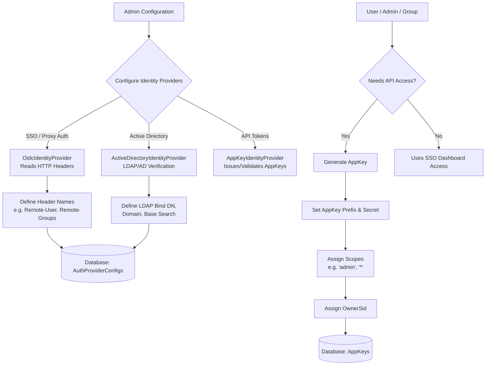

# Platform Configuration & User Setup Flow

This document explains how to configure user authentication in Model Context Gateway (MCG). It covers identity providers, reverse proxies, and AppKeys.

### Core Concepts for Beginners
- **AppKey (Bearer Token)**: A persistent secret string that IDEs and scripts send to authenticate with the gateway.
- **Reverse Proxy**: A server that verifies user identity and forwards requests with identity headers.
- **Scope**: A permission tag that controls which tools and endpoints a key can access.

### Explanation of AppKeys

AppKeys are bearer tokens that external clients (such as IDEs or scripts) use to authenticate with the gateway.

- **Prefix & Hash**: AppKeys contain a public prefix and a secret part. The database indexes the prefix for lookup and stores only the SHA-256 hash of the secret. Token format: `mcp-{scopeSlug}-{selector}-{secret}`.
- **Scopes**: Scopes define key permissions. For example, `admin` or `*` grants administrative control over the gateway.
- **OwnerSid**: Binds the AppKey to a user account or group Security Identifier (SID). When an IDE connects with this key, the gateway applies the permissions of the assigned `OwnerSid`. Teams can use shared service account keys while maintaining role-based access control.
