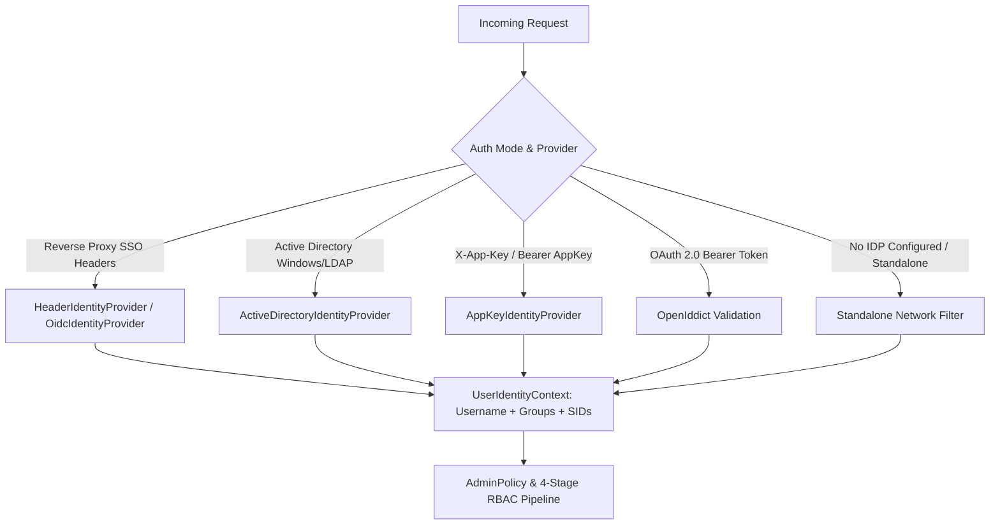

# Authentication & Authorization Architecture

This document describes authentication and authorization in Model Context Gateway (MCG). It explains how the gateway identifies callers and verifies permissions across Active Directory (AD) Security Identifiers (SIDs), reverse proxy headers, local network rules, AppKeys, and the dedicated Admin MCP Server.

---

## 1. Identity Providers & Resolution

The gateway uses pluggable `IIdentityProvider` components inside a `CompositeIdentityProvider`. These providers build a `UserIdentityContext` from each incoming HTTP request.



### 1.1 Active Directory (`ActiveDirectoryIdentityProvider`)
- **Mechanism:** Uses native Windows Authentication (Kerberos or NTLM) or direct LDAP service binds.
- **Data Extraction:** Extracts the Windows username, primary SID, and group SIDs (such as `S-1-5-32-544`). Can query domain LDAP trees recursively for nested groups.
- **Mapping:** Maps SIDs into the `UserIdentityContext.Sids` and `AllSids` collections.

### 1.2 OIDC / Header Proxy (`HeaderIdentityProvider` / `OidcIdentityProvider`)
- **Mechanism:** Reads HTTP headers added by trusted upstream reverse proxies (such as PocketID, TinyAuth, Authentik, Keycloak, Authelia, Traefik, Caddy, or Nginx).
- **Reverse Proxy Explained:** A reverse proxy sits in front of the gateway. It authenticates users with Single Sign-On (SSO) and forwards their verified identity headers.
- **Trust Validation:** Verifies that the proxy remote IP address matches `Oidc:TrustedProxies`. The gateway accepts exact IP addresses and CIDR subnet ranges. It strips headers from untrusted proxies and sets the user role to `guest`.
- **Data Parsing:** 
  - **User Headers:** Reads `Remote-User`, `X-Forwarded-User`, `X-Auth-Request-User`, and `X-User`.
  - **Group Headers:** Reads headers like `Remote-Groups`, `sso_groups`, and `X-Forwarded-Groups` into `GroupNames`. Supports comma-separated strings and JSON arrays.
  - **SID Headers:** Reads explicit SID headers (such as `Remote-User-Sid` and `X-Auth-Request-Sid`) into the `Sids` collection.

### 1.3 AppKey Authentication (`AppKeyAuthenticationHandler`)
- **Mechanism:** Verifies API tokens (`mcp-...`) using constant-time SHA-256 hash comparisons against hashes in the database.
- **Bearer Tokens Explained:** A bearer token is a secret security key. Any client that sends this token receives the permissions granted to it.
- **Accepted Token Transports:**
  - Header: `Authorization: Bearer mcp-...`
  - Header: `X-App-Key: mcp-...` or `X-Api-Key: mcp-...`
  - URL Query parameter: `?app_key=mcp-...` or `?api_key=mcp-...`
- **Scope Verification:**
  - Scopes define specific permissions granted to the token.
  - `all` or `*`: Grants full access to all tools, prompts, resources, and admin endpoints.
  - `admin`: Grants the administrator role (`ClaimTypes.Role: Administrator`).
  - `category:<name>`: Restricts access strictly to backend servers assigned that category tag.

---

## 2. Standalone Mode & Local Network Authorization

When you configure **no external authentication provider** (no Active Directory LDAP or OIDC SSO), the gateway runs in **Standalone / Personal Mode**:

```
                       [ Incoming Request in Standalone Mode ]
                                         │
                   ┌─────────────────────┴─────────────────────┐
                   ▼                                           ▼
       [ Client IP in StandaloneAllowedNetworks? ]   [ Valid Admin AppKey Presented? ]
       (default: 127.0.0.1, ::1;                     (scopes: ["admin"], ["all"])
        custom LAN CIDRs or "0.0.0.0/0")                       │
                   │                                           │
                  YES ──► Grant Local Admin Access            YES ──► Grant Admin Access
                   │                                           │
                   NO ─────────────────────────────────────────NO ──► 403 Forbidden
```

### Configuration (`Admin:StandaloneAllowedNetworks`)

| Mode | Allowed Networks | Purpose |
| :--- | :--- | :--- |
| **Default** | `["127.0.0.1", "::1"]` | Restricts administration to the local host machine. |
| **Private Subnet** | `["127.0.0.1", "::1", "10.0.0.0/8", "192.168.0.0/16", "172.16.0.0/12"]` | Allows administrative access from trusted private networks. |
| **Open LAN** | `["0.0.0.0/0"]` | Allows all network clients to administer the gateway. Use only in isolated lab environments. |

---

## 3. Administrative Authorization (`AdminPolicy`)

`AdminPolicy` protects management API endpoints (`/api/*`) and the Admin MCP Server (`/admin`, `/admin/sse`, `/router-admin`). The gateway grants admin access when any of these conditions are met:

1. **Active Directory SID Match:** The user SID list contains `Admin:GroupSid` (default: `S-1-5-32-544` / Local Administrators).
2. **OIDC Group Match:** The user `GroupNames` list contains `Admin:GroupName` or matches any entry in `Admin:Groups` (defaults: `full_admin`, `Administrator`, `Administrators`).
3. **Database Group Mappings:** A rule in the `GroupMappings` database table maps an external SSO group ID to an admin group or SID.
4. **Admin AppKey:** The request presents an AppKey with the `admin`, `*`, or `all` scope owned by an administrator.
5. **Standalone Network Match:** When no external IDP is active, the caller IP matches `Admin:StandaloneAllowedNetworks`.

---

## 4. Admin MCP Server Architecture

AI assistants and LLM tools (Claude Desktop, Cursor, Cline, Windsurf) can manage the gateway through the native Admin MCP Server:

* **Endpoints:**
  * `GET/POST /admin` & `GET/POST /admin/sse`: MCP Server-Sent Events stream.
  * `POST /admin/message`: JSON-RPC 2.0 message handler.
  * `/{targetServerId}` (`/router-admin` or `/admin`): Target proxy alias.

* **Consolidated Administration Tools:**

| Tool Name | Purpose |
| :--- | :--- |
| `manage_servers` | Adds, updates, deletes, toggles, and reconnects downstream MCP servers. |
| `manage_appkeys` | Creates, lists, checks limits, and revokes AppKeys. |
| `manage_clients` | Registers, lists, and deletes dynamic OAuth clients. |
| `manage_policies` | Configures fine-grained RBAC access policies. |
| `manage_group_mappings` | Maps external SSO groups to internal roles. |
| `manage_providers` | Configures and tests secret stores and identity providers. |
| `manage_settings` | Updates dashboard branding and semantic embedding providers. |
| `manage_custom_files` | Manages local prompt and resource files in the `data/` folder. |
| `manage_system` | Reads runtime diagnostics, checks logs, and inspects audit logs. |
| `test_tool_call` | Runs test tool calls directly on downstream servers. |

* **Audit Logging:** Every tool call records the caller, tool name, action, parameters (redacted), and outcome to the persistent `AuditLogs` database table.

---

## 5. Configuration Reference

```json
{
  "Admin": {
    "GroupSid": "S-1-5-32-544",
    "GroupName": "full_admin",
    "Groups": [
      "full_admin",
      "Administrator",
      "Administrators",
      "Domain Admins"
    ],
    "StandaloneAllowedNetworks": [
      "127.0.0.1",
      "::1",
      "10.0.0.0/8",
      "192.168.0.0/16"
    ]
  },
  "Oidc": {
    "TrustedProxies": "10.0.5.10,172.17.0.1",
    "RequireTrustedProxy": true
  },
  "Identity": {
    "HeaderAuth": {
      "UserHeaders": [
        "Remote-User",
        "X-Forwarded-User"
      ],
      "GroupHeaders": [
        "Remote-Groups",
        "X-Forwarded-Groups",
        "sso_groups"
      ]
    }
  }
}
```

### Environment Variable Equivalents
* `Admin__GroupSid="S-1-5-32-544"`
* `Admin__GroupName="full_admin"`
* `Admin__Groups__0="full_admin"`
* `Admin__Groups__1="Administrator"`
* `Admin__Groups__2="Domain Admins"`
* `Admin__StandaloneAllowedNetworks__0="127.0.0.1"`
* `Admin__StandaloneAllowedNetworks__1="::1"`
* `Admin__StandaloneAllowedNetworks__2="10.0.0.0/8"`
* `Oidc__TrustedProxies="10.0.5.10,172.17.0.1"`
* `Oidc__RequireTrustedProxy="true"`


