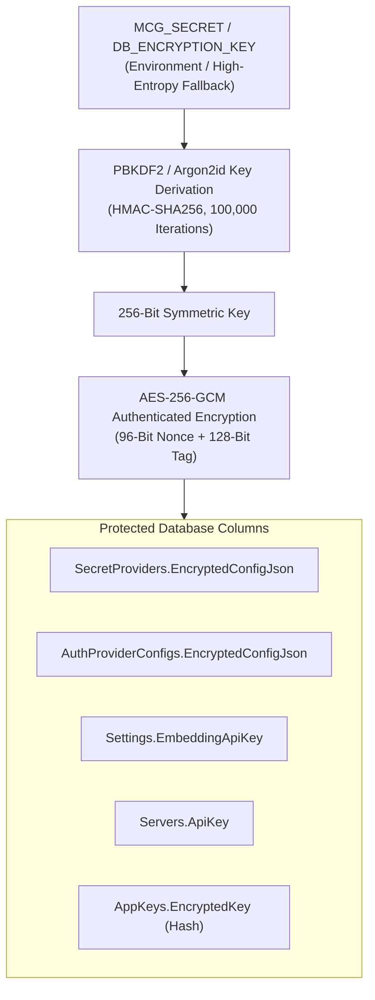

# Canonical Data Model & Database ERD

This document provides the complete, canonical data model and Entity-Relationship Diagram (ERD) for the **C# Model Context Gateway (MCG) & Semantic Proxy**. It documents all 12 core database entities, relationship cardinalities, column constraints, indexing strategies, multi-dialect support (SQLite SQLCipher, MS SQL Server, MySQL), and data protection models.

For dialect-specific SQL migrations and connection string setups, see [database-providers.md](database-providers.md). For end-to-end system architecture and data flow sequences, see [architecture.md](architecture.md).

---

## Entity-Relationship Diagram (Mermaid ERD)

```mermaid
erDiagram
    Servers ||--o{ Tools : "exposes (FK: ServerId)"
    Servers ||--o{ AccessPolicies : "governed by (TargetId)"
    Servers ||--o{ AuditLogs : "generates (ServerCodeName)"
    Servers }o--o| SecretProviders : "resolves credentials (SecretProvider)"
    
    Tools ||--o{ ToolAccessPolicies : "governed by (FK: ToolId)"
    Tools ||--o{ AccessPolicies : "governed by (TargetId)"
    
    AdGroups ||--o{ ToolAccessPolicies : "assigned to (FK: GroupId)"
    AdGroups ||--o{ GroupMappings : "maps external groups (InternalGroup)"
    
    AppKeys ||--o{ AuditLogs : "attributed via (UserSid -> OwnerSid)"
    
    Servers {
        string Id PK "Server unique identifier (e.g. docker, plex)"
        string DisplayName "Human-readable server name"
        string Url "Endpoint URL or command string"
        boolean Enabled "Active/inactive operational state"
        boolean Hidden "Hidden from client discovery list"
        string Type "Transport type: sse, http, streamable, stdio"
        string SecretProvider "Provider: None, HashiCorpVault, WindowsRegistry, Environment"
        string SecretItemKey "Target secret key identifier"
        string SecretMount "Vault secret engine mount path"
        string SecretPath "Vault secret subpath or registry key"
        string SecretField "Vault secret JSON field key"
        string AuthShape "Authentication shape: bearer, customHeader, query"
        string CustomHeaderName "Custom HTTP header name if shape=customHeader"
        string Categories "JSON array of category tags"
        string ApiKey "Static API key (redacted in API)"
        string HeadersJson "JSON dictionary of custom HTTP headers"
        boolean AutoDiscovered "Flag indicating dynamic auto-discovery"
    }

    Settings {
        string Id PK "Global singleton configuration ID"
        string EmbeddingProvider "Embedding backend: local, openai, custom"
        string EmbeddingApiUrl "Embedding inference API endpoint"
        string EmbeddingApiKey "Encrypted embedding API key"
        string EmbeddingApiModel "Embedding model name"
        string EmbeddingModelDir "Filesystem directory for local ONNX model"
        string UserSecretStorage "Storage mode for user personal secrets"
        int GlobalMaxKeys "Maximum total active AppKeys allowed"
        int UserMaxKeys "Maximum active AppKeys allowed per user"
    }

    SecretProviders {
        int ProviderId PK "Provider integer surrogate key"
        string ProviderName UK "Unique provider identifier (e.g. HashiCorpVault)"
        string DisplayName "Human-readable provider name"
        string EncryptedConfigJson "AES-256-GCM encrypted provider configuration"
        boolean IsEnabled "Provider enabled state"
        datetime UpdatedAt "Timestamp of last modification"
    }

    AuthProviderConfigs {
        int AuthId PK "Auth provider surrogate key"
        string ProviderName UK "Unique identity provider identifier (e.g. ActiveDirectory)"
        string DisplayName "Human-readable identity provider name"
        string UserHeader "HTTP header for username (default: Remote-User)"
        string GroupsHeader "HTTP header for user groups (default: Remote-Groups)"
        string EncryptedConfigJson "AES-256-GCM encrypted provider settings"
        boolean IsEnabled "Identity provider enabled state"
        datetime UpdatedAt "Timestamp of last modification"
    }

    AdGroups {
        int GroupId PK "Group integer surrogate key"
        string ObjectSid UK "Active Directory Security Identifier (SID)"
        string GroupName "Active Directory / Enterprise group name"
        string Description "Group description and purpose"
        boolean IsActive "Group active state"
        datetime CreatedAt "Timestamp of creation"
    }

    Tools {
        int ToolId PK "Tool integer surrogate key"
        string ServerId FK "Foreign key referencing Servers.Id"
        string ToolName "MCP tool name (e.g. list_containers)"
        string Description "Tool description shown to LLMs"
        string InputSchemaJson "JSON Schema defining tool arguments"
        string VaultSecretPath "Optional tool-specific secret path"
        string SecretProvider "Tool-specific secret provider"
        boolean IsEnabled "Tool enabled state"
        datetime CreatedAt "Timestamp of tool discovery"
    }

    ToolAccessPolicies {
        int ToolPolicyId PK "Surrogate policy primary key"
        int ToolId FK "Foreign key referencing Tools.ToolId"
        int GroupId FK "Foreign key referencing AdGroups.GroupId"
        boolean IsAllowed "Allow (1) or Explicit Deny (0)"
        int RateLimitPerMin "Rate limit allocations per minute"
        datetime CreatedAt "Timestamp of policy creation"
    }

    AccessPolicies {
        string Id PK "Policy unique GUID identifier"
        string TargetId "Target server ID, category, or tool identifier"
        string RequiredGroup "AD group, SID, or role required for access"
        boolean IsAllowed "Allow (1) or Explicit Deny (0)"
        datetime CreatedAt "Timestamp of policy assignment"
    }

    GroupMappings {
        string Id PK "Mapping unique GUID identifier"
        string ExternalId "External group claim or SSO header value"
        string InternalGroup "Internal mapped router role / AD group"
        datetime CreatedAt "Timestamp of mapping creation"
    }

    AppKeys {
        string Id PK "AppKey unique GUID identifier"
        string Name "Friendly application/client name"
        string Username "Subject username associated with key"
        string KeyPrefix UK "High-entropy random key prefix"
        string EncryptedKey "Argon2id / PBKDF2 hash of secret key"
        string ScopesJson "JSON array of allowed scopes (*, category:*, server:*)"
        datetime ExpiresAt "Optional key expiration UTC timestamp"
        datetime CreatedAt "Timestamp of key creation"
        string OwnerSid "Target user SID (decoupled from admin creator)"
    }

    AuditLogs {
        bigint AuditId PK "Audit entry sequential identifier"
        string RequestId "Unique client request GUID"
        string UserPrincipalName "Caller username or identity"
        string UserSid "Caller Active Directory SID or AppKey OwnerSid"
        string ServerCodeName "Target MCP server code name"
        string ItemName "Target tool, prompt, or resource URI"
        string RequestMethod "MCP method: tools/call, prompts/get, etc."
        string RequestParams "Sanitized and PII-redacted parameters JSON"
        string ResponseStatus "Response status: SUCCESS, DENIED, ERROR"
        int ExecutionDurationMs "Execution latency in milliseconds"
        datetime Timestamp "UTC event log timestamp"
    }

    OAuthClients {
        string ClientId PK "Client unique identifier"
        string ClientSecretHash "SHA-256 hash of client secret"
        string ClientName "Human-readable application name"
        string ClientType "Client type: confidential or public"
        string RedirectUrisJson "JSON array of allowed redirect URIs"
        string GrantTypesJson "JSON array of allowed grant types"
        string ScopesJson "JSON array of allowed OAuth scopes"
        string OwnerSid "Target user SID (empty for machine apps)"
        string CreatedBy "Creator username or dcr"
        datetime ExpiresAt "Optional client secret expiration UTC timestamp"
        datetime CreatedAt "Timestamp of client registration"
    }
```

---

## Entity Catalog & Schema Specifications

### 1. `Servers` (Registered MCP Servers)
Stores backend downstream server registrations, transport parameters, credential shapes, and metadata.

| Column | Type | Nullable | Constraints | Description |
| :--- | :--- | :--- | :--- | :--- |
| `Id` | `VARCHAR(100)` | No | `PK` | Unique alphanumeric identifier (e.g. `docker`, `plex`, `ha`) |
| `DisplayName` | `VARCHAR(255)` | No | | Friendly name rendered in UI dashboards |
| `Url` | `VARCHAR(1000)` | No | | Downstream endpoint URL or local binary execution command |
| `Enabled` | `BOOLEAN / INT` | No | Default `1` | Operational state (`1` = active, `0` = disabled) |
| `Hidden` | `BOOLEAN / INT` | No | Default `0` | Hides tools from `tools/list` while retaining routing capability |
| `Type` | `VARCHAR(50)` | No | Default `'sse'` | Transport protocol: `sse`, `http`, `streamable`, `stdio` |
| `SecretProvider` | `VARCHAR(50)` | No | Default `'None'` | Credential provider: `None`, `HashiCorpVault`, `WindowsRegistry`, `Environment` |
| `SecretItemKey` | `VARCHAR(255)` | Yes | | Target secret identifier or environment variable name |
| `SecretMount` | `VARCHAR(255)` | Yes | | HashiCorp Vault KV mount point (e.g. `secret/data/`) |
| `SecretPath` | `VARCHAR(500)` | Yes | | Vault secret path or Windows Registry subkey |
| `SecretField` | `VARCHAR(255)` | Yes | | JSON property key inside the secret payload |
| `AuthShape` | `VARCHAR(50)` | No | Default `'bearer'` | Header injection shape: `bearer`, `basic`, `customHeader`, `query` |
| `CustomHeaderName` | `VARCHAR(255)` | Yes | | HTTP header name if `AuthShape = 'customHeader'` |
| `Categories` | `TEXT / JSON` | Yes | | JSON array of category strings (e.g. `["infrastructure", "media"]`) |
| `ApiKey` | `VARCHAR(1000)` | Yes | | Static token (encrypted at rest; redacted in API responses) |
| `HeadersJson` | `TEXT / JSON` | Yes | | JSON dictionary of static downstream HTTP headers |
| `AutoDiscovered` | `BOOLEAN / INT` | No | Default `0` | Flag set when registered dynamically via Docker socket discovery |

---

### 2. `Tools` (Cached Backend & Native Tools)
Stores cached metadata and JSON schemas for downstream MCP tools discovered during server warming.

| Column | Type | Nullable | Constraints | Description |
| :--- | :--- | :--- | :--- | :--- |
| `ToolId` | `INT` | No | `PK, AUTOINCREMENT` | Surrogate integer identifier |
| `ServerId` | `VARCHAR(100)` | No | `FK -> Servers(Id)` | Reference to parent MCP server |
| `ToolName` | `VARCHAR(255)` | No | | Unnamespaced tool name (e.g. `restart_container`) |
| `Description` | `TEXT` | Yes | | Description analyzed by LLMs and vector embedding index |
| `InputSchemaJson` | `TEXT / JSON` | Yes | | Standard JSON Schema defining input parameters |
| `VaultSecretPath` | `VARCHAR(500)` | Yes | | Optional tool-level Vault override path |
| `SecretProvider` | `VARCHAR(50)` | Yes | | Optional tool-level secret provider override |
| `IsEnabled` | `BOOLEAN / INT` | No | Default `1` | Per-tool activation state |
| `CreatedAt` | `DATETIME` | No | Default `CURRENT_TIMESTAMP` | Initial discovery timestamp |

---

### 3. `AppKeys` (Scoped API Keys)
Stores client API credentials used by IDEs, CLI tools, and background agents.

| Column | Type | Nullable | Constraints | Description |
| :--- | :--- | :--- | :--- | :--- |
| `Id` | `VARCHAR(36)` | No | `PK` | Unique GUID identifier |
| `Name` | `VARCHAR(255)` | No | | Descriptive client label (e.g. `Cursor IDE Laptop`) |
| `Username` | `VARCHAR(255)` | No | | Subject principal username associated with key |
| `KeyPrefix` | `VARCHAR(32)` | No | `UK, INDEX` | High-entropy random prefix (`mcp_app_key_xxxxxxxx`) |
| `EncryptedKey` | `VARCHAR(512)` | No | | Argon2id / PBKDF2 cryptographic hash of secret key |
| `ScopesJson` | `TEXT / JSON` | No | | Scopes JSON array: `["*"]`, `["server:docker"]`, `["category:media"]` |
| `ExpiresAt` | `DATETIME` | Yes | | Expiration timestamp in UTC (`NULL` = Never) |
| `CreatedAt` | `DATETIME` | No | Default `CURRENT_TIMESTAMP` | Creation timestamp |
| `OwnerSid` | `VARCHAR(255)` | Yes | | Target user SID decoupled from admin creator principal |

---

### 4. `AdGroups` & `GroupMappings` (Identity & RBAC)
Resolves enterprise Active Directory SIDs and maps external SSO reverse-proxy claims to internal router roles.

#### `AdGroups`
| Column | Type | Nullable | Constraints | Description |
| :--- | :--- | :--- | :--- | :--- |
| `GroupId` | `INT` | No | `PK, AUTOINCREMENT` | Surrogate integer identifier |
| `ObjectSid` | `VARCHAR(255)` | No | `UK, INDEX` | Windows Security Identifier (e.g. `S-1-5-32-544`) |
| `GroupName` | `VARCHAR(255)` | No | | Domain or local group name (e.g. `Administrators`) |
| `Description` | `TEXT` | Yes | | Group purpose and description |
| `IsActive` | `BOOLEAN / INT` | No | Default `1` | Group active state |
| `CreatedAt` | `DATETIME` | No | Default `CURRENT_TIMESTAMP` | Registration timestamp |

#### `GroupMappings`
| Column | Type | Nullable | Constraints | Description |
| :--- | :--- | :--- | :--- | :--- |
| `Id` | `VARCHAR(36)` | No | `PK` | Unique GUID identifier |
| `ExternalId` | `VARCHAR(255)` | No | `INDEX` | External header/claim value (e.g. `house_member`, `sso_admin`) |
| `InternalGroup` | `VARCHAR(255)` | No | | Mapped internal role or AD group name (e.g. `full_admin`) |
| `CreatedAt` | `DATETIME` | No | Default `CURRENT_TIMESTAMP` | Mapping creation timestamp |

---

### 5. `AccessPolicies` & `ToolAccessPolicies` (Governance)
Controls fine-grained authorization for servers, categories, tools, resources, and prompts.

#### `AccessPolicies`
| Column | Type | Nullable | Constraints | Description |
| :--- | :--- | :--- | :--- | :--- |
| `Id` | `VARCHAR(36)` | No | `PK` | Unique GUID identifier |
| `TargetId` | `VARCHAR(255)` | No | `INDEX` | Target identifier: `server:<id>`, `category:<name>`, `tool:<name>` |
| `RequiredGroup` | `VARCHAR(255)` | No | | Required internal group, role, or AD SID |
| `IsAllowed` | `BOOLEAN / INT` | No | Default `1` | Policy decision (`1` = ALLOW, `0` = DENY) |
| `CreatedAt` | `DATETIME` | No | Default `CURRENT_TIMESTAMP` | Policy assignment timestamp |

#### `ToolAccessPolicies`
| Column | Type | Nullable | Constraints | Description |
| :--- | :--- | :--- | :--- | :--- |
| `ToolPolicyId` | `INT` | No | `PK, AUTOINCREMENT` | Surrogate primary key |
| `ToolId` | `INT` | No | `FK -> Tools(ToolId)` | Reference to target tool |
| `GroupId` | `INT` | No | `FK -> AdGroups(GroupId)` | Reference to authorized AD group |
| `IsAllowed` | `BOOLEAN / INT` | No | Default `1` | Access grant decision |
| `RateLimitPerMin` | `INT` | No | Default `0` | Maximum executions per minute (`0` = unlimited) |
| `CreatedAt` | `DATETIME` | No | Default `CURRENT_TIMESTAMP` | Creation timestamp |

---

### 6. `SecretProviders` & `AuthProviderConfigs` (Dynamic Providers)
Stores encrypted connection credentials and runtime configuration for pluggable secret and identity backends.

#### `SecretProviders`
| Column | Type | Nullable | Constraints | Description |
| :--- | :--- | :--- | :--- | :--- |
| `ProviderId` | `INT` | No | `PK, AUTOINCREMENT` | Surrogate integer identifier |
| `ProviderName` | `VARCHAR(100)` | No | `UK` | Unique provider key (`HashiCorpVault`, `WindowsRegistry`, `Environment`) |
| `DisplayName` | `VARCHAR(255)` | No | | Friendly name rendered in Settings UI |
| `EncryptedConfigJson` | `TEXT` | No | | AES-256-GCM encrypted JSON settings (Vault URL, Tokens, etc.) |
| `IsEnabled` | `BOOLEAN / INT` | No | Default `1` | Provider enabled toggle |
| `UpdatedAt` | `DATETIME` | No | Default `CURRENT_TIMESTAMP` | Last modification timestamp |

#### `AuthProviderConfigs`
| Column | Type | Nullable | Constraints | Description |
| :--- | :--- | :--- | :--- | :--- |
| `AuthId` | `INT` | No | `PK, AUTOINCREMENT` | Surrogate integer identifier |
| `ProviderName` | `VARCHAR(100)` | No | `UK` | Identity provider key (`ActiveDirectory`, `OidcHeader`) |
| `DisplayName` | `VARCHAR(255)` | No | | Friendly name rendered in Settings UI |
| `UserHeader` | `VARCHAR(100)` | No | Default `'Remote-User'` | Incoming HTTP header for username resolution |
| `GroupsHeader` | `VARCHAR(100)` | No | Default `'Remote-Groups'` | Incoming HTTP header for group claim extraction |
| `EncryptedConfigJson` | `TEXT` | No | | AES-256-GCM encrypted provider settings (LDAP server, Base DN, etc.) |
| `IsEnabled` | `BOOLEAN / INT` | No | Default `1` | Provider enabled toggle |
| `UpdatedAt` | `DATETIME` | No | Default `CURRENT_TIMESTAMP` | Last modification timestamp |

---

### 7. `Settings` (System Singleton)
Stores global singleton settings controlling vector embeddings, user quotas, and secret storage strategies.

| Column | Type | Nullable | Constraints | Description |
| :--- | :--- | :--- | :--- | :--- |
| `Id` | `VARCHAR(50)` | No | `PK` | Fixed singleton key (e.g. `'default'`) |
| `EmbeddingProvider` | `VARCHAR(50)` | No | Default `'local'` | Embedding engine: `local` (ONNX CPU), `openai`, `ollama` |
| `EmbeddingApiUrl` | `VARCHAR(1000)` | Yes | | Remote embedding API endpoint |
| `EmbeddingApiKey` | `VARCHAR(500)` | Yes | | Encrypted embedding API authentication key |
| `EmbeddingApiModel` | `VARCHAR(100)` | Yes | | Remote embedding model identifier (e.g. `text-embedding-3-small`) |
| `EmbeddingModelDir` | `VARCHAR(500)` | Yes | | Local path to ONNX model weights (`/app/data/models`) |
| `UserSecretStorage` | `VARCHAR(50)` | No | Default `'Database'` | Storage strategy for user-supplied secrets (`Database`, `Vault`) |
| `GlobalMaxKeys` | `INT` | No | Default `0` | Gateway-wide limit on active AppKeys (`0` = Unlimited) |
| `UserMaxKeys` | `INT` | No | Default `0` | Per-user limit on active AppKeys (`0` = Unlimited) |

---

### 8. `AuditLogs` (Security & Observability)
Stores append-only, PII-sanitized audit trails of all tool calls, prompt evaluations, and administrative changes.

| Column | Type | Nullable | Constraints | Description |
| :--- | :--- | :--- | :--- | :--- |
| `AuditId` | `BIGINT` | No | `PK, AUTOINCREMENT` | Sequential integer audit record identifier |
| `RequestId` | `VARCHAR(100)` | No | `INDEX` | Unique client request correlation GUID |
| `UserPrincipalName` | `VARCHAR(255)` | No | | Caller username, SSO principal, or AppKey owner |
| `UserSid` | `VARCHAR(255)` | Yes | | Caller Windows SID or AppKey OwnerSid |
| `ServerCodeName` | `VARCHAR(100)` | Yes | | Target backend server ID (e.g. `docker`, `plex`) |
| `ItemName` | `VARCHAR(255)` | No | | Target tool name, prompt name, or resource URI |
| `RequestMethod` | `VARCHAR(100)` | No | | MCP JSON-RPC method (`tools/call`, `prompts/get`, etc.) |
| `RequestParams` | `TEXT / JSON` | Yes | | PII-sanitized arguments JSON (passwords, tokens redacted) |
| `ResponseStatus` | `VARCHAR(50)` | No | | Execution outcome: `SUCCESS`, `DENIED`, `ERROR`, `PENDING` |
| `ExecutionDurationMs` | `INT` | No | | Total round-trip execution latency in milliseconds |
| `Timestamp` | `DATETIME` | No | Default `CURRENT_TIMESTAMP` | UTC event creation timestamp |

---

### 9. `OAuthClients` (RFC 7591 & Dynamic Client Registration)
Stores registered OAuth 2.0 / 2.1 client applications, redirect URIs, grant types, and SHA-256 hashed secrets.

| Column | Type | Nullable | Constraints | Description |
| :--- | :--- | :--- | :--- | :--- |
| `ClientId` | `VARCHAR(100)` | No | `PK` | Unique OAuth client identifier (e.g. `client-xxx`, GUID) |
| `ClientSecretHash` | `VARCHAR(128)` | No | Default `''` | Hex-encoded SHA-256 hash of plaintext client secret |
| `ClientName` | `VARCHAR(255)` | No | | Friendly client / application name |
| `ClientType` | `VARCHAR(50)` | No | Default `'confidential'` | Client type: `'confidential'` or `'public'` |
| `RedirectUrisJson` | `TEXT / JSON` | No | Default `'[]'` | JSON array of whitelisted redirect URI strings |
| `GrantTypesJson` | `TEXT / JSON` | No | Default `'[]'` | JSON array of allowed grant types (`authorization_code`, etc.) |
| `ScopesJson` | `TEXT / JSON` | No | Default `'[]'` | JSON array of allowed OAuth scopes (`mcp_client`, `category:*`) |
| `OwnerSid` | `VARCHAR(200)` | No | Default `''` | Target owner SID (empty string for machine clients) |
| `CreatedBy` | `VARCHAR(256)` | No | Default `''` | Creator username or `'dcr'` |
| `ExpiresAt` | `DATETIME` | Yes | `NULL` | Optional client secret expiration UTC timestamp |
| `CreatedAt` | `DATETIME` | No | Default `CURRENT_TIMESTAMP` | UTC client registration creation timestamp |

---

## Cryptographic & Envelope Encryption Model

---

## Related Documentation

- [database-providers.md](database-providers.md): Dialect-specific DDL, stored procedure definitions, and connection configuration.
- [architecture.md](architecture.md): End-to-end system context, component diagrams, and runtime sequence diagrams.
- [secret-providers.md](secret-providers.md): Pluggable secret retriever architecture and HashiCorp Vault integration.
- [appkey-scopes.md](appkey-scopes.md): AppKey scoping, life cycle, and authorization logic.
