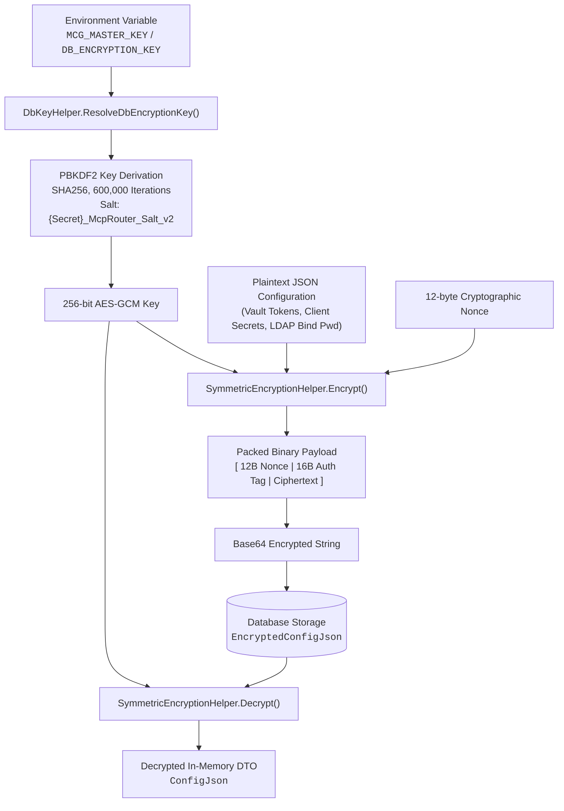
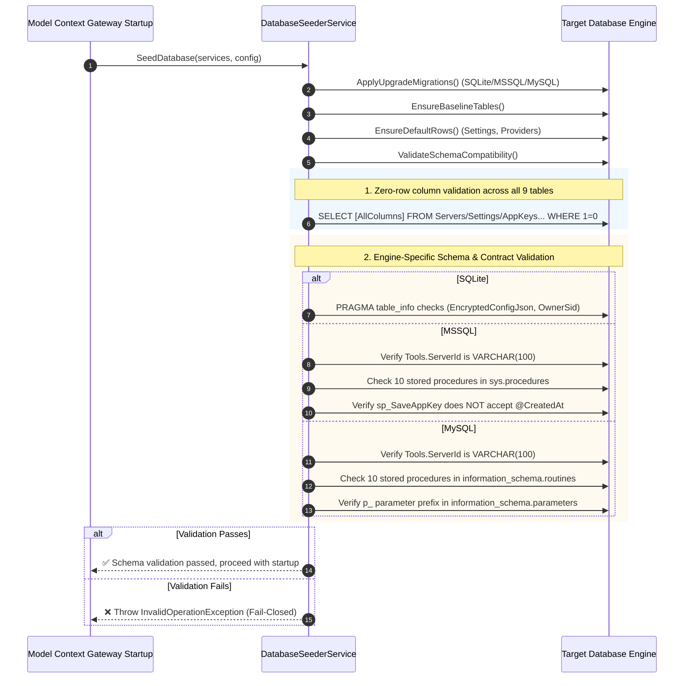

# Database Provider Support & Deployment Matrix

This document details the architectural specification, schema contracts, encryption model, and deployment configurations for database engines supported by the **Model Context Protocol (MCP) Router Gateway**.

---

## Database Engine Support Matrix

Model Context Gateway (MCG) employs **Dapper** with specialized dialect handlers and native ADO.NET providers to deliver high-throughput, low-latency persistence across embedded, enterprise on-premises, and cloud environments.

| Feature / Dimension | 🪶 SQLite (Default) | 🏢 Microsoft SQL Server | 🐬 MySQL / MariaDB |
| :--- | :--- | :--- | :--- |
| **Provider Identifier (`DB_PROVIDER`)** | `sqlite` | `mssql` | `mysql` |
| **Underlying ADO.NET Driver** | [`Microsoft.Data.Sqlite`](https://www.nuget.org/packages/Microsoft.Data.Sqlite) | [`Microsoft.Data.SqlClient`](https://www.nuget.org/packages/Microsoft.Data.SqlClient) | [`MySqlConnector`](https://www.nuget.org/packages/MySqlConnector) |
| **Target Versions** | 3.35+ (WAL Mode Enabled) | 2016, 2019, 2022, Azure SQL | MySQL 8.0+, MariaDB 10.5+ |
| **Execution Paradigm** | Direct SQL & In-Process DDL | T-SQL Stored Procedures (`sp_*`) | Stored Procedures (`sp_*`) |
| **Upsert Mechanism** | `ON CONFLICT(Id) DO UPDATE` | Stored Proc `IF EXISTS ... UPDATE` | `ON DUPLICATE KEY UPDATE` |
| **Parameter Prefix Convention** | Named parameters (`@Param`) | Named T-SQL parameters (`@Param`) | Strict `p_` prefix (`p_Param`) |
| **Timestamp Generation** | `CURRENT_TIMESTAMP` (UTC ISO-8601) | `SYSUTCDATETIME()` (DATETIME2) | `CURRENT_TIMESTAMP` / `NOW()` |
| **Schema Migration Mode** | Automatic in-process migrations | Scripted DDL (`scripts/db/mssql/`) | Scripted DDL (`scripts/db/mysql/`) |
| **Startup Validation** | Table, column & pragma checks | Table, column, FK & proc checks | Table, column, FK & proc checks |
| **Recommended Deployment** | Single-node homelab & edge agents | Corporate Windows/AD enterprise | Cloud-native, Linux & Kubernetes |

---

## Unified Database Entity-Relationship Diagram (ERD)

The following diagram models the complete schema architecture, primary keys (`PK`), unique keys (`UK`), foreign key constraints (`FK`), data types, and relational cardinality across all 12 core tables in Model Context Gateway (MCG) persistence tier. A dedicated standalone specification is available at [**Canonical Data Model & Database ERD**](data-model.md):

```mermaid
erDiagram
    Servers ||--o{ Tools : "exposes (FK: ServerId)"
    Servers ||--o{ AccessPolicies : "governed by (TargetId)"
    Servers ||--o{ AuditLogs : "generates (ServerCodeName)"
    Servers }o--o| SecretProviders : "resolves credentials (SecretProvider)"
    
    Tools ||--o{ ToolAccessPolicies : "governed by (FK: ToolId)"
    Tools ||--o{ AccessPolicies : "governed by (TargetId)"
    
    AdGroups ||--o{ ToolAccessPolicies : "assigned to (FK: GroupId)"
    AdGroups ||--o{ GroupMappings : "maps external groups (InternalGroup)"
    
    AppKeys ||--o{ AuditLogs : "attributed via (UserSid -> OwnerSid)"
    
    Servers {
        string Id PK "Server unique identifier (e.g. docker, plex)"
        string DisplayName "Human-readable server name"
        string Url "Endpoint URL or command string"
        boolean Enabled "Active/inactive operational state"
        boolean Hidden "Hidden from client discovery list"
        string Type "Transport type: sse, http, stdio"
        string SecretProvider "Provider: None, HashiCorpVault, WindowsRegistry, Environment"
        string SecretItemKey "Target secret key identifier"
        string SecretMount "Vault secret engine mount path"
        string SecretPath "Vault secret subpath or registry key"
        string SecretField "Vault secret JSON field key"
        string AuthShape "Authentication shape: bearer, customHeader, query"
        string CustomHeaderName "Custom HTTP header name if shape=customHeader"
        string Categories "JSON array of category tags"
        string ApiKey "Static API key (redacted in API)"
        string HeadersJson "JSON dictionary of custom HTTP headers"
        boolean AutoDiscovered "Flag indicating dynamic auto-discovery"
    }

    Settings {
        string Id PK "Global singleton configuration ID"
        string EmbeddingProvider "Embedding backend: local, openai, custom"
        string EmbeddingApiUrl "Embedding inference API endpoint"
        string EmbeddingApiKey "Encrypted embedding API key"
        string EmbeddingApiModel "Embedding model name"
        string EmbeddingModelDir "Filesystem directory for local ONNX model"
        string UserSecretStorage "Storage mode for user personal secrets"
        int GlobalMaxKeys "Maximum total active AppKeys allowed"
        int UserMaxKeys "Maximum active AppKeys allowed per user"
    }

    SecretProviders {
        int ProviderId PK "Provider integer surrogate key"
        string ProviderName UK "Unique provider identifier (e.g. HashiCorpVault)"
        string DisplayName "Human-readable provider name"
        string EncryptedConfigJson "AES-256-GCM encrypted provider configuration"
        boolean IsEnabled "Provider enabled state"
        datetime UpdatedAt "Timestamp of last modification"
    }

    AuthProviderConfigs {
        int AuthId PK "Auth provider surrogate key"
        string ProviderName UK "Unique identity provider identifier (e.g. ActiveDirectory)"
        string DisplayName "Human-readable identity provider name"
        string UserHeader "HTTP header for username (default: Remote-User)"
        string GroupsHeader "HTTP header for user groups (default: Remote-Groups)"
        string EncryptedConfigJson "AES-256-GCM encrypted provider settings"
        boolean IsEnabled "Identity provider enabled state"
        datetime UpdatedAt "Timestamp of last modification"
    }

    AdGroups {
        int GroupId PK "Group integer surrogate key"
        string ObjectSid UK "Active Directory Security Identifier (SID)"
        string GroupName "Active Directory / Enterprise group name"
        string Description "Group description and purpose"
        boolean IsActive "Group active state"
        datetime CreatedAt "Timestamp of creation"
    }

    Tools {
        int ToolId PK "Tool integer surrogate key"
        string ServerId FK "Foreign key referencing Servers.Id"
        string ToolName "MCP tool name (e.g. list_containers)"
        string Description "Tool description shown to LLMs"
        string InputSchemaJson "JSON Schema defining tool arguments"
        string VaultSecretPath "Optional tool-specific secret path"
        string SecretProvider "Tool-specific secret provider"
        boolean IsEnabled "Tool enabled state"
        datetime CreatedAt "Timestamp of tool discovery"
    }

    ToolAccessPolicies {
        int ToolPolicyId PK "Surrogate policy primary key"
        int ToolId FK "Foreign key referencing Tools.ToolId"
        int GroupId FK "Foreign key referencing AdGroups.GroupId"
        boolean IsAllowed "Allow (1) or Explicit Deny (0)"
        int RateLimitPerMin "Rate limit allocations per minute"
        datetime CreatedAt "Timestamp of policy creation"
    }

    AccessPolicies {
        string Id PK "Policy unique GUID identifier"
        string TargetId "Target server ID, category, or tool identifier"
        string RequiredGroup "AD group, SID, or role required for access"
        boolean IsAllowed "Allow (1) or Explicit Deny (0)"
        datetime CreatedAt "Timestamp of policy assignment"
    }

    GroupMappings {
        string Id PK "Mapping unique GUID identifier"
        string ExternalId "External group claim or SSO header value"
        string InternalGroup "Internal mapped router role / AD group"
        datetime CreatedAt "Timestamp of mapping creation"
    }

    AppKeys {
        string Id PK "AppKey unique GUID identifier"
        string Name "Friendly application/client name"
        string Username "Subject username associated with key"
        string KeyPrefix UK "High-entropy random key prefix"
        string EncryptedKey "Argon2id / PBKDF2 hash of secret key"
        string ScopesJson "JSON array of allowed scopes (*, category:*, server:*)"
        datetime ExpiresAt "Optional key expiration UTC timestamp"
        datetime CreatedAt "Timestamp of key creation"
        string OwnerSid "Target user SID (decoupled from admin creator)"
    }

    AuditLogs {
        bigint AuditId PK "Audit entry sequential identifier"
        string RequestId "Unique client request GUID"
        string UserPrincipalName "Caller username or identity"
        string UserSid "Caller Active Directory SID or AppKey OwnerSid"
        string ServerCodeName "Target MCP server code name"
        string ItemName "Target tool, prompt, or resource URI"
        string RequestMethod "MCP method: tools/call, prompts/get, etc."
        int ExecutionTimeMs "Total round-trip execution latency"
        int StatusCode "HTTP or JSON-RPC status code"
        string RequestPayload "Masked request payload"
        string ResponsePayload "Masked response payload"
        string ErrorMessage "Error message if invocation failed"
        datetime Timestamp "UTC timestamp of execution"
    }

    AdminAuditLogs {
        string Id PK "Admin audit GUID identifier"
        string Username "Administrator username"
        string Action "Administrative action performed"
        string Target "Target configuration entity"
        string Details "Detailed changes or audit payload"
        boolean Success "Action success status"
        string ErrorMessage "Error details if action failed"
        datetime Timestamp "UTC timestamp of administrative action"
    }

    OAuthClients {
        string ClientId PK "Client unique identifier"
        string ClientSecretHash "SHA-256 hash of client secret"
        string ClientName "Human-readable application name"
        string ClientType "Client type: confidential or public"
        string RedirectUrisJson "JSON array of allowed redirect URIs"
        string GrantTypesJson "JSON array of allowed grant types"
        string ScopesJson "JSON array of allowed OAuth scopes"
        string OwnerSid "Target user SID (empty for machine apps)"
        string CreatedBy "Creator username or dcr"
        datetime ExpiresAt "Optional client secret expiration UTC timestamp"
        datetime CreatedAt "Timestamp of client registration"
    }
```



---

## Dialect Specifications & Schema Contracts

### 1. SQLite Engine Dialect

SQLite is the zero-configuration embedded engine designed for single-node instances, developer workstations, and edge agent deployments.

#### Engine Characteristics & Concurrency
* **Embedded Storage**: Database resides in a single binary file on disk (default: `data/mcg.db`) or in-memory for ephemeral test runs (`Data Source=:memory:`).
* **Write-Ahead Logging (WAL)**: SQLite operates with Write-Ahead Logging to support concurrent read operations while writes execute, preventing database lock contention.
* **Type Handlers**: JSON arrays and complex collections (such as `Categories` and `ScopesJson`) are stored as serialized UTF-8 `TEXT` and mapped via custom Dapper `JsonListTypeHandler` instances.

#### In-Process Data-Preserving Upgrades (`DatabaseSeederService.cs`)
On startup, `DatabaseSeederService.ApplySqliteMigrations` inspects `sqlite_master` and SQLite table pragmas (`pragma_table_info`) to apply additive, non-destructive schema migrations automatically:
1. **Legacy Table Migration**: Automatically renames legacy `McpServers` tables to `Servers` while preserving all server configurations.
2. **Column Expansion**: Dynamically adds missing columns (`EncryptedConfigJson` on `SecretProviders` and `AuthProviderConfigs`, `OwnerSid` on `AppKeys`, vector embedding settings on `Settings`, and dynamic auth fields on `Servers`).
3. **Data Integrity**: Migrates legacy unencrypted `ConfigJson` payloads directly into `EncryptedConfigJson` without loss.

```sql
-- SQLite Upsert Contract Example (Servers)
INSERT INTO Servers (Id, DisplayName, Url, Enabled, Hidden, Type, SecretProvider, SecretItemKey, SecretMount, SecretPath, SecretField, AuthShape, CustomHeaderName, Categories, ApiKey, HeadersJson, AutoDiscovered)
VALUES (@Id, @DisplayName, @Url, @Enabled, @Hidden, @Type, @SecretProvider, @SecretItemKey, @SecretMount, @SecretPath, @SecretField, @AuthShape, @CustomHeaderName, @Categories, @ApiKey, @HeadersJson, @AutoDiscovered)
ON CONFLICT(Id) DO UPDATE SET
    DisplayName = @DisplayName, Url = @Url, Enabled = @Enabled, Hidden = @Hidden, Type = @Type,
    SecretProvider = @SecretProvider, SecretItemKey = @SecretItemKey, SecretMount = @SecretMount,
    SecretPath = @SecretPath, SecretField = @SecretField, AuthShape = @AuthShape,
    CustomHeaderName = @CustomHeaderName, Categories = @Categories, ApiKey = @ApiKey,
    HeadersJson = @HeadersJson, AutoDiscovered = @AutoDiscovered;
```

---

### 2. Microsoft SQL Server Engine Dialect

Microsoft SQL Server provides enterprise-grade reliability, strict security isolation, high availability (Always On availability groups), and centralized DBA management.

#### Schema Initialization & Migration Scripts
DDL scripts are located in `scripts/db/mssql/`:
* `01_tables.sql`: Tables, primary keys, nonclustered indexes (`UQ_AppKeys_KeyPrefix`), and foreign key constraints.
* `02_procedures.sql`: Complete suite of 10 T-SQL stored procedures.
* `migrations/`: Incremental upgrade scripts (`003_add_appkeys_ownersid.sql`, `004_align_runtime_persistence.sql`).

#### Complete Stored Procedure Suite
All persistence operations in MSSQL execute via pre-compiled stored procedures:

| Stored Procedure | Purpose | Key Parameters |
| :--- | :--- | :--- |
| `sp_EvaluateUserAccess` | Evaluates group authorization for tools, servers, prompts, and resources | `@GroupNames`, `@ItemName`, `@RequestMethod` |
| `sp_GetAllowedItemsForGroups` | Returns distinct allowed tools and secret paths for active user groups | `@GroupNames` |
| `sp_GetServerSecrets` | Fetches downstream secret paths and provider bindings for a server | `@ServerCodeName` |
| `sp_SaveSecretProvider` | Upserts secret provider configuration with encrypted credentials | `@ProviderName`, `@DisplayName`, `@EncryptedConfigJson`, `@IsEnabled` |
| `sp_SaveAuthProvider` | Upserts identity/auth provider configuration and header bindings | `@ProviderName`, `@DisplayName`, `@UserHeader`, `@GroupsHeader`, `@EncryptedConfigJson`, `@IsEnabled` |
| `sp_InsertAuditLog` | Records telemetry and sanitized payloads with UTC timestamps | `@RequestId`, `@UserPrincipalName`, `@UserSid`, `@ServerCodeName`, `@ItemName`, `@RequestMethod`, `@ExecutionTimeMs`, `@StatusCode`, `@RequestPayload`, `@ResponsePayload`, `@ErrorMessage` |
| `sp_SaveAppKey` | Upserts client application API keys with owner SID tracking | `@Id`, `@Name`, `@Username`, `@KeyPrefix`, `@EncryptedKey`, `@ScopesJson`, `@OwnerSid`, `@ExpiresAt` |
| `sp_DeleteAppKey` | Permanently revokes an application API key by ID | `@Id` |
| `sp_GetAppKeys` | Queries active API keys (filtered by username or all for admins) | `@Username` |
| `sp_SaveOAuthClient` | Upserts OAuth / DCR client application with hashed secret and metadata | `@ClientId`, `@ClientSecretHash`, `@ClientName`, `@ClientType`, `@RedirectUrisJson`, `@GrantTypesJson`, `@ScopesJson`, `@OwnerSid`, `@CreatedBy`, `@ExpiresAt` |
| `sp_GetOAuthClients` | Retrieves all registered OAuth client applications | *(None)* |
| `sp_GetOAuthClientById` | Retrieves a specific OAuth client by Client ID | `@ClientId` |
| `sp_DeleteOAuthClient` | Deletes a registered OAuth client application by Client ID | `@ClientId` |
| `sp_InsertAdminAuditLog` | Records administrative mutations (server additions, policy edits) | `@Id`, `@Username`, `@Action`, `@Target`, `@Details`, `@Success`, `@ErrorMessage` |

#### Parameter Mapping Contract (`sp_SaveAppKey` & `@CreatedAt`)
> [!IMPORTANT]
> **Strict Dapper Parameter Mapping Rule**: The `sp_SaveAppKey` stored procedure generates creation timestamps server-side using `SYSUTCDATETIME()`. It does **NOT** accept an `@CreatedAt` parameter. Dapper parameter objects must supply `@Id`, `@Name`, `@Username`, `@KeyPrefix`, `@EncryptedKey`, `@ScopesJson`, `@OwnerSid`, and `@ExpiresAt`. Passing `@CreatedAt` will fail schema compatibility validation.

```sql
-- MS SQL Server Stored Procedure Contract (sp_SaveAppKey)
CREATE OR ALTER PROCEDURE [dbo].[sp_SaveAppKey]
    @Id VARCHAR(100),
    @Name NVARCHAR(200),
    @Username NVARCHAR(256),
    @KeyPrefix VARCHAR(50),
    @EncryptedKey NVARCHAR(MAX),
    @ScopesJson NVARCHAR(MAX),
    @OwnerSid NVARCHAR(200) = '',
    @ExpiresAt DATETIME2 = NULL
AS
BEGIN
    SET NOCOUNT ON;
    IF EXISTS (SELECT 1 FROM [dbo].[AppKeys] WHERE [Id] = @Id)
    BEGIN
        UPDATE [dbo].[AppKeys]
        SET [Name] = @Name, [Username] = @Username, [OwnerSid] = @OwnerSid,
            [KeyPrefix] = @KeyPrefix, [EncryptedKey] = @EncryptedKey,
            [ScopesJson] = @ScopesJson, [ExpiresAt] = @ExpiresAt
        WHERE [Id] = @Id;
    END
    ELSE
    BEGIN
        INSERT INTO [dbo].[AppKeys] ([Id], [Name], [Username], [OwnerSid], [KeyPrefix], [EncryptedKey], [ScopesJson], [ExpiresAt], [CreatedAt])
        VALUES (@Id, @Name, @Username, @OwnerSid, @KeyPrefix, @EncryptedKey, @ScopesJson, @ExpiresAt, SYSUTCDATETIME());
    END
END;
```

---

### 3. MySQL / MariaDB Engine Dialect

MySQL and MariaDB support Linux-based infrastructure, cloud container platforms (Amazon ECS, EKS, Azure Container Apps), and managed database services (Amazon RDS, Google Cloud SQL, Azure Database for MySQL).

#### Schema Initialization & Migration Scripts
DDL scripts are located in `scripts/db/mysql/`:
* `01_tables.sql`: InnoDB tables with `utf8mb4` charset and foreign key cascades.
* `02_procedures.sql`: MySQL stored procedures using `DELIMITER //` definitions.
* `migrations/`: Incremental upgrade scripts (`003_add_appkeys_ownersid.sql`, `004_align_runtime_persistence.sql`).

#### Strict `p_` Parameter Binding Convention
> [!CAUTION]
> **MySQL Parameter Scoping**: In MySQL stored procedures, parameter names that match column names (e.g. `WHERE Username = Username`) resolve to column references, creating tautologies. To prevent variable shadowing and silent query bugs, **all MySQL stored procedure parameters MUST use the `p_` prefix** (e.g., `p_Id`, `p_Name`, `p_Username`, `p_KeyPrefix`, `p_EncryptedKey`, `p_ScopesJson`, `p_OwnerSid`, `p_ExpiresAt`).

In the C# repository layer ([`Repositories.cs`](https://github.com/spelech/model-context-gateway/blob/main/Infrastructure/Persistence/Repositories.cs)), MySQL procedure calls explicitly bind parameters with this prefix:

```csharp
// MySQL Dapper Parameter Invocation in Repositories.cs
await conn.ExecuteAsync(
    "sp_SaveAppKey",
    new
    {
        p_Id = key.Id,
        p_Name = key.Name,
        p_Username = key.Username,
        p_KeyPrefix = key.KeyPrefix,
        p_EncryptedKey = key.EncryptedKey,
        p_ScopesJson = key.ScopesJson,
        p_OwnerSid = key.OwnerSid ?? "",
        p_ExpiresAt = key.ExpiresAt
    },
    commandType: CommandType.StoredProcedure
);
```

```sql
-- MySQL Stored Procedure Contract (sp_SaveAppKey)
DELIMITER //
DROP PROCEDURE IF EXISTS `sp_SaveAppKey` //
CREATE PROCEDURE `sp_SaveAppKey`(
    IN p_Id VARCHAR(100),
    IN p_Name VARCHAR(200),
    IN p_Username VARCHAR(256),
    IN p_KeyPrefix VARCHAR(50),
    IN p_EncryptedKey LONGTEXT,
    IN p_ScopesJson LONGTEXT,
    IN p_OwnerSid VARCHAR(200),
    IN p_ExpiresAt DATETIME
)
BEGIN
    INSERT INTO `AppKeys` (`Id`, `Name`, `Username`, `OwnerSid`, `KeyPrefix`, `EncryptedKey`, `ScopesJson`, `ExpiresAt`, `CreatedAt`)
    VALUES (p_Id, p_Name, p_Username, IFNULL(p_OwnerSid, ''), p_KeyPrefix, p_EncryptedKey, p_ScopesJson, p_ExpiresAt, NOW())
    ON DUPLICATE KEY UPDATE
        `Name` = p_Name,
        `Username` = p_Username,
        `OwnerSid` = IFNULL(p_OwnerSid, ''),
        `KeyPrefix` = p_KeyPrefix,
        `EncryptedKey` = p_EncryptedKey,
        `ScopesJson` = p_ScopesJson,
        `ExpiresAt` = p_ExpiresAt;
END //
DELIMITER ;
```

---

## Database Encryption & Secrets Architecture

Model Context Gateway (MCG) implements authenticated envelope encryption for all sensitive secrets, tokens, and third-party configuration payloads persisted in the database.



### 1. Key Resolution (`DbKeyHelper.cs`)
Encryption keys are resolved during bootstrap via [`DbKeyHelper.ResolveDbEncryptionKey(configuration)`](https://github.com/spelech/model-context-gateway/blob/main/Infrastructure/Secrets/DbKeyHelper.cs):
1. **Lookup Hierarchy**: Inspects `MCG_MASTER_KEY` first, falling back to `DB_ENCRYPTION_KEY`.
2. **Fail-Closed Security**: If both keys are missing or blank, startup terminates with a fatal `InvalidOperationException`. Self-generating ephemeral fallback keys is strictly disabled in production to prevent silent data loss upon container restart.
3. **Thread-Safe Caching**: Key resolution uses double-checked locking to cache the resolved string in memory, minimizing configuration lookups.

### 2. Symmetric Encryption Engine (`SymmetricEncryptionHelper.cs`)
* **Data Loss Prevention**: If decryption fails (e.g., due to key loss or corruption), the system tracks this state (`IsDecryptionFailed`) to prevent the frontend or API from accidentally overwriting the encrypted ciphertext with an empty string during generic configuration updates.
* **Key Derivation**: Derives a 256-bit symmetric encryption key using `Rfc2898DeriveBytes.Pbkdf2` with **SHA-256**, **600,000 iterations**, and a domain-isolated salt (`{secretString}_McpRouter_Salt_v2`).
* **Authenticated Encryption**: Uses **AES-256-GCM** (`System.Security.Cryptography.AesGcm`) providing confidentiality, integrity, and authenticity.
* **Payload Structure**: Packed binary payload containing `[ 12-byte Nonce | 16-byte Auth Tag | N-byte Ciphertext ]`, encoded as Base64.
* **Transparent Decryption & Key Fallback**: If decryption with the primary master key encounters an authentication tag mismatch, the engine automatically attempts fallback decryption using the legacy `DB_ENCRYPTION_KEY` before failing gracefully.

### 3. Protected Columns (`EncryptedConfigJson`)
Sensitive provider settings are stored in dedicated encrypted columns:
* `SecretProviders.EncryptedConfigJson`: Stores HashiCorp Vault access tokens, namespace headers, and registry paths.
* `AuthProviderConfigs.EncryptedConfigJson`: Stores Active Directory service account passwords, OIDC client secrets, and token endpoint credentials.
* **Automatic Decryption on Read**: Data repositories automatically decrypt `EncryptedConfigJson` when populating `SecretProviderDto.ConfigJson` and `AuthProviderDto.ConfigJson`, ensuring application code operates on clean in-memory representations.

---

## Startup Schema Validation & Fail-Closed Integrity Checks

To prevent runtime data corruption or silent failures caused by misconfigured schemas, the gateway executes a comprehensive validation pass on every startup ([`DatabaseSeederService.ValidateSchemaCompatibility`](https://github.com/spelech/model-context-gateway/blob/main/Infrastructure/Persistence/DatabaseSeederService.cs)):



### Fail-Closed Error Handling
If any column, stored procedure, data type, or parameter convention is missing or invalid:
1. The gateway writes a `Critical` log entry detailing the exact failure and required migration script.
2. An `InvalidOperationException` is thrown, halting server startup immediately.
3. Traffic is not accepted until the underlying database schema is brought into full compliance.

---

## Deployment & Configuration Matrix

### 1. SQLite Deployment (Default / Embedded)

#### Connection String Format
```ini
ConnectionStrings__DefaultConnection=Data Source=/app/data/mcg.db;
```

#### Docker Compose Template (`docker-compose.sqlite.yml`)
```yaml
version: '3.8'

services:
  mcg:
    image: ghcr.io/spelech/model-context-gateway:latest
    container_name: mcg-sqlite
    restart: unless-stopped
    ports:
      - "8080:8080"
    environment:
      - ASPNETCORE_ENVIRONMENT=Production
      - DB_PROVIDER=sqlite
      - ConnectionStrings__DefaultConnection=Data Source=/app/data/mcg.db;
      - MCG_MASTER_KEY=base64_256bit_master_key_here_must_be_configured_at_rest==
      - CORS_ALLOWED_ORIGINS=https://mcp.yourdomain.com
      - Oidc__TrustedProxies=10.0.0.10,127.0.0.1
    volumes:
      - mcg_sqlite_data:/app/data
      - ./certs/oauth_signing.pfx:/app/certs/oauth_signing.pfx:ro
    healthcheck:
      test: ["CMD", "curl", "-f", "http://localhost:8080/health"]
      interval: 10s
      timeout: 5s
      retries: 3

volumes:
  mcg_sqlite_data:
    driver: local
```

---

### 2. Microsoft SQL Server Deployment (Enterprise)

#### Connection String Formats
```ini
# Standard SQL Authentication with TLS Encryption
ConnectionStrings__DefaultConnection=Server=tcp:sqlserver.internal,1433;Database=McpEnterpriseDb;User ID=mcp_app;Password=YourComplexPassword123!;Encrypt=True;TrustServerCertificate=False;

# Self-Signed Certificate / Internal Test Cluster
ConnectionStrings__DefaultConnection=Server=tcp:sqlserver.internal,1433;Database=McpEnterpriseDb;User ID=sa;Password=YourComplexPassword123!;TrustServerCertificate=True;
```

#### Schema Initialization Command
Execute the initialization scripts against your MSSQL instance prior to launching the router:
```bash
# 1. Initialize Tables & Baseline Indexes
sqlcmd -S sqlserver.internal -U sa -P "YourComplexPassword123!" -i scripts/db/mssql/01_tables.sql

# 2. Deploy Stored Procedures Suite
sqlcmd -S sqlserver.internal -U sa -P "YourComplexPassword123!" -i scripts/db/mssql/02_procedures.sql
```

#### Docker Compose Template (`docker-compose.mssql.yml`)
```yaml
version: '3.8'

services:
  sqlserver:
    image: mcr.microsoft.com/mssql/server:2022-latest
    container_name: mcp-sqlserver
    restart: unless-stopped
    environment:
      - ACCEPT_EULA=Y
      - MSSQL_SA_PASSWORD=YourComplexPassword123!
      - MSSQL_PID=Developer
    ports:
      - "1433:1433"
    volumes:
      - mssql_data:/var/opt/mssql
    healthcheck:
      test: ["CMD-SHELL", "/opt/mssql-tools18/bin/sqlcmd -S localhost -U sa -P 'YourComplexPassword123!' -C -Q 'SELECT 1' || exit 1"]
      interval: 10s
      timeout: 5s
      retries: 5

  mcg:
    image: ghcr.io/spelech/model-context-gateway:latest
    container_name: mcg-mssql
    restart: unless-stopped
    depends_on:
      sqlserver:
        condition: service_healthy
    ports:
      - "8080:8080"
    environment:
      - ASPNETCORE_ENVIRONMENT=Production
      - DB_PROVIDER=mssql
      - ConnectionStrings__DefaultConnection=Server=tcp:sqlserver,1433;Database=McpEnterpriseDb;User ID=sa;Password=YourComplexPassword123!;TrustServerCertificate=True;
      - MCG_MASTER_KEY=base64_256bit_master_key_here_must_be_configured_at_rest==
      - CORS_ALLOWED_ORIGINS=https://mcp.yourdomain.com
      - Oidc__TrustedProxies=10.0.0.10,127.0.0.1
    volumes:
      - ./certs/oauth_signing.pfx:/app/certs/oauth_signing.pfx:ro
    healthcheck:
      test: ["CMD", "curl", "-f", "http://localhost:8080/health"]
      interval: 10s
      timeout: 5s
      retries: 3

volumes:
  mssql_data:
    driver: local
```

---

### 3. MySQL / MariaDB Deployment (Cloud / Linux Stack)

#### Connection String Format
```ini
ConnectionStrings__DefaultConnection=Server=mysql.internal;Port=3306;Database=McpEnterpriseDb;Uid=mcp_app;Pwd=YourComplexPassword123!;AllowUserVariables=True;
```

#### Schema Initialization Command
Execute the initialization scripts against your MySQL / MariaDB instance:
```bash
# 1. Initialize Tables & Baseline Indexes
mysql -h mysql.internal -u root -p"YourComplexPassword123!" < scripts/db/mysql/01_tables.sql

# 2. Deploy Stored Procedures Suite
mysql -h mysql.internal -u root -p"YourComplexPassword123!" < scripts/db/mysql/02_procedures.sql
```

#### Docker Compose Template (`docker-compose.mysql.yml`)
```yaml
version: '3.8'

services:
  mysql:
    image: mysql:8.4
    container_name: mcp-mysql
    restart: unless-stopped
    command: --default-authentication-plugin=mysql_native_password
    environment:
      - MYSQL_ROOT_PASSWORD=YourComplexPassword123!
      - MYSQL_DATABASE=McpEnterpriseDb
      - MYSQL_USER=mcp_app
      - MYSQL_PASSWORD=YourComplexPassword123!
    ports:
      - "3306:3306"
    volumes:
      - mysql_data:/var/lib/mysql
      - ./scripts/db/mysql/01_tables.sql:/docker-entrypoint-initdb.d/01_tables.sql:ro
      - ./scripts/db/mysql/02_procedures.sql:/docker-entrypoint-initdb.d/02_procedures.sql:ro
    healthcheck:
      test: ["CMD", "mysqladmin", "ping", "-h", "localhost", "-u", "root", "-pYourComplexPassword123!"]
      interval: 10s
      timeout: 5s
      retries: 5

  mcg:
    image: ghcr.io/spelech/model-context-gateway:latest
    container_name: mcg-mysql
    restart: unless-stopped
    depends_on:
      mysql:
        condition: service_healthy
    ports:
      - "8080:8080"
    environment:
      - ASPNETCORE_ENVIRONMENT=Production
      - DB_PROVIDER=mysql
      - ConnectionStrings__DefaultConnection=Server=mysql;Port=3306;Database=McpEnterpriseDb;Uid=mcp_app;Pwd=YourComplexPassword123!;AllowUserVariables=True;
      - MCG_MASTER_KEY=base64_256bit_master_key_here_must_be_configured_at_rest==
      - CORS_ALLOWED_ORIGINS=https://mcp.yourdomain.com
      - Oidc__TrustedProxies=10.0.0.10,127.0.0.1
    volumes:
      - ./certs/oauth_signing.pfx:/app/certs/oauth_signing.pfx:ro
    healthcheck:
      test: ["CMD", "curl", "-f", "http://localhost:8080/health"]
      interval: 10s
      timeout: 5s
      retries: 3

volumes:
  mysql_data:
    driver: local
```

---

## Related Documentation & References

* [Production Deployment & Database Migration Guide](deployment-guide.md)
* [System Architecture & Dependency Injection](architecture.md)
* [Pairwise Testing Matrix & Integration Suites](testing-matrix.md)
* [Pluggable Secret Providers & Server Management](user-guide/02-server-management-and-secrets.md)
* [Features & Connection Guidelines](features-guide.md)
