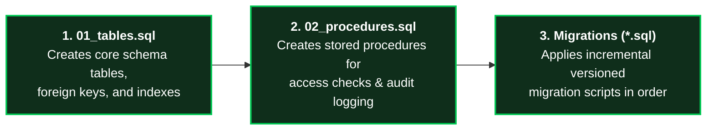
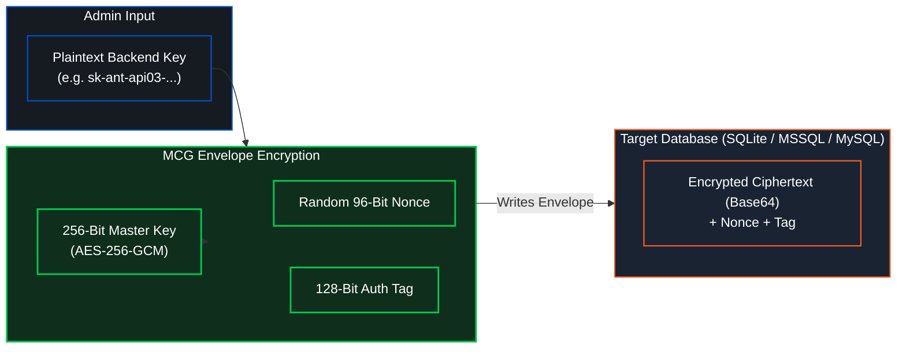

# Multi-Provider Database Setup & Migration Guide


Model Context Gateway (MCG) features a high-performance, vendor-agnostic persistence layer built with Dapper and ADO.NET. It supports **SQLite** (embedded default), **Microsoft SQL Server**, and **MySQL / MariaDB** with uniform schema semantics and AES-256-GCM envelope encryption.

This guide details multi-provider setup, script execution sequences, versioned database migrations, and operational backup runbooks.

---

## 🏗️ Supported Database Providers Overview

| Database Provider | Configuration Value (`DB_PROVIDER`) | Recommended Workload | Connection String Template | Migration Handling |
| :--- | :--- | :--- | :--- | :--- |
| **SQLite (Default)** | `sqlite` | Single-node production, Docker, Home-Lab, Development | `Data Source=/app/data/mcg.db;` | Automatic self-migrating via Dapper on gateway startup. |
| **Microsoft SQL Server** | `mssql` | Enterprise clusters, Windows Server, High Availability | `Server=sql.corp;Database=McpGatewayDb;Integrated Security=True;TrustServerCertificate=True;` | Initialized via scripts (`01_tables.sql`, `02_procedures.sql`), versioned SQL migrations. |
| **MySQL / MariaDB** | `mysql` | Linux cloud clusters, distributed Docker / Kubernetes | `Server=db.internal;Database=McpEnterpriseDb;Uid=mcg;Pwd=Secret123!;` | Initialized via scripts, versioned SQL migrations. |

---

## ⚡ SQLite (Default Out-of-the-Box Provider)

SQLite requires **zero manual database configuration or script execution**. 

When `DB_PROVIDER=sqlite` (or when omitted), the gateway automatically:
1. Creates the SQLite file at `./data/mcg.db` (or the configured connection string path).
2. Runs Dapper schema initialization to create all required tables, foreign keys, and indexes.
3. Configures Write-Ahead Logging (`WAL`) mode for concurrent reads and writes.
4. Seeds default administration records, standalone network rules, and encryption settings.

```bash
# Example SQLite connection string:
ConnectionStrings__DefaultConnection="Data Source=/data/mcg.db;Mode=ReadWriteCreate;Cache=Shared;"
```

---

## 🏢 Enterprise Database Setup (SQL Server & MySQL)

For enterprise clusters where multiple gateway instances share state, configure Microsoft SQL Server or MySQL.

### Mandatory Schema Script Execution Sequence

Database initialization scripts are organized under `scripts/db/`:
- **Microsoft SQL Server**: `scripts/db/mssql/`
- **MySQL / MariaDB**: `scripts/db/mysql/`

When initializing a new enterprise database, you **MUST** run scripts in this exact numerical order:



#### Step 1: Execute `01_tables.sql`
Creates the baseline database schema, primary keys, indexes, and constraints:
- `Servers`: MCP server endpoints, transports, routing categories, and encrypted credentials.
- `Settings`: Key-value gateway configuration parameters.
- `AppKeys`: Client and admin API keys, hashed tokens, owners, and permissions.
- `AccessPolicies`: Granular RBAC and tool visibility rules.
- `GroupMappings`: Role-mapping definitions between external identity groups and internal roles.
- `SecretProviders`: Registry of configured secret backends (Vault, Registry, Database, Env).
- `AuthProviderConfigs`: Identity Provider configurations (OIDC, Active Directory, PocketID).
- `AuditLogs`: Complete tamper-evident audit history of tool executions and administrative actions.

#### Step 2: Execute `02_procedures.sql`
Creates optimized stored procedures for transactional access checks, audit records, and just-in-time (JIT) credential decryption:
- `sp_SaveAppKey` / `sp_GetAppKeys`: High-performance key management and lookup.
- `sp_SaveAuditLog` / `sp_GetAuditLogs`: High-throughput asynchronous audit logging.
- `sp_SaveServer` / `sp_GetServers`: Server inventory and routing rule management.

---

### Microsoft SQL Server Execution Commands

Run initialization scripts using `sqlcmd` from an administrator terminal:

```bash
# 1. Create Tables
sqlcmd -S localhost -d McpGatewayDb -U sa -P "Password123!" -i scripts/db/mssql/01_tables.sql

# 2. Create Stored Procedures
sqlcmd -S localhost -d McpGatewayDb -U sa -P "Password123!" -i scripts/db/mssql/02_procedures.sql
```

*For Windows Integrated Security (Windows Authentication):*
```powershell
sqlcmd -S "sql.domain.local" -d "McpGatewayDb" -E -i scripts\db\mssql\01_tables.sql
sqlcmd -S "sql.domain.local" -d "McpGatewayDb" -E -i scripts\db\mssql\02_procedures.sql
```

### MySQL / MariaDB Execution Commands

Run initialization scripts using the standard `mysql` CLI:

```bash
# 1. Create Tables
mysql -h localhost -u mcg_admin -p McpEnterpriseDb < scripts/db/mysql/01_tables.sql

# 2. Create Stored Procedures
mysql -h localhost -u mcg_admin -p McpEnterpriseDb < scripts/db/mysql/02_procedures.sql
```

---

## 🔄 Upgrading Existing Databases (Versioned Migrations)

When updating Model Context Gateway across versions, apply incremental migration scripts in numerical sequence.

### Versioned Migration Catalog

Migration scripts are located under:
- `scripts/db/mssql/migrations/`
- `scripts/db/mysql/migrations/`

#### Migration Example: `003_add_appkeys_ownersid.sql`
This migration adds the `OwnerSid` column to the `AppKeys` table to support owner-specific AppKey tracking and updates the stored procedures `sp_SaveAppKey` and `sp_GetAppKeys`.

#### Applying Migrations:

**Microsoft SQL Server:**
```bash
sqlcmd -S localhost -d McpGatewayDb -U sa -P "Password123!" -i scripts/db/mssql/migrations/003_add_appkeys_ownersid.sql
```

**MySQL / MariaDB:**
```bash
mysql -h localhost -u mcg_admin -p McpEnterpriseDb < scripts/db/mysql/migrations/003_add_appkeys_ownersid.sql
```

---

## 🔒 Envelope Encryption Across Database Providers

Regardless of whether SQLite, SQL Server, or MySQL is used, backend server credentials (API keys, bearer tokens, passwords) are **NEVER stored in plaintext**.



- Each credential is encrypted using **AES-256-GCM** with a unique random 96-bit Initialization Vector (IV/nonce) and a 128-bit authentication tag.
- The master key is resolved from HashiCorp Vault, DPAPI, environment variables, or `./data/.master.key`.
- Even if an attacker gains read access to the database tables or backups, credentials cannot be decrypted without the master key.

---

## 💾 Database Backup and Recovery Runbooks

### 1. SQLite Online Backup (Zero-Downtime)
To safely backup SQLite without locking active transactions:
```bash
# Linux / Docker:
sqlite3 /app/data/mcg.db ".backup '/backups/mcg-backup-$(date +%Y%m%d%H%M%S).db'"

# Windows PowerShell:
sqlite3 "C:\inetpub\mcg\mcg.db" ".backup 'C:\backups\mcg-backup.db'"
```

### 2. Microsoft SQL Server Full Backup
```sql
BACKUP DATABASE [McpGatewayDb]
TO DISK = N'C:\backups\McpGatewayDb_Full.bak'
WITH FORMAT, INIT, COMPRESSION, STATS = 10;
```

### 3. MySQL Full Dump
```bash
mysqldump -h localhost -u mcg_admin -p --single-transaction --routines McpEnterpriseDb > /backups/mcg_backup.sql
```

> [!NOTE]
> **Continuous Verification**: The automated test suite includes dedicated schema verification tests executing against SQLite, SQL Server, and MySQL, validating that all stored procedures, table constraints, and Dapper queries maintain zero-drift compliance across releases.
