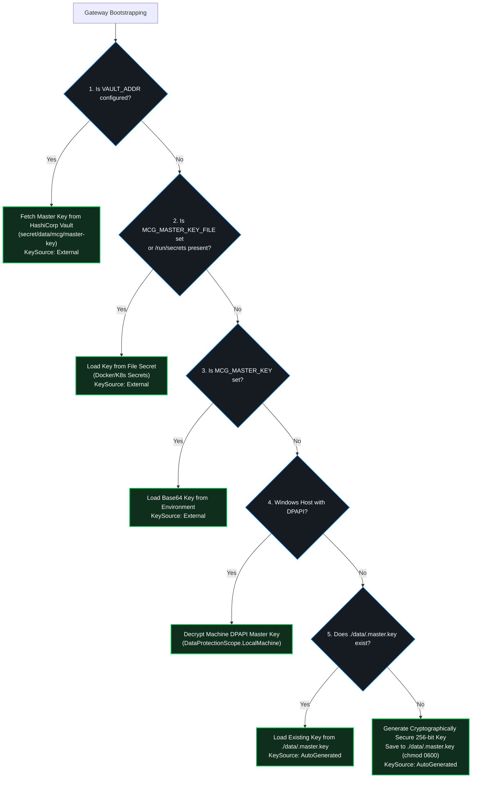

# Deployment & Hosting Architecture Overview


Model Context Gateway (MCG) routes, aggregates, and protects traffic for the Model Context Protocol (MCP). It is engineered as a high-performance C# ASP.NET Core gateway that proxies requests from clients (IDEs, LLMs, AI agents, and web applications) to multiple backend MCP servers.

This section provides an architectural topology overview, zero-configuration defaults, master key resolution mechanics, and hosting options across Linux containers, Windows Server environments, and local home-labs.

---

## 🏛️ Executive Architectural Topology

The gateway acts as an intelligent intermediary between upstream AI client interfaces and downstream MCP tool providers, running natively on Linux containers, Windows Server (IIS / Windows Service), or standalone developer workstations.

```mermaid
flowchart TD
    subgraph Clients["Upstream LLM Clients & Developer Tools"]
        IDE["Visual Studio / VS Code / Cursor / Windsurf"]
        LLM["AI Agents / Claude Desktop / Antigravity / Cline"]
        WebBrowser["Admin Web Dashboard UI / Browser"]
    end

    subgraph IngressTier["Ingress & Hosting Layer"]
        HttpSys["IIS In-Process ANCM / HTTP.sys (Windows Server)"]
        DockerIngress["Reverse Proxy (Nginx / Caddy / Traefik)"]
        KestrelDirect["Kestrel Standalone Listener (:8080)"]
    end

    subgraph CoreEngine["Model Context Gateway ASP.NET Core Engine (.NET 10)"]
        AuthPipeline["Authentication & Identity Pipeline\n(Active Directory / OIDC / Standalone LAN / AppKeys)"]
        SecretEngine["Secret Provider Subsystem\n(SQLite AES-GCM / DPAPI / HashiCorp Vault / Env)"]
        RoutingEngine["ToolRoutingManager\n(Meta-Mode Routing & Semantic Vector Search)"]
        TransportTier["Downstream Transports Tier\n(SSE, Streamable HTTP, STDIO Subprocess)"]
    end

    subgraph WindowsSubsystems["Native Enterprise Subsystems"]
        AD["Active Directory (Kerberos / NTLM / SIDs / S-1-5-32-544)"]
        Registry["Windows Registry (HKLM:\\SOFTWARE\\McpRouter\\Secrets)"]
        DPAPI["DPAPI ProtectedData (LocalMachine Scope)"]
        SCM["Service Control Manager (Auto-Restart Recovery)"]
    end

    subgraph Backends["Downstream MCP Tool Fleet"]
        StdioProc["Subprocess STDIO\n(.exe, .cmd, node.exe, python.exe, uvx)"]
        HttpServer["Remote HTTP / SSE MCP Servers"]
        DockerContainers["Docker Socket Discovered Containers\n(mcp.enabled=true)"]
    end

    Clients -->|HTTP / SSE Streaming| IngressTier
    IngressTier --> CoreEngine

    AuthPipeline <-->|Extract SIDs & Auth| AD
    SecretEngine <-->|Read Encrypted REG_BINARY| Registry
    SecretEngine <-->|Decrypt Machine Keys| DPAPI

    TransportTier -->|ProcessStartInfo (Injected Env Vars)| StdioProc
    TransportTier -->|Streamable HTTP / SSE| HttpServer
    TransportTier -->|TCP Named Pipes / Sockets| DockerContainers

    classDef clientStyle fill:#161b22,stroke:#0052cc,stroke-width:1.5px,color:#fff;
    classDef ingressStyle fill:#1a2332,stroke:#0078d6,stroke-width:1.5px,color:#fff;
    classDef coreStyle fill:#0f2e1b,stroke:#00c853,stroke-width:2px,color:#fff;
    classDef backStyle fill:#161b22,stroke:#30363d,stroke-width:1px,color:#e6edf3;
    class IDE,LLM,WebBrowser clientStyle;
    class HttpSys,DockerIngress,KestrelDirect ingressStyle;
    class CoreEngine coreStyle;
    class StdioProc,HttpServer,DockerContainers backStyle;
```

---

## ⚖️ Hosting Options Comparison Matrix

MCG supports four primary hosting environments tailored to different infrastructure requirements:

| Feature & Capability | Linux Container (Docker) | Windows IIS In-Process | Windows Service (SCM) | Standalone Kestrel Console |
| :--- | :--- | :--- | :--- | :--- |
| **Primary Use Case** | Cloud, Kubernetes, Homelab Docker Compose | Enterprise Windows Server, shared web infrastructure | Dedicated Windows application servers, background daemons | Local developer testing, debugging, CI pipelines |
| **Hosting Model** | Containerized Kestrel behind optional reverse proxy | In-Process inside `w3wp.exe` via `AspNetCoreModuleV2` | Standalone executable managed by Windows SCM | Direct `dotnet run` or interactive binary |
| **Throughput & Latency** | High (native Linux network stack) | **Fastest** (direct in-memory execution in IIS worker process) | High (direct Kestrel HTTP pipeline) | High (development pipeline) |
| **Port Sharing & Bindings** | Container port mapping (e.g. `8080:8080`) | Full HTTP.sys port sharing (ports 80, 443, multiple hosts) | Dedicated port binding (e.g. `http://0.0.0.0:8080`) | Dedicated port binding (e.g. `http://localhost:5000`) |
| **SSL/TLS Termination** | Upstream Reverse Proxy (Caddy/Traefik) or Kestrel | Windows Certificate Store, SNI, win-acme Let's Encrypt | Kestrel certificate binding or upstream reverse proxy | Developer certificates or HTTP only |
| **SSE Streaming Settings** | Native (zero buffering) | Supported with `responseBufferLimit="0"` in `web.config` | Native (zero buffering) | Native |
| **Automatic Crash Recovery** | Docker `restart: unless-stopped` / K8s restart | IIS Application Pool restart & health monitoring | SCM failure restart triggers (`sc.exe failure`) | Manual restart or console loop |
| **Integrated Authentication** | Reverse proxy headers (OIDC/SAML) with `Oidc:TrustedProxies` | Native IIS Negotiate, Kerberos, and NTLM modules | Kestrel Negotiate or header authentication | Negotiate or Anonymous |
| **Automated Deployment** | Docker Compose recipes | [`Deploy-IIS.ps1`](https://github.com/spelech/model-context-gateway/blob/main/scripts/windows/Deploy-IIS.ps1) | [`Setup-WindowsService.ps1`](https://github.com/spelech/model-context-gateway/blob/main/scripts/windows/Setup-WindowsService.ps1) | CLI / PowerShell |

---

## ⚡ Minimal Blank-Slate Startup (Zero-Config Safe Defaults)

You can launch Model Context Gateway with **zero environment variables** or with secure Docker and Kubernetes file secrets. When launched without prior configuration, the gateway automatically applies robust, secure out-of-the-box defaults:

| Subsystem | Automatic Safe Default |
| :--- | :--- |
| **Database** | • Defaults to `DB_PROVIDER=sqlite`.<br>• Automatically creates `./data/mcg.db`.<br>• Executes schema migrations via Dapper and seeds default tables (`Servers`, `Settings`, `AppKeys`, `AccessPolicies`, `GroupMappings`, `SecretProviders`, `AuthProviderConfigs`, `AuditLogs`).<br>• Sets external auth providers (Active Directory, HeaderAuth, PocketID) and external secret providers (Vault, WindowsRegistry) to **`IsEnabled = 0` (Disabled)** for standalone operation. |
| **Secret Storage** | • Uses the **Built-in Database Secret Provider** with AES-256-GCM envelope encryption.<br>• Encrypts all backend server credentials in SQLite using the resolved master key (`./data/.master.key`). You do not need external HashiCorp Vault or DPAPI instances. |
| **Authentication** | • Detects that no external Identity Provider (LDAP or OIDC forward-auth) is active.<br>• Automatically activates **Standalone Mode**.<br>• Treats local loopback (`127.0.0.1`, `::1`) and configured subnets (`STANDALONE_ALLOWED_NETWORKS`) as `Administrator` users for Web UI access without requiring an SSO login. |
| **Admin & Client AppKeys** | • Generates an Admin Application Key (`./data/.admin.key` with prefix `mcp-adm-`) and a default Client AppKey (`./data/.client.key` with prefix `mcp-glb-`).<br>• Supports multi-key seeding with scoped permissions through `MCG_CLIENT_APP_KEYS`.<br>• Lets remote AI coding assistants (such as Claude, Cursor, Cline, and Windsurf) connect immediately without manual setup. |
| **Docker Discovery** | • If you mount `-v /var/run/docker.sock:/var/run/docker.sock`, background discovery registers containers labeled with `mcp.enabled=true`. |

---

## 🔐 Master Encryption Key Resolution Hierarchy

Model Context Gateway protects backend server secrets at rest using AES-256-GCM envelope encryption. The gateway resolves its 256-bit Master Encryption Key using the following ordered hierarchy:



1. **HashiCorp Vault Key Bootstrapping (`KeySource.External`)**:
   In multi-node cluster deployments configured with `VAULT_ADDR`, the gateway pulls its master key from Vault (`secret/data/mcg/master-key` or `secret/data/mcp-router/master-key`).
2. **Docker or Kubernetes File Secret (`MCG_MASTER_KEY_FILE` - `KeySource.External`)**:
   Point `MCG_MASTER_KEY_FILE` to a mounted secret file (e.g., `MCG_MASTER_KEY_FILE=/run/secrets/mcg_master_key`). The gateway also inspects default Docker secret mount locations (`/run/secrets/mcg_master_key`, `/run/secrets/master_key`).
3. **Explicit Environment Variable (`MCG_MASTER_KEY` - `KeySource.External`)**:
   Provide a 256-bit base64-encoded key directly through `MCG_MASTER_KEY=<base64-key>`.
4. **Windows DPAPI (IIS / Windows Service)**:
   When hosted natively on Windows Server, the gateway can leverage the Windows Data Protection API (DPAPI) machine keys (`DataProtectionScope.LocalMachine`), eliminating manual key files.
5. **Auto-Generated Persistent Keyfile (`./data/.master.key` - `KeySource.AutoGenerated`)** *(Default)*:
   If no key is supplied upon first launch, the gateway generates a cryptographically random 256-bit key, writes it to `./data/.master.key` with restricted permissions (`chmod 0600`), and logs a startup notice. Mounting `./data` keeps this key persistent across container recreations.

> [!TIP]
> **Dynamic Database Re-Encryption**: If you initially start with an auto-generated key, you can promote a permanent enterprise Master Key later. Administrators can configure this key via the Web Dashboard or Admin MCP Server without service downtime.

---

## 🌐 Immediate Live Endpoints

Once started, the gateway immediately exposes these core endpoints:

| Endpoint | Protocol | Description |
| :--- | :--- | :--- |
| **`GET /`** | HTTP / HTML | Main Glassmorphic Web Dashboard UI for administration and monitoring. |
| **`GET /health`** | HTTP / JSON | Structured liveness and health probe (`{"status":"healthy","service":"ModelContextGateway","version":"5.11.0"}`). |
| **`GET /sse`** | HTTP / SSE | **Meta-Mode MCP Gateway**: Exposes intelligent `search_tools` and `execute_tool` router endpoints. |
| **`POST /message`** | HTTP / JSON | Client-to-server JSON-RPC message ingestion endpoint for SSE sessions. |
| **`GET /admin/sse`** | HTTP / SSE | **Admin MCP Server**: Administrative tool interface for AI coding assistants (`manage_servers`, `manage_appkeys`, etc.). |
| **`POST /admin`** | HTTP / JSON-RPC | Direct single-request JSON-RPC invocation endpoint for admin automation. |
| **`GET /metrics`** | HTTP / Plaintext | Prometheus metrics endpoint for active sessions, tool call throughput, and latency histograms. |

---

## 🧩 Deployment & Authentication Support Matrix Summary

Model Context Gateway unifies diverse authentication models across enterprise and container topologies.

| Hosting Environment | Identity / Auth Mechanism | AppKey Support | Downstream Identity Delegation | Notes and Limitations |
| :--- | :--- | :---: | :--- | :--- |
| **Linux Container (Docker)** | **Reverse Proxy Headers** (OIDC, SAML) | ✅ Supported | **OAuth2 On-Behalf-Of JWT** or **Header Propagation** (`X-Forwarded-User`) | Requires configuring `Oidc:TrustedProxies`. Linux containers do not support Kerberos or NTLM impersonation (`S4U2Proxy`). |
| **Windows Native (IIS)** | **Active Directory (AD) / Windows Authentication** | ✅ Supported | **Kerberos / NTLM Impersonation** (`S4U2Proxy`) or **Header Propagation** | IIS application pool must run as a domain account with constrained delegation rights for `S4U2Proxy`. |
| **Standalone (Kestrel)** | **AppKey Only** (Machine-to-Machine) | ✅ Supported | **None** (Executes in router context) | Ideal for automated agents, local homelabs, or internal microservices without end-user identity. |
| **Any Environment** | **Dynamic Authentication Pass-Through** | ✅ Supported | **Direct Target Authentication** (`X-Target-Auth`) | MCG intercepts HTTP 401 challenges from backend tools and prompts the client/IDE for credentials. |

### Downstream Delegation Strategies

When MCG forwards tool invocations to downstream MCP servers, it delegates identity using the following matrix:

| Inbound Auth Method | Outbound: Header Propagation | Outbound: OAuth2 On-Behalf-Of | Outbound: Kerberos Impersonation |
| :--- | :---: | :---: | :---: |
| **Proxy SSO Header** | ✅ Supported | ✅ Supported | ❌ Not Supported |
| **AppKey** | ⚠️ AppKey Owner Context | ❌ Not Supported (App is not a user) | ❌ Not Supported |
| **Windows Auth (AD)** | ✅ Supported | ❌ Not Supported (No JWT) | ✅ Supported (Windows Only) |

---

## ⚠️ Deploy-Time Behavior Change Notice

Earlier versions trusted common container subnets (`10.0.0.0/8`, `172.16.0.0/12`) by default.
**Starting in version 4.5.5, the default configuration trusts loopback addresses only (`127.0.0.1` and `::1`).**

> [!IMPORTANT]
> If your reverse proxy (such as Caddy, Nginx, Traefik, or IIS) runs on a separate container network or host IP, you **MUST** set `Oidc:TrustedProxies` (or `Oidc__TrustedProxies`) to the proxy IP address. If this value is omitted, the gateway strips incoming identity headers and downgrades requests to guest access.

---

## 📖 Modular Deployment Guides Roadmap

Select the guide corresponding to your deployment target:

- [**Docker & Container Deployment (`docker.md`)**](docker.md): Official container images, production Docker Compose recipes, persistent volume storage, and environment variables.
- [**Windows Server IIS Deployment (`windows-iis.md`)**](windows-iis.md): Production IIS in-process hosting, ANCM configuration, `Deploy-IIS.ps1`, SSE zero-buffering rules, and AppPool tuning.
- [**Windows Service (SCM) & DPAPI (`windows-service.md`)**](windows-service.md): Windows Service management via `Setup-WindowsService.ps1`, auto-restart recovery, DPAPI registry secrets (`HKLM:\SOFTWARE\McpRouter\Secrets`), and standalone Kestrel console.
- [**Multi-Provider Database Setup (`database-setup.md`)**](database-setup.md): SQLite, Microsoft SQL Server, and MySQL setup, initialization scripts (`01_tables.sql`, `02_procedures.sql`), and versioned migrations.
- [**Single-User & Home-Lab Setup (`homelab.md`)**](homelab.md): Zero-config home-lab setup, private subnet bypass (`STANDALONE_ALLOWED_NETWORKS`), and local LLM integrations (Ollama, LM Studio).
- [**Validation Runbook & Troubleshooting (`validation-and-runbook.md`)**](validation-and-runbook.md): 4-scenario validation test runbook (Active Directory, DPAPI, STDIO subprocesses, diagnostics) and comprehensive troubleshooting matrix.
