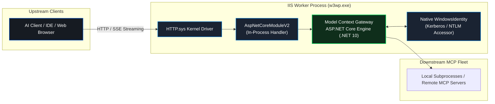

# Production Windows IIS In-Process Deployment Guide


This guide provides exhaustive instructions for hosting **Model Context Gateway (MCG)** natively on Microsoft Windows Server (2019, 2022, 2025) and Windows 10/11 using **Internet Information Services (IIS)** with the in-process **ASP.NET Core Module v2 (ANCM)**.

---

## 🏛️ In-Process Architecture & Benefits

Hosting Model Context Gateway in-process (`hostingModel="inprocess"`) loads the gateway engine directly inside the IIS worker process (`w3wp.exe`).



### Key In-Process Advantages
1. **Zero Loopback Latency**: Eliminates the reverse-proxy network hop between IIS and an out-of-process Kestrel instance. All requests execute in memory.
2. **Native Windows Authentication**: Kerberos and NTLM user tokens pass directly into `HttpContext.User` as native `WindowsIdentity` instances.
3. **Robust Lifecycle Management**: IIS automatically handles worker recycling, idle timeouts, rapid-fail protection, and CPU throttling.
4. **Port Sharing**: Runs alongside other corporate applications on standard HTTP/HTTPS ports (80/443) via `HTTP.sys` host-header routing.

---

## 🛠️ Prerequisites & Host Preparation

### Operating System & Hardware
- **Operating System**: Windows Server 2025, Windows Server 2022, Windows Server 2019, or Windows 10/11 (x64 or arm64).
- **CPU & Memory**: Minimum 2 Cores and 4 GB RAM (8 GB+ recommended for local ONNX vector embeddings).
- **Disk Space**: Minimum 2 GB free disk space for application binaries, SQLite databases, and temporary caches.

### Runtimes & SDKs
1. **.NET 10 Windows Hosting Bundle**:
   - Download and install the [.NET 10 Windows Hosting Bundle](https://dotnet.microsoft.com/download/dotnet/10.0). This bundle installs the .NET runtime and the **ASP.NET Core Module v2 (ANCM)** into IIS.
   - Verify installation in PowerShell:
     ```powershell
     dotnet --info
     ```
2. **Node.js LTS (v20.x or v22.x)**:
   - Required to build the glassmorphic React frontend dashboard.
   - Verify installation:
     ```powershell
     node -v
     npm -v
     ```

### IIS Roles & Features Installation

Open an **Elevated Administrator PowerShell Prompt** on Windows Server:

```powershell
Install-WindowsFeature -Name Web-Server, `
                            Web-WebServer, `
                            Web-Common-Http, `
                            Web-Static-Content, `
                            Web-Default-Doc, `
                            Web-Http-Errors, `
                            Web-Http-Redirect, `
                            Web-Filtering, `
                            Web-Security, `
                            Web-Windows-Auth, `
                            Web-App-Dev, `
                            Web-Net-Ext45, `
                            Web-WebSockets, `
                            Web-Mgmt-Tools, `
                            Web-Mgmt-Console, `
                            Web-Scripting-Tools -IncludeManagementTools
```

*For Windows 10/11 Workstations, enable features via `dism`:*
```powershell
Enable-WindowsOptionalFeature -Online -FeatureName IIS-WebServerRole, IIS-WebServer, IIS-CommonHttpFeatures, IIS-StaticContent, IIS-DefaultDocument, IIS-DirectoryBrowsing, IIS-HttpErrors, IIS-ApplicationDevelopment, IIS-WebSockets, IIS-Security, IIS-WindowsAuthentication, IIS-RequestFiltering, IIS-WebServerManagementTools, IIS-ManagementConsole -All
```

Set PowerShell execution policy to permit script execution:
```powershell
Set-ExecutionPolicy -ExecutionPolicy RemoteSigned -Scope Process -Force
```

---

## 🚀 Automated Deployment with `Deploy-IIS.ps1`

The repository includes a battle-tested automated deployment script: [`scripts/windows/Deploy-IIS.ps1`](https://github.com/spelech/model-context-gateway/blob/main/scripts/windows/Deploy-IIS.ps1).

### Script Parameter Reference

| Parameter | Type | Default | Description |
| :--- | :--- | :--- | :--- |
| **`-SiteName`** | string | `"ModelContextGateway"` | Name of the IIS Website. |
| **`-AppPoolName`** | string | `"ModelContextGatewayAppPool"` | Dedicated IIS Application Pool name. |
| **`-Port`** | int | `8080` | HTTP port for the site binding. |
| **`-HostName`** | string | `""` | Optional hostname binding (e.g. `mcp.corp.local`). |
| **`-PhysicalPath`** | string | `"C:\inetpub\mcg"` | Destination folder on disk for published files. |
| **`-Configuration`** | string | `"Release"` | Build configuration (`Release` or `Debug`). |
| **`-RepoRoot`** | string | Auto-resolved | Path to the repository root directory. |
| **`-SkipFrontend`** | switch | `false` | Skips compiling the Vite React frontend. |
| **`-SkipBuild`** | switch | `false` | Skips dotnet publish if binaries are already staged. |
| **`-SelfContained`**| switch | `false` | Publishes a self-contained binary including the .NET runtime. |
| **`-RuntimeIdentifier`** | string | `"win-x64"` | Target architecture (`win-x64` or `win-arm64`). |
| **`-EnableWindowsAuth`** | switch | `false` | Enables Windows Authentication in IIS. |

### Deployment Command Examples

```powershell
# 1. Standard production deployment on Port 8080 with Windows Authentication:
.\scripts\windows\Deploy-IIS.ps1 -SiteName "ModelContextGateway" -Port 8080 -EnableWindowsAuth

# 2. Production deployment bound to a custom internal domain name:
.\scripts\windows\Deploy-IIS.ps1 -SiteName "ModelContextGateway" -Port 80 -HostName "mcp.company.internal" -EnableWindowsAuth

# 3. Custom path self-contained deployment:
.\scripts\windows\Deploy-IIS.ps1 -PhysicalPath "D:\Apps\ModelContextGateway" -Port 8443 -SelfContained
```

---

## 📄 `web.config` Architectural Deep Dive

The gateway requires specific IIS modules and pipeline settings. The automated script deploys the optimized configuration template from [`scripts/windows/web.config.example`](https://github.com/spelech/model-context-gateway/blob/main/scripts/windows/web.config.example):

```xml
<?xml version="1.0" encoding="utf-8"?>
<configuration>
  <location path="." inheritInChildApplications="false">
    <system.webServer>
      <handlers>
        <add name="aspNetCore" path="*" verb="*" modules="AspNetCoreModuleV2" resourceType="Unspecified" />
      </handlers>

      <!--
        CRITICAL ARCHITECTURAL DIRECTIVES:
        1. hostingModel="inprocess": High performance in-process worker pipeline.
        2. responseBufferLimit="0": CRITICAL for MCP Server-Sent Events (SSE). 
           Completely disables IIS response buffering so streaming chunks flush immediately.
      -->
      <aspNetCore processPath="dotnet"
                  arguments=".\mcg.dll"
                  stdoutLogEnabled="false"
                  stdoutLogFile=".\logs\stdout"
                  hostingModel="inprocess"
                  responseBufferLimit="0">
        <environmentVariables>
          <environmentVariable name="ASPNETCORE_ENVIRONMENT" value="Production" />
          <environmentVariable name="DB_PROVIDER" value="sqlite" />
          <!-- Optional: Uncomment for SQL Server Windows Authentication:
          <environmentVariable name="ConnectionStrings__McpDatabase" value="Server=sql.domain.local;Database=McpGatewayDb;Integrated Security=True;TrustServerCertificate=True;" />
          -->
        </environmentVariables>
      </aspNetCore>

      <!-- Integrated Windows Authentication & Anonymous Public Access -->
      <security>
        <authentication>
          <windowsAuthentication enabled="true" />
          <anonymousAuthentication enabled="true" />
        </authentication>
        <requestFiltering>
          <!-- 100 MB max request body limit for large tool parameters & embeddings -->
          <requestLimits maxAllowedContentLength="104857600" />
        </requestFiltering>
      </security>

      <httpProtocol>
        <customHeaders>
          <remove name="X-Powered-By" />
          <add name="X-Content-Type-Options" value="nosniff" />
          <add name="X-Frame-Options" value="SAMEORIGIN" />
        </customHeaders>
      </httpProtocol>

      <!--
        URL Compression Configuration:
        Dynamic compression MUST be disabled for SSE streaming endpoints
        to prevent gzip filters from buffering real-time chunk streams.
      -->
      <urlCompression doStaticCompression="true" doDynamicCompression="false" />

    </system.webServer>
  </location>
</configuration>
```

---

## ⚡ SSE Streaming & Zero-Buffering Architecture

The Model Context Protocol relies heavily on real-time Server-Sent Events (`/sse` and `/message`) for tool streaming, chunked progress tokens, and continuous JSON-RPC notifications.

> [!CAUTION]
> **Why `responseBufferLimit="0"` is Mandatory:**
> By default, ANCM buffers outbound HTTP chunks up to 4 KB before flushing to the client socket. In MCP tool execution, individual tool tokens and progress messages are often smaller than 4 KB. Buffering causes `search_tools` and `execute_tool` calls to hang or time out. Setting `responseBufferLimit="0"` forces ANCM to flush bytes immediately.

> [!IMPORTANT]
> **Disabling Dynamic Compression:**
> IIS Dynamic Compression (`<urlCompression doDynamicCompression="false" />`) must remain disabled. Compression filters buffer streams until full blocks can be calculated, breaking SSE connections. Static compression (`doStaticCompression="true"`) remains enabled for frontend assets (`.js`, `.css`).

---

## 🔧 Application Pool Tuning & Lifecycle

To ensure long-running client sessions and continuous SSE connections do not terminate unexpectedly, configure these Application Pool settings:

1. **.NET CLR Version**: Set to `No Managed Code` (`""`). ANCM bootstraps and loads the .NET 10 CLR in-process.
2. **Start Mode**: Set to `AlwaysRunning`. Prevents IIS from idling out the process when no initial requests arrive.
3. **Idle Time-out (minutes)**: Set to `0` (Disabled). Standard IIS pools terminate workers after 20 minutes of inactivity; setting this to 0 keeps downstream tool sessions alive indefinitely.
4. **Recycling Limits**: Disable regular time interval recycling (or set to off-peak hours) to avoid terminating active SSE client streams.
5. **Security Permissions**: Grant the Application Pool identity read/write permissions to the application folder and log directories:
   ```powershell
   icacls "C:\inetpub\mcg" /grant "IIS AppPool\ModelContextGatewayAppPool:(OI)(CI)M" /T /Q
   ```

---

## 🔒 SSL/TLS Certificates & HTTPS Bindings

In enterprise environments, terminate TLS directly in IIS:

1. **Import Enterprise Certificate**:
   Open `certlm.msc` and import your organization's wildcard or domain certificate into `Certificates (Local Computer) -> Personal`.
2. **Automated ACME (Let's Encrypt)**:
   Use `win-acme` (`wacs.exe`) to request and bind certificates automatically:
   ```cmd
   wacs.exe --target iissite --siteid 1 --host mcp.domain.local
   ```
3. **Add HTTPS Binding**:
   In IIS Manager, select the site -> **Bindings...** -> **Add...**:
   - **Type**: `https`
   - **Port**: `443`
   - **Host Name**: `mcp.domain.local`
   - **Require Server Name Indication (SNI)**: Enabled
   - **SSL Certificate**: Select your imported certificate.

---

## 📖 Manual IIS Setup Reference

If you must deploy offline or without PowerShell automation:

1. **Build Frontend**:
   ```powershell
   cd frontend
   npm install
   npm run build
   cd ..
   ```
2. **Publish Backend**:
   ```powershell
   dotnet publish ModelContextGateway.csproj -c Release -o C:\inetpub\mcg
   ```
3. **Staged Configuration**:
   Copy `scripts\windows\web.config.example` to `C:\inetpub\mcg\web.config`.
4. **Configure IIS Manager (`inetmgr`)**:
   - Create Application Pool: Name = `ModelContextGatewayAppPool`, .NET CLR Version = `No Managed Code`.
   - Advanced Settings: `Start Mode = AlwaysRunning`, `Idle Time-out = 0`.
   - Add Website: Name = `ModelContextGateway`, Physical Path = `C:\inetpub\mcg`, Port = `8080`.
   - Authentication: Enable `Windows Authentication` and `Anonymous Authentication`.
5. **Apply File ACLs**:
   ```powershell
   icacls "C:\inetpub\mcg" /grant "IIS AppPool\ModelContextGatewayAppPool:(OI)(CI)M" /T /Q
   ```
6. Verify live health:
   ```powershell
   Invoke-RestMethod -Uri "http://localhost:8080/health"
   ```
