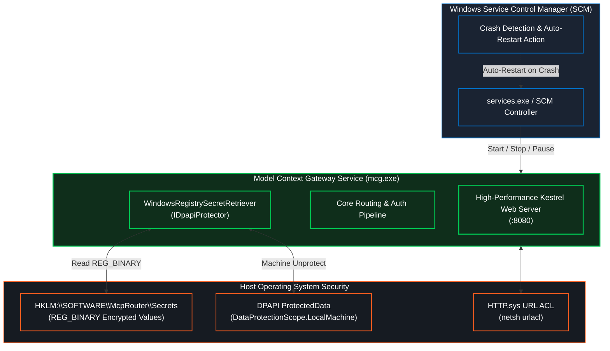

# Windows Service (SCM) & DPAPI Deployment Guide


This guide details running **Model Context Gateway (MCG)** as a managed **Windows Service** via the Windows Service Control Manager (SCM), configuring machine-level **Data Protection API (DPAPI)** secrets in the Windows Registry, and operating in standalone Kestrel console mode.

---

## 🏛️ Windows Service (SCM) Architecture

Running MCG as a native Windows Service runs the ASP.NET Core Kestrel engine as an independent background daemon without requiring IIS:



### Key Windows Service Capabilities
- **Decoupled from Web Servers**: Runs as a lightweight standalone daemon without IIS overhead or complex HTTP modules.
- **Built-in SCM Auto-Recovery**: Windows automatically restarts the process if an unhandled crash or exception occurs.
- **Enterprise Service Accounts**: Runs securely under `NT AUTHORITY\NetworkService`, `NT AUTHORITY\LocalSystem`, or a domain Group Managed Service Account (gMSA).
- **DPAPI Registry Key Isolation**: Stores backend credentials in protected registry keys decrypted in-memory using machine DPAPI keys.

---

## 🛠️ Automated Service Lifecycle with `Setup-WindowsService.ps1`

The repository provides an automated management script: [`scripts/windows/Setup-WindowsService.ps1`](https://github.com/spelech/model-context-gateway/blob/main/scripts/windows/Setup-WindowsService.ps1).

### Supported Commands

```powershell
# 1. Install and start the service on Port 8080:
.\scripts\windows\Setup-WindowsService.ps1 -Action Install -Port 8080

# 2. Query service health and status:
.\scripts\windows\Setup-WindowsService.ps1 -Action Status

# 3. Restart the service:
.\scripts\windows\Setup-WindowsService.ps1 -Action Restart

# 4. Stop the service:
.\scripts\windows\Setup-WindowsService.ps1 -Action Stop

# 5. Start the service:
.\scripts\windows\Setup-WindowsService.ps1 -Action Start

# 6. Uninstall the service:
.\scripts\windows\Setup-WindowsService.ps1 -Action Uninstall
```

### Script Parameter Reference

| Parameter | Type | Default | Description |
| :--- | :--- | :--- | :--- |
| **`-Action`** | string | *(Mandatory)* | Lifecycle action: `Install`, `Uninstall`, `Start`, `Stop`, `Restart`, or `Status`. |
| **`-ServiceName`** | string | `"ModelContextGateway"` | Internal service name in Windows SCM. |
| **`-DisplayName`** | string | `"Model Context Gateway (MCG) Service"` | User-friendly display name shown in `services.msc`. |
| **`-InstallDir`** | string | `"C:\Program Files\McpRouter"` | Destination path for deployed binary files. |
| **`-Port`** | int | `8080` | TCP port for the Kestrel HTTP listener. |
| **`-Urls`** | string | `"http://0.0.0.0:8080"` | Complete URL binding string. |
| **`-ServiceAccount`** | string | `"NT AUTHORITY\LocalSystem"` | Security account running the service (e.g. `DOMAIN\svc_mcp$`). |
| **`-Configuration`** | string | `"Release"` | Compilation mode (`Release` or `Debug`). |
| **`-SelfContained`** | switch | `false` | Publishes a self-contained executable with embedded .NET runtime. |

---

## 🔄 Auto-Recovery & SCM Crash Action Configuration

`Setup-WindowsService.ps1` automatically configures Windows Service Control Manager failure actions using `sc.exe`:

```powershell
# Configure SCM to restart the service after 60 seconds on the 1st, 2nd, and subsequent failures:
sc.exe failure ModelContextGateway reset= 86400 actions= restart/60000/restart/60000/restart/60000
sc.exe failureflag ModelContextGateway 1
```

- **`reset= 86400`**: Resets failure count after 24 hours of normal operation.
- **`actions= restart/60000/...`**: Instructs Windows to wait 60 seconds and restart the executable automatically.
- **`failureflag 1`**: Ensures recovery actions trigger for unexpected process exits and unhandled crashes.

---

## 🔐 Service Accounts & Security Permissions

When running MCG under a restricted domain account or Group Managed Service Account (gMSA) like `DOMAIN\svc_mcp$`:

### 1. File System Permissions
Grant the service account read and execution access to the binary directory, and write access to the `./data` folder:
```powershell
icacls "C:\Program Files\McpRouter" /grant "DOMAIN\svc_mcp$:(OI)(CI)RX" /T /Q
icacls "C:\Program Files\McpRouter\data" /grant "DOMAIN\svc_mcp$:(OI)(CI)M" /T /Q
```

### 2. Registry Permissions
Grant read access to the Secrets registry hive:
```powershell
$acl = Get-Acl "HKLM:\SOFTWARE\McpRouter\Secrets"
$rule = New-Object System.Security.AccessControl.RegistryAccessRule("DOMAIN\svc_mcp$","ReadKey","ContainerInherit,ObjectInherit","None","Allow")
$acl.SetAccessRule($rule)
Set-Acl "HKLM:\SOFTWARE\McpRouter\Secrets" $acl
```

### 3. URL Port Reservation
Reserve the HTTP port binding using `netsh`:
```cmd
netsh http add urlacl url=http://+:8080/ user="DOMAIN\svc_mcp$"
```

---

## 🛡️ Windows Registry Secrets & DPAPI Cryptography

Model Context Gateway includes a dedicated **`WindowsRegistrySecretRetriever`** component that securely extracts backend credentials from the Windows Registry:

- **Target Hive**: `HKLM:\SOFTWARE\McpRouter\Secrets`
- **Supported Formats**:
  - `REG_SZ`: Plaintext string secret (useful for development or non-sensitive tokens).
  - `REG_BINARY`: Encrypted payload protected by the **Windows Data Protection API (DPAPI)** using `DataProtectionScope.LocalMachine`.

### Managing DPAPI Secrets with `Set-RegistrySecrets.ps1`

The repository includes a dedicated secret management utility: [`scripts/windows/Set-RegistrySecrets.ps1`](https://github.com/spelech/model-context-gateway/blob/main/scripts/windows/Set-RegistrySecrets.ps1).

#### 1. Store a DPAPI-Encrypted Secret
```powershell
# Encrypt and store an API key using machine-level DPAPI:
.\scripts\windows\Set-RegistrySecrets.ps1 -SecretName "DockerApiKey" -SecretValue "dckr_pat_secret_token_12345" -Encrypt
```

#### 2. Store a Plaintext String Secret
```powershell
# Store a plaintext secret:
.\scripts\windows\Set-RegistrySecrets.ps1 -SecretName "PlexToken" -SecretValue "plex_plain_token_xyz"
```

#### 3. List Stored Secrets
```powershell
.\scripts\windows\Set-RegistrySecrets.ps1 -List
```

*Output:*
```text
Secrets configured in HKLM:\SOFTWARE\McpRouter\Secrets (2 items):
------------------------------------------------------------
SecretName    Type
----------    ----
DockerApiKey  Binary (DPAPI Encrypted)
PlexToken     String (Plaintext)
```

#### 4. Test Decryption
```powershell
.\scripts\windows\Set-RegistrySecrets.ps1 -SecretName "DockerApiKey" -Get
```

*Output:*
```text
Secret Name : DockerApiKey
Value Type  : Binary (DPAPI Encrypted)
Plaintext   : dckr_pat_secret_token_12345
```

### Configuring Secrets in Backend MCP Servers

In the Web Dashboard or Admin MCP Server, configure backend servers to resolve credentials from the registry:
- **`SecretProvider`**: `WindowsRegistry`
- **`SecretPath`**: `SOFTWARE\McpRouter\Secrets`
- **`SecretItemKey`**: `DockerApiKey`

When an AI assistant executes a tool on that server, MCG reads the binary value from the registry and decrypts it in-memory via `ProtectedData.Unprotect(bytes, null, DataProtectionScope.LocalMachine)`.

---

## 💻 Standalone Kestrel Console Mode

For development, testing, or quick local diagnostics on Windows, run MCG directly from the console without installing a service:

### Developer Interactive Execution
```powershell
# Run from repository root in Development mode:
dotnet run --project ModelContextGateway.csproj --urls "http://localhost:5000"
```

### Command-Line Overrides & Production Execution
```powershell
# Set production environment variables
$env:ASPNETCORE_ENVIRONMENT="Production"
$env:DB_PROVIDER="sqlite"
$env:MCG_MASTER_KEY="your_32_char_secure_hex_master_key_here"

# Execute published binary directly
.\bin\Release\net10.0\win-x64\publish\mcg.exe --urls "http://0.0.0.0:8080"
```
