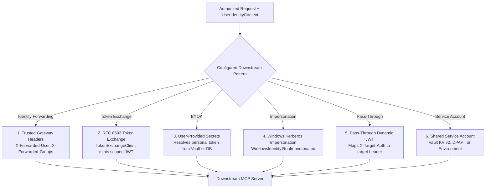

# Downstream Authentication & Credential Delegation Guide

## 1. Overview

This guide describes how Model Context Gateway (MCG) authenticates to downstream Model Context Protocol (MCP) servers on behalf of callers.

The gateway decouples **inbound ingress authentication** (such as Active Directory, OIDC, or AppKeys) from **outbound downstream delegation**. After the gateway authorizes an incoming request, it selects a configured delegation pattern to invoke the target server.

---

## 2. Downstream Delegation Patterns

The gateway supports six downstream delegation patterns:



### Pattern 1: Trusted Gateway Pattern (Identity Header Propagation)
Use this pattern when backend microservices trust the gateway IP address and enforce internal authorization or Row-Level Security (RLS).

- **Outbound Transport**: HTTP or SSE.
- **Injected Headers**:
  - `X-Forwarded-User`: Username of the authenticated caller (such as `steve` or `CORP\steve`).
  - `X-Forwarded-Groups`: Comma-separated list of caller group memberships (such as `Domain Users,DevOps,Engineering`).
  - `X-Mcp-Session-Id`: Unique identifier for the client session.
- **Downstream Enforcement**: The downstream service verifies the shared gateway token, trusts the forwarded headers, and applies internal data filters.

---

### Pattern 2: RFC 8693 Downstream Token Exchange
Use this pattern in zero-trust architectures where backend microservices require user-delegated tokens scoped specifically to their audience.

- **Component**: `TokenExchangeClient`.
- **How It Works**:
  1. The gateway extracts the incoming user token from the request.
  2. The gateway calls the Identity Provider token endpoint using grant type:
     ```text
     urn:ietf:params:oauth:grant-type:token-exchange
     ```
  3. The IdP mints a short-lived downstream JWT scoped to the target server audience (`SecretKey`).
  4. The gateway caches the exchanged token in memory for its lifetime minus 60 seconds.
  5. The gateway attaches `Authorization: Bearer <downstream_jwt>` to the outbound call.

---

### Pattern 3: Bring Your Own Key (BYOK / User-Provided Secrets)
Use this pattern when backend MCP servers require individual user tokens (such as personal GitHub Personal Access Tokens or Slack user tokens).

- **Configuration**: Set `SecretProvider` to `UserProvided` in the server configuration.
- **Storage Providers**:
  - **Database (Encrypted Storage)**: Stored in SQLite/SQL encrypted with AES-256-GCM.
  - **HashiCorp Vault (KV v2)**: Stored in Vault KV v2 using path templates (such as `{Company}/mcgateway/{User}/{Server}`).
- **User Self-Service**: Users add, update, and remove personal credentials in the **My MCP Servers** dashboard tab.
- **Resolution**: During tool execution, the gateway retrieves the caller's credentials and injects them into the outbound request.

---

### Pattern 4: Windows Kerberos Impersonation
Use this pattern on Windows Server and IIS deployments where downstream servers require the caller's Active Directory domain identity.

- **Operating System Requirement**: Windows Server and IIS only. This mode does not run on Linux containers.
- **Configuration**: Set `AuthShape` to `impersonation`. The UI automatically locks `SecretProvider` to `None`.
- **How It Works**:
  1. The user authenticates to IIS with Negotiate or Kerberos.
  2. The gateway extracts the caller's `WindowsIdentity`.
  3. Outbound HTTP requests execute inside `WindowsIdentity.RunImpersonated()`.
  4. Downstream servers receive the caller's Kerberos credentials through S4U2Proxy delegation.

---

### Pattern 5: Pass-Through Dynamic JWTs
Use this pattern when clients obtain backend tokens directly and forward them through the gateway.

- **Configuration**: Set `AllowPassThroughAuth` to `true` on the server configuration.
- **Routing Requirement**: Requires target-specific proxy routes (`/{serverId}`). Not supported in universal meta-mode (`/sse`) because the client must target a specific backend.
- **How It Works**:
  1. The client sends the backend token in the `X-Target-Auth` HTTP header.
  2. The gateway translates `X-Target-Auth` into the configured backend `AuthShape` (such as `Authorization: Bearer <token>`).

---

### Pattern 6: Shared Service Account Credentials
Use this pattern when the gateway connects to shared infrastructure backends (such as Docker, Home Assistant, or Postgres).

- **Secret Providers**:
  - **HashiCorp Vault (KV v2)**: Reads credentials dynamically with JIT token renewal.
  - **Windows Registry (DPAPI)**: Reads machine-encrypted values from `HKLM` hives.
  - **Environment Variables**: Reads values from host or container environment variables (`ENV:VAR_NAME`).
  - **Encrypted Database**: Reads static keys encrypted with AES-256-GCM.

---

## 3. Downstream Authentication Mixing Matrix & Guardrails

To prevent conflicting or invalid configurations, the gateway and UI enforce strict mixing rules:

| Outbound Auth Mode | Secret Provider | Static API Key Allowed? | Secret Key / Path Required? | Valid Transports | Enforced Guardrail & Behavior |
| :--- | :--- | :--- | :--- | :--- | :--- |
| **Kerberos Impersonation** (`impersonation`) | `None` *(Locked)* | ❌ **No** | ❌ **No** | `sse`, `http` | **Windows-Only.** Runs inside `WindowsIdentity.RunImpersonated`. External secret providers and static keys are disabled in the UI. |
| **User-Provided (BYOK)** | `UserProvided` | ❌ **No** | ❌ **No** | `sse`, `http`, `stdio` | Static server API key is disabled. Credentials resolve dynamically per user from Database or HashiCorp Vault. |
| **Token Exchange** (`TokenExchange`) | `TokenExchange` | ❌ **No** | ✅ **Yes** *(Audience)* | `sse`, `http` | Mints dynamic RFC 8693 downstream JWT asserting caller identity. Incompatible with Kerberos impersonation. |
| **Static Shared Secret** | `Environment`, `Vault`, `WindowsRegistry` | ❌ **No** | ✅ **Yes** | `sse`, `http`, `stdio` | Shared service credentials fetched dynamically. The gateway manages TTL and caching. |
| **Hardcoded API Key** | `None` | ✅ **Yes** | ❌ **No** | `sse`, `http`, `stdio` | Stored AES-256-GCM encrypted in the database. Simplest for single-tenant local servers. |
| **Pass-Through JWT** (`AllowPassThroughAuth`) | *(Any)* | Optional | Optional | `sse`, `http` | Client sends dynamic token in `X-Target-Auth`. Requires direct proxy route (`/{serverId}`). |

---

## 4. Transport Injection Mechanics

The gateway formats resolved credentials based on the target transport type:

### HTTP and SSE Transports (`HttpTransport`, `SseTransport`)
Credentials inject into HTTP request headers or URL query parameters according to `AuthShape`:
- `bearer`: Injects `Authorization: Bearer <token>`.
- `custom-header`: Injects `<CustomHeaderName>: <token>` (such as `X-API-Key` or `X-Plex-Token`).
- `basic`: Formats `username:password` into `Authorization: Basic <base64>`.
- `query`: Appends credentials to the URL query string (`?token=<token>`).
- `raw`: Injects `Authorization: <token>`.

### STDIO Local Subprocess Transport (`StdioTransport`)
For local script subprocesses (such as Node.js, Python, or shell tools):
- The gateway never passes secrets in command-line arguments.
- The gateway injects resolved credentials securely into process environment variables (such as `API_KEY` or `TOKEN`).
- Subprocess arguments remain clean to prevent credential exposure in process monitoring tools (`ps`, `top`).

---

## 5. Related Documentation

* [**Active Directory & RBAC Guide**](active-directory-and-rbac-guide.md) — Inbound Windows Kerberos and LDAPS group resolution.
* [**OIDC & SSO Reverse Proxy Guide**](oidc-and-sso-guide.md) — Inbound JWT validation and header SSO.
* [**MCP Server Auth Cookbook**](mcp-server-auth-cookbook.md) — Setup recipes for common backend MCP servers.
* [**Secret Providers Guide**](secret-providers.md) — HashiCorp Vault, Windows DPAPI, and AES master key management.
