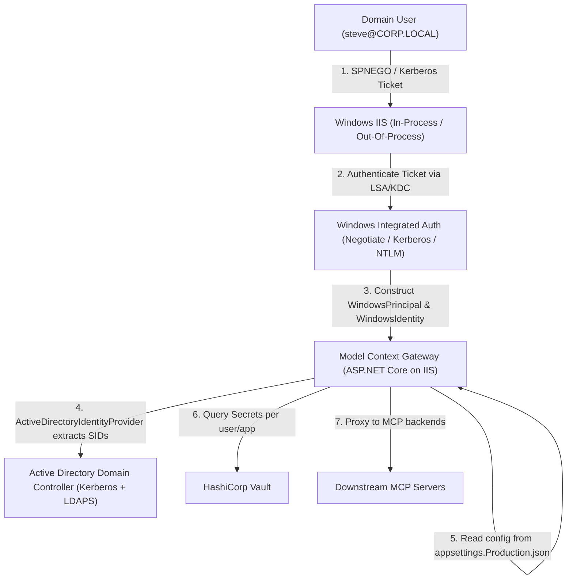

# Enterprise Active Directory, Vault, and Downstream Auth Scenarios: Architecture & Gap Analysis

## 1. Executive Summary

This specification provides a comprehensive architectural evaluation of Model Context Gateway (MCG) operating within an enterprise environment characterized by:
- **On-Premises Active Directory (AD)**: Central identity directory managing user accounts (`steve`, `alice`, `bob`, `Administrator`), security identifiers (SIDs), and enterprise group memberships.
- **Dual Hosting Options**:
  1. *Linux Containers* (Docker/Kubernetes): Scalable containerized deployment utilizing an in-house Identity Provider (IdP) publishing JSON Web Tokens (JWT) and OIDC discovery endpoints (`.well-known`).
  2. *Windows IIS*: Native Windows Server hosting utilizing `appsettings.{Environment}.json` and Integrated Windows Authentication (Kerberos / Negotiate / NTLM).
- **HashiCorp Vault Secret Management**: Centralized storage of downstream service credentials and per-user application secrets (e.g., Slack OAuth user tokens).
- **Downstream MCP Auth Matrix**: Support for multiple downstream authentication modalities, including API Keys, custom headers, per-user OAuth tokens, RFC 8693 Token Exchange, and identity header propagation.

> [!IMPORTANT]
> **Strict Non-Regression & Code-Freeze Rule**: Per architectural instructions, **no gateway code changes** were introduced in this phase. All architectural shortcomings, path inflexibilities, and missing middleware components are rigorously highlighted herein, backed by test harnesses and containerized proof-of-concepts.

---

## 2. Enterprise Hosting Scenarios

### Scenario A: Linux Containers + In-House Identity Provider (JWT & `.well-known`)

```mermaid
flowchart TD
    Client["Client / Agent (Cursor, Claude, VS Code)"]
    Ingress["Enterprise Ingress / Reverse Proxy (Traefik, Nginx, Envoy)"]
    IdP["In-House IdP (OIDC / JWT & /.well-known)"]
    MCG["Model Context Gateway (Linux Container)"]
    LDAP["Active Directory / OpenLDAP (LDAPS :636)"]
    Vault["HashiCorp Vault"]
    Downstream["Downstream MCP Servers"]

    Client -->|1. Authenticate with In-House IdP| IdP
    IdP -->|2. Issue JWT Bearer Token| Client
    Client -->|3. Send Request + Bearer JWT| Ingress
    Ingress -->|4a. Validate Token & Inject Identity Headers\n(Remote-User, Remote-Groups, Remote-User-Sid)| MCG
    Client -.->|4b. Direct Bearer JWT (Current Gateway Limitation)| MCG
    MCG -->|5. Augment SIDs via LDAPS| LDAP
    MCG -->|6. Retrieve App/User Secrets| Vault
    MCG -->|7. Route namespaced tool call with target auth| Downstream
```

#### Architecture & Flow:
1. **Identity Resolution on Linux**:
   - Linux containers cannot natively validate Windows Kerberos tickets without complex domain-join dependencies (Kerberos keytabs, SSSD, Winbind).
   - In modern container architectures, the client authenticates against the corporate in-house IdP (OIDC).
   - The IdP issues a signed JWT containing claims: `sub`, `preferred_username`, `email`, `groups`, and Windows SIDs (`sid`, `group_sids`).
2. **Current Gateway Ingestion Path**:
   - **HeaderAuth (`OidcHeader`)**: If an enterprise ingress / reverse proxy (Envoy, Nginx `auth_request`, Traefik forwardAuth) validates the JWT against the IdP's `/.well-known/jwks.json` and strips/injects trusted headers (`Remote-User: steve`, `Remote-Groups: MCP Developers,Slack Users`, `Remote-User-Sid: S-1-5-21-1001`), MCG's `HeaderIdentityProvider` and `TrustedProxyHelper` seamlessly accept the identity.
   - **LDAP Augmentation**: MCG connects via LDAPS (port 636) using service credentials (`Ldap:BindDn` / `Ldap:BindPassword`) to query Active Directory for `objectSid` and `tokenGroups`, caching SIDs in memory for 5 minutes.
3. **Gateway Shortcoming Highlighted**:
   - **No Native External JWT Bearer Validation**: MCG's `OpenIddictExtensions.cs` configures OpenIddict validation exclusively with `options.UseLocalServer()`. MCG does *not* currently possess an `AddJwtBearer` or external OIDC token validator that validates incoming client Bearer JWTs directly against an external IdP's `/.well-known/openid-configuration` and JWKS endpoints. If clients connect directly to MCG without an authenticating reverse proxy, incoming external JWTs cannot be validated.

---

### Scenario B: Windows IIS + `appsettings.{Environment}.json` + Windows Auth



#### Architecture & Flow:
1. **Native Windows Authentication**:
   - IIS is configured with `<windowsAuthentication enabled="true" />` and `<anonymousAuthentication enabled="false" />`.
   - Incoming HTTP requests from domain-joined workstations (or Windows clients) perform SPNEGO / Negotiate handshakes.
   - IIS sets `HttpContext.User` to a `WindowsPrincipal` with an underlying `WindowsIdentity`.
2. **Configuration via Environment JSON**:
   - Deployed on Windows with `appsettings.Production.json` or `appsettings.Staging.json`.
   - ASP.NET Core automatically binds environment settings, such as `Ldap:Server`, `Vault:Address`, `Vault:RoleId`, `Vault:SecretId`, and `Admin:GroupSid`.
3. **Identity Resolution in MCG**:
   - `ActiveDirectoryIdentityProvider` uses `IWindowsIdentityAccessor` to extract the primary user SID (`winSid`) and group SIDs (`winGroups`).
   - If configured with `ILdapService`, it connects to AD over LDAPS to resolve nested token group SIDs.
4. **Gateway Shortcoming Highlighted**:
   - **Authorization Scheme Binding**: In `OpenIddictExtensions.cs`, `DefaultPolicy` strictly requires `.AddAuthenticationSchemes(OpenIddictValidationAspNetCoreDefaults.AuthenticationScheme, "AppKey", "OidcHeader")`. Because `Negotiate` or `Windows` is not registered as an ASP.NET Core authentication scheme in `DefaultPolicy`, authentication relies on `OidcHeaderAuthenticationHandler` inspecting `_identityProvider.ResolveIdentityAsync(Context)`. While this functions when `Context.User.Identity.IsAuthenticated` is populated by IIS, direct Kestrel hosting on Windows with `Microsoft.AspNetCore.Authentication.Negotiate` requires explicit scheme registration.

---

## 3. HashiCorp Vault Storage Path & Secret Topology Analysis

### Current MCG Implementation
In the existing codebase:
1. **`VaultSecretRetriever.cs`**:
   - Resolves secrets via KV v2 at `path` within `mountPoint` (defaulting to `secret`).
   - Secret syntax in server configuration: `mount:path:field` or `SecretPath` + `SecretField`.
   - Retrieves `secretData.Data.Data[keyName]?.ToString()`.
2. **`VaultUserSecretStore.cs`**:
   - Implements `IUserSecretStore` as follows:
     ```csharp
     public async Task<string?> GetSecretAsync(string username, string serverId)
     {
         return await _retriever.GetSecretAsync($"users/{username}/{serverId}", "secret");
     }
     ```
   - Throws `NotImplementedException` for `SaveSecretAsync`, `DeleteSecretAsync`, and `GetServerIdsAsync`.
3. **DI Registration (`ServiceCollectionExtensions.cs`)**:
   - Line 144 unconditionally registers:
     ```csharp
     builder.Services.AddSingleton<IUserSecretStore, DatabaseUserSecretStore>();
     ```
   - `VaultUserSecretStore` is never registered or toggled via configuration.

### Enterprise Desired Path Structures & Shortcomings

| Desired Enterprise Pattern | Description | Supported by MCG Today? | Shortcoming / Gap Detail |
| :--- | :--- | :--- | :--- |
| `{company}/mcgateway/{user}/{app}` | Hierarchical enterprise multi-tenant path (e.g. `acme/mcgateway/steve/slack`). | **No** | Hardcoded path `users/{username}/{serverId}` inside `VaultUserSecretStore.cs`. No template expression support (`Vault:UserSecretPathTemplate`). |
| Discrete KV Fields (`client_id`, `client_secret`, `access_token`) | Storing credentials as separate KV attributes in the Vault secret dictionary. | **Partial** | `VaultSecretRetriever` can read any single field if explicitly queried via `SecretField`, but `VaultUserSecretStore` hardcodes reading key `"secret"`. |
| JSON Auth Blob at `{user}/{app}` | Storing a complete JSON payload (`{"access_token":"...","client_id":"..."}`) under key `"secret"` or root. | **Yes (Read Only)** | Supported only if stored at `users/{username}/{serverId}` under key name `"secret"`. |
| Vault User Credential Self-Service / OAuth Save | User completes OAuth flow for Slack; gateway writes token to Vault. | **No** | `VaultUserSecretStore.SaveSecretAsync` throws `NotImplementedException`. Gateway lacks Vault KV v2 write capability for user secrets. |
| Pluggable Provider Selection | Choosing between encrypted database and Vault for `IUserSecretStore`. | **No** | DI unconditionally registers `DatabaseUserSecretStore`. There is no configuration option (`Secrets:UserStore:Provider = "Vault"`) to switch implementations. |

---

## 4. Downstream Authentication Support Matrix

MCG proxies requests to downstream MCP servers via `HttpTransport` and `SseTransport`. The table below outlines how each enterprise downstream auth mechanism functions:

| Downstream Auth Mechanism | Header / Injection Shape | Gateway Implementation | Enterprise Use Case |
| :--- | :--- | :--- | :--- |
| **1. Static App Key** | `X-API-Key: <token>` | `AuthShape: "x-api-key"`, resolved from Vault or static `ApiKey`. | Internal legacy services, shared infrastructure MCP servers. |
| **2. Custom Header Auth** | `X-Internal-Token: <token>` | `AuthShape: "custom-header"`, `CustomHeaderName: "X-Internal-Token"`, resolved from Vault. | Internal enterprise microservices with custom perimeter auth. |
| **3. Per-User Secret (Slack MCP)** | `Authorization: Bearer <user_token>` | `SecretProvider: "UserProvided"`, resolved from `IUserSecretStore.GetSecretAsync(user, serverId)`. | Slack MCP, GitHub MCP, Jira MCP requiring user-delegated tokens. |
| **4. Token Exchange (RFC 8693 / RFC 7523)** | `Authorization: Bearer <downstream_jwt>` | `SecretProvider: "TokenExchange"`, invokes `TokenExchangeSecretRetriever` against internal IdP token endpoint. | Zero-trust service-to-service micro-segmentation with short-lived scoped JWTs. |
| **5. Identity Header Propagation** | `X-Forwarded-User: <username>` | Automatically injected by `HttpTransport` when `_forwardedUser` is present. | Internal MCP servers that trust the gateway as an authenticating gateway. |

---

## 5. Comprehensive Gap Analysis & Remediation Status (v5.12.0)

1. **Vault Path Templating Gap**:
   - *Previous State*: `VaultUserSecretStore` had hardcoded path formatting `users/{username}/{serverId}` and key `"secret"`.
   - *Remediation in v5.12.0 (`SEC-30`)*: Added configurable path templates via `Secrets:UserStore:PathTemplate` or `VAULT_USER_SECRET_PATH_TEMPLATE` (e.g. `{Company}/mcgateway/{User}/{Server}`). Tokens `{Company}`, `{company}`, `{User}`, `{user}`, `{username}`, `{Server}`, `{server}`, and `{app}` are dynamically interpolated. Supports discrete KV fields (`client_id`, `client_secret`, `access_token`) and raw JSON auth blobs.

2. **Vault User Secret Mutation Gap**:
   - *Previous State*: `SaveSecretAsync`, `DeleteSecretAsync`, and `GetServerIdsAsync` threw `NotImplementedException`, preventing self-service user credential management and Slack OAuth callbacks.
   - *Remediation in v5.12.0 (`SEC-30`)*: Implemented full CRUD mutations using VaultSharp KV v2 `WriteSecretAsync`, `DeleteSecretAsync`, and `GetSecretAsync`. Self-service user credential updates now persist directly into HashiCorp Vault.

3. **`IUserSecretStore` DI Configuration Gap**:
   - *Previous State*: `DatabaseUserSecretStore` was hardcoded in `ServiceCollectionExtensions.cs`.
   - *Remediation in v5.12.0 (`SEC-31`)*: Decoupled DI registration to read `Secrets:UserStore:Provider` (or `MCG_USER_SECRET_STORE`). When set to `"Vault"` or `"HashiCorpVault"`, `VaultUserSecretStore` is injected; otherwise defaults to `DatabaseUserSecretStore`.

4. **External JWT Bearer Authentication Gap**:
   - *Previous State*: MCG lacked an external JWT Bearer authentication handler. OpenIddict was configured only for locally-issued tokens (`options.UseLocalServer()`).
   - *Remediation in v5.12.0 (`AUTH-130`, `AUTH-131`, `AUTH-132`)*: Added `ExternalJwtAuthenticationHandler` registered under scheme `"ExternalJwt"`. It dynamically discovers OIDC metadata and JWKS from `Identity:Jwt:Authority` / `.well-known/openid-configuration` with caching and validates signatures, issuer, and audience. Seamlessly included in `DefaultPolicy` and `AdminPolicy`.

5. **Windows Authentication Scheme Registration on Linux vs Windows**:
   - *Platform Characteristic*: Windows Kerberos/NTLM authentication cannot run natively inside Linux containers without external domain joins or Kerberos keytabs.
   - *Enterprise Solution*: On Windows IIS hosts, native Windows Auth runs via `appsettings.environment.json`. On Linux containers, identity is resolved either via reverse proxy identity headers (`Remote-User`, `Remote-Groups`, `Remote-User-Sid` per `AUTH-134` and `GUARD-06`) or via In-House IdP JWT Bearer tokens (`AUTH-130`).

---

## 6. Documented Assumptions

1. **Active Directory & LDAP**:
   - Active Directory is reachable via LDAPS (port 636) from the container network or IIS host.
   - Plaintext LDAP (port 389) is rejected fail-closed by MCG guardrails (`GUARD-02`).
   - Active Directory service accounts have read access to query user attributes (`sAMAccountName`, `objectSid`, `tokenGroups`).
2. **In-House IdP**:
   - The in-house IdP issues standard RFC 7519 JWTs signed with RS256.
   - Discovery endpoints (`/.well-known/openid-configuration`, `/.well-known/jwks.json`) are available without client authentication.
   - Token exchange follows RFC 8693 or RFC 7523 On-Behalf-Of assertions.
3. **HashiCorp Vault**:
   - Vault is running KV v2 secrets engine mounted at `secret` (or configured mount).
   - AppRole authentication (`role_id`, `secret_id`) or static tokens are used to authenticate MCG to Vault.
   - Network connectivity between MCG and Vault is secured via HTTPS/TLS in production.
4. **Ingress & Reverse Proxy Trust**:
   - When running on Linux, reverse proxies forwarding identity headers (`Remote-User`, `Remote-Groups`, `Remote-User-Sid`) must have their source IPs explicitly allowlisted in `Oidc:TrustedProxies` or Docker subnets per `GUARD-06`.
