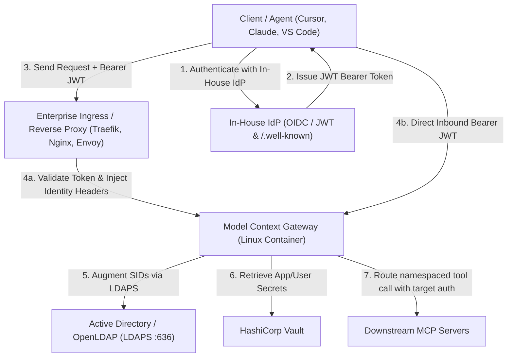
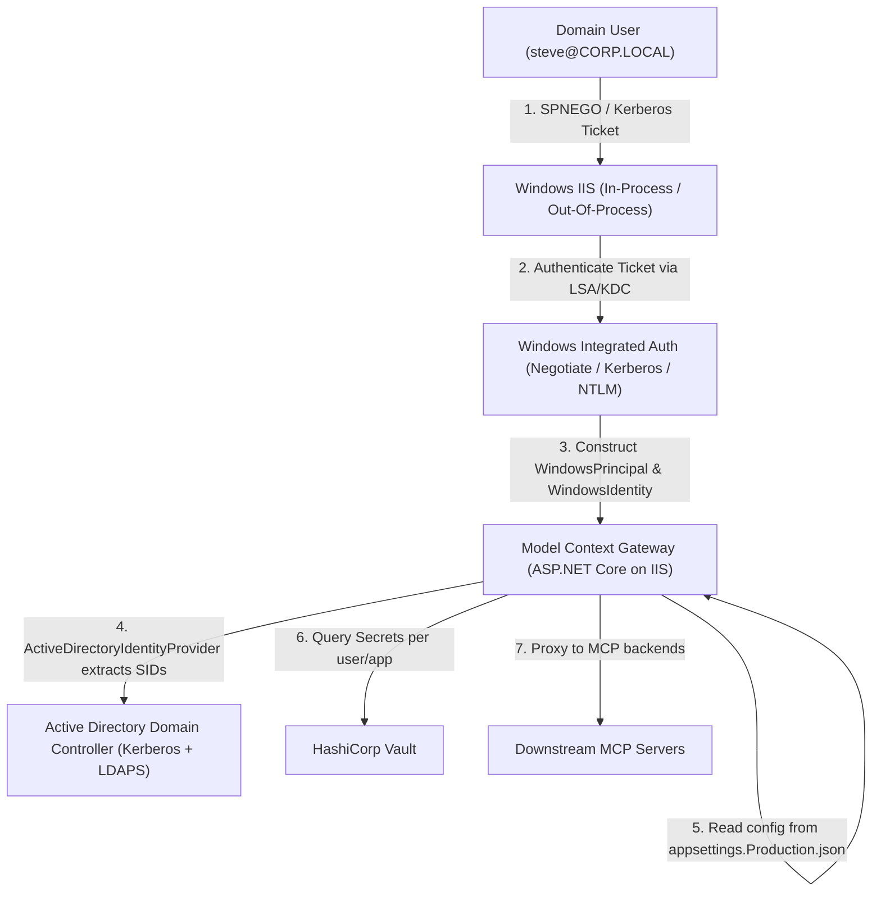

# Enterprise Active Directory, Vault, and Downstream Auth Architecture

## 1. Overview

This document describes how Model Context Gateway (MCG) operates in enterprise environments. It covers:
- **Active Directory (AD)**: Central identity directory managing domain accounts, security identifiers (SIDs), and enterprise groups.
- **Enterprise Hosting Options**:
  1. *Linux Containers* (Docker/Kubernetes): Containerized deployment with an in-house Identity Provider (IdP) publishing JSON Web Tokens (JWT) and OIDC discovery endpoints.
  2. *Windows IIS*: Windows Server deployment using `appsettings.{Environment}.json` and Integrated Windows Authentication (Kerberos / Negotiate / NTLM).
- **HashiCorp Vault Secret Management**: Central storage for shared downstream service credentials and per-user application secrets.
- **Downstream MCP Auth Matrix**: Downstream authentication options including API Keys, custom headers, per-user OAuth tokens, RFC 8693 Token Exchange, and Kerberos Impersonation.

---

## 2. Enterprise Hosting Modes

### Mode A: Linux Containers + In-House Identity Provider (JWT & `.well-known`)

#### Architecture & Operation:
1. **Direct JWT Bearer Validation (`ExternalJwtAuthenticationHandler`)**:
   - Clients send `Authorization: Bearer <jwt>` directly to the gateway.
   - The gateway fetches public keys from the provider's discovery endpoint (`Identity:Jwt:Authority` / `.well-known/openid-configuration`).
   - The gateway validates signatures (RS256, ES256), token expiration, issuer, and audience.
   - The gateway extracts username, groups, and Active Directory SIDs into `UserIdentityContext`.
2. **Reverse Proxy Header Auth (`HeaderIdentityProvider`)**:
   - Upstream reverse proxies (Envoy, Traefik, Nginx) validate tokens at the network edge.
   - The proxy forwards identity headers (`Remote-User`, `Remote-Groups`, `Remote-User-Sid`).
   - The gateway validates proxy IP addresses against `Oidc:TrustedProxies`.
3. **LDAP Group and SID Augmentation (`ActiveDirectoryIdentityProvider`)**:
   - The gateway connects via secure LDAPS (port 636) with service account credentials.
   - The gateway queries Active Directory for `objectSid` and `tokenGroups`.
   - The gateway caches resolved SIDs in memory for 5 minutes.

---

### Mode B: Windows IIS + Windows Integrated Authentication

#### Architecture & Operation:
1. **Integrated Windows Authentication**:
   - IIS uses `<windowsAuthentication enabled="true" />` and `<anonymousAuthentication enabled="false" />`.
   - Domain clients perform SPNEGO / Negotiate handshakes.
   - IIS sets `HttpContext.User` to a `WindowsPrincipal` containing the caller's `WindowsIdentity`.
2. **Environment Configuration**:
   - Windows deployments use `appsettings.Production.json` or `appsettings.Staging.json`.
   - The application binds provider settings: `Ldap:Server`, `Vault:Address`, `Vault:RoleId`, `Vault:SecretId`, and `Admin:GroupSid`.
3. **Identity Resolution**:
   - `ActiveDirectoryIdentityProvider` extracts user SIDs and group SIDs using `IWindowsIdentityAccessor`.
   - When configured, `ILdapService` resolves nested domain group SIDs.

---

## 3. HashiCorp Vault Storage Topology

The gateway stores downstream credentials in HashiCorp Vault using two components:

### 3.1 Shared Service Secrets (`VaultSecretRetriever`)
- Reads shared service credentials from Vault KV v2 paths.
- Uses AppRole authentication (`role_id`, `secret_id`) or static token authentication.
- Evaluates remaining token lifetime before operations. If remaining lifetime is under 300 seconds, it renews authentication automatically.
- Caches resolved secrets in memory for 10 minutes.

### 3.2 User Secret Storage (`VaultUserSecretStore`)
The gateway stores user-specific credentials in HashiCorp Vault when `Secrets:UserStore:Provider` is set to `"Vault"`:
- **Path Templating**: Constructs paths from configured templates (default: `{Company}/mcgateway/{User}/{Server}`). Supported tokens:
  - `{Company}`: Configured organization or enterprise identifier.
  - `{User}`: Sanitized username of the caller.
  - `{Server}`: Target backend MCP server identifier.
- **Data Formats**: Supports both individual credential fields (`client_id`, `client_secret`, `access_token`) and complete JSON authentication blobs.
- **Full Self-Service CRUD**: Users create, read, update, and delete credentials through the Web UI or API. The gateway executes corresponding Vault KV v2 write and delete calls.

---

## 4. Downstream Authentication Support Matrix

The gateway connects to downstream MCP servers using `HttpTransport` and `SseTransport`:

| Downstream Auth Mechanism | Header / Injection Shape | Gateway Implementation | Enterprise Use Case |
| :--- | :--- | :--- | :--- |
| **Static App Key** | `X-API-Key: <token>` | `AuthShape: "x-api-key"`, resolved from Vault or static `ApiKey`. | Shared infrastructure and legacy MCP servers. |
| **Custom Header Auth** | `X-Internal-Token: <token>` | `AuthShape: "custom-header"`, `CustomHeaderName: "X-Internal-Token"`, resolved from Vault. | Microservices with custom perimeter authentication. |
| **Per-User Secret (BYOK)** | `Authorization: Bearer <user_token>` | `SecretProvider: "UserProvided"`, resolved from `IUserSecretStore` (Database or Vault). | User-scoped services (Slack MCP, GitHub MCP, Jira MCP). |
| **Token Exchange (RFC 8693)** | `Authorization: Bearer <downstream_jwt>` | `SecretProvider: "TokenExchange"`, invokes `TokenExchangeClient` against the IdP token endpoint. | Zero-trust services requiring audience-scoped JWTs. |
| **Kerberos Impersonation** | Windows Negotiate / Kerberos | `AuthShape: "impersonation"`, invokes `WindowsIdentity.RunImpersonated`. | On-premises Windows Server and IIS environments. |
| **Identity Header Propagation** | `X-Forwarded-User: <username>` | Injected by `HttpTransport` when identity forwarding is enabled. | Backend services enforcing Row-Level Security (RLS). |

---

## 5. Configuration Guardrails

The gateway enforces the following configuration rules:

1. **Kerberos Impersonation Constraints**:
   - Selecting `AuthShape: impersonation` locks `SecretProvider` to `None`.
   - The UI disables static `ApiKey` and `SecretKey` fields.
   - Outbound requests run inside `WindowsIdentity.RunImpersonated`.
   - Supported on Windows IIS hosts only.
2. **User-Provided (BYOK) Constraints**:
   - Selecting `SecretProvider: UserProvided` disables the static `ApiKey` field.
   - The gateway resolves credentials per-user at runtime.
3. **Vault User Store Dependency**:
   - Selecting `Vault` for User Secret Storage requires an active Vault secret provider.
   - If Vault is disabled or unconfigured, user credential requests fail closed.
4. **Token Exchange Constraints**:
   - Requires `SecretKey` to specify the downstream target audience or scope.
   - Incompatible with Kerberos impersonation.

---

## 6. Documented Assumptions

1. **Active Directory & LDAP**:
   - Active Directory is accessible over LDAPS (port 636).
   - The gateway rejects unencrypted LDAP (port 389).
   - Active Directory service accounts have read access to `sAMAccountName`, `objectSid`, and `tokenGroups`.
2. **In-House Identity Provider**:
   - The in-house IdP issues standard RFC 7519 JWTs signed with RS256 or ES256.
   - Discovery endpoints (`/.well-known/openid-configuration`, `/.well-known/jwks.json`) are reachable by the gateway.
   - Token exchange follows standard RFC 8693 specifications.
3. **HashiCorp Vault**:
   - Vault uses the KV v2 secrets engine mounted at `secret` (or configured mount).
   - AppRole authentication or token authentication is configured with read and write permissions to the user secret path.
   - Network connectivity between the gateway and Vault uses HTTPS in production.
4. **Ingress and Reverse Proxy Trust**:
   - Reverse proxies that forward identity headers must be explicitly allowlisted in `Oidc:TrustedProxies`.
   - The gateway strips identity headers from untrusted network sources.
