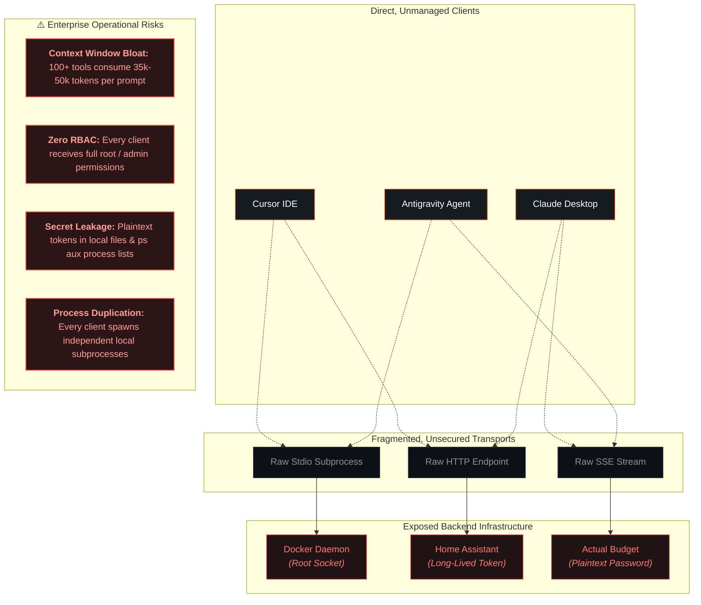
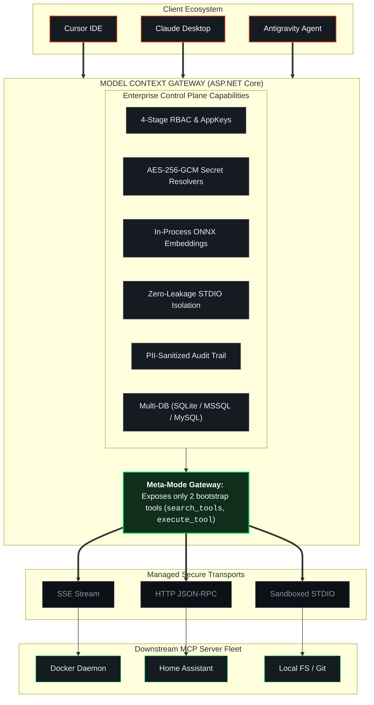
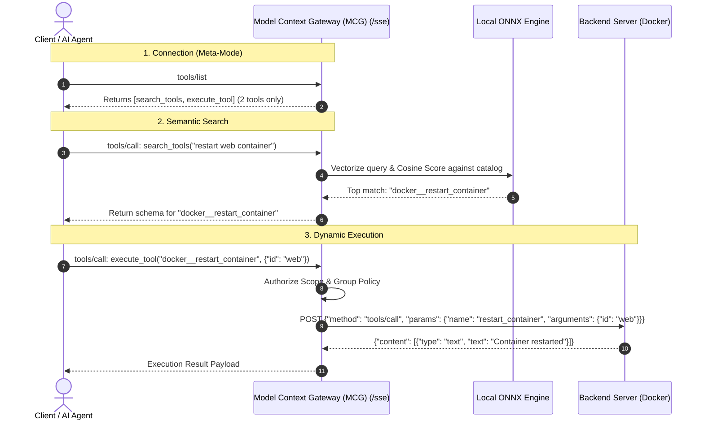

# Model Context Gateway (MCG): Evaluation & Product Overview Guide

C# ASP.NET Core gateway router, semantic proxy, and authorization control plane for the **Model Context Protocol (MCP)**.

---

## 🎯 Executive Summary & Problem Statement

Connecting LLMs, IDE coding assistants (Cursor, VS Code, Windsurf), and autonomous agent frameworks (Antigravity, Claude Desktop, OpenClaw) to internal services introduces operational, architectural, and security bottlenecks:

### 1. Context Window Bloat & Tool Confusion
Directly connecting an LLM to 10–20 MCP servers exposes 100–300+ tool JSON schemas simultaneously.
* **Token Overhead**: Tool schemas consume 30,000–60,000+ tokens per interaction, increasing inference latency and API costs.
* **Model Confusion & Hallucination**: Large tool catalogs exceed LLM attention spans, resulting in incorrect tool selection or schema validation failures.

### 2. Absence of Centralized RBAC & Least-Privilege Access
Individual MCP backends lack standardized authentication or authorization:
* Backends often provide no authentication or use a single shared token.
* Environments cannot enforce Active Directory (AD) security groups, OIDC group claims (`Remote-Groups`), or category-scoped permissions (`category:smarthome`).

### 3. Secret Leakage & Command-Line Exposure
Local STDIO MCP servers often require passing API tokens as command-line arguments:
* Tokens are visible via `ps aux`, `/proc/<pid>/cmdline`, and process audit trees.
* Passwords and API keys in plaintext configuration files risk source control leakage.

### 4. Operational & Transport Fragmentation
Clients manage mixes of local subprocesses (`stdio`), Server-Sent Events streams (`sse`), and stateless HTTP endpoints (`http`).
* Subprocesses crash without health checks, auto-restart, or connection pooling.
* No centralized audit trail exists for tool invocations.

---

## 🚀 The Solution: Model Context Gateway (MCG)

The **Model Context Gateway (MCG)** provides a single, hardened proxy between client applications and backend MCP services.

---

## 💎 Core Architectural Differentiators

| Capability | Raw Direct Connections | Generic Reverse Proxy | **Model Context Gateway (MCG)** |
| :--- | :--- | :--- | :--- |
| **Context Window Efficiency** | ❌ 100+ tools injected into every prompt (30k+ tokens) | ❌ Raw proxy passes full catalog through | ✅ **Meta-Mode**: Fixed 2 bootstrap tools; dynamic vector search |
| **Semantic Discovery** | ❌ None (Linear LLM schema scan) | ❌ None | ✅ **Dual Engine**: In-process ONNX (`All-MiniLM-L6-v2`) or OpenAI API |
| **STDIO Secret Security** | ❌ Secrets passed in CLI args (`ps aux` leak) | ❌ Cannot manage STDIO subprocesses | ✅ **Zero CLI Leakage**: Injected via process environment dictionaries |
| **Encryption at Rest** | ❌ Plaintext configs / DB | ❌ Plaintext configs | ✅ **AES-256-GCM**: Authenticated envelope encryption for all credentials |
| **Secret Management** | ❌ Hardcoded in client config | ❌ Basic static headers | ✅ **Pluggable Retrievers**: HashiCorp Vault KV v2 (JIT renewal), Windows Registry DPAPI, Env |
| **Identity & Group RBAC** | ❌ Disjoint / None | ⚠️ Reverse proxy handles basic auth only | ✅ **Multi-Tenant RBAC**: Active Directory SIDs + OIDC/SSO (`Remote-Groups`) + AppKeys |
| **Scope Authorization** | ❌ All or nothing | ❌ None | ✅ **Granular Scopes**: `*`, `server:*`, `category:*`, `tool:*`, `resource:*`, `prompt:*` |
| **Multi-Database Support** | ❌ N/A | ❌ N/A | ✅ **Enterprise Dapper**: SQLite, Microsoft SQL Server, MySQL with fail-closed checks |
| **Fail-Closed Security** | ❌ Direct execution | ❌ None | ✅ **4-Stage Authorization Pipeline**: Multi-level Explicit Deny > Allow > Scope > Default Policy |
| **PII & Audit Trail** | ❌ No centralized logging | ⚠️ Access logs only | ✅ **Automated Redaction**: Sanitizes Bearer tokens, passwords, and API keys in audit tables |
| **Developer Test Bench** | ❌ Separate CLI tools | ❌ None | ✅ **Interactive UI**: Dynamic JSON schema forms, virtual resources, prompt testing, live logs |

---

## 🔍 Deep-Dive: Key Product Pillars

### 1. Meta-Mode & In-Process Semantic Discovery
Instead of returning 100+ tools via `tools/list`, the router returns two dynamic tools:
* `search_tools(query)`: Performs vector similarity search across registered backend tools, returning top matching tool schemas with similarity scores.
* `execute_tool(name, arguments)`: Routes invocation to the backend server, enforcing RBAC, un-namespacing the tool, and logging execution.

### 2. Zero CLI Secret Leakage for STDIO Transports
For local subprocesses (e.g., `npx -y @modelcontextprotocol/server-filesystem`):
* Arguments are validated and separated from the executable path.
* Credentials resolved from Vault, Registry, or Environment are placed in `ProcessStartInfo.Environment` before process launch.
* Process arguments in OS tables (`/proc`, `ps`, Task Manager) remain free of secrets.

### 3. Authenticated AES-256-GCM Envelope Encryption
Sensitive data (Vault credentials, API keys, database settings) is encrypted at rest using AES-256-GCM:
* **Algorithm**: 256-bit AES in Galois/Counter Mode (GCM).
* **Cryptographic Integrity**: 128-bit authentication tag ensures data integrity.
* **Initialization Vector**: Unique 96-bit IV generated per encryption operation.
* **Payload Structure**: Persisted as a base64 string: `base64(iv[12] + ciphertext[N] + tag[16])`.

### 4. Multi-Stage Authorization & Scoped AppKeys
Incoming requests undergo a 4-stage evaluation pipeline:
1. **Explicit Deny Rules**: If any user group matches a Deny rule on the target server, the request is rejected (`403 Forbidden`).
2. **Explicit Allow Rules**: If user groups match an Allow policy, authorization proceeds.
3. **AppKey Scope Verification**: Validates whether the caller's AppKey permits the action (`*`, `category:smarthome`, `server:docker`, `tool:docker__ps`).
4. **Default Policy Fallback**: Evaluates global default fallback policy (Allow or Deny).

---

## 📊 Evaluation Comparison Matrix

| Evaluation Criteria | Direct Tool Integration | Node.js MCP Proxy | **Model Context Gateway (MCG)** |
| :--- | :--- | :--- | :--- |
| **Runtime & Performance** | Subprocess per client | Node.js single thread | .NET 10 Kestrel async multi-threaded runtime |
| **Memory Footprint** | ~50MB per process x N | ~80-120MB | ~45MB baseline (including embedded ONNX model) |
| **Context Window Consumption** | 30,000–60,000 tokens | 30,000–60,000 tokens | **< 450 tokens** (2 bootstrap tools) |
| **Downstream Transports** | STDIO or SSE only | SSE only | **SSE, HTTP (stateless/chunked), STDIO, Target Proxy** |
| **Authentication Modes** | None / Hardcoded | Bearer token | **OIDC Headers, Active Directory Windows SIDs, AppKeys, OAuth 2.0** |
| **Secret Resolution** | Plaintext config files | Environment only | **HashiCorp Vault (KV v2 + JIT renew), Windows DPAPI, Env** |
| **Storage Engines** | None / In-memory | JSON file / SQLite | **SQLite (SQLCipher), Microsoft SQL Server, MySQL** |
| **Fail-Closed Security** | ❌ No | ❌ No | **✅ 4-Stage Authorization Pipeline & Granular RBAC** |
| **Auditing & Compliance** | ❌ None | ⚠️ Console logs | **✅ Structured DB logs with automated PII & secret redaction** |
| **Admin UI & Test Bench** | ❌ None | ⚠️ Minimal HTML | **✅ Vite React 19 glassmorphic dashboard + interactive forms** |

---

## 🎯 Target Use Cases & Deployment Personas

### 🏠 1. Homelab & Self-Hosted
* **Scenario**: 15–30 self-hosted containers (Home Assistant, Plex, Radarr, Sonarr, Docker, Pi-hole, Actual Budget).
* **Benefit**: Connect IDEs and agents to infrastructure via a single endpoint with category-scoped AppKeys (`category:media`, `category:smarthome`).

### 🏢 2. Enterprise Engineering Teams
* **Scenario**: Centralized internal tool gateway for AI coding assistants.
* **Benefit**: Active Directory Windows SID integration, HashiCorp Vault credential rotation, zero CLI secret leakage, and MS SQL Server audit compliance.

### 🛡️ 3. Security & Compliance Operations (SecOps)
* **Scenario**: Monitoring and controlling AI agent access to production infrastructure.
* **Benefit**: Enforce explicit deny rules, sanitize PII in logs, and enforce least-privilege AppKey scopes.

---

## 📚 Next Steps & Deep-Dive Navigation

To explore architecture, configuration, and implementation guides, proceed to:

* [**Architecture Guide**](architecture.md)
* [**Official User Guide**](user-guide.md)
* [**Enterprise Secret Providers Guide**](secret-providers.md)
* 🔑 [**AppKey Scopes & Authorization Guide**](appkey-scopes.md)
* 🚀 [**Transport Capability & Configuration Guide**](transports.md)
* 🗄️ [**Database Provider Support & Deployment Matrix**](database-providers.md)
* 💻 [**Developer & Contributing Guide**](developer-guide.md)
* 🛠️ [**Operations & Production Runbook**](runbook.md)
