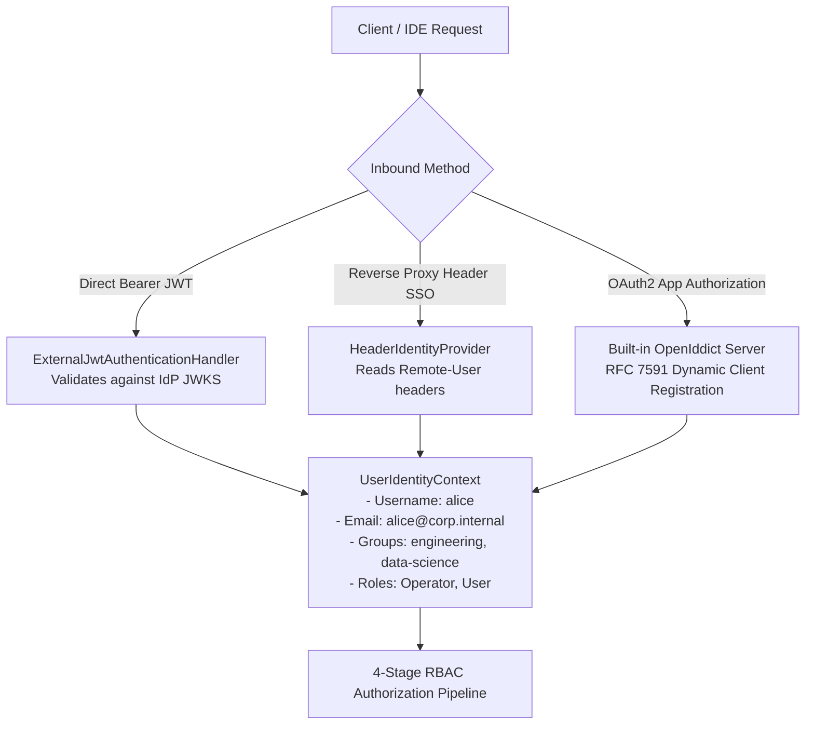
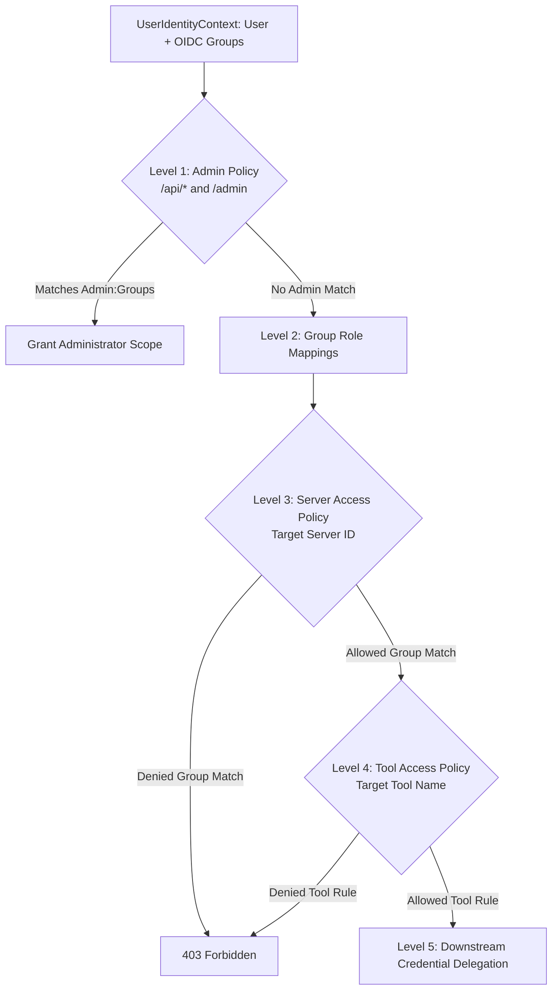

# OIDC, SSO Reverse Proxy & Downstream Delegation Guide

## 1. Overview

This guide describes how Model Context Gateway (MCG) integrates with OpenID Connect (OIDC) identity providers and Single Sign-On (SSO) reverse proxies. It explains how the gateway ingests user claims, evaluates access policies, and delegates credentials to downstream MCP servers.

Supported identity systems include:
- **Enterprise Identity Providers**: Microsoft Entra ID (Azure AD), Okta, Keycloak, Authentik, and In-House OIDC services.
- **SSO Ingress Proxies**: Traefik (ForwardAuth), Envoy, Nginx (`auth_request`), Caddy, Authelia, and PocketID.

---

## 2. Inbound Authentication Modes

The gateway supports three inbound authentication mechanisms for OIDC and SSO environments:



### 2.1 Mode 1: In-House IdP / External JWT Bearer
Use this mode when AI clients (such as Cursor, Claude Desktop, or custom agent runners) send Bearer tokens directly to the gateway.

- **Component**: `ExternalJwtAuthenticationHandler` (registered under authentication scheme `"ExternalJwt"`).
- **Validation Flow**:
  1. The client sends an HTTP request with `Authorization: Bearer <jwt>`.
  2. The gateway retrieves the provider metadata from `Identity:Jwt:Authority` (`/.well-known/openid-configuration`).
  3. The gateway downloads and caches the public JSON Web Key Set (JWKS) for 1 hour.
  4. The gateway verifies cryptographic signatures using asymmetric algorithms (RS256, ES256).
  5. The gateway enforces issuer (`Identity:Jwt:Issuer`) and audience (`Identity:Jwt:Audience`) constraints.
  6. The gateway validates token expiration with clock skew tolerances.
- **Claims Ingestion**:
  - Username: Extracted from `preferred_username`, `upn`, `email`, or `sub`.
  - Groups: Extracted from `groups` or `roles` claims.
  - SIDs: Extracted from `sid` or `group_sids` claims when bridging Active Directory identities.

---

### 2.2 Mode 2: Reverse Proxy Header SSO
Use this mode when an enterprise reverse proxy terminates TLS and authenticates users at the network edge.

- **Component**: `HeaderIdentityProvider` (registered under authentication scheme `"OidcHeader"`).
- **Security & Trusted Proxies**:
  - The gateway evaluates the client IP address against `Oidc:TrustedProxies`.
  - If the request originates from an untrusted IP, the gateway strips all identity headers and assigns the `guest` role.
  - Set `Oidc:RequireTrustedProxy` to `true` in production to prevent header spoofing.
- **Header Resolution**:
  - **User Headers**: Reads `Remote-User`, `X-Forwarded-User`, `X-Auth-Request-User`, or `X-User`.
  - **Group Headers**: Reads `Remote-Groups`, `X-Forwarded-Groups`, `X-Auth-Request-Groups`, or `sso_groups`.
  - **SID Headers**: Reads `Remote-User-Sid` or `X-Auth-Request-Sid`.
  - The gateway parses groups from comma-separated strings or JSON arrays.

---

### 2.3 Mode 3: Built-in OAuth 2.0 Authorization Server (`OpenIddict`)
Use this mode when third-party applications or developer tools request scoped access on behalf of users.

- **Dynamic Client Registration (RFC 7591)**:
  - IDEs register client credentials using `POST /api/register` or `manage_clients`.
  - The gateway issues a client identifier and secret with configured redirect URIs.
- **Interactive User Consent**:
  - When an application requests access, the user visits `/connect/authorize`.
  - The user approves or denies specific backend server permissions on the `/consent` screen.
  - The gateway issues short-lived access tokens containing approved scopes.

---

## 3. Multi-Level Authorization for OIDC Groups

The gateway evaluates OIDC user groups through a multi-level authorization pipeline:



### Level 1: Administrative Control (`AdminPolicy`)
- Protects administrative APIs (`/api/*`) and the Admin MCP Server (`/admin`, `/mcg-admin`).
- Compares caller groups against `Admin:Groups` (such as `["full_admin", "devops_leads"]`).
- Matching users receive full gateway administration privileges.

### Level 2: Group Role Mappings (`GroupMappings` Table)
- Maps external OIDC group claims to internal gateway roles.
- Examples:
  - `oidc:engineering-leads` &rarr; `Operator` (can toggle and reconnect servers).
  - `oidc:compliance-auditors` &rarr; `Auditor` (can view diagnostics and audit logs).
  - `oidc:platform-admins` &rarr; `Administrator` (full administrative rights).

### Level 3: Server-Level Access Control (`Policies` Table)
- Restricts backend MCP servers using server `AllowedGroups` and `DeniedGroups`.
- **Explicit Deny Precedence**: If a user belongs to any denied group, the gateway rejects access immediately.
- Example:
  - Server `finance-mcp`: `AllowedGroups: ["finance-team", "accounting"]`.
  - Non-members receive `403 Forbidden`.

### Level 4: Tool-Level Access Control (`Policies` Table)
- Restricts specific tool functions within a server to designated OIDC groups.
- Example:
  - All authenticated users can invoke `jira/get_issue`.
  - Only members of `jira-project-managers` can invoke `jira/delete_project`.

---

## 4. Downstream Credential Delegation

When an authorized client invokes a backend MCP server, the gateway delegates credentials using one of five patterns:

| Delegation Pattern | How Credentials Are Sent | Primary Use Case |
| :--- | :--- | :--- |
| **1. Trusted Gateway Identity Propagation** | `X-Forwarded-User: <username>`<br>`X-Forwarded-Groups: <groups>` | Internal microservices that enforce Row-Level Security (RLS). |
| **2. RFC 8693 Token Exchange** | `Authorization: Bearer <downstream_jwt>` | Zero-trust microservices requiring audience-scoped tokens. |
| **3. Bring Your Own Key (BYOK)** | `Authorization: Bearer <user_token>` | Per-user personal access tokens (Slack, GitHub, Jira). |
| **4. Pass-Through Dynamic JWT** | `Authorization: Bearer <target_jwt>` | Target-specific proxy routes (`/{serverId}`) with client tokens. |
| **5. Shared Service Account** | `Authorization: Bearer <shared_key>`<br>`X-API-Key: <shared_key>` | Shared backend infrastructure (Docker, Home Assistant, Postgres). |

> For complete details on all downstream delegation modes, transport formatting, and mixing guardrails, read the [**Downstream Authentication & Credential Delegation Guide**](downstream-auth-and-delegation-guide.md).

---

## 5. Configuration Reference

### Application Settings (`appsettings.json`)
```json
{
  "Admin": {
    "Groups": [
      "full_admin",
      "platform-admins"
    ]
  },
  "Oidc": {
    "TrustedProxies": "10.0.0.1,172.16.0.0/12",
    "RequireTrustedProxy": true
  },
  "Identity": {
    "HeaderAuth": {
      "UserHeaders": [
        "Remote-User",
        "X-Forwarded-User"
      ],
      "GroupHeaders": [
        "Remote-Groups",
        "X-Forwarded-Groups"
      ]
    },
    "Jwt": {
      "Enabled": true,
      "Authority": "https://idp.corp.internal/auth/realms/corp",
      "Audience": "model-context-gateway",
      "Issuer": "https://idp.corp.internal/auth/realms/corp"
    }
  }
}
```

### Environment Variable Overrides
```bash
Admin__Groups__0="full_admin"
Admin__Groups__1="platform-admins"
Oidc__TrustedProxies="10.0.0.1,172.16.0.0/12"
Oidc__RequireTrustedProxy="true"
Identity__Jwt__Enabled="true"
Identity__Jwt__Authority="https://idp.corp.internal/auth/realms/corp"
Identity__Jwt__Audience="model-context-gateway"
Identity__Jwt__Issuer="https://idp.corp.internal/auth/realms/corp"
```
