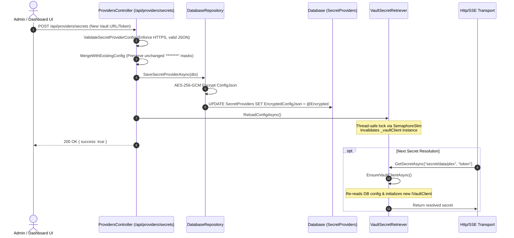

# 🔐 Enterprise Secret Providers and Key Management Guide

The **Model Context Gateway (MCG)** provides a pluggable secrets management system (`ISecretRetriever`). It prevents storing plaintext credentials (such as API keys, Bearer tokens, passwords, and service account keys) in database tables, configuration files, or container environment variables. MCG routes and secures traffic for the Model Context Protocol (MCP).

This guide explains supported secret providers, AES-256-GCM (Advanced Encryption Standard in Galois/Counter Mode) encryption at rest, runtime configuration reloading, audit sanitization, Docker settings, and troubleshooting.

> [!TIP]
> **Need server setup recipes?** Read the [**MCP Server Authentication & Integration Cookbook**](mcp-server-auth-cookbook.md) for lookup tables and configuration examples (*"If your server requires Bearer / Custom Header / Basic Auth / Vault / STDIO ➔ Setup is Y"*).

---

## 📑 Table of Contents
- [Architecture Overview](#architecture-overview)
- [Supported Secret Providers](#supported-secret-providers)
  - [1. HashiCorp Vault (KV v2)](#1-hashicorp-vault-kv-v2)
  - [2. Windows Registry (DPAPI)](#2-windows-registry-dpapi)
  - [3. Environment Variables](#3-environment-variables)
- [Encryption at Rest and Key Derivation](#encryption-at-rest-and-key-derivation)
  - [AES-256-GCM Envelope Encryption](#aes-256-gcm-envelope-encryption)
  - [Master Key Derivation (PBKDF2)](#master-key-derivation-pbkdf2)
- [Dynamic Runtime Reloading](#dynamic-runtime-reloading)
- [Secret Redaction and Audit Safety](#secret-redaction-and-audit-safety)
  - [Masking and Mask-Preserving Updates](#masking-and-mask-preserving-updates)
  - [Audit Trail Sanitization](#audit-trail-sanitization)
  - [Fail-Closed Security Validation](#fail-closed-security-validation)
- [Configuration Examples](#configuration-examples)
  - [Docker Compose with HashiCorp Vault](#docker-compose-with-hashicorp-vault)
  - [Vault KV v2 and AppRole Setup Commands](#vault-kv-v2-and-approle-setup-commands)
  - [Registering Backend MCP Servers with Secrets](#registering-backend-mcp-servers-with-secrets)
- [Troubleshooting and Operational Guide](#troubleshooting-and-operational-guide)

---

## 🏛️ Architecture Overview

When an incoming client request (over HTTP, Server-Sent Events [SSE], or Standard Input/Output [STDIO]) targets a downstream MCP server, the router resolves credentials on demand using `CompositeSecretRetriever`.

```mermaid
flowchart TD
    Client["Client IDE / LLM Agent"] -->|JSON-RPC Request| Router["Model Context Gateway (MCG)"]
    Router --> Transport["Transport Layer (HTTP / SSE / STDIO)"]
    Transport -->|ResolveTokenAsync| Composite["CompositeSecretRetriever"]
    
    Composite -->|Check Cache (10m TTL)| MemoryCache[("IMemoryCache")]
    MemoryCache -.->|Cache Hit| Transport
    
    MemoryCache -.->|Cache Miss| ProviderRouter{"Secret Provider?"}
    
    ProviderRouter -->|Vault| VaultRetriever["VaultSecretRetriever (KV v2)"]
    ProviderRouter -->|WindowsRegistry| RegRetriever["WindowsRegistrySecretRetriever (DPAPI)"]
    ProviderRouter -->|Environment| EnvRetriever["EnvironmentSecretRetriever"]
    
    VaultRetriever -->|AppRole / Token Auth| VaultService[("HashiCorp Vault Server")]
    RegRetriever -->|HKLM / LocalMachine| WinRegistry[("Windows Registry Hive")]
    EnvRetriever -->|Process Env| SystemEnv[("Container Environment")]
    
    VaultService --> CacheAndReturn["Cache in Memory & Inject Bearer Header"]
    WinRegistry --> CacheAndReturn
    SystemEnv --> CacheAndReturn
    CacheAndReturn --> Downstream["Downstream MCP Server (Docker, Plex, HA, etc.)"]
```

### Core Architecture Rules:
1. **Zero Plaintext Storage**: The gateway never stores unencrypted credentials in SQLite, Microsoft SQL Server, or MySQL tables.
2. **Fail-Closed Resolution**: If a configured secret provider cannot resolve a secret, the gateway throws an explicit `SecurityException`. It never falls back to plaintext.
3. **In-Memory Cache with Rolling TTL**: Resolved secrets remain in memory (`IMemoryCache`) for 5 to 10 minutes. This avoids repeated remote network calls while still supporting secret rotation. TTL means Time-to-Live.
4. **Platform Isolation**: Providers inspect operating system capabilities at runtime. On Linux containers, the Windows Registry provider returns `null` safely without crashing.

---

## 🔌 Supported Secret Providers

### 1. HashiCorp Vault (KV v2)
**Implementation**: [`VaultSecretRetriever.cs`](https://github.com/spelech/model-context-gateway/blob/main/Infrastructure/Secrets/VaultSecretRetriever.cs)  
**Provider Identifiers**: `"HashiCorpVault"` or `"Vault"`

The Vault retriever connects to HashiCorp Vault Key-Value Version 2 (`kv-v2`) secret engines.

#### Features:
* **Key-Value v2 Engine**: Reads versioned secrets from `v1/{mountPoint}/data/{secretPath}`.
* **Authentication Methods**:
  * **AppRole Authentication**: Recommended for production systems. Requires `roleId` and `secretId`.
  * **Token Authentication**: Static token authentication using `token` (or `vault_token`).
* **Environment Fallbacks**:
  * If configuration is missing from the database, the gateway reads `VAULT_ADDR` and `VAULT_TOKEN` (or `Vault:Address`, `Vault:RoleId`, `Vault:SecretId`) from environment variables.
* **Just-In-Time (JIT) Token TTL Monitoring and Renewal**:
  * Before reading secrets, the retriever checks remaining token lifetime using `client.V1.Auth.Token.LookupSelfAsync()`.
  * If the remaining TTL is **less than 300 seconds (5 minutes)** or lookup fails, the retriever rebuilds the client and authenticates again. This prevents dropped requests during long sessions.
* **Memory Caching**:
  * Successfully resolved secrets stay in `IMemoryCache` for 10 minutes under `vault:{mountPoint}:{path}:{keyName}`. The retriever checks this cache before making network calls.

#### Database Configuration JSON Schema:
```json
{
  "address": "https://vault.homelab.local:8200",
  "mountPath": "secret",
  "roleId": "d3b07384-d113-4ec4-9c8e-32432c23ae91",
  "secretId": "6c2e39ff-b52b-426b-9c78-65e3170e7039"
}
```
*Alternatively, for static token authentication:*
```json
{
  "address": "https://vault.homelab.local:8200",
  "mountPath": "secret",
  "token": "hvs.CAESIJ7...sampleVaultToken"
}
#### User Secrets in HashiCorp Vault (`VaultUserSecretStore`)
*(Introduced in v5.12.0)*

MCG supports storing per-user MCP credentials (such as personal tokens for Slack, GitHub, or Jira) directly in HashiCorp Vault instead of the local encrypted SQLite/SQL database.

* **Configuration**:
  Set `Secrets:UserStore:Provider` (or environment variable `MCG_USER_SECRET_STORE`) to `"Vault"`.
* **Path Templating**:
  Configure `Secrets:UserStore:PathTemplate` (or `VAULT_USER_SECRET_PATH_TEMPLATE`) to customize the Vault secret path. Supported replacement tokens include:
  * `{Company}` / `{company}`: Configured tenant or enterprise name (defaults to `MCG_COMPANY_NAME` or `"default"`).
  * `{User}` / `{user}` / `{username}`: The sanitized username of the authenticated user.
  * `{Server}` / `{server}` / `{app}`: The target backend MCP server identifier.

  *Example Path Template*:
  `{Company}/mcgateway/{User}/{Server}` resolves for user `steve` accessing `slack` in `acme-corp` to:
  `acme-corp/mcgateway/steve/slack`
* **Discrete Key and JSON Storage**:
  `VaultUserSecretStore` supports reading both individual credential keys (`secret`, `access_token`, `token`, `key`, `password`) or structured JSON objects containing multi-field authentication blobs (`client_id`, `client_secret`, `access_token`).
* **Full Self-Service CRUD**:
  Users can save, update, list, and delete their backend secrets via the Web UI or API, which translates directly to Vault KV v2 `WriteSecretAsync` and `DeleteSecretAsync` operations.

---

### 2. Windows Registry (DPAPI)
**Implementation**: [`WindowsRegistrySecretRetriever.cs`](https://github.com/spelech/model-context-gateway/blob/main/Infrastructure/Secrets/WindowsRegistrySecretRetriever.cs)  
**Provider Identifiers**: `"WindowsRegistry"` or `"Registry"`

The Windows Registry retriever reads encrypted or plaintext configuration values from the Windows Registry on the host machine. DPAPI stands for Data Protection Application Programming Interface.

#### Features:
* **Registry Hive**: Accesses `RegistryHive.LocalMachine` (`HKLM`) using `RegistryView.Registry64`.
* **DPAPI Decryption**:
  * If the registry value is a binary `byte[]` blob, the gateway decrypts it using `ProtectedData.Unprotect(rawBytes, null, DataProtectionScope.LocalMachine)`.
  * If the registry value is a `string`, the gateway returns it directly.
* **Operating System Requirements**:
  > [!IMPORTANT]
  > **Windows-Only Requirement**: The Windows Registry retriever requires `Microsoft.Win32.Registry` and Windows DPAPI. When running inside Linux containers (Docker) or macOS environments, the gateway detects the non-Windows operating system and returns `null` safely without unhandled exceptions.

#### Resolution Syntax:
* **Registry Path (`secretPath`)**: `SOFTWARE\Homelab\McpSecrets`
* **Value Name (`keyName`)**: `PlexToken` or `DockerApiKey`

---

### 3. Environment Variables
**Implementation**: [`EnvironmentSecretRetriever.cs`](https://github.com/spelech/model-context-gateway/blob/main/Infrastructure/Secrets/EnvironmentSecretRetriever.cs)  
**Provider Identifiers**: `"Environment"` or `"Env"`

The Environment retriever reads operating system and container environment variables at runtime. You do not need to store secret values in database tables.

#### Features:
* **Two-Step Lookup**:
  1. Checks `Environment.GetEnvironmentVariable(keyName)`.
  2. If empty and `secretPath` is set, checks `Environment.GetEnvironmentVariable(secretPath)`.
* **Accepted Variable Patterns**:
  * `MY_SECRET_KEY`
  * `env:MY_SECRET_KEY`
  * `${MY_SECRET_KEY}`

---

## 🔒 Encryption at Rest and Key Derivation

All secret provider configurations stored in the database (such as `SecretProviders.EncryptedConfigJson` and `AuthProviderConfigs.EncryptedConfigJson`) are encrypted at rest using authenticated symmetric encryption.

### AES-256-GCM Envelope Encryption
**Implementation**: [`SymmetricEncryptionHelper.cs`](https://github.com/spelech/model-context-gateway/blob/main/Infrastructure/Secrets/SymmetricEncryptionHelper.cs)

* **Cipher**: `AES-256-GCM` (Galois/Counter Mode).
* **Nonce**: 96-bit (12-byte) cryptographically secure random nonce generated per payload via `RandomNumberGenerator.GetBytes(12)`. A nonce is a number used once.
* **Authentication Tag**: 128-bit (16-byte) tag that verifies ciphertext integrity and prevents data tampering.
* **Packed Base64 Format**:
  ```
  +-------------------+------------------+-----------------------------+
  | Nonce (12 Bytes)  | Tag (16 Bytes)   | Ciphertext (N Bytes)        |
  +-------------------+------------------+-----------------------------+
  ```
  The gateway encodes this combined byte array as a Base64 string.

### Master Key Resolution Hierarchy and Lifecycle

**Implementation**: [`DbKeyHelper.cs`](https://github.com/spelech/model-context-gateway/blob/main/Infrastructure/Secrets/DbKeyHelper.cs)

The gateway resolves the 256-bit encryption key in this order of precedence, tracking the `KeySource`:

1. **Vault Master Key Bootstrapping (`KeySource.External`)**:
   In multi-node clusters with `VAULT_ADDR`, the gateway fetches `secret/data/mcg/master-key` (or `secret/data/mcp-router/master-key`) directly from Vault.
2. **Environment Variables (`KeySource.External`)**:
   Checks `MCG_MASTER_KEY`, `MCG_SECRET`, or `DB_ENCRYPTION_KEY`.
3. **Secret File Mount (`KeySource.External`)**:
   Checks `MCG_MASTER_KEY_FILE` or default Docker/Kubernetes paths (`/run/secrets/mcg_master_key`, `/run/secrets/master_key`).
4. **Existing Configured Keyfile (`KeySource.Configured`)**:
   Reads `./data/.master.key` created or configured by an administrator.
5. **Auto-Generated Persistent Keyfile (`KeySource.AutoGenerated`)**:
   If no master key is supplied on first boot, the gateway creates a 256-bit key automatically. It saves the key to `./data/.master.key` with restricted permissions (`chmod 0600`).

### Dynamic Database Re-Encryption and Master Key Updates

When the gateway runs on an auto-generated key (`KeySource.AutoGenerated`), the Web UI displays a prompt. Administrators can promote a permanent Master Key at runtime without downtime:

1. **API and Admin MCP Tool**:
   - Web UI: `POST /api/config/master-key` with `{ "masterKey": "Your32CharKey" }`
   - Admin MCP Server: `manage_system(action: "set_master_key", newKey: "Your32CharKey")`
2. **Atomic Transaction**:
   - Decrypts all existing rows in `SecretProviders`, `AuthProviderConfigs`, `Servers`, and `UserSecrets` using the active key.
   - Re-encrypts all rows using the new master key.
   - Overwrites `./data/.master.key` with the new key value.
   - Updates the key cache in memory and sets `KeySource` to `Configured`.

### Master Key Derivation (PBKDF2)

The gateway derives the 256-bit encryption key from the master secret using Password-Based Key Derivation Function 2 (PBKDF2):

1. **Derivation Settings**:
   - **Salt**: `SHA256(masterSecret + "_McpRouter_Salt_v2")`
   - **Iterations**: `600,000` rounds
   - **Hash Algorithm**: `HMAC-SHA256`
   - **Key Length**: 256 bits (32 bytes)

2. **Dual-Key Rotation Fallback**:
   When reading stored payloads, `SymmetricEncryptionHelper` decrypts with the primary key. If authentication fails, it attempts fallback decryption using `DB_ENCRYPTION_KEY` before reporting an error.

### Declarative Admin AppKey Seeding (`MCG_ADMIN_AUTH_KEY` / `MCG_ADMIN_KEY`)

The gateway supports declarative admin key setup:
- **Environment Variables**: `MCG_ADMIN_AUTH_KEY` or `MCG_ADMIN_KEY`.
- **Behavior**: On startup, `ClientAppKeySeeder` hashes and seeds the admin key for user `admin` with `["all", "admin"]` scopes. If omitted on initial startup, MCG generates a compact Base62 key.

---

## ⚡ Dynamic Runtime Reloading

**Implementation**: [`ProvidersController.cs`](https://github.com/spelech/model-context-gateway/blob/main/Components/Providers/ProvidersController.cs)

To maintain continuous uptime for AI assistants and IDEs, Model Context Gateway supports **hot-reloading secret providers without restarting the application or container**.



### Thread Safety and Zero Downtime:
- `VaultSecretRetriever` protects client creation with a `SemaphoreSlim(1, 1)` lock.
- Calling `ReloadConfigAsync()` clears the internal `_vaultClient` reference safely.
- The next request creates a new client using the updated database configuration. Active sessions continue without interruptions.

---

## 🛡️ Secret Redaction and Audit Safety

**Implementation**: [`ProviderConfigSecurityHelper.cs`](https://github.com/spelech/model-context-gateway/blob/main/Components/Providers/ProviderConfigSecurityHelper.cs)

To enforce Zero Trust security, Model Context Gateway applies multi-layered redaction across all APIs and log outputs.

### Masking and Mask-Preserving Updates
1. **Automatic JSON Redaction**:
   Any property matching sensitive tokens (`token`, `vault_token`, `secret_id`, `role_id`, `password`, `bind_password`, `apikey`, `client_secret`, `master_key`, or terms containing `secret`, `token`, or `password`) is replaced with `********` on query endpoints:
   - `GET /api/providers`
   - `GET /api/providers/secrets`
   - `GET /api/admin/providers`
2. **Mask Preservation (`MergeWithExistingConfig`)**:
   When administrators update non-sensitive fields (such as a Vault URL or mount path) in the UI, masked values (`********`) are merged with existing decrypted database values. Operators do not need to re-enter sensitive tokens when modifying metadata.

### Audit Trail Sanitization
Administrative operations trigger audit logs through `IAuditLogger.LogAdminActionAsync`. Before saving records, the system filters payloads through `RedactConfigJson`. Audit records in `AuditLogs` and standard console logs never contain plaintext passwords.

### Fail-Closed Security Validation
- **JSON Object Verification**: Configuration bodies must be valid JSON objects.
- **HTTPS Enforcement**: Vault endpoints must use secure `https://` URLs (checked by `SecurityValidationHelper.ValidateJsonUrlsRequireHttps`).
- **AppRole Completeness**: When you supply `roleId`, you must also supply `secretId`.

---

## 📋 Configuration Examples

### Docker Compose with HashiCorp Vault

This `docker-compose.yaml` file configures `mcg` connected to a local `vault` container with persistent data and network isolation:

```yaml
version: '3.8'

networks:
  mcp_network:
    driver: bridge

volumes:
  mcg_data:
  vault_data:

services:
  vault:
    image: hashicorp/vault:1.15
    container_name: mcp-vault
    restart: unless-stopped
    environment:
      VAULT_DEV_ROOT_TOKEN_ID: "dev-root-token-homelab-2026"
      VAULT_DEV_LISTEN_ADDRESS: "0.0.0.0:8200"
    ports:
      - "8200:8200"
    volumes:
      - vault_data:/vault/file
    cap_add:
      - IPC_LOCK
    networks:
      - mcp_network

  mcg:
    image: ghcr.io/spelech/model-context-gateway:latest
    container_name: mcg
    restart: unless-stopped
    ports:
      - "8080:8080"
    environment:
      - ASPNETCORE_ENVIRONMENT=Production
      - MCG_MASTER_KEY=SuperSecretDeploymentMasterKey2026!MustBe32CharsLong
      # Vault bootstrap environment (or configure via UI /api/providers/secrets)
      - VAULT_ADDR=http://vault:8200
      - VAULT_TOKEN=dev-root-token-homelab-2026
    volumes:
      - mcg_data:/app/data
    depends_on:
      - vault
    networks:
      - mcp_network
```

---

### Vault KV v2 and AppRole Setup Commands

Run these commands inside your Vault container to configure the KV v2 secrets engine, create access policies, and generate AppRole credentials:

```bash
# 1. Enable Key-Value Version 2 engine at 'secret/'
vault secrets enable -version=2 -path=secret kv

# 2. Write sample secrets for downstream MCP servers
vault kv put secret/services/docker api_key="dckr_pat_9981240a1b2c3d4e5f"
vault kv put secret/services/homeassistant api_key="eyJhbGciOiJIUzI1NiIsIn..."
vault kv put secret/services/plex token="plx_token_abc123xyz"

# 3. Create least-privilege policy for MCG
cat << 'EOF' > /tmp/mcg-policy.hcl
path "secret/data/*" {
  capabilities = ["read"]
}
path "auth/token/lookup-self" {
  capabilities = ["read"]
}
path "auth/token/renew-self" {
  capabilities = ["update"]
}
EOF

vault policy write mcg /tmp/mcg-policy.hcl

# 4. Enable and configure AppRole
vault auth enable approle
vault write auth/approle/role/mcg-role \
    token_policies="mcg" \
    token_ttl=1h \
    token_max_ttl=24h

# 5. Fetch Role ID and Secret ID
ROLE_ID=$(vault read -field=role_id auth/approle/role/mcg-role/role-id)
SECRET_ID=$(vault write -f -field=secret_id auth/approle/role/mcg-role/secret-id)

echo "Vault Role ID: $ROLE_ID"
echo "Vault Secret ID: $SECRET_ID"
```

---

### Registering Backend MCP Servers with Secrets

#### Example 1: Server Configured with HashiCorp Vault
```json
{
  "id": "docker_mcp",
  "name": "Docker Management MCP",
  "url": "http://docker-mcp:8080/sse",
  "transportType": "sse",
  "category": "Infrastructure",
  "secretProvider": "Vault",
  "secretMount": "secret",
  "secretPath": "services/docker",
  "secretField": "api_key"
}
```

#### Example 2: Server Configured with Environment Variable
```json
{
  "id": "plex_mcp",
  "name": "Plex Media Server MCP",
  "url": "http://plex-mcp:8080/mcp",
  "transportType": "http",
  "category": "Media",
  "secretProvider": "Environment",
  "secretItemKey": "PLEX_API_TOKEN"
}
```

#### Example 3: Server Configured with Windows Registry (DPAPI)
```json
{
  "id": "actual_budget",
  "name": "Actual Budget MCP",
  "url": "http://actual-budget:5006/mcp",
  "transportType": "http",
  "category": "Cloud",
  "secretProvider": "WindowsRegistry",
  "secretPath": "SOFTWARE\\Homelab\\McpSecrets",
  "secretField": "ActualBudgetPassword"
}
```

---

## 🛠️ Troubleshooting and Operational Guide

| Symptom or Error | Probable Cause | Verified Resolution |
| :--- | :--- | :--- |
| **`401 Unauthorized: Vault secret read failed`** | Expired or invalid Vault token or AppRole Secret ID. | Verify `token_ttl` and `token_max_ttl` in Vault AppRole. Confirm JIT renewal can access `auth/token/lookup-self` in the Vault policy. |
| **`403 Forbidden: permission denied at secret/data/...`** | Vault Access Control List (ACL) path mismatch. | Vault KV v2 paths require the `data/` prefix in policies (`path "secret/data/*"`). Ensure the policy includes `secret/data/*`. |
| **`SecurityException: Failed to resolve secret from provider 'Vault'...`** | The secret key or path does not exist in Vault. | Run `vault kv get secret/<path>` to confirm the field name matches `secretField` exactly (case-sensitive). |
| **`FATAL: Master encryption key is missing.`** | Neither `MCG_MASTER_KEY` nor `DB_ENCRYPTION_KEY` is set. | Define `MCG_MASTER_KEY` in `docker-compose.yaml` or `.env`. Provide a persistent, non-empty secret string. |
| **`WindowsRegistry provider returns null`** | The gateway is running in a Linux or Docker container. | Windows Registry lookups require a Windows host. Switch the server's `secretProvider` to `Vault` or `Environment`. |
| **`System.Net.Http.HttpRequestException: Connection refused`** | Network separation between Gateway and Vault. | Ensure both containers share the Docker network bridge (`networks: [mcp_network]`) and use container DNS names (such as `http://vault:8200`). |
| **`ArgumentException: Vault Address must use HTTP or HTTPS scheme`** | Malformed URL in database or environment. | Ensure `address` begins with `https://` (or `http://` for local development networks). |

---

## 🔗 Related Documentation and Links

- [Official User Guide: Server Management & Secrets](user-guide/02-server-management-and-secrets.md)
- [Architecture & Domain Model](architecture.md)
- [Features & Usage Guide](features-guide.md)
- [Security & Access Control (RBAC)](user-guide/03-rbac-and-security.md)
