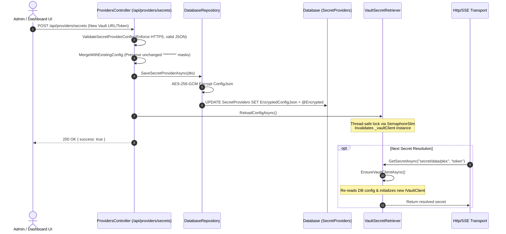

# 🔐 Enterprise Secret Providers & Key Management Guide

The **Model Context Gateway (MCG) & Semantic Proxy** provides a pluggable secrets management subsystem (`ISecretRetriever`). It prevents plaintext storage of downstream MCP server credentials (API keys, bearer tokens, passwords, service account keys) in database columns, configuration files, or container environments.

This guide details supported secret providers, AES-256-GCM encryption-at-rest architecture, dynamic runtime reloading, audit safety mechanisms, Docker configurations, and troubleshooting.

> [!TIP]
> **Need server setup recipes?** Check the [**MCP Server Authentication & Integration Cookbook**](mcp-server-auth-cookbook.md) for quick-lookup tables and copy-paste examples (*"If your server requires Bearer / Custom Header / Basic Auth / Vault / STDIO ➔ Setup is Y"*).

---

## 📑 Table of Contents
- [Architecture Overview](#architecture-overview)
- [Supported Secret Providers](#supported-secret-providers)
  - [1. HashiCorp Vault (KV v2)](#1-hashicorp-vault-kv-v2)
  - [2. Windows Registry (DPAPI)](#2-windows-registry-dpapi)
  - [3. Environment Variables](#3-environment-variables)
- [Encryption at Rest & Key Derivation](#encryption-at-rest-key-derivation)
  - [AES-256-GCM Envelope Encryption](#aes-256-gcm-envelope-encryption)
  - [Master Key Derivation (PBKDF2)](#master-key-derivation-pbkdf2)
- [Dynamic Runtime Reloading](#dynamic-runtime-reloading)
- [Secret Redaction & Audit Safety](#secret-redaction-audit-safety)
  - [Masking & Mask-Preserving Updates](#masking-mask-preserving-updates)
  - [Audit Trail Sanitization](#audit-trail-sanitization)
  - [Fail-Closed Security Validation](#fail-closed-security-validation)
- [Copy-Pasteable Configuration Examples](#copy-pasteable-configuration-examples)
  - [Docker Compose with HashiCorp Vault](#docker-compose-with-hashicorp-vault)
  - [Vault KV v2 & AppRole Setup Commands](#vault-kv-v2-approle-setup-commands)
  - [Registering Backend MCP Servers with Secrets](#registering-backend-mcp-servers-with-secrets)
- [Troubleshooting & Operational Guide](#troubleshooting-operational-guide)

---

## 🏛️ Architecture Overview

When an incoming client request (via HTTP, SSE, or STDIO) requires communication with a downstream MCP server, the router resolves the required authentication token on-demand using the `CompositeSecretRetriever`.

```mermaid
flowchart TD
    Client["Client IDE / LLM Agent"] -->|JSON-RPC Request| Router["Model Context Gateway (MCG)"]
    Router --> Transport["Transport Layer (HTTP / SSE / STDIO)"]
    Transport -->|ResolveTokenAsync| Composite["CompositeSecretRetriever"]
    
    Composite -->|Check Cache (10m TTL)| MemoryCache[("IMemoryCache")]
    MemoryCache -.->|Cache Hit| Transport
    
    MemoryCache -.->|Cache Miss| ProviderRouter{"Secret Provider?"}
    
    ProviderRouter -->|Vault| VaultRetriever["VaultSecretRetriever (KV v2)"]
    ProviderRouter -->|WindowsRegistry| RegRetriever["WindowsRegistrySecretRetriever (DPAPI)"]
    ProviderRouter -->|Environment| EnvRetriever["EnvironmentSecretRetriever"]
    
    VaultRetriever -->|AppRole / Token Auth| VaultService[("HashiCorp Vault Server")]
    RegRetriever -->|HKLM / LocalMachine| WinRegistry[("Windows Registry Hive")]
    EnvRetriever -->|Process Env| SystemEnv[("Container Environment")]
    
    VaultService --> CacheAndReturn["Cache in Memory & Inject Bearer Header"]
    WinRegistry --> CacheAndReturn
    SystemEnv --> CacheAndReturn
    CacheAndReturn --> Downstream["Downstream MCP Server (Docker, Plex, HA, etc.)"]
```

### Key Architectural Guarantees:
1. **Zero Plaintext Storage**: Secrets are never persisted unencrypted in SQLite, MS SQL Server, or MySQL databases.
2. **Fail-Closed Resolution**: If a configured secret provider fails to resolve a secret, plaintext fallback is strictly disabled and an explicit `SecurityException` is thrown.
3. **In-Memory Caching with Rolling TTL**: Resolved secrets are cached in `IMemoryCache` (5–10 minutes) to avoid degrading throughput with repeated remote secret store lookups while still supporting automated secret rotation.
4. **Platform Isolation**: Providers check OS capabilities at runtime (e.g., Windows Registry safely returns `null` on Linux containers without throwing).

---

## 🔌 Supported Secret Providers

### 1. HashiCorp Vault (KV v2)
**Implementation**: [`VaultSecretRetriever.cs`](https://github.com/spelech/model-context-gateway/blob/main/Infrastructure/Secrets/VaultSecretRetriever.cs)  
**Provider Identifiers**: `"HashiCorpVault"` or `"Vault"`

The Vault retriever integrates with HashiCorp Vault's Key-Value Version 2 (`kv-v2`) secret engine.

#### Features:
* **Key-Value v2 Engine**: Reads versioned secrets from the path `v1/{mountPoint}/data/{secretPath}`.
* **Authentication Methods**:
  * **AppRole Authentication**: Highly recommended for production workloads. Requires `roleId` and `secretId`.
  * **Token Authentication**: Direct token authentication via `token` (or `vault_token`).
* **Environment & Dev Fallbacks**:
  * If not configured in the database, automatically checks `VAULT_ADDR` and `VAULT_TOKEN` (or `Vault:Address`, `Vault:RoleId`, `Vault:SecretId`) from environment variables.
* **Just-In-Time (JIT) Token TTL Monitoring & Renewal**:
  * Before executing secret reads, the retriever inspects the token's remaining time-to-live using `client.V1.Auth.Token.LookupSelfAsync()`.
  * If the remaining TTL is **less than 300 seconds (5 minutes)** or lookup fails, the retriever automatically recreates the Vault client and re-authenticates to prevent dropped requests during long-running sessions.
* **High-Performance Memory Caching**:
  * Successfully retrieved secrets are cached in `IMemoryCache` for 10 minutes under the key pattern `vault:{mountPoint}:{path}:{keyName}`. The cache is checked before initiating network calls.

#### Database Configuration JSON Schema:
```json
{
  "address": "https://vault.homelab.local:8200",
  "mountPath": "secret",
  "roleId": "d3b07384-d113-4ec4-9c8e-32432c23ae91",
  "secretId": "6c2e39ff-b52b-426b-9c78-65e3170e7039"
}
```
*Alternatively, for static/dev token authentication:*
```json
{
  "address": "https://vault.homelab.local:8200",
  "mountPath": "secret",
  "token": "hvs.CAESIJ7...sampleVaultToken"
}
```

---

### 2. Windows Registry (DPAPI)
**Implementation**: [`WindowsRegistrySecretRetriever.cs`](https://github.com/spelech/model-context-gateway/blob/main/Infrastructure/Secrets/WindowsRegistrySecretRetriever.cs)  
**Provider Identifiers**: `"WindowsRegistry"` or `"Registry"`

The Windows Registry retriever reads encrypted or plaintext configuration values directly from the host system's Windows Registry hive.

#### Features:
* **Registry Hive**: Accesses `RegistryHive.LocalMachine` (`HKLM`) using `RegistryView.Registry64`.
* **DPAPI Decryption**:
  * If the registry value is a `byte[]` binary blob, it is automatically decrypted using Windows DPAPI via `ProtectedData.Unprotect(rawBytes, null, DataProtectionScope.LocalMachine)`.
  * If the registry value is a `string`, it is returned directly.
* **Operating System Requirements**:
  > [!IMPORTANT]
  > **Windows-Only OS Requirement**: The Windows Registry retriever relies on `Microsoft.Win32.Registry` and Windows Data Protection API (DPAPI). When running inside Linux containers (Docker) or macOS environments, `RuntimeInformation.IsOSPlatform(OSPlatform.Windows)` safely returns `false`, causing the retriever to return `null` without throwing unhandled exceptions.

#### Resolution Syntax:
* **Registry Path (`secretPath`)**: `SOFTWARE\Homelab\McpSecrets`
* **Value Name (`keyName`)**: `PlexToken` or `DockerApiKey`

---

### 3. Environment Variables
**Implementation**: [`EnvironmentSecretRetriever.cs`](https://github.com/spelech/model-context-gateway/blob/main/Infrastructure/Secrets/EnvironmentSecretRetriever.cs)  
**Provider Identifiers**: `"Environment"` or `"Env"`

The Environment retriever allows dynamic interpolation of host or container environment variables at runtime without hardcoding keys into database tables.

#### Features:
* **Dual Resolution Strategy**:
  1. Searches for `Environment.GetEnvironmentVariable(keyName)`.
  2. If empty and `secretPath` is provided, searches for `Environment.GetEnvironmentVariable(secretPath)`.
* **Standard Variable Syntax**:
  * `MY_SECRET_KEY`
  * `env:MY_SECRET_KEY`
  * `${MY_SECRET_KEY}`

---

## 🔒 Encryption at Rest & Key Derivation

All secret provider configurations stored in the database (e.g. `SecretProviders.EncryptedConfigJson` and `AuthProviderConfigs.EncryptedConfigJson`) are encrypted at rest using industry-standard authenticated symmetric encryption.

### AES-256-GCM Envelope Encryption
**Implementation**: [`SymmetricEncryptionHelper.cs`](https://github.com/spelech/model-context-gateway/blob/main/Infrastructure/Secrets/SymmetricEncryptionHelper.cs)

* **Cipher**: `AES-256-GCM` (Galois/Counter Mode).
* **Nonce**: 96-bit (12-byte) cryptographically secure random nonce generated per payload via `RandomNumberGenerator.GetBytes(12)`.
* **Authentication Tag**: 128-bit (16-byte) MAC tag to prevent ciphertext tampering.
* **Packed Base64 Format**:
  ```
  +-------------------+------------------+-----------------------------+
  | Nonce (12 Bytes)  | Tag (16 Bytes)   | Ciphertext (N Bytes)        |
  +-------------------+------------------+-----------------------------+
  ```
  The concatenated byte array is stored as a standard Base64 string.

### Master Key Resolution Hierarchy & Lifecycle

**Implementation**: [`DbKeyHelper.cs`](https://github.com/spelech/model-context-gateway/blob/main/Infrastructure/Secrets/DbKeyHelper.cs)

The 256-bit symmetric encryption key is resolved according to the following precedence hierarchy, automatically detecting the origin `KeySource`:

1. **Vault Master Key Bootstrapping (`KeySource.External`)**:
   In enterprise multi-replica clusters, if `VAULT_ADDR` is present, the gateway connects to HashiCorp Vault (via AppRole, Token, or Kubernetes Service Account auth) and fetches `secret/data/mcg/master-key` (or `secret/data/mcp-router/master-key`).
2. **Environment Variables (`KeySource.External`)**:
   `MCG_MASTER_KEY`, `MCG_SECRET`, or `DB_ENCRYPTION_KEY`.
3. **Secret File Mount (`KeySource.External`)**:
   `MCG_MASTER_KEY_FILE` or standard Docker/Kubernetes secret mounts (`/run/secrets/mcg_master_key`, `/run/secrets/master_key`).
4. **Existing Configured Keyfile (`KeySource.Configured`)**:
   Persistent `./data/.master.key` configured explicitly by an administrator.
5. **Auto-Generated Persistent Keyfile (`KeySource.AutoGenerated`)**:
   If no master key is supplied on first boot, the gateway automatically generates a cryptographically secure 256-bit key and persists it to `./data/.master.key` (with restricted permissions `chmod 0600`).

### Dynamic Database Re-Encryption & Master Key Setting

When running with an auto-generated master key (`KeySource.AutoGenerated`), the Web UI surfaces an actionable indicator, allowing administrators to set a permanent Master Key at runtime without downtime:

1. **API / Admin MCP Tool**:
   - Web UI: `POST /api/config/master-key` with `{ "masterKey": "Your32CharKey" }`
   - Admin MCP Server: `manage_system(action: "set_master_key", newKey: "Your32CharKey")`
2. **Atomic Transaction**:
   - Decrypts all existing rows in `SecretProviders`, `AuthProviderConfigs`, `Servers`, and `UserSecrets` using the current active key.
   - Re-encrypts all rows using the new master key.
   - Overwrites `./data/.master.key` with the new key.
   - Updates the in-memory key cache and transitions `KeySource` to `Configured`.

### Master Key Derivation (PBKDF2)

The 256-bit symmetric encryption key is derived deterministically from the master secret using Password-Based Key Derivation Function 2 (PBKDF2):

1. **Key Derivation Parameters**:
   - **Salt**: `SHA256(masterSecret + "_McpRouter_Salt_v2")`
   - **Iterations**: `600,000` rounds
   - **Hash Algorithm**: `HMAC-SHA256`
   - **Key Length**: 256 bits (32 bytes)

2. **Dual-Key Rotation Fallback**:
   When reading stored payloads, `SymmetricEncryptionHelper` attempts decryption with the primary derived key. If tag validation fails (e.g., during secret rotation from a legacy key), it automatically falls back to attempt decryption using `DB_ENCRYPTION_KEY` before failing closed.

### Declarative Admin AppKey Seeding (`MCG_ADMIN_AUTH_KEY` / `MCG_ADMIN_KEY`)

The gateway supports declarative admin key provisioning:
- **Environment Variables**: `MCG_ADMIN_AUTH_KEY` or `MCG_ADMIN_KEY`.
- **Behavior**: On startup, `ClientAppKeySeeder` hashes and seeds the admin key for user `admin` with `["all", "admin"]` scopes. If omitted on initial startup, a compact Base62 admin key is generated.

---

## ⚡ Dynamic Runtime Reloading

**Implementation**: [`ProvidersController.cs`](https://github.com/spelech/model-context-gateway/blob/main/Components/Providers/ProvidersController.cs)

To maintain 99.999% uptime for connected AI agents and IDEs, Model Context Gateway (MCG) supports **hot-reloading of secret providers without restarting the application or Docker container**.



### Thread Safety & Zero Downtime:
- `VaultSecretRetriever` protects client creation with a `SemaphoreSlim(1, 1)` synchronization primitive.
- Calling `ReloadConfigAsync()` safely sets the internal `_vaultClient` to `null`.
- The very next request lazily re-instantiates the client using the newly saved database configuration without race conditions or dropped client connections.

---

## 🛡️ Secret Redaction & Audit Safety

**Implementation**: [`ProviderConfigSecurityHelper.cs`](https://github.com/spelech/model-context-gateway/blob/main/Components/Providers/ProviderConfigSecurityHelper.cs)

To adhere to Zero Trust principles, the Model Context Gateway (MCG) enforces multi-layered redaction and audit protection across all APIs and logs.

### Masking & Mask-Preserving Updates
1. **Automatic JSON Redaction**:
   Any property matching sensitive tokens (`token`, `vault_token`, `secret_id`, `role_id`, `password`, `bind_password`, `apikey`, `client_secret`, `master_key`, or properties containing `secret`, `token`, `password`) is automatically replaced with `********` whenever queried via:
   - `GET /api/providers`
   - `GET /api/providers/secrets`
   - `GET /api/admin/providers`
2. **Mask Preservation (`MergeWithExistingConfig`)**:
   When administrators update non-sensitive configuration fields (such as changing a Vault URL or Mount Path) in the UI, existing masked values (`********`) are merged with the existing decrypted secrets from the database. Administrators do not need to re-type or re-expose sensitive credentials when modifying metadata.

### Audit Trail Sanitization
All administrative changes trigger audit logs via `IAuditLogger.LogAdminActionAsync`. Before logging, configuration payloads are passed through `RedactConfigJson`. Audit logs stored in `AuditLogs` tables and emitted to standard out never contain plaintext credentials.

### Fail-Closed Security Validation
- **JSON Object Enforcement**: Configuration bodies must be valid JSON objects.
- **HTTPS Enforcement**: Vault endpoints must use secure `https://` URLs (validated via `SecurityValidationHelper.ValidateJsonUrlsRequireHttps`).
- **AppRole Completeness**: If `roleId` is supplied, `secretId` must also be present.

---

## 📋 Copy-Pasteable Configuration Examples

### Docker Compose with HashiCorp Vault

The following `docker-compose.yaml` provisions `mcg` connected to a local `vault` container with persistent data and mutual networking:

```yaml
version: '3.8'

networks:
  mcp_network:
    driver: bridge

volumes:
  mcg_data:
  vault_data:

services:
  vault:
    image: hashicorp/vault:1.15
    container_name: mcp-vault
    restart: unless-stopped
    environment:
      VAULT_DEV_ROOT_TOKEN_ID: "dev-root-token-homelab-2026"
      VAULT_DEV_LISTEN_ADDRESS: "0.0.0.0:8200"
    ports:
      - "8200:8200"
    volumes:
      - vault_data:/vault/file
    cap_add:
      - IPC_LOCK
    networks:
      - mcp_network

  mcg:
    image: ghcr.io/spelech/model-context-gateway:latest
    container_name: mcg
    restart: unless-stopped
    ports:
      - "8080:8080"
    environment:
      - ASPNETCORE_ENVIRONMENT=Production
      - MCG_MASTER_KEY=SuperSecretDeploymentMasterKey2026!MustBe32CharsLong
      # Vault bootstrap environment (or configure via UI /api/providers/secrets)
      - VAULT_ADDR=http://vault:8200
      - VAULT_TOKEN=dev-root-token-homelab-2026
    volumes:
      - mcg_data:/app/data
    depends_on:
      - vault
    networks:
      - mcp_network
```

---

### Vault KV v2 & AppRole Setup Commands

Run these commands inside your Vault container to initialize the KV v2 secrets engine, create a least-privilege policy, and generate AppRole credentials for the gateway:

```bash
# 1. Enable Key-Value Version 2 engine at 'secret/'
vault secrets enable -version=2 -path=secret kv

# 2. Write sample secrets for downstream MCP servers
vault kv put secret/services/docker api_key="dckr_pat_9981240a1b2c3d4e5f"
vault kv put secret/services/homeassistant api_key="eyJhbGciOiJIUzI1NiIsIn..."
vault kv put secret/services/plex token="plx_token_abc123xyz"

# 3. Create least-privilege policy for MCG
cat << 'EOF' > /tmp/mcg-policy.hcl
path "secret/data/*" {
  capabilities = ["read"]
}
path "auth/token/lookup-self" {
  capabilities = ["read"]
}
path "auth/token/renew-self" {
  capabilities = ["update"]
}
EOF

vault policy write mcg /tmp/mcg-policy.hcl

# 4. Enable and configure AppRole
vault auth enable approle
vault write auth/approle/role/mcg-role \
    token_policies="mcg" \
    token_ttl=1h \
    token_max_ttl=24h

# 5. Fetch Role ID and Secret ID
ROLE_ID=$(vault read -field=role_id auth/approle/role/mcg-role/role-id)
SECRET_ID=$(vault write -f -field=secret_id auth/approle/role/mcg-role/secret-id)

echo "Vault Role ID: $ROLE_ID"
echo "Vault Secret ID: $SECRET_ID"
```

---

### Registering Backend MCP Servers with Secrets

#### Example 1: Server Configured with HashiCorp Vault
```json
{
  "id": "docker_mcp",
  "name": "Docker Management MCP",
  "url": "http://docker-mcp:8080/sse",
  "transportType": "sse",
  "category": "Infrastructure",
  "secretProvider": "Vault",
  "secretMount": "secret",
  "secretPath": "services/docker",
  "secretField": "api_key"
}
```

#### Example 2: Server Configured with Environment Variable
```json
{
  "id": "plex_mcp",
  "name": "Plex Media Server MCP",
  "url": "http://plex-mcp:8080/mcp",
  "transportType": "http",
  "category": "Media",
  "secretProvider": "Environment",
  "secretItemKey": "PLEX_API_TOKEN"
}
```

#### Example 3: Server Configured with Windows Registry (DPAPI)
```json
{
  "id": "actual_budget",
  "name": "Actual Budget MCP",
  "url": "http://actual-budget:5006/mcp",
  "transportType": "http",
  "category": "Cloud",
  "secretProvider": "WindowsRegistry",
  "secretPath": "SOFTWARE\\Homelab\\McpSecrets",
  "secretField": "ActualBudgetPassword"
}
```

---

## 🛠️ Troubleshooting & Operational Guide

| Symptom / Error | Probable Cause | Verified Resolution |
| :--- | :--- | :--- |
| **`401 Unauthorized: Vault secret read failed`** | Expired or invalid Vault token / AppRole Secret ID. | Verify `token_ttl` and `token_max_ttl` in Vault AppRole. Confirm JIT renewal check has access to `auth/token/lookup-self` capability in the Vault policy. |
| **`403 Forbidden: permission denied at secret/data/...`** | Vault ACL policy path mismatch. | Vault KV v2 paths require the `data/` prefix in policies (`path "secret/data/*"`), but API lookups use mount `secret` and path `services/docker`. Ensure policy covers `secret/data/*`. |
| **`SecurityException: Failed to resolve secret from provider 'Vault'...`** | The requested secret key or path does not exist in Vault. | Run `vault kv get secret/<path>` to confirm the field name matches `secretField` exactly (case-sensitive). |
| **`FATAL: Master encryption key is missing.`** | Neither `MCG_MASTER_KEY` nor `DB_ENCRYPTION_KEY` is defined. | Define `MCG_MASTER_KEY` in `docker-compose.yaml` or `.env`. Ensure it is a persistent, non-empty secret string. |
| **`WindowsRegistry provider returns null`** | Model Context Gateway (MCG) is running in a Linux/Docker container. | Windows Registry lookups require a native Windows host environment. Switch the server's `secretProvider` to `Vault` or `Environment`. |
| **`System.Net.Http.HttpRequestException: Connection refused`** | Network isolation between Router and Vault. | Ensure both containers share the same Docker network bridge (`networks: [mcp_network]`) and use container DNS names (e.g. `http://vault:8200`). |
| **`ArgumentException: Vault Address must use HTTP or HTTPS scheme`** | Malformed URL in database or environment. | Ensure `address` starts with `https://` (or `http://` for local development networks). |

---

## 🔗 Related Documentation & Links

- [Official User Guide: Server Management & Secrets](user-guide/02-server-management-and-secrets.md)
- [Architecture & Domain Model](architecture.md)
- [Features & Usage Guide](features-guide.md)
- [Security & Access Control (RBAC)](user-guide/03-rbac-and-security.md)
