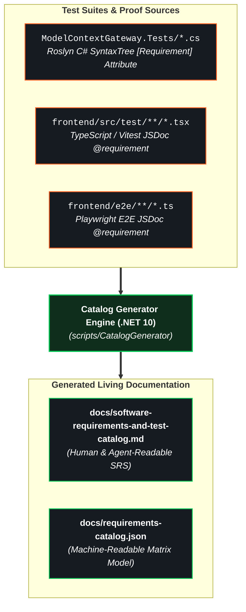

# Software Requirements Specification (SRS) & Test Catalog Guide

This guide describes the architecture, taxonomy, test annotation conventions, and generator workflows for the **Model Context Gateway (MCG) Software Requirements Specification (SRS) & Test Catalog**.

---

## 🎯 1. Overview & Architecture

The `ModelContextGateway` repository employs an automated, living requirements-to-test traceability system. Rather than maintaining static, easily outdated requirements matrices in external documentation tools, software requirements and safety guardrails are annotated directly on test proofs in source code.

The **Catalog Generator** (`scripts/CatalogGenerator`) statically analyzes the codebase using Roslyn (.NET Compiler Platform) and TypeScript AST/regex scanning to extract all requirement definitions and test proofs across backend xUnit tests, frontend Vitest component tests, and Playwright end-to-end (E2E) suites.



### Generated Artifacts
1. [**`docs/software-requirements-and-test-catalog.md`**](software-requirements-and-test-catalog.md): The primary Software Requirements Specification document, formatted with taxonomy summaries, positive feature specs, fail-closed guardrails, and clickable deep-links to source test lines.
2. [**`docs/requirements-catalog.json`**](requirements-catalog.json): Structured JSON export providing machine-actionable traceability data for CI pipelines, compliance checkers, and agentic workflows.

---

## 🏷️ 2. Domain Taxonomy & Categories

Requirements are organized into 7 standard domain categories:

| Category Code | Domain Title | Description & Scope |
| :--- | :--- | :--- |
| **`AUTH`** | Authentication, RBAC & Identity | Kerberos/NTLM Windows SID resolution, OIDC / Reverse Proxy SSO headers, AppKey granular scopes, and admin policy enforcement. |
| **`DB`** | Multi-Database Persistence & Migrations | SQLite schema auto-migrations, AES-256-GCM encrypted column upgrades, MSSQL & MySQL stored procedure suites (`sp_*`). |
| **`GUARD`** | Universal Safety & Fail-Closed Guardrails | Security invariants, unmapped backend fault handling, malformed JSON-RPC payload rejection, and credential sanitization. |
| **`MCP`** | Model Context Protocol Engine & Tool Routing | MCP 2026-07-28 protocol compliance, Meta-Mode `search_tools` / `execute_tool` isolation, tool discovery, and namespacing. |
| **`SEC`** | Secrets Providers & Encryption | HashiCorp Vault (KV v2 AppRole), Windows Registry (DPAPI), container environment variable secret retrieval, and audit masking. |
| **`TRANS`** | Transports (SSE, HTTP, STDIO, Proxy) | Stateful SSE streaming, HTTP stateless dispatch, STDIO subprocess process-tree management, and target proxy endpoints. |
| **`UI`** | Dashboard, Test Bench & Settings UI | Dark-mode glassmorphic React 19 dashboard, interactive tool tester, real-time log stream, and admin settings controls. |

---

## 🛡️ 3. Requirement Types: Positive Features vs. Fail-Closed Guardrails

Every requirement is classified as either a **Positive Feature Capability** or a **Negative / Safety Guardrail (Fail-Closed)**:

* **Positive Feature Capabilities**: Define functionality that the system **MUST DO** under expected conditions (e.g., resolving Vault secrets, rendering server cards, dispatching MCP tool calls).
* **Negative / Safety Guardrails (Fail-Closed)**: Invariant security boundaries defining states the system **MUST NOT DO** or conditions where it must immediately fail closed without data leakage (e.g., rejecting shell metacharacters in STDIO transports, failing closed on missing database columns, denying admin access without valid SID claims).

Requirement IDs follow the naming convention `[CATEGORY-NN]` (e.g., `AUTH-01`, `GUARD-02`, `TRANS-03`).

---

## 💻 4. Code Annotation Standards

### 4.1 Backend C# (xUnit Tests)

Use the `[Requirement]` attribute from the `ModelContextGateway.Tests.Attributes` namespace on test methods:

```csharp
using ModelContextGateway.Tests.Attributes;
using Xunit;

public class StdioTransportTests
{
    // Positive Feature Annotation
    [Fact]
    [Requirement(
        "TRANS-03",
        "TRANS",
        RequirementType.Positive,
        "STDIO transport spawns subprocess, handles JSON-RPC initialization and executes tool calls")]
    public async Task StdioTransport_ShouldInitializeAndCallToolSuccessfully()
    {
        // Test implementation
    }

    // Fail-Closed Safety Guardrail Annotation
    [Fact]
    [Requirement(
        "GUARD-03",
        "GUARD",
        RequirementType.Negative,
        "STDIO transport rejects commands with shell metacharacters or dangerous commands")]
    public async Task StdioTransport_ShouldThrowSecurityExceptionForShellExecutable()
    {
        // Test implementation verifying security exception thrown
    }
}
```

*Note:* You can also use named property syntax:
```csharp
[Requirement("AUTH-01", "Admin SID bypasses explicit deny policies", Type = RequirementType.Positive, Category = "AUTH")]
```

### 4.2 Frontend Component Tests (Vitest / React Testing Library)

Use structured JSDoc block comments immediately preceding the `it(...)` or `test(...)` declaration (accepts `@requirement`, `@id`, or `@req`):

```typescript
/**
 * @requirement UI-01
 * @category UI
 * @type PositiveFeature
 * @description Dynamic form generation validates and casts schema input values
 */
it('renders stats card, server list, and client setup guide', () => {
  render(<DashboardView />);
  expect(screen.getByText(/Active Servers/i)).toBeInTheDocument();
});

/**
 * @requirement GUARD-01
 * @category GUARD
 * @type FailClosedGuardrail
 * @description Null or empty capability targets must immediately fail closed
 */
it('handles empty server list gracefully without crashing', () => {
  // Test implementation
});
```

### 4.3 End-to-End Tests (Playwright)

Use structured JSDoc block comments preceding `test(...)` declarations in `frontend/e2e/*.spec.ts`:

```typescript
/**
 * @requirement AUTH-03
 * @category AUTH
 * @type PositiveFeature
 * @description SSO identity and group mappings resolve Windows SIDs and OIDC claims to internal access roles
 */
test('Operator Context: allows overview and testbench navigation with operator identity', async ({ page }) => {
  // E2E test steps
});
```

---

## ⚡ 5. Execution & CI Workflow

### 5.1 Generating Documentation
To regenerate the markdown SRS catalog and JSON matrix after creating or modifying tests:

```bash
# Via .NET CLI from repository root
dotnet run --project scripts/CatalogGenerator

# Or via npm script from frontend directory
cd frontend && npm run docs:catalog
```

### 5.2 CI Drift & Quality Gate Verification
To verify that existing documentation is 100% synchronized with test annotations (without writing changes to disk):

```bash
# Via .NET CLI from repository root
dotnet run --project scripts/CatalogGenerator -- --verify-only

# Or via npm script from frontend directory
cd frontend && npm run docs:catalog:verify
```

* **Exit Code `0`**: All requirements, proofs, line numbers, and markdown contents are synchronized.
* **Exit Code `1`**: Catalog drift detected or parsing errors encountered. The command prints the exact diff and instructions to regenerate.

---

## 📋 6. Guidelines for Developers & AI Coding Agents

When contributing features, bug fixes, or test enhancements:

1. **Annotate Every New Test**: Whenever writing a unit, component, or E2E test that validates a functional requirement or security guardrail, add the corresponding `[Requirement]` attribute or JSDoc `@requirement` tag.
2. **Reuse Existing IDs for Related Proofs**: If a new test verifies an existing requirement from a different perspective (e.g. adding a Playwright E2E proof for an existing C# backend requirement), reuse the exact same `ID`, `Category`, and `Description`. (Do NOT prefix IDs with `REQ-`; use standard category codes like `AUTH-01`, `UI-01`, `GUARD-01`).
3. **Regenerate Before Committing**: Run `dotnet run --project scripts/CatalogGenerator` to update `docs/software-requirements-and-test-catalog.md` and `docs/requirements-catalog.json`.
4. **Verify Clean Pass**: Run `dotnet run --project scripts/CatalogGenerator -- --verify-only` to ensure zero drift before creating a pull request or pushing to `main`.
