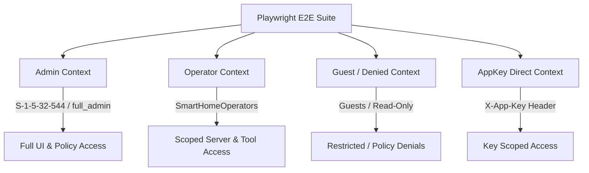

# Pairwise Integration & E2E Requirements Matrix

This document defines the canonical pairwise requirements matrix, interaction coverage tables, and end-to-end verification contracts for the **Model Context Gateway (MCG)**.

> **Living Test Catalog & SRS:** For automated requirement-to-test traceability and fail-closed safety guardrails, see the [**Software Requirements Specification (SRS) & Test Verification Catalog**](software-requirements-and-test-catalog.md) and [**Test Catalog Guide**](test-catalog-guide.md).


---

## 1. Matrix Dimensions & Value Domains

The router operates across 6 primary orthogonal dimensions:

```
+---------------------------------------------------------------------------------------------------+
|                                      PAIRWISE TEST DIMENSIONS                                     |
+---------------------------------------------------------------------------------------------------+
| 1. Auth Methods     | AppKey | SSO Headers | OIDC Bearer | Anonymous / Unauthenticated          |
| 2. Identity / SIDs  | Admin (S-1-5-32-544 / full_admin) | Group-Mapped Operator | Denied | Invalid|
| 3. AppKey Scopes    | `*`/`all` | `server:{id}` | `category:{cat}` | `tool:`/`prompt:`/`resource:`|
| 4. Capabilities     | tools/call | prompts/get | resources/read | templates | completion | meta   |
| 5. Transports       | SSE (`/sse`) | HTTP (`/mcp`) | Target Proxy (`/{server}`) | STDIO Subprocess |
| 6. Persistence DB   | SQLite | Microsoft SQL Server (MSSQL) | MySQL                               |
+---------------------------------------------------------------------------------------------------+
```

### Dimension Definitions

| Dimension | Domain Values | Descriptions |
| :--- | :--- | :--- |
| **Auth Method** | `AppKey`, `SSO`, `OIDC`, `Anonymous` | Credential mechanism (`X-App-Key` header, `Remote-User`/`Remote-Groups` headers, `Authorization: Bearer <jwt>`, or unauthenticated). |
| **Identity / Role** | `Admin (S-1-5-32-544)`, `Operator`, `DeniedUser`, `InvalidSid` | Security principle context: bypass admin, group-mapped RBAC operator, explicit deny policy, or non-resolving SID. |
| **AppKey Scope** | `*`/`all`, `server:{id}`, `category:{name}`, `group:{name}`, `tool:{id}`, `prompt:{id}`, `resource:{uri}`, `Expired` | Granular permission boundaries embedded into API keys. |
| **Capability** | `tools/call`, `prompts/get`, `resources/read`, `resources/templates/list`, `completion/complete`, `search_tools`, `execute_tool` | MCP protocol primitives and meta-mode dynamic discovery router tools. |
| **Transport** | `SSE`, `HTTP Stream`, `Target Proxy (/{server})`, `STDIO` | Client-to-router and router-to-backend communication mechanisms. |
| **Persistence Engine**| `SQLite`, `MSSQL`, `MySQL` | Relational database backends storing servers, appkeys, settings, access policies, and audit logs. |

---

## 2. Pairwise Interaction Matrices

### 2.1 Auth Method × Identity Context Matrix

| Auth Method | Identity Context | Target Policy | Expected Router Result | HTTP Status | Test File Reference |
| :--- | :--- | :--- | :--- | :--- | :--- |
| **SSO Headers** | Admin (`S-1-5-32-544`) | None (Unseeded) | **Allowed** (Admin bypass) | 200 OK | `PairwiseIntegrationMatrixTests` |
| **SSO Headers** | Admin (`full_admin`) | Explicit Deny | **Allowed** (Admin SID bypass takes precedence) | 200 OK | `AdminPolicySidOnlyTests` |
| **SSO Headers** | Operator (`SmartHomeOperators` via group mapping) | `server:ha` -> `SmartHomeOperators` Allowed | **Allowed** (Group mapped via `GroupMappings`) | 200 OK | `GroupMappingsAndSpecAuthTests` |
| **SSO Headers** | Denied User (`Guests`) | `server:ha` -> `Guests` Denied (`IsAllowed=0`) | **Denied** (Explicit Deny overrides allow) | 403 Forbidden / Error | `UnifiedMcpAuthorizationTests` |
| **SSO Headers** | Invalid / Unknown SID (`S-1-5-21-999`) | No policy matches | **Denied** (Fail-closed default) | 403 Forbidden / Error | `PairwiseIntegrationMatrixTests` |
| **AppKey** | Admin Key (`*` scope) | None | **Allowed** (Key scope `*` + Owner admin) | 200 OK | `AppKeyAuthenticationTests` |
| **AppKey** | Category-Scoped Key (`category:smarthome`)| `server:ha` (Category: `smarthome`) | **Allowed** (Resolved category matches server) | 200 OK | `CategoryScopedAppKeysTests` |
| **AppKey** | Expired Key (`ExpiresAt < Now`) | Any | **Denied** (Key validation fails before policy check) | 401 Unauthorized | `AppKeyAuthenticationTests` |
| **OIDC** | Operator (`oidc_user` with scopes) | `server:docker` -> `DevOps` Allowed | **Allowed** (JWT claims mapped to user groups) | 200 OK | `OpenIddictProductionTests` |
| **Anonymous** | None (`DefaultHttpContext`) | Any | **Denied** (Anonymous fails closed on protected resources)| 401 / 403 | `EndpointAuthorizationTests` |

---

### 2.2 AppKey Scopes × MCP Capabilities Matrix

| AppKey Scope | `tools/call` (`ha__turn_on`) | `prompts/get` (`ha__summary`) | `resources/read` (`mcp://ha/states`) | `templates` (`mcp://ha/sensor/{id}`) | `completion` (`ha__summary`) | `search_tools` / `execute_tool` |
| :--- | :---: | :---: | :---: | :---: | :---: | :---: |
| `*` / `all` / `mcp_client` | ✅ Allow | ✅ Allow | ✅ Allow | ✅ Allow | ✅ Allow | ✅ Allow |
| `server:ha` | ✅ Allow | ✅ Allow | ✅ Allow | ✅ Allow | ✅ Allow | ✅ Allow (`ha` tools only) |
| `category:smarthome` | ✅ Allow (if `ha` in category) | ✅ Allow (if `ha` in category) | ✅ Allow (if `ha` in category) | ✅ Allow (if `ha` in category) | ✅ Allow (if `ha` in category) | ✅ Allow (smarthome tools) |
| `group:smarthome` | ✅ Allow (group alias) | ✅ Allow (group alias) | ✅ Allow (group alias) | ✅ Allow (group alias) | ✅ Allow (group alias) | ✅ Allow (group alias) |
| `tool:ha__turn_on` | ✅ Allow | ❌ Denied | ❌ Denied | ❌ Denied | ❌ Denied | ✅ Allow (specific tool) |
| `prompt:ha__summary` | ❌ Denied | ✅ Allow | ❌ Denied | ❌ Denied | ✅ Allow (`ha__summary`) | ❌ Denied |
| `resource:mcp://ha/states`| ❌ Denied | ❌ Denied | ✅ Allow | ❌ Denied | ❌ Denied | ❌ Denied |
| `server:other_server` | ❌ Denied | ❌ Denied | ❌ Denied | ❌ Denied | ❌ Denied | ❌ Denied |
| Invalid / Expired Scope | ❌ Denied | ❌ Denied | ❌ Denied | ❌ Denied | ❌ Denied | ❌ Denied |

---

### 2.3 Transports × Auth Shapes & Upstream Target Matrix

| Client Transport | Upstream Server Type | AuthShape Configuration | Secret Provider | Forwarding Transformation |
| :--- | :--- | :--- | :--- | :--- |
| **SSE (`/sse`)** | `sse` | `bearer` | Direct Key / DB | `Authorization: Bearer <secret>` |
| **SSE (`/sse`)** | `http` | `x-api-key` | HashiCorp Vault | `X-API-Key: <vault_retrieved_secret>` |
| **SSE (`/sse`)** | `http` | `bearer` | Windows Registry (DPAPI) | `Authorization: Bearer <dpapi_decrypted_secret>` |
| **HTTP (`/mcp`)** | `http` | `custom-header` | Environment Var | `<CustomHeaderName>: <env_secret>` |
| **HTTP (`/mcp`)** | `http` | `bearer` | Windows Registry (DPAPI) | `Authorization: Bearer <dpapi_decrypted_secret>` |
| **HTTP (`/mcp`)** | `http` | `query` | Direct Key | `?api_key=<secret>` URL parameter rewrite |
| **Target Proxy (`/{id}`)**| `sse` / `http` | `basic` | Direct Key | `Authorization: Basic <base64>` header rewrite |
| **STDIO Subprocess** | `stdio` | Environment args | Windows Registry (DPAPI) | Decrypted DPAPI secret injected into process environment |
| **STDIO Subprocess** | `stdio` | Environment args | System Environment | Process environment variable injection |

---

### 2.4 Persistence Engines × Dialect & Upgrade Matrix

| Engine | Param Prefix | Timestamp Format | Schema Auto-Migration | Table Quoting | Connection Testing |
| :--- | :---: | :---: | :---: | :---: | :---: |
| **SQLite** | `@param` | `TEXT` (ISO-8601 UTC) | `CREATE TABLE IF NOT EXISTS` | `""` or none | `DbConnectionFactoryTests` |
| **MSSQL** | `@param` | `DATETIME2` | `IF NOT EXISTS (SELECT * FROM sysobjects ...)` | `[]` | `DatabaseSchemaUpgradeAndContractTests` |
| **MySQL** | `@param` | `DATETIME(6)` | `CREATE TABLE IF NOT EXISTS` | ```` ```` | `DatabaseSchemaUpgradeAndContractTests` |

---

### 2.5 Fail-Closed & Malformed Request Boundary Matrix

| Fault Scenario | Input Condition | Expected Behavior | Safety Assertion |
| :--- | :--- | :--- | :--- |
| **Unregistered Backend** | `targetId = "ghost__tool1"` | Reject with `UnauthorizedAccessException` or 404 | No downstream network leak |
| **Malformed Target URI** | `targetId = "invalid-uri-format"` | Reject with `UnauthorizedAccessException` | Fail closed default |
| **Null / Empty Target** | `targetId = null` or `""` or `" "` | Reject with `false` authorization result | No exception thrown, returns false |
| **Corrupted Scope JSON** | `AppKeyScopes = "{invalid json}"` | Log warning, fail closed (deny request) | AppKey rejected safely |
| **Database Disconnection**| DB factory returns closed/null | Catch exception, fail closed (deny request) | Does not bypass to allow |
| **Malformed JSON-RPC** | Missing `"id"` or `"method"` | Return standard JSON-RPC 2.0 error object (`-32600`) | Clean error serialization |

---

### 2.6 Windows Native Host & IIS In-Process Matrix

| Test Probe / Target | Mechanism / Subsystem | Expected Behavior | Verification Proof |
| :--- | :--- | :--- | :--- |
| **IIS ANCM v2 In-Process** | `aspnetcorev2.dll` inside `w3wp.exe` | High-throughput in-process request pipeline | `Deploy-IIS.ps1`, `GET /health` -> 200 OK |
| **Unbuffered SSE Streaming**| `<handlerSetting name="responseBufferLimit" value="0" />` | Immediate SSE frame dispatch to LLM client | Live curl `/sse` stream verification |
| **DPAPI LocalMachine Secrets**| `ProtectedData.Protect` / `Unprotect` | Machine-level AES decryption from `REG_BINARY` | `WindowsRegistrySecretRetrieverTests`, `Set-RegistrySecrets.ps1` |
| **Windows Caller SID Resolution**| `IWindowsIdentityAccessor` / `ClaimsIdentity` | Extraction of User SID & group token SIDs | `ActiveDirectoryWindowsIdentityTests`, `GET /api/me` |
| **Admin SID Bypass (`S-1-5-32-544`)**| `ActiveDirectoryIdentityProvider` | Automatic mapping to `Administrator` role | `AdminPolicySidOnlyTests`, `Test-WindowsEnvironment.ps1` |

---

## 3. End-to-End Multi-User Context Fixtures

Playwright E2E tests are parameterized using 4 distinct caller contexts defined in `frontend/e2e/fixtures/userContexts.ts`:



### Context Definitions

1. **Admin Context (`adminUser`)**:
   - `Remote-User`: `admin_user`
   - `Remote-Groups`: `full_admin,devops`
   - `Remote-Name`: `Admin User`
   - `Remote-User-Sid`: `S-1-5-32-544`
   - Access: Unrestricted dashboard, server creation, RBAC policies, settings, key generation.

2. **Operator Context (`operatorUser`)**:
   - `Remote-User`: `operator_user`
   - `Remote-Groups`: `SmartHomeOperators`
   - `Remote-Name`: `SmartHome Operator`
   - `Remote-User-Sid`: `S-1-5-21-1002`
   - Access: Access to permitted smart home tools and dashboard overview; denied admin settings and unauthorized servers.

3. **Read-Only / Denied Context (`guestUser`)**:
   - `Remote-User`: `guest_user`
   - `Remote-Groups`: `Guests`
   - `Remote-Name`: `Guest User`
   - `Remote-User-Sid`: `S-1-5-21-9999`
   - Access: Overview visibility only, denied tool execution on protected servers.

4. **AppKey Direct Header Context (`appKeyUser`)**:
   - `X-App-Key`: `mcp_live_pairwise_test_key`
   - Access: Scoped strictly according to the issued key's JSON scope list (`category:smarthome`, `server:ha`, etc.).

---

## 4. Automation & CI Verification

To execute pairwise test theories and validation locally:

```bash
# Run backend pairwise contract and integration theories
CI=true dotnet test ModelContextGateway.slnx --filter "FullyQualifiedName~PairwiseIntegrationMatrixTests"

# Run all backend tests
CI=true dotnet test ModelContextGateway.slnx

# Run frontend lint, build, and E2E specs
cd frontend
npm run lint
npm run build
npx playwright test
```
