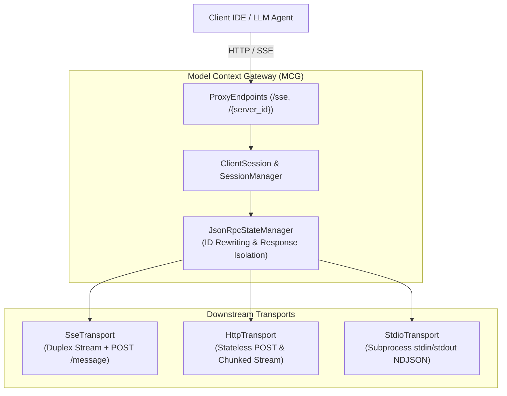
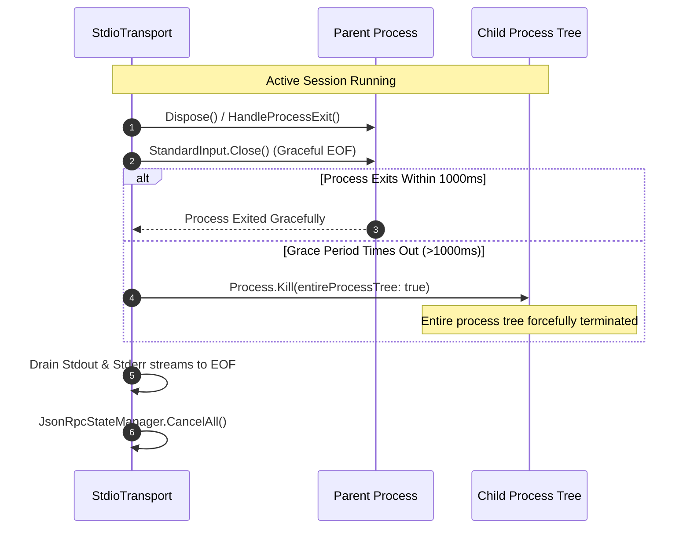
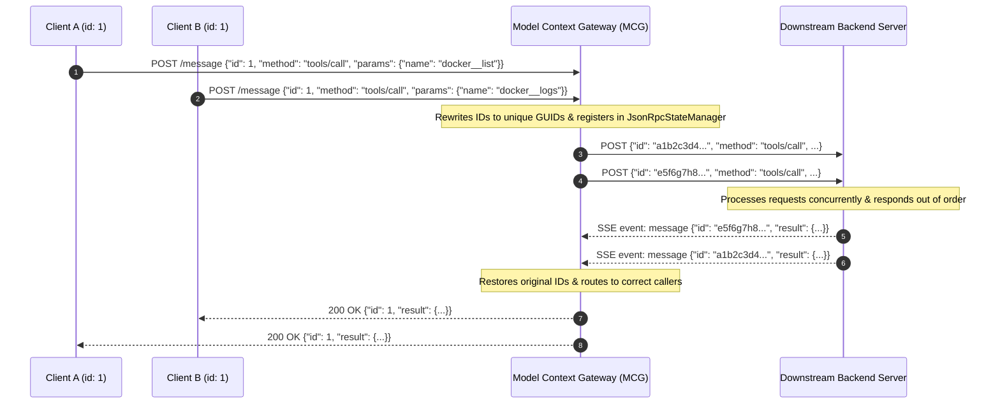

# Model Context Gateway Transport Capability and Configuration Guide

The **Model Context Protocol (MCP) Gateway** supports multiple downstream transport mechanisms to communicate with backend tools, services, and local processes. It also supports multiple upstream client connection models.

This guide details supported transports, security policies, concurrency architecture, configuration settings, and troubleshooting steps.

---

## Table of Contents

1. [Transport Comparison and Capability Matrix](#1-transport-comparison-and-capability-matrix)
2. [Subprocess STDIO Deep-Dive](#2-subprocess-stdio-deep-dive)
   - [Executable Path and Argument Configuration](#executable-path-and-argument-configuration)
   - [Strict Process Security Policy](#strict-process-security-policy)
   - [Secure Credential Injection via Environment Variables](#secure-credential-injection-via-environment-variables)
   - [Process Tree Management and Lifecycle](#process-tree-management-and-lifecycle)
   - [Stderr Log Capture and Secret Masking](#stderr-log-capture-and-secret-masking)
   - [Stream EOF Draining and Buffer Loss Prevention](#stream-eof-draining-and-buffer-loss-prevention)
   - [Health Checking: Non-HTTP Process Liveness](#health-checking-non-http-process-liveness)
3. [SSE Concurrency and Session Isolation](#3-sse-concurrency-and-session-isolation)
   - [JSON-RPC ID Type Preservation and Rewriting](#json-rpc-id-type-preservation-and-rewriting)
   - [Concurrent Response Isolation Under High Load](#concurrent-response-isolation-under-high-load)
   - [Stateless vs Stateful Request Routing](#stateless-vs-stateful-request-routing)
   - [Target Proxy Routing (`/{targetServerId}`)](#target-proxy-routing-targetserverid)
   - [Cancellation Token Handling and Disconnect Race Prevention](#cancellation-token-handling-and-disconnect-race-prevention)
4. [Configuration Examples](#4-configuration-examples)
   - [Auth Token Pass-Through](#auth-token-pass-through)
   - [Backend Server Configuration (JSON and UI)](#backend-server-configuration-json-and-ui)
   - [Client IDE and Agent Configurations](#client-ide-and-agent-configurations)
5. [Troubleshooting and Recovery Procedures](#5-troubleshooting-and-recovery-procedures)
   - [JSON-RPC Error Codes](#json-rpc-error-codes)
   - [HTTP Status Codes](#http-status-codes)
   - [Common Operational Issues and Solutions](#common-operational-issues-and-solutions)

---

## 1. Transport Comparison and Capability Matrix

The gateway abstracts transport differences using the unified [`ITransport`](https://github.com/spelech/model-context-gateway/blob/main/Infrastructure/Transports/ITransport.cs) interface and the [`BackendConnection`](https://github.com/spelech/model-context-gateway/blob/main/Core/Routing/BackendConnection.cs) wrapper. Backend servers specify their transport type in the `Type` column (`sse`, `http`, `streamable`, `stdio`, or `custom`).



### Capability Matrix

| Feature and Capability | Server-Sent Events (`sse`) | HTTP Stream (`http` / `streamable`) | Subprocess STDIO (`stdio`) | Target Proxy (`/{server_id}`) |
| :--- | :--- | :--- | :--- | :--- |
| **Protocol Framing** | W3C Server-Sent Events (SSE) (`text/event-stream`) + HTTP POST | HTTP POST with `application/json` or chunked streaming | Newline-Delimited JSON (NDJSON) over standard OS pipes | Direct passthrough of MCP SSE or HTTP streams to target servers |
| **Connection Model** | Persistent SSE connection with duplex HTTP POST | Request-Response or single-shot chunked stream per request | Long-lived managed child process with redirected standard input/output (`stdin`, `stdout`, `stderr`) | Stateful or stateless client session mapped directly to one backend |
| **Duplex Streaming** | Full duplex (server events over SSE, client tool calls over POST) | Half duplex (request and response body stream) | Full duplex (asynchronous line-by-line read and write locks) | Full duplex passthrough directly to target server |
| **Session Identification** | `Mcp-Session-Id` header and `event: endpoint` payload | `Mcp-Session-Id` header (passed across requests) | Subprocess Process ID (PID) + dedicated transport instance | Target session ID + client connection token |
| **Secret Injection** | Authorization headers (`Bearer`, `Basic`, `Raw`, `X-API-Key`, `Custom-Header`) or Query Parameter | Authorization headers (`Bearer`, `Basic`, `Raw`, `X-API-Key`, `Custom-Header`) or Query Parameter | Environment variables (`startInfo.Environment`) — **never command-line arguments** | Inherits target server authentication + AppKey scope validation |
| **Health Probing** | HTTP GET probe every 15s + background 30s JSON-RPC `ping` loop | HTTP GET probe every 15s | Process liveness check (`!_process.HasExited`) and syntax checks | Evaluates health of downstream backend connection |
| **Auto-Reconnection** | Automatic reconnect with 5-second backoff and clean state reset | Stateless per-request retries with 15-second default timeout | Exit detection, state cleanup, and lazy process restart | Rebinds client session upon reconnect |
| **Best For** | Long-running MCP services, Docker containers, remote network microservices | Serverless functions, stateless API gateways, lightweight webhooks | Local CLI tools, Python/Node packages (`uvx`, `npx`), sandboxed binary tools | Client sessions requiring direct target access without Meta-Mode filtering |

---

## 2. Subprocess STDIO Deep-Dive

The [`StdioTransport`](https://github.com/spelech/model-context-gateway/blob/main/Infrastructure/Transports/StdioTransport.cs) executes local MCP tools, script interpreters, and binary programs without network overhead. It communicates through Standard Input and Output (STDIO).

### Executable Path and Argument Configuration

When you configure a `stdio` server, provide the program name and arguments in the `Url` field. The gateway parses this command line with [`StdioTransport.ParseCommandLine`](https://github.com/spelech/model-context-gateway/blob/main/Infrastructure/Transports/StdioTransport.cs#L115-L165). The parser supports single quotes, double quotes, and space-separated tokens:

```csharp
// Example command string:
// node "/opt/mcp-servers/dist/index.js" --mode=production --port=0
var parsed = StdioTransport.ParseCommandLine(server.Url);
var executable = parsed[0];
var arguments = parsed.Skip(1);
```

- **Working Directory**: Defaults to `AppContext.BaseDirectory` (the application runtime root). This default prevents unexpected path traversal.
- **Process Start Settings**: Runs with `UseShellExecute = false` and `CreateNoWindow = true`. Redirects `StandardInput`, `StandardOutput`, and `StandardError`.

### Strict Process Security Policy

To prevent arbitrary command execution, privilege escalation, and command injection attacks, [`ValidateSecurityPolicy`](https://github.com/spelech/model-context-gateway/blob/main/Infrastructure/Transports/StdioTransport.cs#L167-L191) enforces these rules:

1. **Blocked Shell Interpreters**: Direct calls to system shells fail immediately:
   - `sh`, `bash`, `zsh`, `cmd`, `powershell`, `pwsh`
   - *Reason*: Shells permit nested scripts, pipe redirection, and variable expansion bypasses. The gateway must invoke tools directly through their binary executable or language runtime (such as `node`, `python3`, or `dotnet`).
2. **Disallowed Metacharacters**: Commands and arguments containing shell metacharacters trigger a `SecurityException`:
   - Disallowed characters: `;`, `&`, `|`, `<`, `>`, `\n`, `\r`, `` ` ``, `$`, `*`
3. **URL Scheme Prohibition**: `stdio` commands starting with `http://` or `https://` are rejected.

### Secure Credential Injection via Environment Variables

> [!IMPORTANT]
> **Zero Command-Line Credential Rule**: Never pass secrets or API keys as command-line arguments.

When you pass secrets through command-line arguments, any local user can view them through:
- Operating system process lists (`ps aux`, `ps -ef`)
- The Linux `/proc/[pid]/cmdline` pseudo-filesystem
- Windows Task Manager and Process Explorer
- System crash reports and error logs

#### Injection Implementation:
1. The gateway resolves secrets dynamically through [`ResolveTokenAsync`](https://github.com/spelech/model-context-gateway/blob/main/Infrastructure/Transports/StdioTransport.cs#L47-L98). It supports HashiCorp Vault KV v2, Windows Data Protection API (DPAPI), registry values, environment variables, or encrypted database values.
2. The gateway injects the resolved secret only into the isolated environment of the child process:
   ```csharp
   var envKey = !string.IsNullOrWhiteSpace(_server.SecretItemKey) ? _server.SecretItemKey : "API_KEY";
   startInfo.Environment[envKey] = _resolvedSecret;
   startInfo.Environment["MCP_API_KEY"] = _resolvedSecret;
   ```
3. **Fail-Closed Design**: If secret retrieval fails (for example, if a Vault token expires), `ConnectAsync` throws a `SecurityException` and stops. The gateway never starts the child process without required secrets.

### Process Tree Management and Lifecycle

Child processes often start worker threads or secondary subprocesses. If the gateway stops the parent process without cleaning child processes, orphaned processes remain active in memory.



- **Graceful Shutdown**: During disposal or session termination, `StdioTransport` closes `StandardInput`. This action sends an End of File (EOF) signal to the child process.
- **Grace Period and Forced Termination**: If the process does not stop within 1000ms (`WaitForExit(1000)`), the gateway calls `_process.Kill(entireProcessTree: true)`. This kills the parent process and all child processes.
- **Resource Disposal**: The gateway cleans and releases all `Process`, `StreamReader`, `StreamWriter`, and `SemaphoreSlim` instances.

### Stderr Log Capture and Secret Masking

The gateway reads standard error (`stderr`) asynchronously on a dedicated background thread:

- **Log Forwarding**: The gateway reads non-empty `stderr` lines and logs them as `LogLevel.Warning` with prefix `[STDIO Backend {ServerId} Stderr]`.
- **Secret Redaction**: Every log line passes through [`SanitizeLogOutput`](https://github.com/spelech/model-context-gateway/blob/main/Infrastructure/Transports/StdioTransport.cs#L100-L113):
  - Sanitized with [`PiiSanitizer.SanitizePayload`](https://github.com/spelech/model-context-gateway/blob/main/Infrastructure/Logging/PiiSanitizer.cs) to remove Bearer tokens, passwords, and authorization headers.
  - Replaces `_resolvedSecret` and `_server.ApiKey` values with `[REDACTED]`.

### Stream EOF Draining and Buffer Loss Prevention

A common bug in subprocess I/O is exiting the read loop as soon as `_process.HasExited == true`. This bug drops unread responses waiting in the operating system pipe buffer.

`StdioTransport` avoids this race condition. It continues reading until `ReadLineAsync()` returns `null` (stream EOF):

```csharp
while (!_cts.Token.IsCancellationRequested && _process != null)
{
    var line = await _process.StandardOutput.ReadLineAsync(_cts.Token);
    if (line == null) break; // EOF reached (all buffered bytes drained)
    // Process JSON-RPC message...
}
```

This ensures fast one-shot tools send their complete response to the caller before the process terminates.

### Health Checking: Non-HTTP Process Liveness

`stdio` backends do not expose network ports or HTTP URLs. [`BackendHealthCheckService.ProbeServerAsync`](https://github.com/spelech/model-context-gateway/blob/main/Components/Servers/BackendHealthCheckService.cs#L112-L122) validates `stdio` servers with these steps:
1. **Command Syntax and Security Verification**: Runs `ServerValidationHelper.IsValidStdioCommand` to confirm the executable exists and meets security policy.
2. **Process Liveness**: Confirms the process is running or ready to start on demand.
3. **Zero Socket Usage**: Bypasses network sockets entirely.

---

## 3. SSE Concurrency and Session Isolation

The Model Context Protocol supports full-duplex communication. Multiple concurrent tool calls, notifications, and prompts can run at the same time.

### JSON-RPC ID Type Preservation and Rewriting

The JSON-RPC 2.0 specification allows request `id` values to be **strings**, **numbers**, or **null**.

When multiple client sessions connect through the gateway, they often send identical request IDs (for example, Client A sends `id: 1` while Client B also sends `id: 1`).



#### State Tracking Engine ([`JsonRpcStateManager`](https://github.com/spelech/model-context-gateway/blob/main/Infrastructure/Transports/JsonRpcStateManager.cs)):
1. **Extraction**: Reads the original client ID and keeps its exact type (`string`, `long`, `double`, or `null`) using [`GetJsonElementValue`](https://github.com/spelech/model-context-gateway/blob/main/Infrastructure/Transports/SseTransport.cs#L325-L344).
2. **Upstream Rewriting**: Creates a unique 32-character hexadecimal GUID (`upstreamRequestId = Guid.NewGuid().ToString("N")`) and replaces the outgoing `id` field.
3. **Request Tracking**: Saves a [`PendingRequestTcs`](https://github.com/spelech/model-context-gateway/blob/main/Infrastructure/Transports/JsonRpcStateManager.cs#L9-L31) record containing:
   - `OriginalId`: The original client ID and data type.
   - `UpstreamId`: The unique upstream GUID.
   - `SessionId`: The originating client session identifier.
   - `CancellationToken`: The caller cancellation token.
   - `Expiry`: The request expiration deadline (`DateTime.UtcNow + RequestTimeout`).
4. **Response Restoration**: When the downstream server replies with `upstreamRequestId`, [`TryCompleteRequest`](https://github.com/spelech/model-context-gateway/blob/main/Infrastructure/Transports/JsonRpcStateManager.cs#L112-L134) removes the tracking entry. It restores `response.Id = tracked.OriginalId` and completes the awaiting task.

### Concurrent Response Isolation Under High Load

Under heavy concurrent load across multiple IDEs and AI agents:
- The gateway tracks requests with thread-safe `ConcurrentDictionary<string, TaskCompletionSource<JsonRpcResponse>>` collections.
- Out-of-order and interleaved backend responses route to the correct caller without cross-talk.
- Reusing an active request ID throws an `InvalidOperationException("Duplicate request ID detected")` to prevent data corruption.

### Stateless vs Stateful Request Routing

The gateway supports both stateful and stateless MCP client connection models:

#### 1. Stateful Client Sessions (`GET /sse` + `POST /message?sessionId=...`)
- The client starts a long-lived SSE stream at `/sse`.
- The gateway assigns a unique `sessionId` and returns an `event: endpoint` payload pointing to `/message?sessionId={sessionId}`.
- The client sends subsequent tool calls, cancellations, and notifications via HTTP POST to `/message`.
- The gateway maintains session state, cached tool schemas, and cancellation tokens inside [`ClientSession`](https://github.com/spelech/model-context-gateway/blob/main/Core/Routing/ClientSession.cs).

#### 2. Stateless Single-Shot Requests (`POST /sse`)
- Clients and lightweight HTTP agents send HTTP POST directly to `/sse` without opening an SSE stream.
- The router detects stateless calls (`method != "initialize"`) and routes them to `global-stateless-session`.
- Tool searches, tool calls, and prompt rendering execute on demand and return immediate JSON responses (`HTTP 200` or `202`).

### Target Proxy Routing (`/{targetServerId}`)

Clients that need direct communication with a single backend (bypassing Meta-Mode tool aggregation) connect directly to `/{targetServerId}`:

- **Routing**: `GET /{targetServerId}` creates a direct SSE session for that server. `POST /{targetServerId}` forwards JSON-RPC payloads directly.
- **Scope Validation**: Verifies that the client AppKey includes wildcard (`*`, `all`), server-specific (`server:{targetServerId}`), or category-specific (`category:{name}`) scopes.
- **Role-Based Access Control (RBAC)**: Executes `sp_EvaluateUserAccess` for the target server ID to confirm user or group permissions.

### Cancellation Token Handling and Disconnect Race Prevention

Network interruptions and client cancellations are handled cleanly without memory leaks:

1. **Client Cancellation (`notifications/cancelled`)**:
   - When a client cancels a tool call, it sends `notifications/cancelled` with `params.requestId`.
   - [`ClientSession.CancelRequest`](https://github.com/spelech/model-context-gateway/blob/main/Core/Routing/ClientSession.cs) finds the associated `CancellationTokenSource` and cancels it immediately.
2. **Timeout Expiration**:
   - Every request uses a configurable `RequestTimeout` (default 15 seconds).
   - If the downstream server does not respond within this window, `WaitAsync(RequestTimeout)` throws a `TimeoutException`.
3. **Disconnect Cleanup**:
   - If a backend connection drops unexpectedly, [`JsonRpcStateManager.MarkDisconnected()`](https://github.com/spelech/model-context-gateway/blob/main/Infrastructure/Transports/JsonRpcStateManager.cs#L58-L69) cancels all pending tasks (`tcs.TrySetCanceled()`) and purges the pending collection.
   - All `SendRequestAsync` calls use `try ... finally { _stateManager.TryRemoveRequest(upstreamRequestId); }` to prevent memory leaks during failures.

---

## 4. Configuration Examples

### Auth Token Pass-Through

The router supports an `AllowPassThroughAuth` flag for backend servers. When enabled, clients pass user tokens directly to the backend through the `X-Target-Auth` header. The router forwards this token to the downstream service, overriding any static token configured on the server.

Example `custom_servers.json` entry:
```json
{
  "id": "user-scoped-service",
  "displayName": "User Scoped Service",
  "url": "http://user-service/mcp",
  "type": "http",
  "allowPassThroughAuth": true,
  "authShape": "bearer"
}
```
Client Request Example:
```http
POST /sse HTTP/1.1
X-Target-Auth: eyJhbGciOiJIUzI1NiIsInR5cCI6IkpXVCJ9...
```

### Backend Server Configuration (JSON and UI)

You can configure backend servers through the Web Dashboard or declaratively through `/app/data/custom_servers.json`.

#### Example `custom_servers.json`:
```json
[
  {
    "id": "docker-mcp",
    "displayName": "Docker Management Server",
    "url": "http://10.0.0.10:8080/sse",
    "type": "sse",
    "category": "infrastructure",
    "enabled": true,
    "hidden": false,
    "secretProvider": "Vault",
    "secretPath": "secret/data/mcp/docker",
    "secretField": "api_token",
    "authShape": "bearer",
    "headersJson": "{\"X-Custom-Env\": \"production\"}"
  },
  {
    "id": "weather-api",
    "displayName": "Stateless Weather MCP",
    "url": "http://weather-service.internal/api/mcp",
    "type": "http",
    "category": "services",
    "enabled": true,
    "hidden": false,
    "secretProvider": "Environment",
    "secretItemKey": "WEATHER_API_KEY",
    "authShape": "x-api-key"
  },
  {
    "id": "local-filesystem",
    "displayName": "Local Filesystem Tools",
    "url": "node \"/opt/mcp/filesystem-server/index.js\" \"/containers/storage\"",
    "type": "stdio",
    "category": "development",
    "enabled": true,
    "hidden": false,
    "secretProvider": "None"
  }
]
```

### Client IDE and Agent Configurations

#### 1. Claude Desktop (`claude_desktop_config.json`)
```json
{
  "mcpServers": {
    "mcp-gateway": {
      "command": "npx",
      "args": [
        "-y",
        "@modelcontextprotocol/client-sse",
        "http://localhost:8080/sse"
      ],
      "env": {
        "X_APP_KEY": "mcp_app_live_your_app_key_here"
      }
    }
  }
}
```

#### 2. Antigravity CLI (`.gemini/settings.json`)
```json
{
  "mcpServers": {
    "mcg": {
      "url": "http://localhost:8080/sse",
      "type": "sse",
      "trust": true,
      "serverUrl": "http://localhost:8080/sse",
      "headers": {
        "X-App-Key": "mcp_app_live_your_app_key_here"
      }
    }
  }
}
```

#### 3. Cursor IDE (`.cursor/mcp.json`)
```json
{
  "mcpServers": {
    "homelab-mcg": {
      "url": "http://localhost:8080/sse",
      "headers": {
        "X-App-Key": "mcp_app_live_your_app_key_here"
      }
    }
  }
}
```

#### 4. VS Code / Cline (`cline_mcp_settings.json`)
```json
{
  "mcpServers": {
    "mcg": {
      "url": "http://localhost:8080/sse",
      "headers": {
        "X-App-Key": "mcp_app_live_your_app_key_here"
      }
    }
  }
}
```

#### 5. Direct Target Server Connection
To connect directly to one backend without Meta-Mode discovery, point the client URL to the target server ID:
```json
{
  "mcpServers": {
    "direct-docker": {
      "url": "http://localhost:8080/docker-mcp",
      "headers": {
        "X-App-Key": "mcp_app_live_your_app_key_here"
      }
    }
  }
}
```

---

## 5. Troubleshooting and Recovery Procedures

### JSON-RPC Error Codes

| Error Code | Error Message | Typical Cause | Recommended Action |
| :--- | :--- | :--- | :--- |
| `-32700` | `Parse error` | The client sent malformed JSON syntax. | Verify JSON syntax and string escaping in client payloads. |
| `-32600` | `Invalid Request` | Payload is not a valid JSON-RPC 2.0 object. | Ensure the payload includes `"jsonrpc": "2.0"` and a valid `"method"`. |
| `-32601` | `Method not found` | Method does not exist or tool name is invalid. | Query `search_tools` first, or verify the `<serverId>__<toolName>` spelling. |
| `-32602` | `Invalid params / Resource Not Found` | Arguments do not match tool schema, or resource URI is invalid. | Check tool input schema in the Test Bench form or verify the URI. |
| `-32603` | `Internal error` | Unhandled error in downstream server or serialization failure. | Inspect gateway diagnostic logs in the Web UI for the backend stack trace. |
| `-32001` | `Server Disconnected / Not Running` | Downstream SSE stream or STDIO child process is offline. | Check backend server status on the dashboard; inspect container logs. |
| `-32020` | `Connection Closed` | Downstream connection dropped during communication. | Check backend server health and network logs. |
| `-32021` | `Request Cancelled` | Client cancelled the request with `notifications/cancelled`. | Check client session lifecycle and timeout settings. |
| `-32022` | `Missing Required Client Capability` | Client lacked declared capability for requested operation. | Declare required client capability in initialize handshake. |

### HTTP Status Codes

| Status Code | Description | Diagnostics and Resolution |
| :--- | :--- | :--- |
| `400 Bad Request` | Malformed request body or missing `sessionId` parameter on `/message`. | Include the `?sessionId={id}` query parameter on POST requests to `/message`. |
| `401 Unauthorized` | Missing or invalid AppKey, or invalid OIDC token. | Provide a valid `X-App-Key` header or verify reverse proxy SSO headers. |
| `403 Forbidden` | User or AppKey lacks permission for the server, category, or tool. | Verify RBAC permissions in the Security tab; ensure AppKey includes required scopes. |
| `404 Not Found` | Server ID not found or target proxy path does not exist. | Verify server ID exists and is enabled in the Servers management tab. |
| `502 Bad Gateway` | Downstream server is unreachable or failed during startup handshake. | Ensure downstream service is running and accessible on the Docker network. |
| `504 Gateway Timeout` | Downstream tool execution exceeded `RequestTimeout` (default 15s). | Increase server `RequestTimeout` for long operations or optimize downstream tool. |

### Common Operational Issues and Solutions

#### Issue 1: STDIO Process Exits Immediately or Throws `SecurityException`
- **Symptom**: Server status displays `Failed: Command contains disallowed unsafe characters` or `Direct invocation of shell is blocked`.
- **Cause**: Using shell chaining (`;`, `&&`, `|`) or invoking a shell (`bash -c`, `sh script.sh`, `powershell`).
- **Solution**: Call the runtime executable directly without shell wrappers:
  - ❌ *Incorrect*: `bash -c "node server.js"`
  - 🟢 *Correct*: `node /path/to/server.js`

#### Issue 2: STDIO Fails Secret Resolution
- **Symptom**: `SecurityException: Failed to resolve secret from provider 'Vault'`.
- **Cause**: Vault token expired, path is invalid, or secret retriever settings are wrong.
- **Solution**: Check secret provider configuration in Settings; ensure the secret key exists at the configured mount and path.

#### Issue 3: SSE Connection Drops Repeatedly Behind Reverse Proxy (Caddy / Nginx)
- **Symptom**: SSE connection drops every 30 to 60 seconds; client continuously reconnects.
- **Cause**: Reverse proxy response buffering is active, blocking SSE event streaming.
- **Solution**:
  - **Nginx**: Add `proxy_buffering off; proxy_cache off; proxy_read_timeout 86400s;` to the site configuration.
  - **Caddy**: Ensure `flush_interval -1` is active for `/sse` streaming endpoints.

#### Issue 4: Tools Return `Duplicate request ID detected`
- **Symptom**: Client logs report `InvalidOperationException: Duplicate request ID detected`.
- **Cause**: A custom client library reuses an active request ID before the earlier request completes.
- **Solution**: The gateway rewrites IDs automatically for standard clients. For custom clients, send unique request IDs or wait for response completion before reusing an ID.
