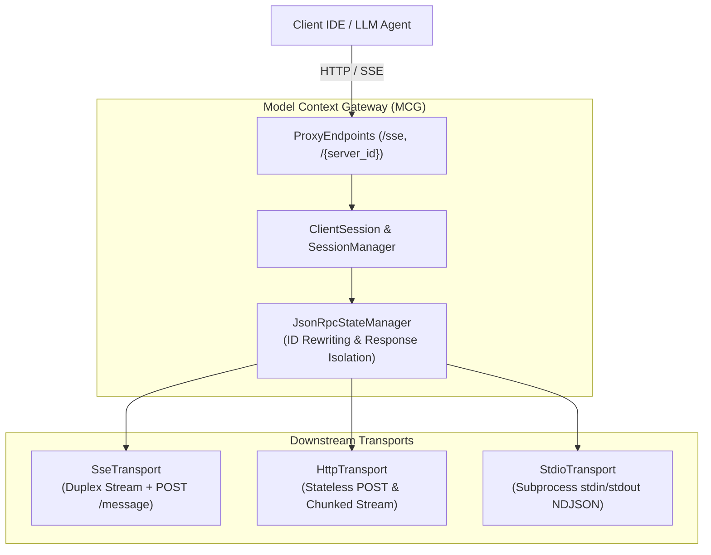
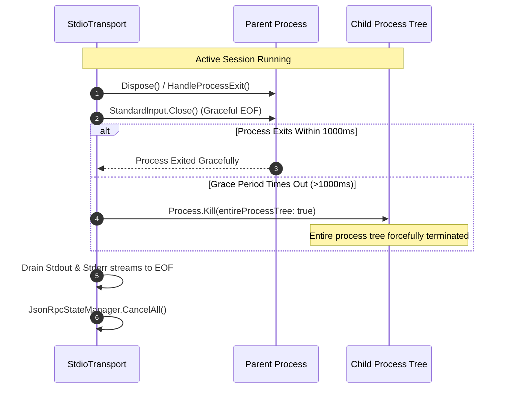
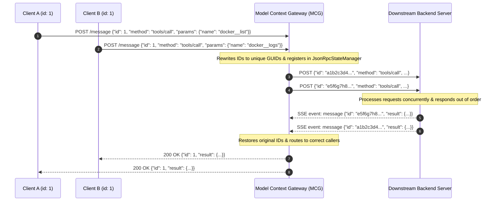

# Model Context Gateway Transport Capability & Configuration Guide

The **Model Context Protocol (MCP) Gateway** supports multiple downstream transport mechanisms to communicate with backend tools, services, and local processes, as well as multiple upstream client connectivity models.

This guide details supported transports, security policies, concurrency architectures, configuration parameters, and troubleshooting procedures.

---

## Table of Contents

1. [Transport Comparison & Capability Matrix](#1-transport-comparison-capability-matrix)
2. [Subprocess STDIO Deep-Dive](#2-subprocess-stdio-deep-dive)
   - [Executable Path & Argument Configuration](#executable-path-argument-configuration)
   - [Strict Process Security Policy](#strict-process-security-policy)
   - [Secure Credential Injection via Environment Variables](#secure-credential-injection-via-environment-variables)
   - [Process Tree Management & Lifecycle](#process-tree-management-lifecycle)
   - [Stderr Log Capture & Secret Masking](#stderr-log-capture-secret-masking)
   - [Stream EOF Draining & Buffer Loss Prevention](#stream-eof-draining-buffer-loss-prevention)
   - [Health Checking: Non-HTTP Process Liveness](#health-checking-non-http-process-liveness)
3. [SSE Concurrency & Session Isolation](#3-sse-concurrency-session-isolation)
   - [JSON-RPC ID Type Preservation & Rewriting](#json-rpc-id-type-preservation-rewriting)
   - [Concurrent Response Isolation Under High Load](#concurrent-response-isolation-under-high-load)
   - [Stateless vs Stateful Request Routing](#stateless-vs-stateful-request-routing)
   - [Target Proxy Routing (`/{targetServerId}`)](#target-proxy-routing-targetserverid)
   - [Cancellation Token Handling & Disconnect Race Prevention](#cancellation-token-handling-disconnect-race-prevention)
4. [Configuration Examples](#4-configuration-examples)
   - [Backend Server Configuration (JSON & UI)](#backend-server-configuration-json-ui)
   - [Client IDE & Agent Configurations](#client-ide-agent-configurations)
5. [Troubleshooting & Recovery Procedures](#5-troubleshooting-recovery-procedures)
   - [JSON-RPC Error Codes](#json-rpc-error-codes)
   - [HTTP Status Codes](#http-status-codes)
   - [Common Operational Issues & Solutions](#common-operational-issues-solutions)

---

## 1. Transport Comparison & Capability Matrix

The gateway router abstracts transport differences behind the unified [`ITransport`](https://github.com/spelech/model-context-gateway/blob/main/Infrastructure/Transports/ITransport.cs) interface and [`BackendConnection`](https://github.com/spelech/model-context-gateway/blob/main/Core/Routing/BackendConnection.cs) wrapper. Backend servers specify their transport type via the `Type` column (`sse`, `http`, `streamable`, `stdio`, or `custom`).



### Capability Matrix

| Feature / Capability | Server-Sent Events (`sse`) | HTTP Stream (`http` / `streamable`) | Subprocess STDIO (`stdio`) | Target Proxy (`/{server_id}`) |
| :--- | :--- | :--- | :--- | :--- |
| **Protocol Framing** | W3C Server-Sent Events (`text/event-stream`) + HTTP POST | HTTP POST with `application/json` or chunked streaming | Newline-delimited JSON-RPC 2.0 (NDJSON) over standard pipes | Passthrough MCP SSE or HTTP stream directly to target server |
| **Connection Model** | Long-lived persistent SSE connection with duplex HTTP POST | Request-Response or single-shot chunked stream per request | Long-lived managed subprocess with redirected `stdin`/`stdout`/`stderr` | Stateful or stateless client session mapped to a single backend |
| **Duplex Streaming** | Full duplex (server events via SSE, client calls via POST) | Half duplex (request/response body stream) | Full duplex (asynchronous line-by-line read/write locks) | Full duplex passthrough directly to target server |
| **Session Identification** | `Mcp-Session-Id` header and `event: endpoint` payload | `Mcp-Session-Id` header (propagated across requests) | Subprocess Process ID (PID) + dedicated transport instance | Target session ID + client connection token |
| **Secret Injection** | Authorization headers (`Bearer`, `Basic`, `Raw`, `X-API-Key`, `Custom-Header`) or Query Param | Authorization headers (`Bearer`, `Basic`, `Raw`, `X-API-Key`, `Custom-Header`) or Query Param | Environment Variables (`startInfo.Environment`) — **never CLI arguments** | Inherits target server auth + AppKey scope validation |
| **Health Probing** | HTTP GET probe every 15s + 30s background JSON-RPC `ping` loop | HTTP GET probe every 15s | Process liveness check (`!_process.HasExited`) & syntax check | Evaluates target server backend connection health |
| **Auto-Reconnection** | Automatic reconnect with 5-second backoff and clean state reset | Stateless per-request retries with 15-second default timeout | Subprocess exit detection, state cleanup, and lazy re-spawn | Rebinds client session upon reconnect |
| **Best For** | Persistent MCP services, Docker containers, remote network microservices | Serverless functions, stateless API gateways, lightweight webhooks | Local CLI tools, Python/Node packages (`uvx`, `npx`), sandboxed binary tools | Client sessions requiring direct target access without Meta-Mode filtering |

---

## 2. Subprocess STDIO Deep-Dive

The [`StdioTransport`](https://github.com/spelech/model-context-gateway/blob/main/Infrastructure/Transports/StdioTransport.cs) provides zero-network-overhead execution for local MCP tools, script interpreters, and binary executables.

### Executable Path & Argument Configuration

When configuring a `stdio` server, the `Url` field contains the executable and its arguments. The router parses this command line using [`StdioTransport.ParseCommandLine`](https://github.com/spelech/model-context-gateway/blob/main/Infrastructure/Transports/StdioTransport.cs#L115-L165), supporting single quotes, double quotes, and space-separated tokens:

```csharp
// Example command string:
// node "/opt/mcp-servers/dist/index.js" --mode=production --port=0
var parsed = StdioTransport.ParseCommandLine(server.Url);
var executable = parsed[0];
var arguments = parsed.Skip(1);
```

- **Working Directory**: Defaults to `AppContext.BaseDirectory` (the application runtime root) to prevent unexpected path traversal.
- **Process Start Configuration**: Configured with `UseShellExecute = false`, `CreateNoWindow = true`, and redirected `StandardInput`, `StandardOutput`, and `StandardError`.

### Strict Process Security Policy

To prevent arbitrary command execution, privilege escalation, and shell injection vulnerabilities, [`ValidateSecurityPolicy`](https://github.com/spelech/model-context-gateway/blob/main/Infrastructure/Transports/StdioTransport.cs#L167-L191) strictly enforces:

1. **Blocked Shell Interpreters**: Direct invocation of system shells is rejected:
   - `sh`, `bash`, `zsh`, `cmd`, `powershell`, `pwsh`
   - *Rationale*: Shells allow subshell execution, piping, and variable expansion bypasses. Tools must be invoked directly via their binary or language runtime (e.g. `node`, `python3`, `dotnet`).
2. **Disallowed Metacharacters**: Commands and arguments containing shell metacharacters are rejected with a `SecurityException`:
   - Disallowed characters: `;`, `&`, `|`, `<`, `>`, `\n`, `\r`, `` ` ``, `$`, `*`
3. **URL Scheme Prohibition**: `stdio` commands starting with `http://` or `https://` are rejected.

### Secure Credential Injection via Environment Variables

> [!IMPORTANT]
> **Zero Command-Line Credential Leakage Rule**: Secrets and API keys are **NEVER** passed as command-line arguments.

When secrets are passed via command-line arguments, they are visible to any unprivileged user on the host system via:
- Process table inspections (`ps aux`, `ps -ef`)
- Linux `/proc/[pid]/cmdline` pseudo-filesystem
- Windows Task Manager and Process Explorer
- OS error logs and system crash dumps

#### Injection Implementation:
1. Secret retrieval is performed dynamically through [`ResolveTokenAsync`](https://github.com/spelech/model-context-gateway/blob/main/Infrastructure/Transports/StdioTransport.cs#L47-L98) (supporting HashiCorp Vault KV v2, Windows DPAPI / Registry, Environment Variables, or database-stored keys).
2. The resolved secret is injected exclusively into the subprocess's isolated environment dictionary:
   ```csharp
   var envKey = !string.IsNullOrWhiteSpace(_server.SecretItemKey) ? _server.SecretItemKey : "API_KEY";
   startInfo.Environment[envKey] = _resolvedSecret;
   startInfo.Environment["MCP_API_KEY"] = _resolvedSecret;
   ```
3. **Fail-Closed Guarantee**: If secret resolution fails (e.g. Vault token expired or secret path missing), `ConnectAsync` throws a `SecurityException` and aborts immediately. The subprocess is never launched.

### Process Tree Management & Lifecycle

Subprocesses often spawn child helper processes or worker threads. If the parent is terminated without cleaning the process tree, orphaned zombie processes remain running in the background.



- **Graceful Shutdown**: Upon disposal or session end, `StdioTransport` closes `StandardInput` to signal EOF to the child process.
- **Grace Period & Forced Termination**: If the process does not terminate within 1000ms (`WaitForExit(1000)`), the router calls `_process.Kill(entireProcessTree: true)` to terminate the process and all descendant processes.
- **Disposal Safety**: All `Process`, `StreamReader`, `StreamWriter`, and `SemaphoreSlim` handles are disposed cleanly.

### Stderr Log Capture & Secret Masking

Subprocess standard error (`stderr`) is read asynchronously on a dedicated background thread:

- **Log Routing**: Non-empty `stderr` output is captured line-by-line and routed to the gateway logger as `LogLevel.Warning` with prefix `[STDIO Backend {ServerId} Stderr]`.
- **Secret Redaction**: All logged lines pass through [`SanitizeLogOutput`](https://github.com/spelech/model-context-gateway/blob/main/Infrastructure/Transports/StdioTransport.cs#L100-L113):
  - Sanitized via [`PiiSanitizer.SanitizePayload`](https://github.com/spelech/model-context-gateway/blob/main/Infrastructure/Logging/PiiSanitizer.cs) (redacting Bearer tokens, passwords, and authorization headers).
  - Explicit string replacement masks `_resolvedSecret` and `_server.ApiKey` with `[REDACTED]`.

### Stream EOF Draining & Buffer Loss Prevention

A common bug in subprocess I/O is exiting the read loop as soon as `_process.HasExited == true`, which discards responses remaining in the pipe's internal kernel buffer.

`StdioTransport` avoids this race condition by looping until `ReadLineAsync()` returns `null` (stream EOF):

```csharp
while (!_cts.Token.IsCancellationRequested && _process != null)
{
    var line = await _process.StandardOutput.ReadLineAsync(_cts.Token);
    if (line == null) break; // EOF reached (all buffered bytes drained)
    // Process JSON-RPC message...
}
```

This guarantees that fast-executing one-shot tools or tools that exit immediately after writing their response are fully read and dispatched to the caller before cleanup.

### Health Checking: Non-HTTP Process Liveness

`stdio` backends do not expose network ports or HTTP endpoints. [`BackendHealthCheckService.ProbeServerAsync`](https://github.com/spelech/model-context-gateway/blob/main/Components/Servers/BackendHealthCheckService.cs#L112-L122) validates `stdio` servers via:
1. **Command Syntax & Security Validation**: Runs `ServerValidationHelper.IsValidStdioCommand` to ensure the executable exists and meets security policies.
2. **Process Liveness**: Verifies the process is either running or ready to be spawned on-demand.
3. **No Phantom Socket Consumption**: Bypasses HTTP socket generation entirely.

---

## 3. SSE Concurrency & Session Isolation

The Model Context Protocol allows client and backend communication over duplex channels where multiple concurrent tool invocations, notifications, and prompts occur simultaneously.

### JSON-RPC ID Type Preservation & Rewriting

The JSON-RPC 2.0 specification allows request `id` values to be **strings**, **numbers (integers or floating point)**, or **null**. 

When multiple client sessions connect through the gateway, they often use overlapping request IDs (e.g. Client A sends `id: 1`, and Client B simultaneously sends `id: 1`).



#### Gateway State Tracking Engine ([`JsonRpcStateManager`](https://github.com/spelech/model-context-gateway/blob/main/Infrastructure/Transports/JsonRpcStateManager.cs)):
1. **Extraction**: Reads the client's original ID and preserves its exact primitive data type (`string`, `long`, `double`, or `null`) using [`GetJsonElementValue`](https://github.com/spelech/model-context-gateway/blob/main/Infrastructure/Transports/SseTransport.cs#L325-L344).
2. **Upstream Rewriting**: Generates a cryptographically unique 32-character hexadecimal GUID string (`upstreamRequestId = Guid.NewGuid().ToString("N")`) and replaces the `id` field in the outgoing payload.
3. **Tracking**: Creates a [`PendingRequestTcs`](https://github.com/spelech/model-context-gateway/blob/main/Infrastructure/Transports/JsonRpcStateManager.cs#L9-L31) storing:
   - `OriginalId`: The client's original ID and data type.
   - `UpstreamId`: The unique upstream GUID.
   - `SessionId`: The originating client session.
   - `CancellationToken`: The caller's cancellation token.
   - `Expiry`: The request expiration deadline (`DateTime.UtcNow + RequestTimeout`).
4. **Response Restoration**: When the downstream backend emits an SSE message or standard response with `upstreamRequestId`, [`TryCompleteRequest`](https://github.com/spelech/model-context-gateway/blob/main/Infrastructure/Transports/JsonRpcStateManager.cs#L112-L134) removes the tracked entry, sets `response.Id = tracked.OriginalId`, and completes the awaiting `TaskCompletionSource`.

### Concurrent Response Isolation Under High Load

Under heavy concurrent usage (e.g. 50+ simultaneous tool executions across multiple IDEs and agents):
- All request tracking is thread-safe using `ConcurrentDictionary<string, TaskCompletionSource<JsonRpcResponse>>` guarded by atomic synchronization.
- Responses returning out of order or interleaved across the same backend connection never cross-talk or overwrite each other.
- Attempting to register duplicate IDs throws an explicit `InvalidOperationException("Duplicate request ID detected")` rather than causing silent data corruption.

### Stateless vs Stateful Request Routing

The gateway seamlessly handles both stateful and stateless MCP client models:

#### 1. Stateful Client Sessions (`GET /sse` + `POST /message?sessionId=...`)
- Client establishes a long-lived SSE stream at `/sse`.
- Gateway assigns a unique `sessionId` and returns an `event: endpoint` pointing to `/message?sessionId={sessionId}`.
- All subsequent tool calls, cancellations, and notifications are sent via HTTP POST to `/message`.
- Connection state, warmed tools cache, and active cancellation tokens are retained in [`ClientSession`](https://github.com/spelech/model-context-gateway/blob/main/Core/Routing/ClientSession.cs).

#### 2. Stateless Single-Shot Requests (`POST /sse`)
- Clients (or lightweight HTTP agents) send HTTP POST directly to `/sse` without establishing an SSE stream first.
- The router detects subsequent stateless calls (`method != "initialize"`) and routes them automatically to the `global-stateless-session`.
- Tool listing, tool calling, and prompt rendering are executed on-demand and returned immediately as JSON responses (`StatusCode 200/202`).

### Target Proxy Routing (`/{targetServerId}`)

Clients that need direct, unmediated communication with a specific backend (bypassing Meta-Mode discovery) connect via `/{targetServerId}`:

- **Routing**: `GET /{targetServerId}` initializes a direct SSE session mapped exclusively to the target server; `POST /{targetServerId}` dispatches JSON-RPC payloads directly.
- **AppKey Scope Enforcement**: Verifies the caller's AppKey includes wildcard (`*`, `all`), server-specific (`server:{targetServerId}`), or category-specific (`category:{name}`) scopes.
- **Fine-Grained RBAC**: Executes `sp_EvaluateUserAccess` against the target server ID, verifying the authenticated user or SID has permission to access the server.

### Cancellation Token Handling & Disconnect Race Prevention

Network drops and client aborts are handled without leaving orphaned tasks or memory leaks:

1. **Client Cancellation (`notifications/cancelled`)**:
   - When a client cancels an ongoing tool call, it sends `notifications/cancelled` with `params.requestId`.
   - [`ClientSession.CancelRequest`](https://github.com/spelech/model-context-gateway/blob/main/Core/Routing/ClientSession.cs) looks up the caller's `CancellationTokenSource` and cancels it immediately.
2. **Timeout Expiration**:
   - Every request is bounded by `RequestTimeout` (default 15 seconds, configurable per server).
   - If the downstream server fails to respond, `WaitAsync(RequestTimeout)` raises a `TimeoutException`.
3. **Disconnect Race Cleanup**:
   - If a backend connection drops unexpectedly (stream EOF or socket error), [`JsonRpcStateManager.MarkDisconnected()`](https://github.com/spelech/model-context-gateway/blob/main/Infrastructure/Transports/JsonRpcStateManager.cs#L58-L69) cancels all pending `TaskCompletionSource` instances (`tcs.TrySetCanceled()`) and clears the pending requests collection.
   - All `SendRequestAsync` invocations feature `try ... finally { _stateManager.TryRemoveRequest(upstreamRequestId); }` to guarantee no memory leaks occur under any failure branch.

---

## 4. Configuration Examples

### Auth Token Pass-Through

The router supports an `AllowPassThroughAuth` flag for backend servers. When this flag is enabled, clients can pass individual user tokens directly to the backend server via the `X-Target-Auth` header. The router will intercept this header and inject it as the authentication token for the downstream connection, overriding any static token configured for the server.

Example `custom_servers.json` configuration:
```json
{
  "id": "user-scoped-service",
  "displayName": "User Scoped Service",
  "url": "http://user-service/mcp",
  "type": "http",
  "allowPassThroughAuth": true,
  "authShape": "bearer"
}
```
Client Request Example:
```http
POST /sse HTTP/1.1
X-Target-Auth: eyJhbGciOiJIUzI1NiIsInR5cCI6IkpXVCJ9...
```


### Backend Server Configuration (JSON & UI)

Backend servers can be configured dynamically via the Web Dashboard or declaratively via `/app/data/custom_servers.json`.

#### Example `custom_servers.json`:
```json
[
  {
    "id": "docker-mcp",
    "displayName": "Docker Management Server",
    "url": "http://10.0.0.10:8080/sse",
    "type": "sse",
    "category": "infrastructure",
    "enabled": true,
    "hidden": false,
    "secretProvider": "Vault",
    "secretPath": "secret/data/mcp/docker",
    "secretField": "api_token",
    "authShape": "bearer",
    "headersJson": "{\"X-Custom-Env\": \"production\"}"
  },
  {
    "id": "weather-api",
    "displayName": "Stateless Weather MCP",
    "url": "http://weather-service.internal/api/mcp",
    "type": "http",
    "category": "services",
    "enabled": true,
    "hidden": false,
    "secretProvider": "Environment",
    "secretItemKey": "WEATHER_API_KEY",
    "authShape": "x-api-key"
  },
  {
    "id": "local-filesystem",
    "displayName": "Local Filesystem Tools",
    "url": "node \"/opt/mcp/filesystem-server/index.js\" \"/containers/storage\"",
    "type": "stdio",
    "category": "development",
    "enabled": true,
    "hidden": false,
    "secretProvider": "None"
  }
]
```

### Client IDE & Agent Configurations

#### 1. Claude Desktop (`claude_desktop_config.json`)
```json
{
  "mcpServers": {
    "mcp-gateway": {
      "command": "npx",
      "args": [
        "-y",
        "@modelcontextprotocol/client-sse",
        "http://localhost:8080/sse"
      ],
      "env": {
        "X_APP_KEY": "mcp_app_live_your_app_key_here"
      }
    }
  }
}
```

#### 2. Antigravity CLI (`.gemini/settings.json`)
```json
{
  "mcpServers": {
    "mcg": {
      "url": "http://localhost:8080/sse",
      "type": "sse",
      "trust": true,
      "serverUrl": "http://localhost:8080/sse",
      "headers": {
        "X-App-Key": "mcp_app_live_your_app_key_here"
      }
    }
  }
}
```

#### 3. Cursor IDE (`.cursor/mcp.json`)
```json
{
  "mcpServers": {
    "homelab-mcg": {
      "url": "http://localhost:8080/sse",
      "headers": {
        "X-App-Key": "mcp_app_live_your_app_key_here"
      }
    }
  }
}
```

#### 4. VS Code / Cline (`cline_mcp_settings.json`)
```json
{
  "mcpServers": {
    "mcg": {
      "url": "http://localhost:8080/sse",
      "headers": {
        "X-App-Key": "mcp_app_live_your_app_key_here"
      }
    }
  }
}
```

#### 5. Direct Target Server Connection (e.g. Docker MCP direct)
To connect directly to a single backend bypassing Meta-Mode, point the client URL to the target server ID:
```json
{
  "mcpServers": {
    "direct-docker": {
      "url": "http://localhost:8080/docker-mcp",
      "headers": {
        "X-App-Key": "mcp_app_live_your_app_key_here"
      }
    }
  }
}
```

---

## 5. Troubleshooting & Recovery Procedures

### JSON-RPC Error Codes

| Error Code | Error Message | Typical Cause | Recommended Action |
| :--- | :--- | :--- | :--- |
| `-32700` | `Parse error` | Client sent malformed or invalid JSON payload. | Verify JSON syntax and escaping in client payloads. |
| `-32600` | `Invalid Request` | JSON is not a valid JSON-RPC 2.0 request object. | Ensure payload includes `"jsonrpc": "2.0"` and valid `"method"`. |
| `-32601` | `Method not found` | Method is not implemented or namespaced identifier is invalid. | Query `search_tools` first or verify exact `<serverId>__<toolName>` spelling. |
| `-32602` | `Invalid params / Resource Not Found` | Arguments do not match tool input schema or requested resource URI not found. | Inspect tool input schema using the Test Bench form builder or verify URI. |
| `-32603` | `Internal error` | Unhandled downstream server error or serialization failure. | Check gateway diagnostic logs in Web UI for backend stack trace. |
| `-32001` | `Server Disconnected / Not Running` | Downstream SSE stream or STDIO subprocess is offline. | Check backend server status on Overview dashboard; inspect container logs. |
| `-32020` | `Connection Closed` | Downstream connection terminated during communication. | Check backend server connectivity and logs. |
| `-32021` | `Request Cancelled` | Request was cancelled by client session via `notifications/cancelled`. | Check client session lifecycle and timeouts. |
| `-32022` | `Missing Required Client Capability` | Client lacked declared capability for requested operation (e.g. sampling). | Declare required client capability in initialize handshake. |

### HTTP Status Codes

| Status Code | Description | Diagnostics & Resolution |
| :--- | :--- | :--- |
| `400 Bad Request` | Malformed request body or missing `sessionId` parameter on `/message`. | Ensure POST requests to `/message` include `?sessionId={id}` query parameter. |
| `401 Unauthorized` | Missing or invalid AppKey / OIDC authentication token. | Provide a valid `X-App-Key` header or verify reverse proxy SSO headers. |
| `403 Forbidden` | User or AppKey lacks permission for the requested server, category, or tool. | Verify RBAC group permissions in the Security tab; ensure AppKey scopes include required servers. |
| `404 Not Found` | Server ID not found or target proxy path does not exist. | Verify server ID exists and is enabled in the Servers management tab. |
| `502 Bad Gateway` | Downstream server is unreachable or failed to respond to initial handshake. | Ensure downstream service is running and accessible on the local Docker network. |
| `504 Gateway Timeout` | Downstream tool execution exceeded `RequestTimeout` (default 15s). | Increase server `RequestTimeout` for long-running operations or optimize downstream tool. |

### Common Operational Issues & Solutions

#### Issue 1: STDIO Process Exits Immediately or Throws `SecurityException`
- **Symptom**: Server status displays `Failed: Command contains disallowed unsafe characters` or `Direct invocation of shell is blocked`.
- **Cause**: Using shell chaining (`;`, `&&`, `|`) or invoking a shell (`bash -c`, `sh script.sh`, `powershell`).
- **Solution**: Invoke the runtime binary directly without a shell wrapper:
  - ❌ *Incorrect*: `bash -c "node server.js"`
  - 🟢 *Correct*: `node /path/to/server.js`

#### Issue 2: STDIO Fails Secret Resolution
- **Symptom**: `SecurityException: Failed to resolve secret from provider 'Vault'`.
- **Cause**: Vault token expired, path is invalid, or secret retriever configuration is incorrect.
- **Solution**: Verify secret provider configuration in Settings; ensure the secret key exists at the configured mount and path.

#### Issue 3: SSE Connection Drops Repeatedly Behind Reverse Proxy (Caddy / Nginx)
- **Symptom**: SSE connection drops every 30–60 seconds; client continuously reconnects.
- **Cause**: Reverse proxy response buffering is enabled, preventing SSE event streaming.
- **Solution**:
  - **Nginx**: Add `proxy_buffering off; proxy_cache off; proxy_read_timeout 86400s;` to the site config.
  - **Caddy**: Ensure `flush_interval -1` is active for `/sse` streaming endpoints.

#### Issue 4: Tools Return `Duplicate request ID detected`
- **Symptom**: Client logs report `InvalidOperationException: Duplicate request ID detected`.
- **Cause**: A custom client library is reusing the same in-flight request ID before the previous request completed.
- **Solution**: The gateway automatically rewrites IDs for standard clients; ensure custom clients generate distinct request IDs or wait for response completion before reusing IDs.
