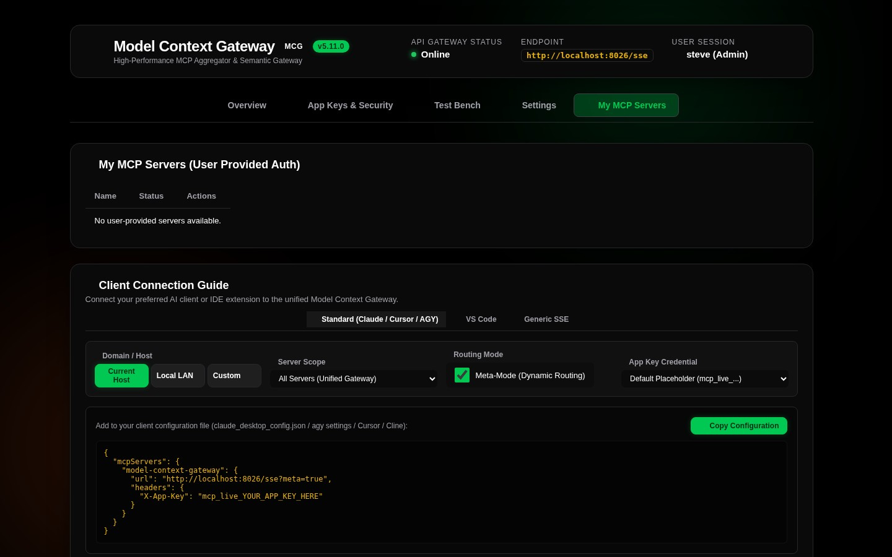

# 01. Dashboard & Navigation Interface

The **Model Context Gateway (MCG) Dashboard** lets you monitor, configure, test, and secure your system. Use it to manage Model Context Protocol (MCP) servers, client connections, and security policies.

---

## 🖥️ Layout & Primary Navigation Tabs


The web interface includes a fixed top navigation bar. You can switch between primary views with one click:

```
+--------------------------------------------------------------------------------------------------------+
| 🌐 Model Context Gateway (MCG)  [Overview] [App Keys & Security] [Test Bench] [Settings] [My MCP Servers]  👤 admin |
+--------------------------------------------------------------------------------------------------------+
```

1. **Overview (`Overview`)**: Shows system metrics (`StatsCard`), the backend server catalog, search and sort controls, and the client setup guide.
2. **App Keys & Security (`App Keys & Security` / `My App Keys`)**: Lets you create AppKeys, inspect connected clients, set access scopes, manage user quotas, and copy configuration snippets.
3. **Test Bench (`Test Bench`)**: Lets you execute tools, read virtual resources, test prompt templates, run semantic searches, send JSON-RPC commands, and view live logs.
4. **Settings (`Settings` - Admin Only)**: Lets administrators configure vector search engines, identity providers, secret providers, custom files, and access policies.
5. **My MCP Servers (`My MCP Servers`)**: Lets users manage personal access tokens (PATs), view accessible servers, and copy direct connection endpoints.
6. **Identity & Version Badge**: Shows the authenticated user name and the active gateway version in the top-right corner.

---

## 📊 Overview View: Statistics & Metric Cards

### Statistics Summary Card (`StatsCard`)
The `StatsCard` appears at the top of the **Overview** tab. It displays four real-time metrics:

* **Total Servers**: The total number of registered MCP servers in the database.
* **Connected**: The number of enabled servers with an active and healthy connection.
* **Failed / Error**: The number of enabled servers that report a connection failure or error.
* **Disabled**: The number of administratively disabled servers.

---

## 🎛️ Server Controls Toolbar: Search, Sort, & Grouping

Manage the server catalog with the **Server Controls Toolbar**:

```
[ 🔍 Search servers by name, ID, category... ] [ Sort: Status ▾ ] [ Group: Category ▾ ] [ + Add Server ]
```

### 1. Real-Time Search & Filtering
* **Instant Filter**: Type in the search box to filter servers. The search matches display names, server IDs, URLs, commands, and categories.
* **Category Filtering**: Click category badges or type a category name to filter servers. Examples include `Smart Home`, `Media`, `Infrastructure`, and `Cloud`.

### 2. Multi-Mode Sorting
Sort the server catalog with the **Sort** dropdown:
* **Status Priority** (Default): Shows connected servers first, then disconnected servers, then disabled servers.
* **Name (A–Z / Ascending)**: Sorts alphabetically by display name.
* **Name (Z–A / Descending)**: Sorts reverse alphabetically by display name.
* **Transport Type**: Sorts by protocol type (`SSE`, `HTTP`, or `STDIO`).
* **Category**: Sorts alphabetically by primary category tag.

### 3. Hierarchical Grouping & Collapsible Sections
Organize the server list into collapsible sections with the **Group** dropdown:
* **None**: Shows a flat list with pagination controls.
* **Group by Category**: Groups servers by domain tags (such as `Media`, `Smart Home`, `Infrastructure`, or `Cloud`).
* **Group by Status**: Groups servers by connection health (`Connected`, `Disconnected`, or `Disabled`).
* **Group by Transport Type**: Groups servers by protocol (`SSE`, `HTTP`, or `STDIO`).
* **Collapsible Sections**: Click any section header to collapse or expand that group.

### 4. Dynamic Pagination Toolbar (`PaginationToolbar`)
When you use a flat list (`Group: None`), the footer toolbar provides page controls:
* **Page Size**: Choose **10**, **25**, **50**, or **All** servers per page.
* **Page Navigation**: Use **First**, **Previous**, page numbers, **Next**, and **Last** buttons to navigate.

---

## 🗂️ Server Status Cards

Each registered backend MCP server appears on an individual card:

```
+-----------------------------------------------------------------------------+
| 🟢 Docker Daemon MCP  [docker]                     [SSE] [Tools: 24] [Resources: 6] [Vault] |
| 🔗 http://docker-mcp:8080/sse                      📂 Infrastructure                        |
|                                                                                             |
| [ 👁️ Inspect ]  [ ✏️ Edit ]  [ 🛡️ Policy ]  [ 🔄 Reconnect ]  [ 🗑️ Delete ]                 |
+-----------------------------------------------------------------------------+
```

### Card Indicators & Badges
* **Connection Status Indicator**:
  * 🟢 **Green (Connected)**: The connection is active. Tools and resources are cached and ready.
  * 🟡 **Yellow (Connecting / Degraded)**: The gateway is connecting or is timing out.
  * 🔴 **Red (Disconnected / Error)**: The endpoint is unreachable, the process stopped, or credentials failed.
  * ⚫ **Gray (Disabled)**: An administrator paused the server. The gateway routes no traffic to it.
* **Transport Badge**: Shows the protocol type (`SSE`, `HTTP`, or `STDIO`).
* **Capabilities Badges**: Shows the count of discovered tools, virtual resources, and prompts.
* **Secret Provider Badge**: Shows the credential source (`None`, `Env`, `Vault`, `Registry`, or `OAuth2`).
* **Category Badges**: Shows category tags assigned to the server.

### Card Actions
* **👁️ Inspect**: Opens the Inspect modal. You can view tool schemas, resource URIs, and prompt parameters.
* **✏️ Edit**: Opens the Edit modal. You can modify display names, endpoints, commands, headers, categories, and secrets.
* **🛡️ Policy**: Opens the Policy modal. You can configure allowed groups, denied groups, and default access rules.
* **🔄 Reconnect**: Clears cached data and restarts the connection to the backend server.
* **🗑️ Delete**: Removes the server registration and closes active sessions.


---

## 🔑 My MCP Servers (Per-User Provided Credentials)



In multi-user environments, users can bring their own credentials or personal access tokens (PATs). The **My MCP Servers** tab lets users store and manage personal credentials. The gateway encrypts these credentials with an envelope master key.

## 📖 Navigation Flow Summary

```mermaid
graph TD
    Nav[Global Top Navigation] --> Overview[Overview Tab]
    Nav --> Security[App Keys & Security Tab]
    Nav --> TestBench[Test Bench Tab]
    Nav --> Settings[Settings Tab - Admin]
    Nav --> MyServers[My MCP Servers Tab]

    Overview --> Stats[Operational Stats Card]
    Overview --> Controls[Search / Sort / Group Controls]
    Overview --> ServerCards[Server Status Cards]
    Overview --> QuickSetup[Client Setup Guide]

    Security --> AppKeys[AppKey Generation & Scopes]
    Security --> Clients[Connected Clients Registry]
    Security --> Quotas[User Quotas & Lifecycle Limits]
    Security --> SetupSnippets[Client Config Snippets]

    TestBench --> ToolTester[Tool Execution Form Builder]
    TestBench --> ResTester[Virtual Resource Reader]
    TestBench --> PromptTester[Prompt Template Tester]
    TestBench --> SemanticRouter[Semantic Search Simulator]
    TestBench --> RawConsole[JSON-RPC Direct Console]
    TestBench --> LiveLogs[Real-time Terminal Logs]

    Settings --> GenTab[Vector & Search Engines]
    Settings --> IdTab[Identity & Auth Providers]
    Settings --> SecProvTab[Secret Providers Configuration]
    Settings --> FilesTab[Custom Prompts & Resources]
    Settings --> AccessTab[RBAC Policies & Group Mappings]

    MyServers --> PersonalCreds[Personal User Credentials]
    MyServers --> UserEndpoints[Custom Connection Endpoints]
```



