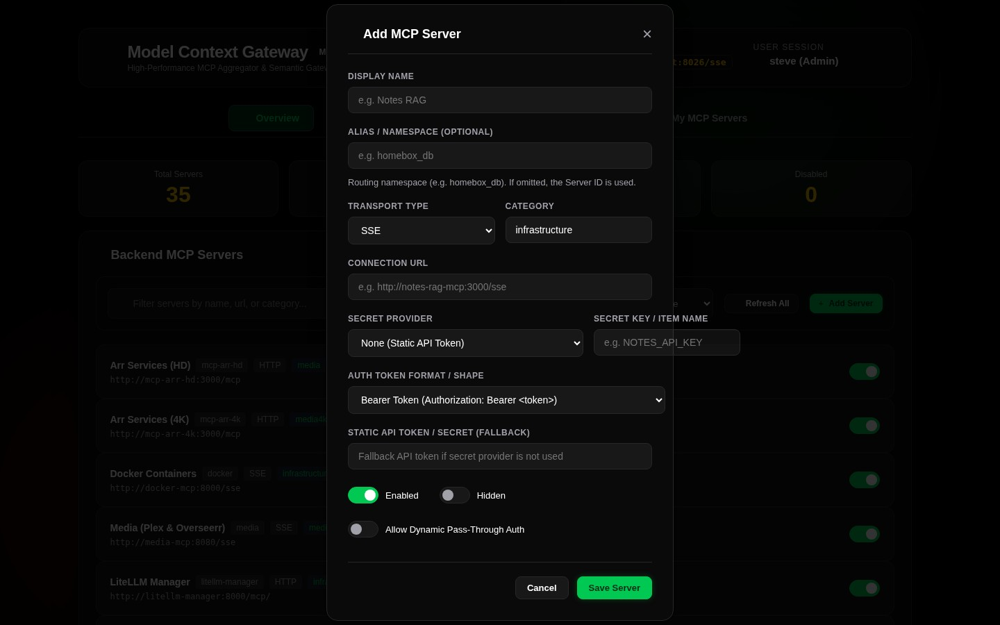
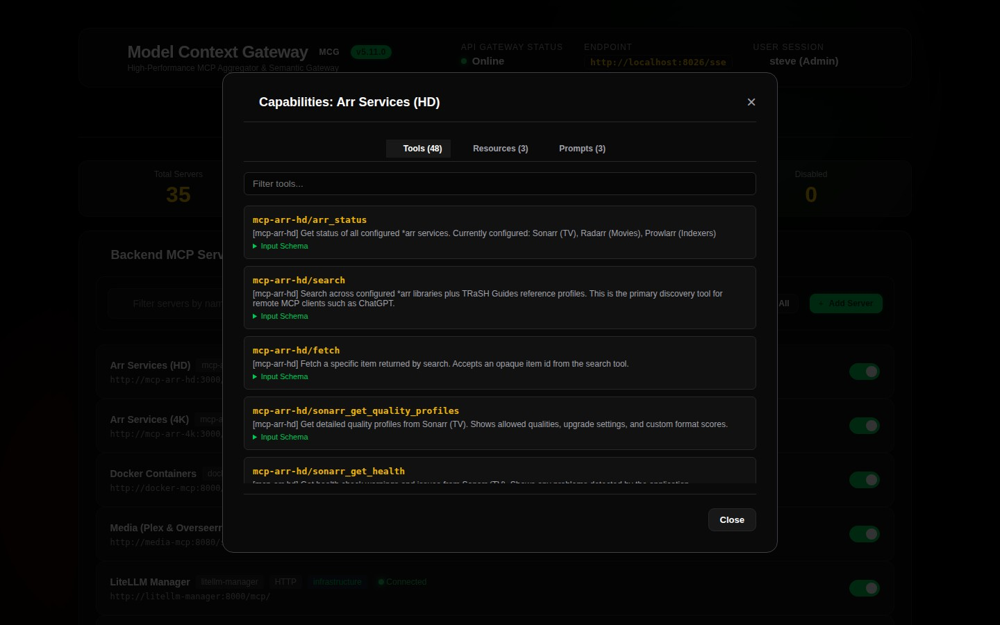

# 02. Server Management & Secret Providers

The **Model Context Gateway (MCG)** registers and manages backend Model Context Protocol (MCP) servers. It supports three transport types: `SSE`, `HTTP`, and `STDIO`. It also integrates with secret providers to protect credentials.

> [!TIP]
> **Need a configuration recipe for your server?** Check the [**MCP Server Authentication & Integration Cookbook**](../mcp-server-auth-cookbook.md) for quick decision tables and configuration examples.

---

## ➕ Registering a New Backend Server



Click the **`+ Add Server`** button in the dashboard toolbar to open the registration modal.

```
+-------------------------------------------------------------------------------+
| ➕ Add New MCP Server                                                      [X] |
+-------------------------------------------------------------------------------+
| Server Identifier:   [ docker                                              ]  |
| Display Name:        [ Docker Infrastructure Daemon                        ]  |
| Transport Type:      (•) SSE Stream   ( ) HTTP JSON-RPC   ( ) STDIO CLI       |
| Endpoint / Command:  [ http://docker-mcp:8080/sse                          ]  |
| Categories (comma):  [ Infrastructure, DevOps                              ]  |
|                                                                               |
| Secret Provider:     [ HashiCorp Vault (KV v2) ▾                           ]  |
|   Vault Mount:       [ secret                                              ]  |
|   Secret Path:       [ homelab/docker                                      ]  |
|   Secret Field:      [ api_token                                           ]  |
|                                                                               |
| Custom Headers:      [ {"X-Custom-Header": "value"}                        ]  |
|                                                                               |
| [ Cancel ]                                                    [ Save Server ] |
+-------------------------------------------------------------------------------+
```

### Core Configuration Parameters

| Field | Description | Example |
| :--- | :--- | :--- |
| **Server Identifier (`id`)** | Unique text string. The gateway uses this identifier to namespace tools (`{id}__{tool}`) and route requests (`/{id}`). | `docker`, `homeassistant`, `plex` |
| **Display Name** | Human-readable name shown on cards and test bench selectors. | `Docker Infrastructure Daemon` |
| **Transport Type** | Communication protocol: `SSE`, `HTTP`, or `STDIO`. | `SSE` |
| **Endpoint / Command** | Full HTTP or SSE URL, or a CLI command path. | `http://docker-mcp:8080/sse` or `npx` |
| **Categories** | Comma-separated tags for filtering and category-scoped AppKeys. | `Infrastructure, Smart Home` |
| **Secret Provider** | Secret resolution system: `None`, `Environment`, `Vault`, or `WindowsRegistry`. | `Vault` |
| **Custom Headers** | Optional JSON key-value map of HTTP headers sent with downstream requests. | `{"Authorization": "Bearer token"}` |

---

## 🚀 Transport Types & Lifecycle Behaviors

> [!TIP]
> For technical specifications and process lifecycle policies, read the [**Transport Capability & Configuration Guide**](../transports.md).

### 1. Server-Sent Events (`SSE`)
* **Usage**: Stateful stream for real-time notifications and long operations.
* **Endpoint Pattern**: `http://host:port/sse`
* **Session Lifecycle**: The gateway opens an SSE connection to the backend server. It tracks session IDs and routes JSON-RPC messages between clients and the server.

### 2. HTTP JSON-RPC (`HTTP` / `Streamable`)
* **Usage**: Stateless HTTP POST requests with standard JSON-RPC 2.0 payloads.
* **Endpoint Pattern**: `http://host:port/mcp` or `http://host:port/v1/jsonrpc`
* **Session Lifecycle**: The gateway sends an independent HTTP request for each tool call, prompt evaluation, or resource read. This mode works well for microservices.

### 3. Local Subprocess (`STDIO`)
* **Usage**: Starts local CLI tools or container binaries that communicate through standard input and output (`stdin`/`stdout`).
* **Command Syntax**: Executable name with command-line arguments (for example, `npx -y @modelcontextprotocol/server-filesystem /shared/data`).
* **Secret Protection**: The gateway injects resolved secrets directly into the process environment variables. Secrets never appear in command strings or system process lists (`ps aux`).

---

## 🔐 Enterprise Secret Providers

The gateway supports four secret resolution options to avoid plaintext credentials in database records:

```
                  SECRET RESOLUTION ARCHITECTURE
                  
                      +-------------------+
                      | McpServer Record  |
                      | (Encrypted in DB) |
                      +-------------------+
                                |
                                v
               [ SecretProvider Strategy Resolver ]
                                |
        +-----------------------+-----------------------+
        |                       |                       |
        v                       v                       v
+---------------+       +---------------+       +---------------+
|  Environment  |       |   HashiCorp   |       |    Windows    |
|   Variables   |       |  Vault KV v2  |       |   Registry    |
|  (Host / OS)  |       |  (JIT Token)  |       |  (DPAPI Blob) |
+---------------+       +---------------+       +---------------+
```

### 1. Direct Static Key (`None`)
* Stores credentials directly in the server configuration.
* Use this option for local development, public APIs, or unauthenticated internal networks.

### 2. Environment Variables (`Environment` / `Env`)
* Resolves secrets from environment variables on the gateway host.
* **Configuration**: Set `Item Key / Path` to the environment variable name (for example, `HOME_ASSISTANT_LONG_LIVED_TOKEN`).
* You can use the `ENV:` prefix notation (for example, `env:DOCKER_SECRET_KEY`).

### 3. HashiCorp Vault KV v2 (`Vault` / `HashiCorpVault`)
* Reads secrets from HashiCorp Vault Key-Value Version 2 (`kv-v2`) engines.
* **Authentication**: Supports AppRole authentication (`roleId` and `secretId`) or a direct Vault Token.
* **Features**:
  * **Automatic Token Renewal**: Checks token time-to-live before each request. The gateway re-authenticates if less than five minutes remain.
  * **In-Memory Cache**: Stores retrieved secrets in memory for 10 minutes.
  * **Parameters**:
    * **Secret Mount**: Mount path of the KV v2 engine (default: `secret`).
    * **Secret Path**: Path to the secret document (for example, `homelab/services/radarr`).
    * **Secret Field**: Specific key name in the secret document (for example, `api_key`).

### 4. Windows Registry DPAPI (`WindowsRegistry` / `Registry`)
* Reads credentials from Windows Registry keys (`HKLM` or `HKCU`).
* **DPAPI Decryption**: Detects and decrypts DPAPI-encrypted data blobs automatically.
* **Parameters**:
  * **Secret Path**: Subkey registry path (for example, `SOFTWARE\Homelab\McpSecrets`).
  * **Secret Field**: Registry value name (for example, `PlexToken`).
* *Note: Returns `null` when running on Linux containers.*

---

## 👁️ Inspecting Server Capabilities (Inspect Modal)



Click **`Inspect`** on any server card to open the Server Inspect Modal:

* **Tools Tab**: Lists all discovered tools, their names, descriptions, and parameter JSON schemas.
* **Resources Tab**: Displays virtual resource URIs (for example, `mcp://docker/containers/list`), MIME types, and descriptions.
* **Prompts Tab**: Displays prompt templates and required arguments.
* **Raw Schema**: Shows the raw JSON-RPC discovery response from the downstream server.

---

## 📄 Custom Tool JSON Specifications

If downstream services do not support the MCP protocol directly, you can upload custom specifications:

1. Click **Settings**, then click **Prompts & Resources** (or **Custom Files**).
2. Click **+ Add Custom File**.
3. Select the file type (`Tools`, `Prompts`, or `Resources`). Enter a filename and paste valid JSON:

```json
[
  {
    "name": "network_ping_host",
    "description": "Sends an ICMP ping to a target IP or hostname",
    "parameters": {
      "type": "object",
      "properties": {
        "host": {
          "type": "string",
          "description": "Target hostname or IPv4 address"
        },
        "count": {
          "type": "integer",
          "default": 4,
          "description": "Number of packets to send"
        }
      },
      "required": ["host"]
    }
  }
]
```

4. Click **Save File**. The gateway indexes the new items into the catalog and vector search engine.
