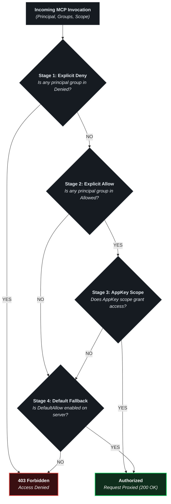
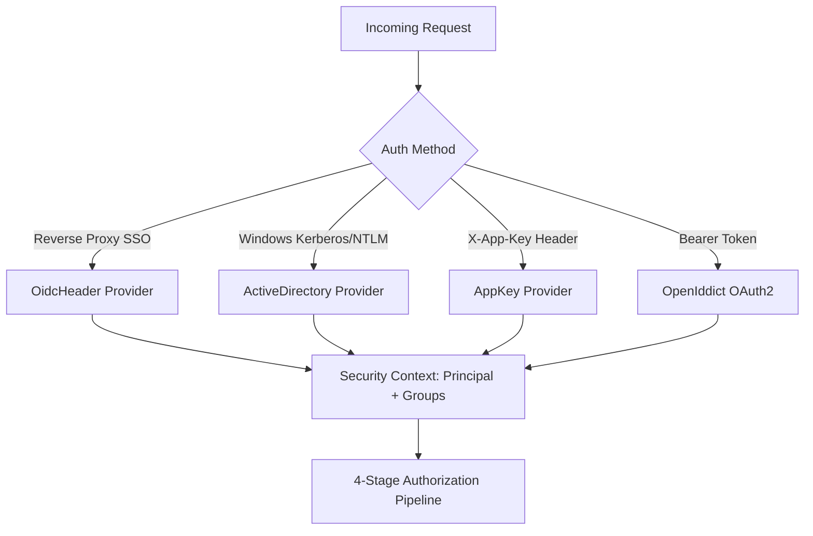
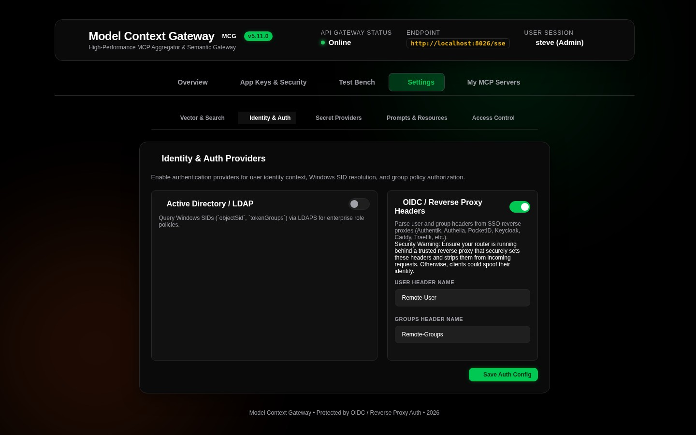

# 03. RBAC, Security & Access Control Policies

The **Model Context Gateway (MCG)** enforces Role-Based Access Control (RBAC). It resolves user identities, checks access rules, enforces user quotas, and validates AppKey scopes.

---

## 🛡️ The 4-Stage Authorization Pipeline

The gateway evaluates every tool invocation, virtual resource request, and prompt evaluation through a four-stage pipeline:

### Stage 1: Explicit Deny Rules (Highest Precedence)
* If any caller group or SID matches the server `DeniedGroups` list, the gateway rejects the request (`403 Forbidden`).
* Deny rules always override allow rules and administrative scopes.

### Stage 2: Explicit Allow Rules
* If any caller group matches the server `AllowedGroups` list, the gateway accepts the group check and evaluates key scopes.

### Stage 3: AppKey Scope Verification
* For AppKey requests, the gateway verifies that the key scope permits the action. Supported scopes include `*`, `all`, `admin`, `category:<name>`, `server:<id>`, `tool:<name>`, `resource:<uri>`, and `prompt:<name>`.

### Stage 4: Default Policy Fallback
* If no explicit group rule matches, the gateway checks the server `DefaultAllow` setting. If `DefaultAllow` is `false`, the gateway rejects the request (`403 Forbidden`).

---

## 👥 Pluggable Identity Providers

The gateway determines caller identity and group claims through pluggable identity providers:

### 1. Reverse Proxy SSO Headers (`OidcHeader`)
* Integrates with reverse proxies and identity providers such as Authentik, Authelia, PocketID, Keycloak, Traefik, Caddy, or Nginx.
* Reads forward-auth headers:
  * `Remote-User`: Username or user principal name (for example, `admin`).
  * `Remote-Groups`: Comma-separated group names (for example, `full_admin, engineering, devops`).
  * `Remote-Email`: User email address.
  * `Remote-Name`: User display name.

### 2. Active Directory Windows SIDs (`ActiveDirectory`)
* Integrates with Windows Domain Controllers and Active Directory.
* Resolves Windows Security Identifiers (SIDs) and group memberships from Kerberos or NTLM tokens (for example, `S-1-5-32-544` or `Domain Admins`).

### 3. AppKey Authentication (`AppKey`)
* Authenticates AI clients and developer tools with SHA-256 tokens (`mcp-...`).
* Supports granular scopes (`*`, `all`, `admin`, `category:<name>`, `server:<id>`, `tool:<name>`, `resource:<uri>`, `prompt:<name>`).
* Keys with `admin`, `all`, or `*` scopes assign the `Administrator` role. This role grants access to administrative endpoints and the Admin MCP Server.

### 4. Standalone Mode & Local Network Authorization
* Operates when you do not configure an external identity provider.
* Compares client IP addresses against `Admin:StandaloneAllowedNetworks`. The default setting allows loopback addresses (`127.0.0.1`, `::1`).
* You can allow local subnets (such as `10.0.0.0/8` or `192.168.0.0/16`) through the environment variable `Admin__StandaloneAllowedNetworks__0=10.0.0.0/8`.
* Requests from other IP addresses require an Admin AppKey (`mcp-global-admin...`).

### 5. OAuth 2.0 Authorization Server (`OpenIddict`) & RFC 7591 Dynamic Client Registration
* Includes an OAuth 2.0 authorization server that issues signed access tokens.
* **Dynamic Client Registration (RFC 7591)**: External clients can register credentials at `/api/register`, `/connect/register`, or `/oauth/register`.
* **Isolated OAuth Client Storage**: Stores client credentials separately from API keys. The gateway hashes client secrets with SHA-256 and validates redirect URIs, grant types, and scopes.
* **Web Interface Management**: View, register, and revoke OAuth client applications in the **App Keys & Security** tab.

---

## 🎛️ Configuring Access Control & Group Mappings

### 1. Server Policy Configuration Modal
Click **Policy** on any server card on the Overview dashboard:

* **Allowed Groups**: Enter comma-separated group names or SIDs that can access this server (for example, `full_admin, homelab_users`).
* **Denied Groups**: Enter comma-separated group names or SIDs blocked from this server (for example, `contractors, guest_users`).
* **Default Behavior**: Select **Allow by Default** or **Deny by Default**.

### 2. Access Control Settings Tab
Go to **Settings**, then select **Access Control**:
* **Group Mappings Table**: Maps external SSO or Active Directory groups to internal roles.
* **Server Policies Table**: Shows all server policies in a table for quick editing.

---

## 📊 User Quotas & Lifecycle Limits

The gateway provides user quota management to control key creation and resource usage:

* **Maximum AppKeys per User**: Administrators can set key limits for each user (default: 5 keys).
* **Key Expiration**: Keys support expiration periods (`30 Days`, `90 Days`, `1 Year`, or `Never`).
* **Instant Revocation**: Administrators and key owners can revoke AppKeys immediately.
* **Quota Controls**: Configure quotas in the **App Keys & Security** tab under **User Quota Limits**.

---

## 🔒 PII Sanitization & Audit Logging

The gateway sanitizes payloads (`PiiSanitizer`) and writes audit records (`sp_InsertAuditLog`):
* **Automatic Redaction**: Removes bearer tokens, passwords, API keys, and sensitive secrets before saving audit records to the database.
* **Audit Metadata**: Records timestamps, client identity, target server, tool name, execution time, HTTP status code, and sanitized parameters.

For database schema details and security tables (`AccessPolicies`, `ToolAccessPolicies`, `AdGroups`, and `AuditLogs`), see the [**Database Entity-Relationship Diagram**](../database-providers.md#unified-database-entity-relationship-diagram-erd).
