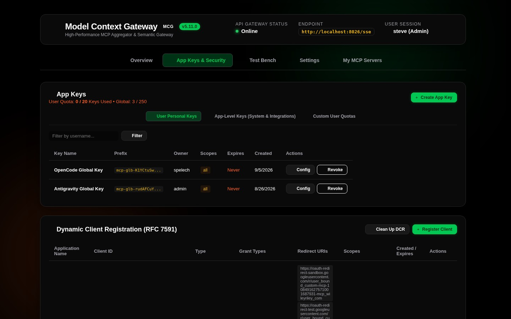
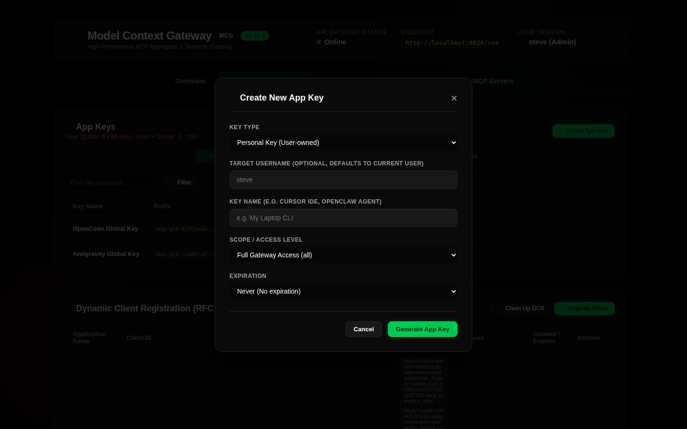
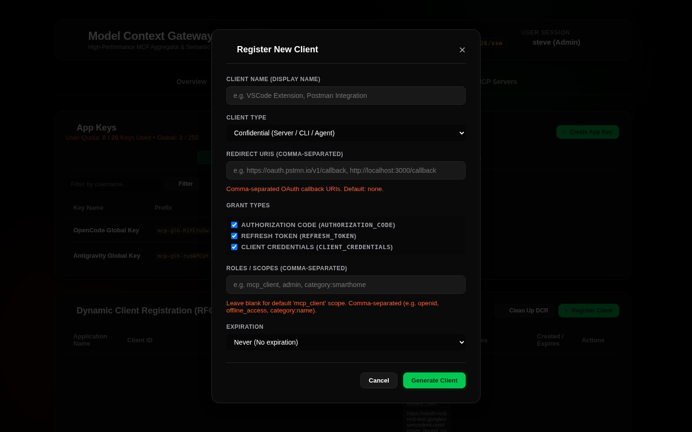

# 04. Client Setup & App Key Management

The **Model Context Gateway (MCG)** enables AI coding assistants, IDEs, and autonomous agent frameworks to connect securely using standard Model Context Protocol (MCP) clients, secured by cryptographically hashed, scoped **AppKeys**.

---

## Managing App Keys (`App Keys & Security` Tab)



AppKeys grant external clients secure, authenticated access to the router without exposing master administrator credentials or passing raw SSO headers.



### 1. Generating an AppKey
1. Click **`App Keys & Security`** in the top navigation bar.
2. Click **`+ Generate App Key`** to open the creation modal.
3. Configure the key parameters:
   * **Key Label**: Descriptive identifier for the client (e.g. `Cursor IDE - MacBook`, `Antigravity CLI - Server 10`).
   * **Assigned User**: User principal UPN to associate with audit logs and RBAC policies.
   * **Access Scopes**: Assign least-privilege permissions (see scope grammar below).
   * **Expiration**: Select `30 Days`, `90 Days`, `1 Year`, or `Never`.
4. Click **Generate Key**.
5. **Copy the Secret Key**: The plaintext key (`mcp_app_key_...`) is displayed **only once**. Store it in your client configuration or secrets manager immediately. The database stores only the one-way SHA-256 hash.

---

## AppKey Scope Grammar & Examples

> [!TIP]
> For the complete formal grammar specification, evaluation order, and least-privilege persona recipes, refer to the [**AppKey Scopes & Authorization Guide**](../appkey-scopes.md). For the underlying database schema and hash storage model (`AppKeys`), see the [**Database Entity-Relationship Diagram**](../database-providers.md#unified-database-entity-relationship-diagram-erd).

| Scope Pattern | Description | Example |
| :--- | :--- | :--- |
| `*`, `all` | **Global Access**: Grants unrestricted access to all servers, tools, resources, and prompts. | `*`, `all` |
| `admin` | **Administrative Access**: Grants full gateway administration rights and access to the `/admin` MCP server. | `admin` |
| `category:<name>` | **Category Scope**: Grants access to all servers tagged with the specified category. | `category:smarthome`, `category:media` |
| `server:<id>` | **Server Scope**: Grants access to all capabilities of a specific backend server. | `server:docker`, `server:actual_budget` |
| `tool:<name>` | **Granular Tool**: Grants execution rights for a specific namespaced tool. | `tool:docker__ps`, `tool:ha__get_state` |
| `resource:<uri>` | **Granular Resource**: Grants read access to a specific virtual resource URI. | `resource:mcp://docker/containers` |
| `prompt:<name>` | **Granular Prompt**: Grants access to a specific prompt template. | `prompt:notes__summarize` |

---

## Dynamic Client Setup Guide

The **Client Setup Guide** card (available on both the Overview and App Keys & Security views) features an interactive configuration generator:

```
[ Target Route: Unified Meta-Mode (/sse?meta=true) ▾ ]
[ Client Tool: Cursor IDE ▾ ]  [ Host: http://localhost:8080 ]  [☑ Include X-App-Key ]
```

---

### 1. Cursor IDE (`.cursor/mcp.json`)

To connect Cursor to the unified Meta-Mode gateway:

1. Create or edit `.cursor/mcp.json` in your project root or global settings:
```json
{
  "mcpServers": {
    "model-context-gateway": {
      "url": "http://localhost:8080/sse",
      "headers": {
        "X-App-Key": "mcp_app_key_your_generated_secret_key_here"
      }
    }
  }
}
```
2. Restart Cursor or reload MCP servers in Cursor Settings (`Features` -> `MCP Servers`).

---

### 2. Claude Desktop (`claude_desktop_config.json`)

Claude Desktop connects using the official MCP inspector bridge or direct SSE transport:

* **File Location**:
  * **macOS**: `~/Library/Application Support/Claude/claude_desktop_config.json`
  * **Windows**: `%APPDATA%\Claude\claude_desktop_config.json`
  * **Linux**: `~/.config/Claude/claude_desktop_config.json`

```json
{
  "mcpServers": {
    "model-context-gateway": {
      "command": "npx",
      "args": [
        "-y",
        "@modelcontextprotocol/inspector",
        "http://localhost:8080/sse"
      ],
      "env": {
        "X_APP_KEY": "mcp_app_key_your_generated_secret_key_here"
      }
    }
  }
}
```

---

### 3. Antigravity CLI / OpenClaw Autonomous Agent

For CLI coding agents and autonomous workflows:

```bash
# Export environment variable
export MCG_URL="http://localhost:8080/sse"
export MCG_KEY="mcp-adm-your_generated_secret_key_here"

# Connect via Antigravity CLI
agy mcp connect --url "$MCG_URL" --header "X-App-Key: $MCG_KEY"
```

---

### 4. VS Code / Cline / Roo Code (`cline_mcp_settings.json`)

In VS Code with the Cline or Roo Code extension:

```json
{
  "mcpServers": {
    "model-context-gateway": {
      "url": "http://localhost:8080/sse",
      "headers": {
        "X-App-Key": "mcp_app_key_your_generated_secret_key_here"
      }
    }
  }
}
```

---

### 5. TypeScript & Python SDK Clients

#### TypeScript (`@modelcontextprotocol/sdk`)
```typescript
import { Client } from "@modelcontextprotocol/sdk/client/index.js";
import { SSEClientTransport } from "@modelcontextprotocol/sdk/client/sse.js";

const transport = new SSEClientTransport(
  new URL("http://localhost:8080/sse"),
  {
    requestInit: {
      headers: {
        "X-App-Key": "mcp_app_key_your_generated_secret_key_here"
      }
    }
  }
);

const client = new Client({ name: "my-ts-agent", version: "1.0.0" }, { capabilities: {} });
await client.connect(transport);

// In Meta-Mode, search for tools dynamically
const searchResult = await client.callTool({
  name: "search_tools",
  arguments: { query: "restart container" }
});
console.log("Discovered tools:", searchResult);
```

#### Python (`mcp` SDK)
```python
import asyncio
from mcp import ClientSession
from mcp.client.sse import sse_client

async def main():
    headers = {"X-App-Key": "mcp_app_key_your_generated_secret_key_here"}
    async with sse_client("http://localhost:8080/sse", headers=headers) as (read, write):
        async with ClientSession(read, write) as session:
            await session.initialize()
            tools = await session.list_tools()
            print("Connected! Available bootstrap tools:", [t.name for t in tools.tools])

asyncio.run(main())
```

---

## Registered Clients Registry (`RegisteredClientsCard`)



The **Registered Clients** table in the App Keys & Security view provides real-time visibility into active client connections:

* **Client Name & ID**: Reported client user-agent or application name.
* **Protocol Version**: Negotiated MCP specification version (e.g. `2026-07-28`).
* **Client IP Address**: Source IP address of the client connection.
* **Active Sessions**: Number of open SSE / HTTP sessions.
* **Last Seen**: Live timestamp of the most recent JSON-RPC activity.

---

## Interactive OAuth 2.0 Consent Screen


When third-party multi-tenant applications or developer tools initiate the standard OAuth 2.0 Authorization Code flow against `/oauth/authorize` or `/connect/authorize`, the gateway presents the interactive consent authorization screen at `/consent`. End-users can inspect the requested client identity, verify backend scope boundaries, and approve or deny access in real time.
