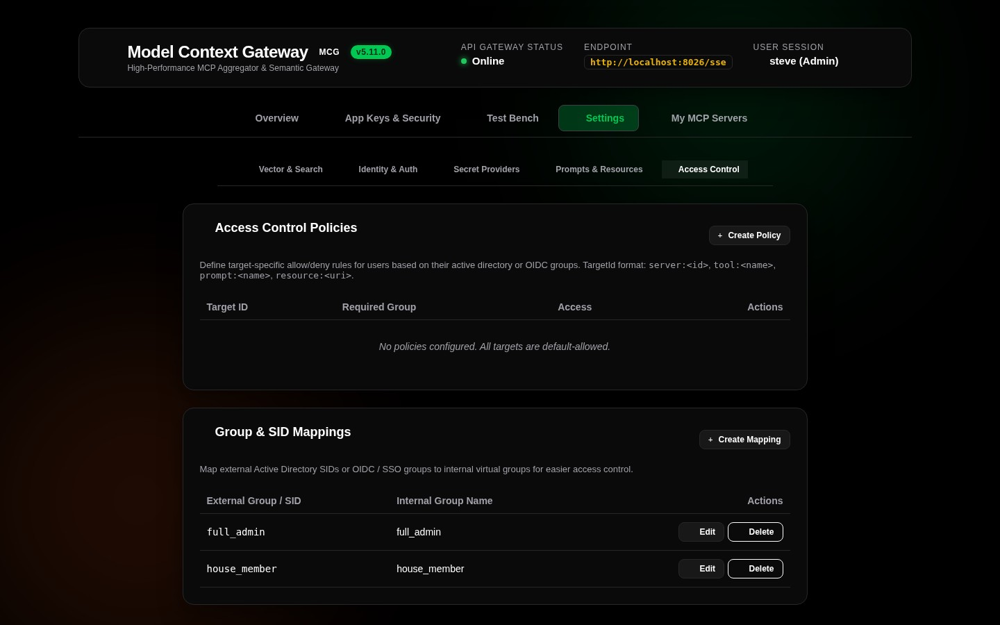
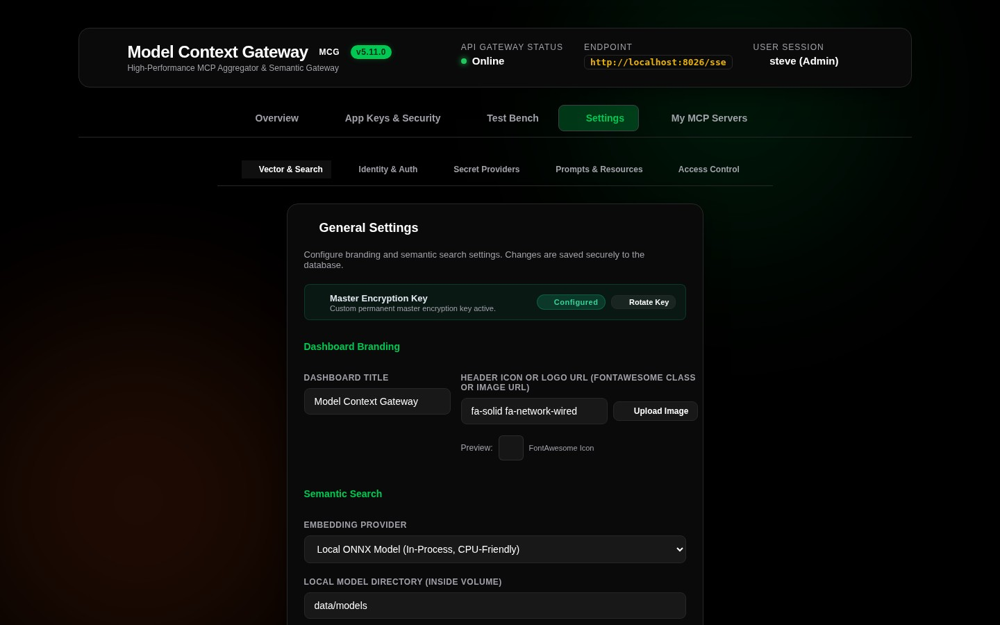
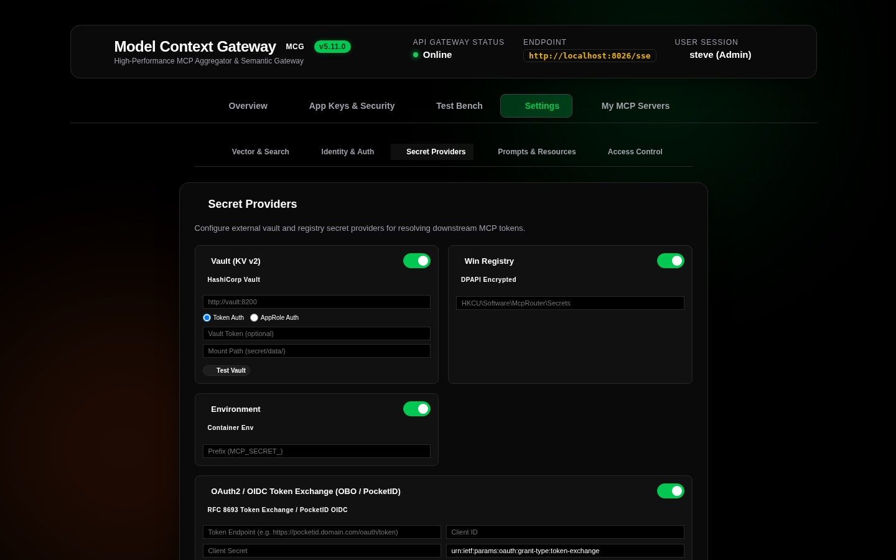
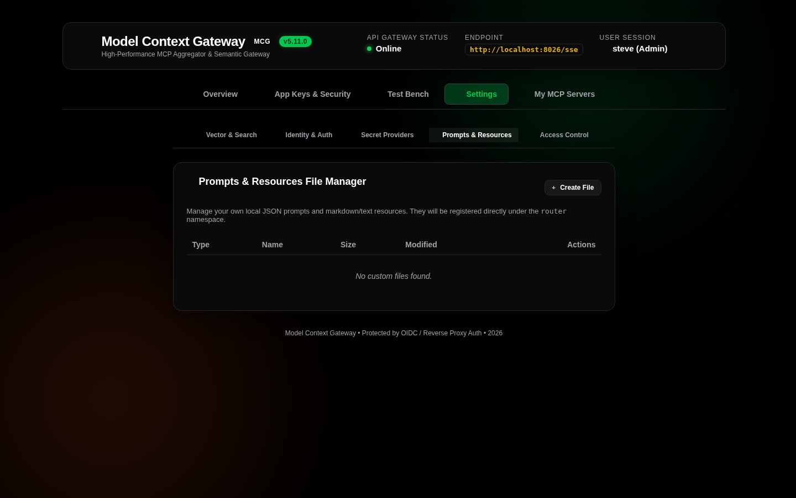

# 06. System Settings & Vector Embeddings

The **Settings View** (`Settings` tab) lets administrators configure vector search engines, identity providers, secret providers, custom files, and access rules.

---

## 🧭 Settings Sub-Navigation Tabs



The Settings interface contains five tabs:

```
+-------------------------------------------------------------------------------------------------------------------------+
| [ 🧠 Vector & Search ]  [ 🪪 Identity & Auth ]  [ 🔐 Secret Providers ]  [ 📂 Prompts & Resources ]  [ 👥 Access Control ] |
+-------------------------------------------------------------------------------------------------------------------------+
```

---

## 🧠 Tab 1: Vector & Search Engine (`GeneralTab`)



The vector engine powers the **Meta-Mode** tool discovery function (`search_tools`). It matches client queries to backend tools in the catalog:

```
+-------------------------------------------------------------------------------+
| 🧠 Vector Embedding & Semantic Search Configuration                           |
+-------------------------------------------------------------------------------+
| Embedding Engine:     (•) Local ONNX In-Process   ( ) External API Provider   |
|                                                                               |
| [Local ONNX Engine Parameters]                                                |
| Model Architecture:   All-MiniLM-L6-v2 (384-dimensional dense vectors)        |
| Model Cache Path:     [ /data/models                                       ]  |
| Execution Provider:   CPU Multi-Threaded In-Process (Microsoft.ML.OnnxRuntime) |
|                                                                               |
| [External API Provider Parameters]                                            |
| Provider Type:        [ OpenAI / Compatible (LiteLLM, Ollama) ▾ ]             |
| Base API Endpoint:    [ https://api.openai.com/v1                          ]  |
| API Secret Key:       [ sk-proj-********************************           ]  |
| Model Identifier:     [ text-embedding-3-small                             ]  |
|                                                                               |
| [ Save Vector Settings ]                                                      |
+-------------------------------------------------------------------------------+
```

### 1. Local ONNX Engine (Recommended / Default)
* **Model**: Uses the embedded `All-MiniLM-L6-v2` transformer model.
* **No External Dependencies**: Runs in-process on CPU using `Microsoft.ML.OnnxRuntime` and `Microsoft.ML.Tokenizers`.
* **Data Privacy**: Queries and tool descriptions never leave the local host or container.
* **Automatic Download**: The gateway downloads, verifies, and caches model files in the models directory (`/data/models`).

### 2. External API Provider (OpenAI / Ollama / LiteLLM)
* **Usage**: Connects to remote embedding endpoints or GPU clusters.
* **Supported Providers**: OpenAI, Azure OpenAI, Ollama, LiteLLM, Open WebUI, and vLLM.
* **Key Security**: The gateway encrypts API keys at rest with AES-256-GCM envelope encryption.

---

## 🪪 Tab 2: Identity & Auth Providers (`IdentityAuthTab`)


This tab configures how the gateway verifies incoming users and client tokens:

### 1. Active Directory / Windows SID Provider
* Enable or disable Windows Kerberos and NTLM authentication.
* Configure Domain Controller hosts, Base DN paths, and service credentials.

### 2. OIDC / Reverse Proxy Headers Provider
* Enable or disable reverse proxy headers (Authentik, Authelia, PocketID, Keycloak, Traefik, Caddy, or Nginx).
* Configure header names: `Remote-User`, `Remote-Groups`, `Remote-Email`, and `Remote-Name`.

### 3. OpenIddict OAuth 2.0 Authorization Server
* Configure token lifetimes, including access token and refresh token durations.
* Set paths for X.509 signing certificates and encryption keys.

---

## 🔐 Tab 3: Secret Providers (`SecretProvidersTab`)



Configure external systems that store secrets:
* **HashiCorp Vault KV v2**: Uses AppRole authentication (`roleId` and `secretId`) or a direct Vault Token with automatic renewal.
* **Windows Registry**: Uses DPAPI-encrypted secrets stored in `HKLM` or `HKCU` keys.
* **Container Environment**: Reads secrets from environment variables.
* **OAuth 2.0 Token Exchange (RFC 8693 / PocketID)**: Exchanges user tokens for downstream tools.

---

## 📂 Tab 4: Prompts & Resources File Manager (`CustomFilesTab`)



Create and manage custom JSON files for virtual tools, prompt templates, and virtual resources:

* **File Catalog Table**: Lists registered files by name, type (`Tools`, `Prompts`, or `Resources`), and update date.
* **Interactive Editor**: Includes a JSON editor and template builder that validate syntax before saving.
* **Immediate Reload**: Updates catalog caches and vector embeddings when you save changes.

---

## 👥 Tab 5: Access Control & Group Mappings (`AccessControlTab`)


Configure access permissions for servers, tools, and user groups:

* **Group Mappings Table**: Maps external identity groups (such as `CN=IT-Admins,OU=Groups,DC=corp` or `S-1-5-21-1001`) to internal roles (`full_admin`).
* **Server Policies Table**: Defines server access rules:
  * Target Identifier (for example, `server:docker`, `tool:docker__ps`, or `prompt:router__diagnose`)
  * Required Group (for example, `Engineering` or `Administrators`)
  * Mode (`ALLOW Access` or `DENY Access`)

