# Dashboard & Navigation Interface

The **Model Context Gateway (MCG) Dashboard** provides a centralized, web-based management interface to monitor, configure, test, and secure your Model Context Protocol (MCP) servers, client connections, and security policies.

---

## 🖥️ Layout & Primary Navigation Tabs


The web interface features a fixed top navigation bar allowing one-click access across all primary subsystems:

```
+--------------------------------------------------------------------------------------------------------+
| 🌐 Model Context Gateway (MCG)  [Overview] [App Keys & Security] [Test Bench] [Settings] [My MCP Servers]  👤 admin |
+--------------------------------------------------------------------------------------------------------+
```

1. **Overview (`Overview`)**: Displays system health metrics (`StatsCard`), the full registered server catalog, search and sort controls, and the interactive client setup guide.
2. **App Keys & Security (`App Keys & Security` / `My App Keys`)**: Create and manage cryptographically hashed AppKeys, inspect connected clients, set access scopes, manage user quotas, and copy client configuration snippets.
3. **Test Bench (`Test Bench`)**: Directly execute tools, read virtual resources, test prompt templates, run semantic searches, send raw JSON-RPC commands, and view live gateway diagnostic logs.
4. **Settings (`Settings` - Admin Only)**: Configure vector search engines (Local ONNX vs OpenAI/Ollama), identity providers, secret providers, custom files, and access control policies.
5. **My MCP Servers (`My MCP Servers`)**: Manage personal access tokens (PATs), view accessible servers, and copy user-scoped direct connection endpoints.
6. **Identity & Version Badge**: Displays the active authenticated user principal name and the running gateway version in the top-right corner.

---

## 📊 Overview View: Statistics & Metric Cards

### Statistics Summary Card (`StatsCard`)
The `StatsCard` appears at the top of the **Overview** view, reporting real-time operational status across the entire server catalog:

* **Total Servers**: The total count of registered MCP servers in the database.
* **Connected**: The number of enabled servers with an active, healthy upstream connection.
* **Failed / Error**: The number of enabled servers currently reporting an unreachable endpoint, process crash, or connection timeout.
* **Disabled**: The number of administratively paused or disabled servers.

---

## 🎛️ Server Controls Toolbar: Search, Sort, & Grouping

Manage and filter your server catalog using the **Server Controls Toolbar**:

```
[ 🔍 Search servers by name, ID, category... ] [ Sort: Status ▾ ] [ Group: Category ▾ ] [ + Add Server ]
```

### 1. Real-Time Search & Filtering
* **Instant Filter**: Type in the search box to filter servers in real time. The filter matches display names, server IDs, URLs, commands, and assigned categories.
* **Category Filtering**: Click on any category badge or type a category name to isolate specific server domains (such as `Smart Home`, `Media`, `Infrastructure`, or `Cloud`).

### 2. Multi-Mode Sorting
Sort the catalog instantly using the **Sort** dropdown:
* **Status Priority** (Default): Prioritizes connected servers first, followed by disconnected servers, and disabled servers last.
* **Name (A–Z / Ascending)**: Alphabetical sort by server display name.
* **Name (Z–A / Descending)**: Reverse alphabetical sort by server display name.
* **Transport Type**: Groups and sorts by protocol type (`SSE`, `HTTP`, or `STDIO`).
* **Category**: Sorts alphabetically by primary category tag.

### 3. Hierarchical Grouping & Collapsible Sections
Organize the server list into collapsible sections with the **Group** dropdown:
* **None**: Flat list rendering with dynamic pagination controls.
* **Group by Category**: Groups servers by domain tags (`Media`, `Smart Home`, `Infrastructure`, `Cloud`).
* **Group by Status**: Groups servers by connection health (`Connected`, `Disconnected`, `Disabled`).
* **Group by Transport Type**: Groups servers by protocol (`SSE`, `HTTP`, `STDIO`).
* **Collapsible Sections**: Click any group header to expand or collapse that section.

### 4. Dynamic Pagination Toolbar (`PaginationToolbar`)
When viewing the server catalog in flat mode (`Group: None`), the footer toolbar provides comprehensive pagination:
* **Page Size**: Switch between **10**, **25**, **50**, or **All** servers per page.
* **Page Navigation**: Jump quickly using **First**, **Previous**, numbered page buttons, **Next**, and **Last**.

---

## 🗂️ Server Status Cards

Each registered backend MCP server is represented by an interactive status card:

```
+-----------------------------------------------------------------------------+
| 🟢 Docker Daemon MCP  [docker]                     [SSE] [Tools: 24] [Resources: 6] [Vault] |
| 🔗 http://docker-mcp:8080/sse                      📂 Infrastructure                        |
|                                                                                             |
| [ 👁️ Inspect ]  [ ✏️ Edit ]  [ 🛡️ Policy ]  [ 🔄 Reconnect ]  [ 🗑️ Delete ]                 |
+-----------------------------------------------------------------------------+
```

### Card Indicators & Badges
* **Connection Status Indicator**:
  * 🟢 **Green (Connected)**: Upstream connection is healthy; tools and resources are cached and ready for routing.
  * 🟡 **Yellow (Connecting / Degraded)**: The gateway is establishing a connection or encountering transient latency.
  * 🔴 **Red (Disconnected / Error)**: Endpoint is unreachable, child process terminated, or authentication failed.
  * ⚫ **Gray (Disabled)**: Administratively disabled; no traffic is routed to this server.
* **Transport Badge**: Displays the active protocol (`SSE`, `HTTP`, or `STDIO`).
* **Capabilities Badges**: Shows the count of discovered tools, virtual resources, and prompt templates.
* **Secret Provider Badge**: Identifies the credential resolution mechanism (`None`, `Env`, `Vault`, `Registry`, `OAuth2`).
* **Category Badges**: Displays category tags assigned to the server.

### Card Actions
* **👁️ Inspect**: Opens the Server Capabilities Inspect Modal to examine discovered tool schemas, resource URIs, and prompt parameters.
* **✏️ Edit**: Opens the Edit modal to update display names, endpoints, commands, custom HTTP headers, categories, and secrets.
* **🛡️ Policy**: Opens the Policy modal to configure allowed groups, denied groups, and default access behaviors.
* **🔄 Reconnect**: Flushes in-memory capability caches and forces an immediate reconnect to the downstream server.
* **🗑️ Delete**: Unregisters the server from the database and terminates any active child processes or client sessions.


---

## 🔑 My MCP Servers (Per-User Provided Credentials)


In multi-tenant or team environments, individual users can supply personal access tokens (PATs) or custom credentials for shared servers:
* Stored credentials are encrypted using an envelope master key.
* Users can view and copy customized direct proxy endpoints (`http://localhost:8080/{serverId}`) pre-configured for their personal identity.
* Eliminates credential sharing while maintaining centralized auditing and policy governance.

---

## 📖 Global Navigation Flow

```mermaid
graph TD
    Nav[Global Top Navigation] --> Overview[Overview Tab]
    Nav --> Security[App Keys & Security Tab]
    Nav --> TestBench[Test Bench Tab]
    Nav --> Settings[Settings Tab - Admin]
    Nav --> MyServers[My MCP Servers Tab]

    Overview --> Stats[Operational Stats Card]
    Overview --> Controls[Search / Sort / Group Controls]
    Overview --> ServerCards[Server Status Cards]
    Overview --> QuickSetup[Client Setup Guide]

    Security --> AppKeys[AppKey Generation & Scopes]
    Security --> Clients[Connected Clients Registry]
    Security --> Quotas[User Quotas & Lifecycle Limits]
    Security --> SetupSnippets[Client Config Snippets]

    TestBench --> ToolTester[Tool Execution Form Builder]
    TestBench --> ResTester[Virtual Resource Reader]
    TestBench --> PromptTester[Prompt Template Tester]
    TestBench --> SemanticRouter[Semantic Search Simulator]
    TestBench --> RawConsole[JSON-RPC Direct Console]
    TestBench --> LiveLogs[Real-Time Terminal Logs]

    Settings --> GenTab[Vector & Search Engines]
    Settings --> IdTab[Identity & Auth Providers]
    Settings --> SecProvTab[Secret Providers Configuration]
    Settings --> FilesTab[Custom Prompts & Resources]
    Settings --> AccessTab[RBAC Policies & Group Mappings]

    MyServers --> PersonalCreds[Personal User Credentials]
    MyServers --> UserEndpoints[Custom Connection Endpoints]
```


