# Model Context Gateway (MCG) User Guide

Welcome to the **Model Context Gateway (MCG)** User Guide.

MCG is a high-performance, enterprise-grade Model Context Protocol (MCP) gateway, proxy, and aggregator built with C# and ASP.NET Core. It connects your AI coding assistants, IDEs, and autonomous agent workflows to all your backend tools, databases, and microservices through a single secure, unified endpoint.

---

## What is Model Context Gateway?

The **Model Context Protocol (MCP)** enables Large Language Models (LLMs) and AI agents to interact with external systems—reading files, querying databases, running container commands, and invoking external APIs.

Connecting AI assistants directly to individual MCP servers introduces significant operational challenges:

* **Memory Waste & Context Saturation**: Exposing dozens or hundreds of raw tool schemas directly to an LLM consumes massive context window bandwidth before a conversation even begins.
* **Higher Inference Cost & Latency**: Injecting large JSON schemas into every prompt increases token consumption and model latency.
* **Security & Credential Sprawl**: Hardcoding static API keys into developer desktop configuration files creates credential leaks and bypasses centralized enterprise auditing.
* **Inconsistent Auth & Transport**: Tools run across diverse transports (`SSE`, `HTTP`, `STDIO`) with inconsistent authentication, headers, and access policies.

**Model Context Gateway (MCG)** solves these challenges by acting as a reverse proxy, semantic router, and security gateway between AI clients and backend tools.

---

## Core System Concepts

### 1. MCP Server
An MCP server is an application or service providing tools, resources, or prompt templates. MCG supports backend servers running in Docker containers, as local subprocesses (`STDIO`), or across remote networks via `SSE` and `HTTP`.

### 2. Meta-Mode (`/sse`)
Meta-Mode is MCG's signature context-optimization architecture. Instead of exposing all backend tools at startup:
* The gateway exposes only two bootstrap tools: `search_tools` and `execute_tool`.
* When an AI client needs a capability, it calls `search_tools` with natural language intent (e.g. *"restart broken proxy container"*).
* MCG's semantic vector router ranks and returns only relevant tool schemas.
* The AI then calls `execute_tool` with the targeted tool name and arguments.
* This cuts prompt tokens by up to 95%, prevents model hallucinations, and accelerates response times.

### 3. AppKey
An AppKey is a cryptographically hashed (SHA-256) bearer token used by AI clients to authenticate to the gateway. Keys carry explicit semantic prefixes:
* `mcp-adm-`: Administrative keys with full gateway permissions and access to the `/admin` MCP management server.
* `mcp-usr-`: User keys tied to specific user principals and RBAC quotas.
* `mcp-glb-`: Global keys for shared applications and system daemons.

### 4. Transports
MCG bridges heterogeneous downstream transport protocols:
* **Server-Sent Events (`SSE`)**: Long-lived streaming connection over HTTP for real-time notifications and stateful tools.
* **HTTP JSON-RPC (`HTTP` / `Streamable`)**: Stateless HTTP POST requests for standard microservice endpoints.
* **Local Subprocess (`STDIO`)**: Manages local CLI processes (`npx`, `python`, binaries), injecting secrets directly into child process environment variables.

### 5. Role-Based Access Control (RBAC)
MCG enforces a 4-stage authorization pipeline (`Explicit Deny` > `Explicit Allow` > `AppKey Scope` > `Default Fallback`), integrating with Active Directory SIDs, OIDC reverse proxy headers, and granular scope patterns.

### 6. Tool Routing Conventions
MCG supports slash-based tool routing (`{namespace}/{tool_name}`) alongside backwards-compatible double-underscore syntax (`{serverId}__{toolName}`). Direct target server routing is available via `/{targetServerId}` (e.g. `/docker`, `/homeassistant`).

### 7. Encryption & Persistence
All tokens, API keys, and provider secrets are encrypted at rest using AES-256-GCM envelope encryption. MCG supports SQLite (WAL mode), Microsoft SQL Server, and MySQL.

---

## System Navigation & Architecture

```mermaid
graph TD
    Nav[Global Navigation] --> Overview[Dashboard & Overview]
    Nav --> Security[AppKeys & Security]
    Nav --> TestBench[Interactive Test Bench]
    Nav --> Settings[System Settings - Admin]
    Nav --> MyServers[My MCP Servers]

    Overview --> Stats[Operational Stats Cards]
    Overview --> Controls[Search / Sort / Group Controls]
    Overview --> ServerCards[Backend Server Catalog Cards]
    Overview --> QuickSetup[Dynamic Client Setup Guide]

    Security --> AppKeys[AppKey Generation & Scope Grammar]
    Security --> Clients[Registered Connected Clients]
    Security --> Quotas[User Quotas & Lifecycle Limits]
    Security --> Consent[Interactive OAuth Consent Screen]

    TestBench --> ToolTester[Tool Execution Form Builder]
    TestBench --> ResTester[Virtual Resource Reader]
    TestBench --> PromptTester[Prompt Template Tester]
    TestBench --> SemanticRouter[Semantic Search Simulator]
    TestBench --> RawConsole[JSON-RPC Direct Console]
    TestBench --> LiveLogs[Real-Time Terminal Logs]

    Settings --> GenTab[Vector & Search Engines]
    Settings --> IdTab[Identity & Auth Providers]
    Settings --> SecProvTab[Secret Providers Configuration]
    Settings --> FilesTab[Custom Prompts & Resources]
    Settings --> AccessTab[RBAC Policies & Group Mappings]

    MyServers --> PersonalCreds[Personal User Credentials / PATs]
    MyServers --> UserEndpoints[Custom Connection Endpoints]
```

---

## Common Workflows

### Workflow 1: Connect Your First AI Assistant
1. Open the Web Dashboard at `http://localhost:8080`.
2. Navigate to the **App Keys & Security** tab.
3. Click **+ Generate App Key**.
4. Set a key label (e.g., `Cursor IDE - MacBook`), assign scopes (`*` or `all` for full access), and choose an expiration.
5. Copy the generated secret key (`mcp-usr-...` or `mcp-adm-...`). Store it immediately—it is displayed only once.
6. Configure your AI client using the dedicated client guides:
   - [Cursor IDE](clients/cursor.md)
   - [Claude Desktop](clients/claude-desktop.md)
   - [Cline / VS Code](clients/cline-and-vscode.md)
   - [Antigravity CLI](clients/antigravity.md)

### Workflow 2: Register a Backend MCP Server
1. On the **Overview** tab, click **+ Add Server** in the top-right toolbar.
2. Enter the server configuration:
   - **Server Identifier**: Unique alias (e.g. `docker`, `homeassistant`).
   - **Display Name**: Human-readable name (e.g. `Docker Infrastructure Daemon`).
   - **Transport Type**: Select `SSE`, `HTTP`, or `STDIO`.
   - **Endpoint / Command**: Downstream URL or CLI executable path.
   - **Secret Provider**: Select `None`, `Environment`, `Vault`, or `WindowsRegistry`.
3. Click **Save Server**. MCG verifies connectivity and discovers all exposed tools, resources, and prompts automatically.

### Workflow 3: Test a Tool in the Test Bench
1. Click the **Test Bench** tab in the top navigation.
2. Under **Tools**, select your target server and desired tool from the dropdowns.
3. Supply required arguments using either the schema-generated form fields or the raw JSON editor.
4. Click **Execute Tool** to invoke the tool directly through the gateway.
5. Review the execution latency, HTTP response status, and JSON output.

### Workflow 4: Manage User Quotas & Credentials
1. Click your username badge in the top-right header to review quota allocations:
   - **Global Maximum Keys**: Server-wide limit.
   - **User Maximum Keys**: Maximum active keys per user account.
   - **Your Active Keys**: Count of active AppKeys owned by your account.
2. Revoke compromised or unused keys instantly from the **App Keys & Security** table.

---

## User Guide Roadmap

| Section | Topic | Documentation Link |
| :--- | :--- | :--- |
| **01. Dashboard & Navigation** | Web interface, operational metrics cards, catalog filtering, sorting, and server cards. | [Dashboard & Navigation](dashboard.md) |
| **02. Server Management & Secrets** | Registering MCP servers (`SSE`, `HTTP`, `STDIO`), credential resolution (Vault, DPAPI, Env), and inspect modal. | [Server Management](servers.md) |
| **03. RBAC, Security & Policies** | 4-stage authorization pipeline, identity providers (OIDC, AD, AppKey), access policies, and user quotas. | [RBAC & Policies](rbac-and-policies.md) |
| **04. AppKey Management & Scopes** | AppKey generation, prefix types (`mcp-adm-`, `mcp-usr-`, `mcp-glb-`), and complete scope grammar. | [AppKeys & Scopes](app-keys.md) |
| **05. Client Setup & Integration** | Client connection overview, dynamic configuration card, and client recipes: | [Client Setup Overview](clients/index.md) |
| ↳ *Cursor IDE* | `.cursor/mcp.json` setup for Meta-Mode and target proxy endpoints. | [Cursor Setup](clients/cursor.md) |
| ↳ *Claude Desktop* | `claude_desktop_config.json` setup with `@modelcontextprotocol/client-sse`. | [Claude Desktop Setup](clients/claude-desktop.md) |
| ↳ *Cline & VS Code* | `cline_mcp_settings.json` configuration for VS Code AI extensions. | [Cline & VS Code Setup](clients/cline-and-vscode.md) |
| ↳ *Antigravity CLI* | Autonomous agent workflows and CLI commands. | [Antigravity Setup](clients/antigravity.md) |
| **06. Interactive Test Bench** | Comprehensive diagnostic subsystem and interactive tools: | [Test Bench Overview](test-bench/index.md) |
| ↳ *Tool Execution Tester* | Dynamic schema-driven tool execution tester and JSON editor. | [Tool Tester](test-bench/tool-tester.md) |
| ↳ *Resources & Prompts* | Reading virtual resources (`mcp://...`) and evaluating prompt templates. | [Resources & Prompts](test-bench/resources-and-prompts.md) |
| ↳ *Semantic Router* | Vector cosine similarity, keyword weighting, and relevance scoring simulation. | [Semantic Search Simulator](test-bench/semantic-search.md) |
| ↳ *Console & Live Logs* | Direct JSON-RPC console, SSE streaming, and real-time log terminal. | [Console & Live Logs](test-bench/console-and-logs.md) |
| **07. Settings & Configuration** | Vector search engines (Local ONNX vs OpenAI), secret providers, identity providers, and custom files. | [System Settings](settings.md) |

---

## Related Technical Documentation

* [Single-User & Home-Lab Setup Guide](../deployment/homelab.md) — Fast bootstrapping for local development.
* [Administrator Guide](../admin-guide.md) — Operational commands and admin MCP server reference.
* [AppKey Scopes & Authorization Guide](../appkey-scopes.md) — Formal scope grammar and evaluation matrix.
* [MCP Server Auth Cookbook](../mcp-server-auth-cookbook.md) — Integration recipes for common backend servers.
* [Comprehensive Enterprise Architecture Guide](../architecture/index.md) — Deep architectural deep-dive and component lifecycle.
* [Secret Providers & Key Management](../secret-providers.md) — Enterprise HashiCorp Vault, DPAPI, and AES-256 envelope encryption.
* [Troubleshooting & RCA Guide](../mcp-routing-and-admin-issues.md) — Common operational issues and diagnostic procedures.
