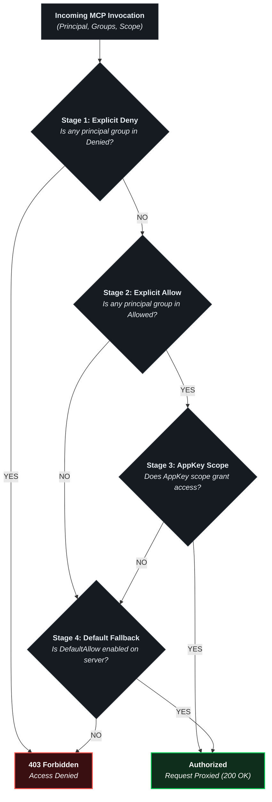
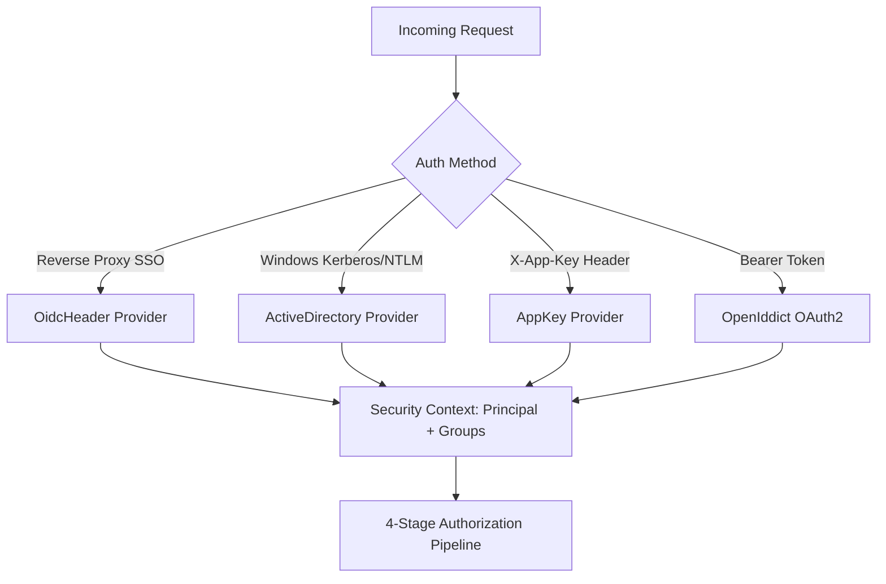

# RBAC, Security & Access Control Policies

The **Model Context Gateway (MCG)** enforces Role-Based Access Control (RBAC) across all MCP operations. It validates caller identities, enforces access policies, governs user key quotas, and evaluates AppKey scope boundaries.

---

## 🛡️ The 4-Stage Authorization Pipeline

Every incoming tool call, virtual resource read, and prompt evaluation passes through MCG's strict 4-stage authorization pipeline:

### Stage 1: Explicit Deny Rules (Highest Precedence)
* If any caller group or SID matches the server's `DeniedGroups` list, MCG immediately terminates evaluation with `403 Forbidden`.
* Explicit deny rules take precedence over all allow rules, administrator scopes, and default policies.

### Stage 2: Explicit Allow Rules
* If any caller group or SID matches the server's `AllowedGroups` list, the caller passes the group authorization gate and proceeds to AppKey scope evaluation.

### Stage 3: AppKey Scope Verification
* For requests authenticated via AppKey, the gateway checks if the key scope allows the target operation. Supported scopes include `*`, `all`, `admin`, `category:<name>`, `server:<id>`, `tool:<name>`, `resource:<uri>`, and `prompt:<name>`.

### Stage 4: Default Policy Fallback
* When no explicit group policy matches, the gateway falls back to the server's `DefaultAllow` setting. If `DefaultAllow` is `false`, the request is denied (`403 Forbidden`).

---

## 👥 Pluggable Identity Providers

MCG resolves user identities and security group memberships through modular, pluggable identity providers:

### 1. Reverse Proxy SSO Headers (`OidcHeader`)
* Integrates with upstream authentication proxies including Authentik, Authelia, PocketID, Keycloak, Traefik, Caddy, and Nginx.
* Extracts identity claims from standardized HTTP forward-auth headers:
  * `Remote-User`: Username or user principal name (e.g. `admin`, `john.doe`).
  * `Remote-Groups`: Comma-separated list of group names or roles (e.g. `full_admin, engineering, devops`).
  * `Remote-Email`: User email address.
  * `Remote-Name`: User full display name.

### 2. Active Directory Windows SIDs (`ActiveDirectory`)
* Integrates natively with Windows Domain Controllers and Active Directory environments.
* Extracts Windows Security Identifiers (SIDs) and group memberships from Kerberos or NTLM security tokens (e.g. `S-1-5-32-544` or `Domain Admins`).

### 3. AppKey Authentication (`AppKey`)
* Authenticates AI assistants, developer tools, and autonomous agents via SHA-256 bearer tokens (`mcp-...`).
* Enforces least-privilege access using granular scope strings (`category:<name>`, `server:<id>`, `tool:<name>`).
* Keys possessing `admin`, `all`, or `*` scopes receive the internal `Administrator` role, enabling access to administrative management APIs and the `/admin` MCP server.

### 4. Standalone Mode & Local Network Authorization
* Used when external identity providers are not configured.
* Validates incoming client IP addresses against `Admin:StandaloneAllowedNetworks`. Loopback addresses (`127.0.0.1`, `::1`) are permitted by default.
* Private subnets (e.g. `10.0.0.0/8`, `192.168.0.0/16`) can be authorized via environment variables (`Admin__StandaloneAllowedNetworks__0=10.0.0.0/8`).
* Requests originating outside authorized networks require an administrative AppKey (`mcp-adm-...`).

### 5. OAuth 2.0 Authorization Server (`OpenIddict`) & RFC 7591 Dynamic Registration
* Built-in OpenID Connect (OIDC) and OAuth 2.0 authorization server providing signed JWT access tokens.
* **Dynamic Client Registration (RFC 7591)**: External AI platforms and tools register dynamically via `/api/register`, `/connect/register`, or `/oauth/register`.
* **Credential Isolation**: Client secrets are hashed with SHA-256 and stored separately from AppKeys. Validates redirect URIs, allowed grant types, and scopes.
* **Consent Management**: Presents interactive authorization screens for user approval.

---

## 🎛️ Configuring Access Control & Group Mappings

### 1. Server Policy Configuration Modal
Click **Policy** on any server card on the Overview dashboard:

* **Allowed Groups**: Comma-separated group names or Active Directory SIDs permitted to invoke tools on this server (e.g. `full_admin, homelab_users`).
* **Denied Groups**: Comma-separated group names or Active Directory SIDs explicitly prohibited from this server (e.g. `contractors, guest_users`).
* **Default Behavior**: Choose **Allow by Default** or **Deny by Default** when no specific group match occurs.

### 2. Access Control Settings Tab
Navigate to **Settings** -> **Access Control**:
* **Group Mappings Table**: Maps external SSO or Active Directory groups to internal MCG roles (`full_admin`, `user`).
* **Server Policies Table**: Centralized grid displaying all server policies for rapid auditing and batch modification.

---

## 📊 User Quotas & Lifecycle Limits

To prevent resource exhaustion and credential sprawl, MCG enforces configurable user quotas:

* **Maximum AppKeys per User**: Limits how many active AppKeys a single user account may generate (default: 5 keys).
* **Key Expiration**: Supports enforced expiration lifecycles (`30 Days`, `90 Days`, `1 Year`, or `Never`).
* **Instant Revocation**: Administrators and key owners can revoke compromised keys immediately, instantly invalidating active sessions.
* **Quota Management**: Monitored and configured in the **App Keys & Security** tab.

---

## 🔒 PII Sanitization & Audit Logging

MCG includes built-in security auditing and sanitization:
* **Automatic Redaction (`PiiSanitizer`)**: Strips authorization headers, bearer tokens, passwords, and sensitive keys from log entries and audit payloads prior to storage.
* **Audit Metadata (`sp_InsertAuditLog`)**: Records UTC timestamp, caller identity, target server, tool name, execution duration, HTTP status code, and sanitized arguments.

For database schema specifications and security tables (`AccessPolicies`, `ToolAccessPolicies`, `AdGroups`, `AuditLogs`), refer to the [**Database Entity-Relationship Diagram**](../database-providers.md#unified-database-entity-relationship-diagram-erd).
