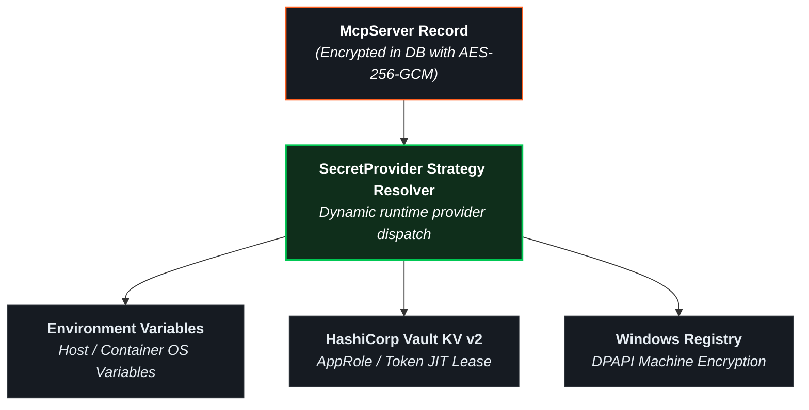

# Server Management & Secret Providers

The **Model Context Gateway (MCG)** manages connections to downstream Model Context Protocol (MCP) servers. It supports multiple transport types (`SSE`, `HTTP`, `STDIO`) and integrates with enterprise secret providers to eliminate hardcoded plaintext credentials.

> [!TIP]
> **Need a configuration recipe for your server?** Check the [**MCP Server Authentication & Integration Cookbook**](../mcp-server-auth-cookbook.md) for quick decision tables and configuration examples for Docker, Home Assistant, Postgres, Kubernetes, and more.

---

## ➕ Registering a New Backend Server


Click the **`+ Add Server`** button in the dashboard toolbar to open the registration modal:

```
+-------------------------------------------------------------------------------+
| ➕ Add New MCP Server                                                      [X] |
+-------------------------------------------------------------------------------+
| Server Identifier:   [ docker                                              ]  |
| Display Name:        [ Docker Infrastructure Daemon                        ]  |
| Transport Type:      (•) SSE Stream   ( ) HTTP JSON-RPC   ( ) STDIO CLI       |
| Endpoint / Command:  [ http://docker-mcp:8080/sse                          ]  |
| Categories (comma):  [ Infrastructure, DevOps                              ]  |
|                                                                               |
| Secret Provider:     [ HashiCorp Vault (KV v2) ▾                           ]  |
|   Vault Mount:       [ secret                                              ]  |
|   Secret Path:       [ homelab/docker                                      ]  |
|   Secret Field:      [ api_token                                           ]  |
|                                                                               |
| Custom Headers:      [ {"X-Custom-Header": "value"}                        ]  |
|                                                                               |
| [ Cancel ]                                                    [ Save Server ] |
+-------------------------------------------------------------------------------+
```

### Core Configuration Parameters

| Field | Description | Example |
| :--- | :--- | :--- |
| **Server Identifier (`id`)** | Unique identifier string. Used to namespace tools (`{id}__{tool}` or `{id}/{tool}`) and route requests (`/{id}`). | `docker`, `homeassistant`, `plex` |
| **Display Name** | Human-readable label displayed across status cards and test bench selectors. | `Docker Infrastructure Daemon` |
| **Transport Type** | Communication protocol: `SSE`, `HTTP`, or `STDIO`. | `SSE` |
| **Endpoint / Command** | Downstream URL (for `SSE` / `HTTP`) or local CLI executable path (for `STDIO`). | `http://docker-mcp:8080/sse` or `npx` |
| **Categories** | Comma-separated tags used for catalog grouping and category-scoped AppKey evaluation. | `Infrastructure, Smart Home` |
| **Secret Provider** | Secret resolution strategy: `None`, `Environment`, `Vault`, or `WindowsRegistry`. | `Vault` |
| **Custom Headers** | Optional JSON key-value map of HTTP headers injected into downstream requests. | `{"Authorization": "Bearer token"}` |

---

## 🚀 Transport Protocols & Lifecycle Behaviors

> [!TIP]
> For complete technical specifications and child process lifecycle policies, see the [**Transport Capability & Configuration Guide**](../transports.md).

### 1. Server-Sent Events (`SSE`)
* **Usage**: Stateful streaming connection for real-time notifications, progress events, and long-running tool executions.
* **Endpoint Pattern**: `http://host:port/sse`
* **Session Lifecycle**: MCG maintains a persistent SSE stream to the backend. It tracks session IDs and routes JSON-RPC messages bi-directionally between connected AI clients and the downstream server.

### 2. HTTP JSON-RPC (`HTTP` / `Streamable`)
* **Usage**: Stateless HTTP POST communication using standard JSON-RPC 2.0 payloads.
* **Endpoint Pattern**: `http://host:port/mcp` or `http://host:port/v1/jsonrpc`
* **Session Lifecycle**: The gateway executes an independent HTTP request for each tool call, prompt evaluation, or resource read. Ideal for containerized microservices and stateless functions.

### 3. Local Subprocess (`STDIO`)
* **Usage**: Spawns local CLI tools, Node.js scripts, Python binaries, or container wrappers communicating over standard input/output (`stdin`/`stdout`).
* **Command Syntax**: Executable name with command-line arguments (for example, `npx -y @modelcontextprotocol/server-filesystem /shared/data`).
* **Secret Protection**: MCG injects resolved credentials directly into the child process environment variables. Secrets never appear in command-line arguments or system process listings (`ps aux`).

---

## 🔐 Enterprise Secret Providers

MCG provides pluggable secret resolution strategies to ensure no credentials are stored in plaintext:



### 1. Direct Static Key (`None`)
* Credentials are stored directly in the server configuration.
* All sensitive strings are encrypted at rest with AES-256-GCM envelope encryption.
* Recommended for local testing, public APIs, or unauthenticated internal networks.

### 2. Environment Variables (`Environment` / `Env`)
* Resolves secrets dynamically from environment variables on the gateway host or container.
* **Configuration**: Specify the environment variable name (e.g. `HOME_ASSISTANT_LONG_LIVED_TOKEN`).
* Supports prefix notation (e.g. `ENV:DOCKER_SECRET_KEY`).

### 3. HashiCorp Vault KV v2 (`Vault` / `HashiCorpVault`)
* Integrates directly with HashiCorp Vault Key-Value Version 2 (`kv-v2`) engines.
* **Authentication**: Supports AppRole authentication (`roleId` and `secretId`) or direct Vault tokens.
* **Features**:
  * **Automatic Token Renewal**: Checks token time-to-live before each request. Automatically renews authentication if less than 5 minutes remain.
  * **In-Memory Cache**: Caches retrieved secrets securely in memory for 10 minutes to minimize Vault traffic.
  * **Parameters**:
    * **Secret Mount**: Mount path of the KV v2 engine (default: `secret`).
    * **Secret Path**: Path to the secret document (e.g. `homelab/services/radarr`).
    * **Secret Field**: Specific key name in the secret document (e.g. `api_key`).

### 4. Windows Registry DPAPI (`WindowsRegistry` / `Registry`)
* Resolves credentials from Windows Registry keys (`HKLM` or `HKCU`).
* **DPAPI Decryption**: Automatically detects and decrypts DPAPI-encrypted machine or user data blobs.
* **Parameters**:
  * **Secret Path**: Subkey registry path (e.g. `SOFTWARE\Homelab\McpSecrets`).
  * **Secret Field**: Registry value name (e.g. `PlexToken`).
* *Note: Returns `null` on Linux containers.*

---

## 👁️ Inspecting Server Capabilities (Inspect Modal)


Click **`Inspect`** on any server card on the Overview dashboard to examine downstream capabilities:

* **Tools Tab**: Discovered tools, names, descriptions, and dynamic JSON Schema parameter requirements.
* **Resources Tab**: Virtual resource URIs (e.g. `mcp://docker/containers/list`), MIME types, and descriptions.
* **Prompts Tab**: Prompt templates and declared arguments.
* **Raw Schema**: Full JSON-RPC capabilities payload returned during protocol handshake.

---

## 📄 Custom Tool JSON Specifications

For services that do not natively support the MCP protocol, you can register virtual tools and resources using custom JSON definitions:

1. Navigate to **Settings** -> **Prompts & Resources** (or **Custom Files**).
2. Click **+ Add Custom File**.
3. Select the file type (`Tools`, `Prompts`, or `Resources`), specify a filename, and enter valid JSON:

```json
[
  {
    "name": "network_ping_host",
    "description": "Sends an ICMP ping to a target IP or hostname",
    "parameters": {
      "type": "object",
      "properties": {
        "host": {
          "type": "string",
          "description": "Target hostname or IPv4 address"
        },
        "count": {
          "type": "integer",
          "default": 4,
          "description": "Number of packets to send"
        }
      },
      "required": ["host"]
    }
  }
]
```

4. Click **Save File**. MCG immediately indexes the virtual definitions into the catalog and updates the semantic vector search engine.
