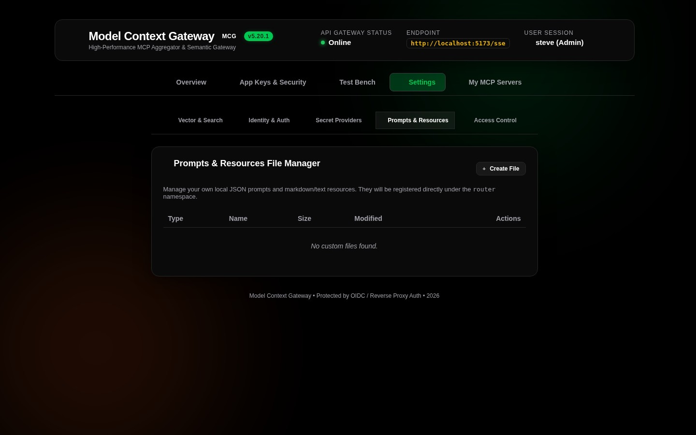

# Virtual Resources & Prompt Templates Tester

The **Interactive Test Bench** provides specialized interfaces for inspecting virtual resources and testing prompt templates exposed by backend MCP servers.

---

## 📄 Virtual Resource Tester (`ResourceTesterCard`)

Use the Virtual Resource Tester to read and verify virtual file paths, database snapshots, and system diagnostic dumps:



### How to Read a Virtual Resource
1. **Select Server or Template**: Choose a registered server from the dropdown to view its published resources.
2. **Select Resource or Specify URI**: Pick an item from the pre-populated resource list or type a custom virtual URI into the **Resource URI** field.
3. **Read Resource**: Click **Read Resource**. The gateway requests the resource, parses the payload, and displays its MIME type, payload size, and formatted content.

### Supported Virtual Resource URIs
* **Downstream MCP Server Resources**: URIs using the namespaced virtual scheme:
  ```
  mcp://{serverId}/{path}
  ```
  *Example*: `mcp://docker/containers/status`, `mcp://filesystem/shared/config.json`.
* **Gateway System Resources**: Built-in system introspection endpoints:
  * `router://status`: Returns active client session counts, connection pools, and runtime uptime.
  * `router://database`: Returns database connection status, registered table counts, and provider types.
  * `logs://recent`: Retrieves the most recent in-memory log buffer.

### API & cURL Invocation
```bash
curl -X POST http://localhost:8080/api/test/resources/read \
  -H "Authorization: Bearer <YOUR_APP_KEY>" \
  -H "Content-Type: application/json" \
  -d '{
    "uri": "mcp://docker/containers/status"
  }'
```

---

## 💬 Prompt Template Tester (`PromptTesterCard`)

Use the Prompt Template Tester to evaluate dynamic prompt templates and ensure variable substitution works before AI consumption:


### How to Render a Prompt Template
1. **Select Server & Template**: Choose the backend server and target prompt template from the dropdown menus.
2. **Supply Arguments**: Enter the required and optional arguments declared by the template schema.
3. **Render Prompt**: Click **Render Prompt**. MCG evaluates the template variables and displays the resulting message array (System, User, Assistant messages).

### API & cURL Invocation
```bash
curl -X POST http://localhost:8080/api/test/prompts/get \
  -H "Authorization: Bearer <YOUR_APP_KEY>" \
  -H "Content-Type: application/json" \
  -d '{
    "serverId": "notes-rag",
    "promptName": "summarize_architecture",
    "arguments": {
      "topic": "Model Context Gateway Security Hardening",
      "max_length": "500"
    }
  }'
```
