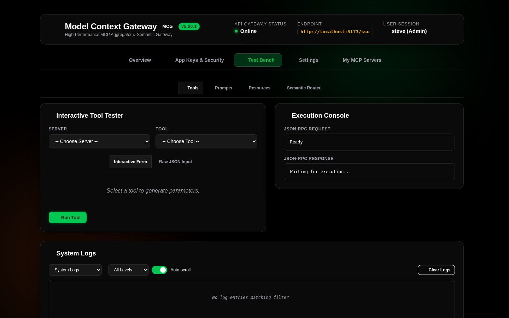
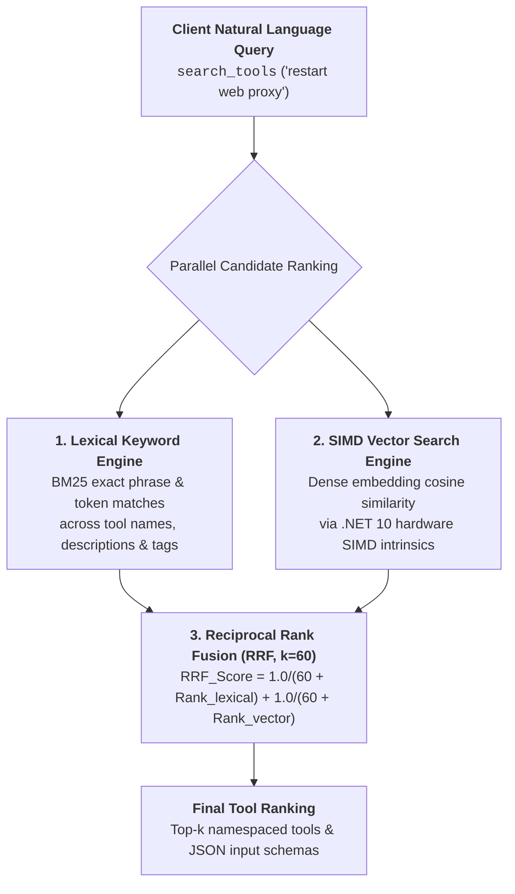

# Semantic Router & Search Simulator

The **Semantic Router Simulator** (`SemanticRouterCard`) in the Test Bench enables you to test and fine-tune how MCG matches natural language intents to backend tools when AI clients call `search_tools` in **Meta-Mode**.

---

## 🧠 Simulator Interface & Layout



---

## 🔍 Understanding the Hybrid Scoring Algorithm (Reciprocal Rank Fusion)

MCG uses an enterprise-grade **Reciprocal Rank Fusion (RRF, $k=60$)** hybrid ranking pipeline that merges lexical keyword precision with dense vector semantic understanding:



### Reciprocal Rank Fusion (RRF) Formula
$$RRF\_Score(tool) = \frac{1.0}{60 + Rank_{keyword}(tool)} + \frac{1.0}{60 + Rank_{vector}(tool)}$$

* **$Rank_{keyword}$**: Ranked position derived from lexical matches across tool names, documentation descriptions, categories, and JSON Schema argument properties.
* **$Rank_{vector}$**: Ranked position derived from dense embedding cosine similarity using **.NET 10 hardware SIMD intrinsics** (`TensorPrimitives.CosineSimilarity`).
* **Why RRF?**: Unlike linear additive scoring, RRF is immune to semantic scale compression, prevents score saturation, guarantees that exact technical command names rank highest, and gracefully falls back to pure keyword rankings if vector providers are offline.

---

## 📋 How to Run a Simulation

1. **Enter Natural Language Query**: Type a representative prompt or intent (e.g. *"check disk usage"*, *"turn off living room lights"*, or *"reboot proxy"*).
2. **Set Result Limit**: Choose the maximum number of results to return (default: `5`).
3. **Simulate**: Click **Simulate Semantic Search**.
4. **Evaluate Results**: Review the ranked list of matching tools. Each entry displays its calculated composite score, match tier (🟢 High, 🟡 Moderate, ⚪ Low), and description snippet.
5. **Optimize**: If a desired tool does not rank highly, refine the tool's description or add relevant category tags in server settings to boost its semantic relevance.

---

## 💻 API & cURL Invocation

You can simulate semantic routing via REST API calls to `/api/test/semantic-search`:

```bash
curl -X POST http://localhost:8080/api/test/semantic-search \
  -H "Authorization: Bearer <YOUR_APP_KEY>" \
  -H "Content-Type: application/json" \
  -d '{
    "query": "restart web proxy container"
  }'
```
