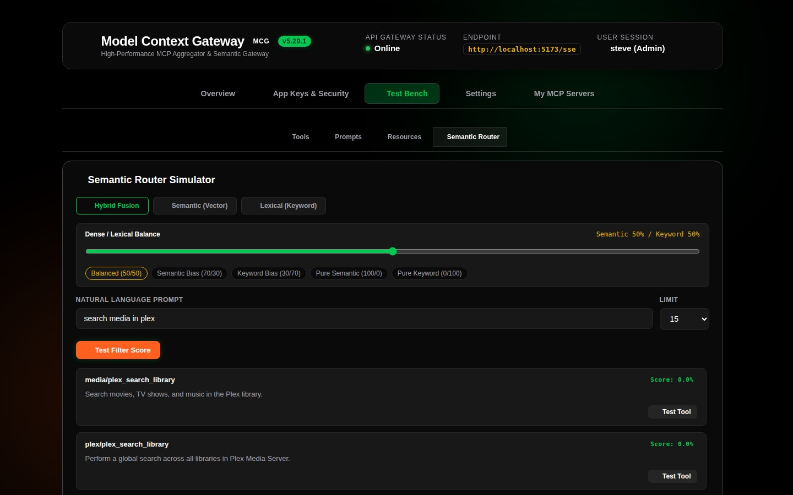
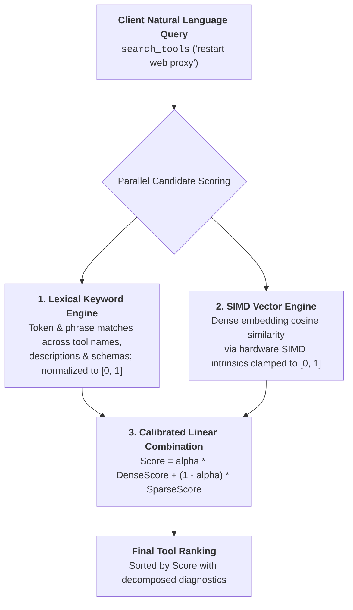

# Semantic Router & Search Simulator

The **Semantic Router Simulator** (`SemanticRouterCard`) in the Test Bench enables you to test, fine-tune, and inspect how MCG matches natural language intents to backend tools when AI clients call `search_tools` in **Meta-Mode**.

---

## 🧠 Simulator Interface & Layout



The simulator features:
1. **3-Way Search Mode Toggle**: Switch between **Hybrid Fusion**, **Semantic (Vector)**, and **Lexical (Keyword)** modes.
2. **Interactive Hybrid Split Slider & Presets**: In *Hybrid* mode, dynamically balance dense vector similarity against sparse lexical keyword scores with 5 quick presets:
   - **Balanced (50/50)**: Equal 0.5/0.5 weighting between semantic intent and technical keyword matches.
   - **Semantic Bias (70/30)**: Prioritizes vector embeddings for conceptual queries.
   - **Keyword Bias (30/70)**: Prioritizes exact command, tool name, or parameter token matches.
   - **Pure Semantic (100/0)**: Dense vector similarity only.
   - **Pure Keyword (0/100)**: Sparse BM25 / token match only.
3. **Result Limit Selector**: Choose `5`, `10`, `15`, or `25` candidate tools.
4. **Decomposed Score Breakdown**: Hit cards display the total combined score alongside individual `Semantic` and `Keyword` percentage badges.
5. **1-Click "Test Tool" Action**: Seamlessly transitions to the **Tools** tab with the selected tool and its upstream server pre-loaded in the Tool Tester.

---

## 🔍 Understanding the Calibrated Scoring Model

MCG combines hardware-accelerated vector similarity (.NET 10 SIMD `TensorPrimitives.CosineSimilarity`) with normalized lexical matching into a calibrated linear combination:



### Scoring Formula
$$\text{Score} = \alpha \cdot \text{DenseScore} + (1.0 - \alpha) \cdot \text{SparseScore}$$

* **$\alpha$ (`dense_weight`)**: Configurable weight in $[0.0, 1.0]$ (default $0.5$).
  - When Mode is `semantic`: $\alpha = 1.0$.
  - When Mode is `lexical`: $\alpha = 0.0$.
  - When Mode is `hybrid`: $\alpha$ matches the slider setting.
* **$\text{DenseScore}$**: SIMD cosine similarity clamped between $0.0$ and $1.0$.
* **$\text{SparseScore}$**: Min-max normalized lexical match score across candidate tools.

---

## 📋 How to Run a Simulation

1. **Select Search Mode**: Choose `Hybrid Fusion`, `Semantic (Vector)`, or `Lexical (Keyword)`.
2. **Calibrate Dense Weight**: In Hybrid mode, adjust the slider or click a preset chip (e.g., `Balanced (50/50)` or `Semantic Bias (70/30)`).
3. **Enter Intent Query**: Type a natural language prompt (e.g. *"restart docker container"* or *"fetch plex media"*).
4. **Select Limit**: Set the maximum tools to inspect (`5`, `10`, `15`, or `25`).
5. **Evaluate Results**: Inspect total score %, semantic %, and keyword % badges, along with formatted tool descriptions.
6. **Test the Tool**: Click **Test Tool** on any hit card to immediately test execution in the Tool Tester form.

---

## 💻 API & Meta-Mode MCP Tool Invocation

### REST API (`POST /api/test/semantic-search`)
```bash
curl -X POST http://localhost:8080/api/test/semantic-search \
  -H "Authorization: Bearer <YOUR_APP_KEY>" \
  -H "Content-Type: application/json" \
  -d '{
    "query": "restart web proxy container",
    "mode": "hybrid",
    "denseWeight": 0.7,
    "limit": 15
  }'
```

Response includes decomposed score diagnostics:
```json
{
  "query": "restart web proxy container",
  "mode": "hybrid",
  "denseWeight": 0.7,
  "results": [
    {
      "tool": { "name": "docker__restart_container", "description": "..." },
      "toolName": "docker__restart_container",
      "serverId": "docker",
      "score": 0.884,
      "denseScore": 0.920,
      "sparseScore": 0.800,
      "denseRank": 1,
      "sparseRank": 1
    }
  ]
}
```

### Meta-Mode MCP Tool (`search_tools`)
AI agents calling `search_tools` can optionally pass `mode` and `dense_weight`:
```json
{
  "name": "search_tools",
  "arguments": {
    "query": "find proxy tools",
    "mode": "hybrid",
    "dense_weight": 0.5
  }
}
```
